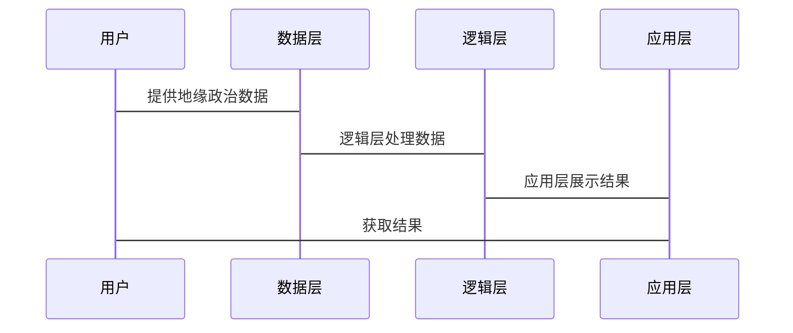

                 


# 利用多智能体系统进行全面的地缘政治风险分析

## 关键词：多智能体系统，地缘政治风险分析，分布式计算，博弈论，群体智能，强化学习

## 摘要：  
本文探讨了利用多智能体系统进行地缘政治风险分析的方法与应用。通过分析多智能体系统的核心概念、算法原理和系统架构，展示了如何将多智能体系统应用于地缘政治风险评估和预测。本文还结合实际案例，详细讲解了系统的设计与实现，并总结了多智能体系统在地缘政治风险分析中的优势与挑战。

---

# 第一部分: 多智能体系统与地缘政治风险分析的背景

## 第1章: 多智能体系统与地缘政治风险分析的背景

### 1.1 多智能体系统的基本概念

#### 1.1.1 多智能体系统的定义  
多智能体系统（Multi-Agent System, MAS）是由多个智能体（Agent）组成的分布式系统，这些智能体通过协作完成复杂的任务。智能体是能够感知环境、做出决策并采取行动的实体。

#### 1.1.2 多智能体系统的特征  
- **自主性**：智能体能够自主决策。
- **反应性**：智能体能够实时感知环境并做出反应。
- **协作性**：智能体之间可以通过通信和协作完成任务。
- **分布性**：智能体是分布式的，不存在中央控制节点。

#### 1.1.3 多智能体系统与单智能体系统的区别  
| 属性 | 多智能体系统 | 单智能体系统 |
|------|--------------|--------------|
| 决策 | 分布式决策 | 中央决策 |
| 通信 | 智能体之间需要通信 | 无通信需求 |
| 效率 | 可能更低，但更灵活 | 更高效，但可能不够灵活 |

### 1.2 地缘政治风险分析的定义与特点

#### 1.2.1 地缘政治风险的定义  
地缘政治风险是指由于政治、经济、军事、文化等多方面因素的综合作用，可能导致的国家间冲突、经济波动或其他不稳定事件的可能性。

#### 1.2.2 地缘政治风险的核心要素  
- **政治因素**：政府政策、选举、领导人更迭等。
- **经济因素**：贸易、投资、资源分配等。
- **军事因素**：军事部署、战争、恐怖主义等。
- **文化因素**：民族主义、宗教冲突等。

#### 1.2.3 地缘政治风险的分类与层次  
- **国家层面**：涉及主权国家的政策和行动。
- **区域层面**：涉及特定区域的冲突和合作。
- **全球层面**：涉及跨国问题，如气候变化、经济危机等。

### 1.3 多智能体系统在地缘政治风险分析中的作用

#### 1.3.1 多智能体系统的优势  
- **分布式计算**：能够处理复杂的地缘政治问题。
- **协作能力**：多个智能体可以模拟不同国家的政策和行动。
- **实时响应**：能够实时分析地缘政治事件的动态变化。

#### 1.3.2 多智能体系统在地缘政治风险分析中的应用场景  
- **预测冲突**：通过模拟不同国家的政策，预测潜在的冲突。
- **经济建模**：分析贸易政策对经济的影响。
- **危机管理**：制定应对地缘政治危机的策略。

#### 1.3.3 多智能体系统在地缘政治风险分析中的局限性与挑战  
- **数据不足**：地缘政治数据往往不完整或难以获取。
- **模型复杂性**：多智能体系统的建模和仿真需要复杂的算法和计算资源。

---

## 第2章: 多智能体系统与地缘政治风险分析的核心概念

### 2.1 多智能体系统的组成与结构

#### 2.1.1 智能体的定义与分类  
- **智能体**：能够感知环境、做出决策并采取行动的实体。
- **分类**：  
  - **简单反射型智能体**：基于当前感知做出反应。
  - **基于模型的反射型智能体**：使用内部模型进行决策。
  - **目标驱动型智能体**：基于目标进行决策。
  - **效用驱动型智能体**：基于效用函数进行决策。

#### 2.1.2 多智能体系统的层次结构  
- **物理层**：智能体的物理实现。
- **逻辑层**：智能体的逻辑推理和决策。
- **通信层**：智能体之间的通信机制。

#### 2.1.3 多智能体系统的通信机制  
- **直接通信**：智能体之间直接交换信息。
- **间接通信**：通过中间媒介进行信息交换。

### 2.2 地缘政治风险分析的模型与框架

#### 2.2.1 地缘政治风险分析的基本模型  
- **事件驱动模型**：基于地缘政治事件进行分析。
- **情景分析模型**：模拟不同情景下的地缘政治风险。

#### 2.2.2 多智能体系统在地缘政治风险分析中的架构  
- **智能体角色分配**：每个智能体代表一个国家或组织。
- **信息共享机制**：智能体之间共享信息。
- **决策模拟**：模拟不同决策对地缘政治风险的影响。

#### 2.2.3 地缘政治风险分析的流程与步骤  
1. **数据收集**：收集相关地缘政治数据。
2. **模型构建**：构建多智能体系统的模型。
3. **仿真运行**：运行仿真，分析结果。
4. **结果解读**：解读仿真结果，制定应对策略。

### 2.3 多智能体系统与地缘政治风险分析的关联性分析

#### 2.3.1 多智能体系统在地缘政治风险分析中的核心作用  
- **模拟复杂性**：多智能体系统能够模拟多个智能体之间的互动。
- **实时分析**：能够实时分析地缘政治事件的变化。

#### 2.3.2 多智能体系统与地缘政治风险分析的相互影响  
- **数据驱动决策**：多智能体系统依赖数据进行决策，地缘政治风险分析需要高质量的数据。
- **动态适应性**：多智能体系统能够动态适应变化的地缘政治环境。

#### 2.3.3 多智能体系统在地缘政治风险分析中的创新点  
- **分布式计算**：通过分布式计算提高分析效率。
- **协作模拟**：通过协作模拟不同国家的政策和行动。

---

## 第3章: 多智能体系统的理论基础

### 3.1 智能体的定义与分类

#### 3.1.1 智能体的基本定义  
智能体是能够感知环境、做出决策并采取行动的实体。

#### 3.1.2 智能体的分类与特点  
- **简单反射型智能体**：基于当前感知做出反应。
- **基于模型的反射型智能体**：使用内部模型进行决策。
- **目标驱动型智能体**：基于目标进行决策。
- **效用驱动型智能体**：基于效用函数进行决策。

### 3.2 多智能体系统的通信与协作

#### 3.2.1 多智能体系统的通信机制  
- **直接通信**：智能体之间直接交换信息。
- **间接通信**：通过中间媒介进行信息交换。

#### 3.2.2 多智能体系统的协作模型  
- **协作协议**：智能体之间通过协议进行协作。
- **协作任务分配**：将任务分配给不同的智能体。

#### 3.2.3 多智能体系统的冲突解决策略  
- **协商机制**：智能体之间通过协商解决冲突。
- **仲裁机制**：由第三方仲裁解决冲突。

### 3.3 多智能体系统的分布式计算

#### 3.3.1 分布式计算的基本概念  
分布式计算是指在多个计算节点上进行计算的过程。

#### 3.3.2 多智能体系统中的分布式计算模型  
- **分布式计算模型**：智能体之间的计算任务分布在网络中。
- **通信与同步**：智能体之间的通信和同步机制。

#### 3.3.3 多智能体系统在地缘政治风险分析中的应用  
- **数据分布处理**：通过分布式计算处理大规模地缘政治数据。
- **并行计算**：通过并行计算提高计算效率。

---

## 第4章: 多智能体系统的算法与实现

### 4.1 分布式计算算法

#### 4.1.1 分布式计算的基本原理  
- **任务分配**：将任务分配给不同的计算节点。
- **数据通信**：通过网络进行数据通信。

#### 4.1.2 分布式计算的实现步骤  
1. **任务划分**：将任务划分为多个子任务。
2. **任务分配**：将子任务分配给不同的计算节点。
3. **数据通信**：通过网络进行数据通信。
4. **结果汇总**：将各节点的结果汇总到中央节点。

#### 4.1.3 分布式计算的应用案例  
- **地缘政治数据处理**：通过分布式计算处理大规模的地缘政治数据。
- **事件预测**：通过分布式计算预测地缘政治事件的发生概率。

### 4.2 博弈论与多智能体系统

#### 4.2.1 博弈论的基本概念  
- **博弈论**：研究理性决策者之间的策略互动的理论。
- **纳什均衡**：博弈中的稳定状态，即没有任何一方能够通过单方面改变策略而受益。

#### 4.2.2 博弈论在多智能体系统中的应用  
- **策略模拟**：通过博弈论模拟不同国家的政策和行动。
- **冲突预测**：通过博弈论预测地缘政治冲突的可能性。

#### 4.2.3 博弈论的实现步骤  
1. **定义博弈规则**：定义博弈的规则和参与者。
2. **构建博弈模型**：构建博弈论模型。
3. **求解纳什均衡**：求解博弈论模型的纳什均衡。

### 4.3 群体智能与多智能体系统

#### 4.3.1 群体智能的基本概念  
- **群体智能**：多个个体通过协作完成复杂任务的智能形式。

#### 4.3.2 群体智能在多智能体系统中的应用  
- **任务分配**：通过群体智能分配任务给不同的智能体。
- **协作决策**：通过群体智能进行协作决策。

#### 4.3.3 群体智能的实现步骤  
1. **定义群体智能规则**：定义群体智能的规则和目标。
2. **构建群体智能模型**：构建群体智能模型。
3. **群体智能的实现**：通过算法实现群体智能。

### 4.4 强化学习与多智能体系统

#### 4.4.1 强化学习的基本概念  
- **强化学习**：通过试错学习，智能体通过与环境互动获得奖励或惩罚。

#### 4.4.2 强化学习在多智能体系统中的应用  
- **策略优化**：通过强化学习优化智能体的策略。
- **协作学习**：通过强化学习实现智能体之间的协作。

#### 4.4.3 强化学习的实现步骤  
1. **定义强化学习规则**：定义强化学习的规则和目标。
2. **构建强化学习模型**：构建强化学习模型。
3. **强化学习的实现**：通过算法实现强化学习。

---

## 第5章: 系统架构设计

### 5.1 地缘政治风险分析系统的架构设计

#### 5.1.1 问题场景介绍  
- **问题背景**：地缘政治风险的复杂性和不确定性。
- **问题目标**：通过多智能体系统进行地缘政治风险分析。

#### 5.1.2 系统功能设计  
- **数据采集**：采集地缘政治相关数据。
- **模型构建**：构建多智能体系统的模型。
- **仿真运行**：运行仿真，分析结果。

#### 5.1.3 系统架构设计  
- **分层架构**：包括数据层、逻辑层和应用层。
- **通信机制**：智能体之间的通信机制。

#### 5.1.4 系统接口设计  
- **输入接口**：接收地缘政治数据。
- **输出接口**：输出地缘政治风险分析结果。

#### 5.1.5 系统交互流程图  


### 5.2 系统实现

#### 5.2.1 环境配置  
- **硬件要求**：高性能计算服务器。
- **软件要求**：Python、Java、分布式计算框架。

#### 5.2.2 核心代码实现  
```python
class Agent:
    def __init__(self, id):
        self.id = id
        self.state = None

    def perceive(self, environment):
        self.state = environment

    def decide(self):
        pass

class MultiAgentSystem:
    def __init__(self, agents):
        self.agents = agents

    def run(self):
        for agent in self.agents:
            agent.perceive(environment)
            agent.decide()
```

#### 5.2.3 案例分析  
- **案例背景**：分析某地区的地缘政治风险。
- **数据来源**：公开的地缘政治数据。
- **模型构建**：构建多智能体系统的模型。
- **仿真运行**：运行仿真，分析结果。

#### 5.2.4 项目总结  
- **项目目标**：构建一个基于多智能体系统的地缘政治风险分析系统。
- **项目成果**：实现了一个能够分析地缘政治风险的系统。
- **项目意义**：为地缘政治风险分析提供了新的方法。

---

## 第6章: 总结与展望

### 6.1 总结

#### 6.1.1 核心内容回顾  
- **多智能体系统**：多智能体系统的核心概念和理论基础。
- **地缘政治风险分析**：多智能体系统在地缘政治风险分析中的应用。

#### 6.1.2 主要结论  
- 多智能体系统能够有效模拟地缘政治风险的复杂性。
- 多智能体系统在地缘政治风险分析中具有广泛的应用前景。

### 6.2 展望

#### 6.2.1 当前挑战  
- **数据不足**：地缘政治数据的获取和处理难度大。
- **模型复杂性**：多智能体系统的建模和仿真需要复杂的算法和计算资源。

#### 6.2.2 未来研究方向  
- **算法优化**：进一步优化多智能体系统的算法。
- **数据处理**：提高地缘政治数据的处理能力。
- **系统集成**：将多智能体系统与其他分析工具集成。

### 6.3 最佳实践 tips

#### 6.3.1 实践建议  
- **数据驱动决策**：在地缘政治风险分析中，数据是关键。
- **模型优化**：不断优化多智能体系统的模型和算法。
- **团队协作**：地缘政治风险分析需要多学科团队的协作。

#### 6.3.2 注意事项  
- **数据隐私**：注意地缘政治数据的隐私和安全问题。
- **模型验证**：确保多智能体系统的模型能够准确模拟地缘政治风险。

#### 6.3.3 拓展阅读  
- **推荐书籍**：《Multi-Agent Systems: Algorithmic, Complexity, and Economic Theory》
- **推荐论文**：《A survey on multi-agent systems for political risk analysis》

---

## 第7章: 小结

通过本文的探讨，我们了解了多智能体系统在地缘政治风险分析中的重要作用和应用。多智能体系统能够有效模拟地缘政治风险的复杂性，为地缘政治风险分析提供了新的方法和工具。未来，随着多智能体系统技术的不断发展，其在地缘政治风险分析中的应用前景将更加广阔。

