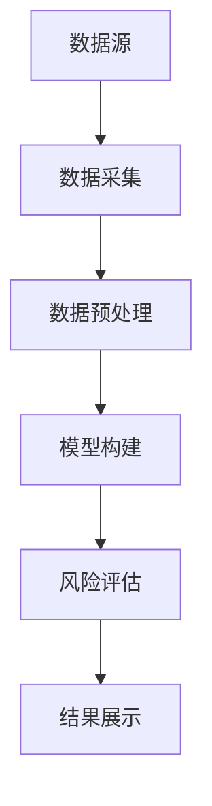

                 


# 利用多智能体系统进行全面的地缘政治风险评估

---

## 关键词：  
- 多智能体系统  
- 地缘政治风险评估  
- 系统架构设计  
- 强化学习  
- 博弈论  

---

## 摘要：  
地缘政治风险评估是全球政治经济活动中的重要环节，传统方法依赖专家经验，存在主观性强、效率低、难以量化等问题。本文提出利用多智能体系统（Multi-Agent System, MAS）进行全面的地缘政治风险评估，通过智能体之间的协作与竞争，模拟复杂的政治经济环境，实现风险的智能化、精准化评估。文章从背景、核心概念、算法原理、系统架构到项目实战，详细阐述了多智能体系统在地缘政治风险评估中的应用，并通过案例分析展示了其优势与实际价值。

---

## 目录大纲：  

### 第一部分：背景与核心概念  

#### 第一章：多智能体系统概述  
1.1 多智能体系统的基本概念  
1.2 多智能体系统的原理与优势  

#### 第二章：地缘政治风险评估概述  
2.1 地缘政治风险的定义  
2.2 传统地缘政治风险评估方法  
2.3 多智能体系统在地缘政治中的应用潜力  

#### 第三章：多智能体系统与地缘政治风险评估的结合  
3.1 结合的必要性  
3.2 结合的方式与方法  

---

### 第二部分：多智能体系统的核心概念与原理  

#### 第四章：多智能体系统的架构与模型  
4.1 多智能体系统的架构  
4.2 多智能体模型的构建  

#### 第五章：地缘政治风险评估的模型构建  
5.1 数据收集与处理  
5.2 模型构建方法  

---

### 第三部分：算法原理与实现  

#### 第六章：多智能体系统中的算法原理  
6.1 博弈论基础  
6.2 强化学习在多智能体中的应用  

---

### 第四部分：系统架构设计  

#### 第七章：基于多智能体的地缘政治风险评估系统架构  
7.1 系统功能设计  
7.2 系统架构设计  
7.3 接口设计与交互流程  

---

### 第五部分：项目实战  

#### 第八章：项目实战与案例分析  
8.1 项目环境搭建  
8.2 核心代码实现  
8.3 案例分析与总结  

---

### 第六部分：总结与展望  

#### 第九章：总结与未来展望  
9.1 全书总结  
9.2 挑战与未来方向  

---

## 正文内容：

### 第一部分：背景与核心概念  

#### 第一章：多智能体系统概述  

1.1 多智能体系统的基本概念  

多智能体系统（Multi-Agent System, MAS）是由多个智能体（Agent）组成的分布式系统，这些智能体能够通过交互协作完成复杂的任务。智能体是具有感知、决策、执行能力的实体，可以是软件程序、机器人或其他智能设备。多智能体系统的核心在于智能体之间的协作与竞争，通过局部信息实现全局目标。

**多智能体系统的分类**：  
根据智能体的结构和功能，多智能体系统可以分为以下几类：  
- **简单智能体**：仅能执行预定义的规则，无法自主决策。  
- **反应式智能体**：根据当前环境信息做出反应，不依赖内部状态。  
- **认知式智能体**：具备复杂推理能力，能够处理不确定性问题。  
- **协作式智能体**：多个智能体协同完成共同目标。  

1.2 多智能体系统的原理与优势  

多智能体系统的原理基于智能体之间的信息共享与协同。智能体通过通信模块交换信息，利用协商机制达成一致，最终实现全局优化。其优势包括：  
- **分布式计算**：任务分解到多个智能体，提高系统效率。  
- **鲁棒性**：单个智能体故障不影响整体系统。  
- **适应性**：智能体能够动态调整策略以应对环境变化。  

---

#### 第二章：地缘政治风险评估概述  

2.1 地缘政治风险的定义  

地缘政治风险是指在特定区域或全球范围内，由于政治、经济、军事等因素引发的潜在风险，可能对企业、政府或个人造成负面影响。常见的地缘政治风险包括战争、政治动荡、贸易限制等。

2.2 传统地缘政治风险评估方法  

传统方法主要依赖专家经验，通过定性分析和历史数据进行风险评估。其缺点在于：  
- **主观性强**：依赖专家判断，缺乏客观性。  
- **效率低**：评估过程耗时较长，难以快速响应。  
- **难以量化**：难以将复杂因素转化为可量化的指标。  

2.3 多智能体系统在地缘政治中的应用潜力  

多智能体系统能够模拟复杂的政治经济环境，通过智能体协作，实时分析多因素交互，提供动态风险评估。其优势在于：  
- **实时性**：能够快速响应环境变化。  
- **精准性**：通过数据驱动，提高评估的准确性。  
- **可扩展性**：适用于大规模复杂场景。  

---

#### 第三章：多智能体系统与地缘政治风险评估的结合  

3.1 结合的必要性  

地缘政治风险评估需要考虑多因素的动态交互，传统的单智能体方法难以应对。多智能体系统通过分布式计算和协作，能够更好地模拟复杂场景，提供更全面的评估结果。

3.2 结合的方式与方法  

结合方式包括：  
1. **智能体建模**：将地缘政治中的各个因素（如国家、企业、组织）建模为智能体。  
2. **博弈论模型**：通过智能体之间的博弈，模拟不同策略下的风险。  
3. **强化学习**：智能体通过不断试错，学习最优策略，优化风险评估。  

---

### 第二部分：多智能体系统的核心概念与原理  

#### 第四章：多智能体系统的架构与模型  

4.1 多智能体系统的架构  

多智能体系统的架构设计决定了系统的运行方式。常见的架构包括：  
- **反应式架构**：智能体仅根据当前感知信息做出反应。  
- **认知式架构**：智能体具备复杂推理能力，能够制定长远计划。  
- **协作式架构**：多个智能体协同完成共同目标。  

**系统架构的分类**：  
| 架构类型 | 描述 | 适用场景 |  
|----------|------|-----------|  
| 反应式   | 基于当前感知做出反应 | 简单环境下的实时响应 |  
| 认知式   | 具备复杂推理能力 | 复杂环境下的决策制定 |  
| 协作式   | 多智能体协同完成任务 | 多目标协作场景 |  

4.2 多智能体模型的构建  

模型构建需要考虑智能体的感知、决策、执行能力。  
- **感知层**：通过传感器或其他数据源获取环境信息。  
- **决策层**：基于感知信息，通过算法制定决策。  
- **执行层**：将决策转化为具体行动。  

---

#### 第五章：地缘政治风险评估的模型构建  

5.1 数据收集与处理  

地缘政治风险评估需要多源数据，包括：  
- **政治数据**：政府政策、法律法规。  
- **经济数据**：GDP、贸易数据、汇率。  
- **军事数据**：军事部署、武器装备。  
- **社会数据**：人口、民族构成、社会矛盾。  

5.2 模型构建方法  

模型构建方法包括：  
1. **基于博弈论的模型**：模拟不同主体之间的博弈关系。  
2. **基于强化学习的模型**：通过智能体学习优化策略。  
3. **基于知识图谱的模型**：构建领域知识图谱，辅助推理。  

---

### 第三部分：算法原理与实现  

#### 第六章：多智能体系统中的算法原理  

6.1 博弈论基础  

博弈论是多智能体系统的核心理论之一。常见的博弈类型包括：  
- **完全信息博弈**：所有玩家都掌握完整信息。  
- **不完全信息博弈**：玩家掌握部分信息。  
- **零和博弈**：一方获益，另一方受损。  
- **非零和博弈**：多方利益可以同时获益。  

博弈论的核心是纳什均衡，即在给定其他玩家策略的情况下，玩家无法通过单方面改变策略而获益。

6.2 强化学习在多智能体中的应用  

强化学习是一种通过试错学习优化策略的方法。在多智能体系统中，每个智能体通过与环境和其他智能体的交互，学习最优策略。  

**强化学习的数学模型**：  
智能体通过动作与环境交互，获得奖励，目标是最大化累积奖励。  
$$ R = \sum_{t=1}^{T} r_t $$  
其中，\( r_t \) 是时间 \( t \) 的奖励，\( T \) 是总时间步数。  

---

### 第四部分：系统架构设计  

#### 第七章：基于多智能体的地缘政治风险评估系统架构  

7.1 系统功能设计  

系统功能包括：  
- **数据采集**：收集多源数据。  
- **模型构建**：建立智能体模型。  
- **风险评估**：模拟不同场景下的风险。  
- **结果分析**：生成评估报告。  

7.2 系统架构设计  

系统架构分为以下几层：  
- **感知层**：数据采集与预处理。  
- **计算层**：模型构建与算法实现。  
- **应用层**：用户界面与结果展示。  

**系统架构图**：  


7.3 接口设计与交互流程  

接口设计需要考虑智能体之间的通信与协作。  
- **通信协议**：定义智能体之间的交互规则。  
- **协商机制**：智能体通过协商达成一致。  
- **交互流程**：从数据采集到结果展示的完整流程。  

---

### 第五部分：项目实战  

#### 第八章：项目实战与案例分析  

8.1 项目环境搭建  

项目环境需要以下工具：  
- **编程语言**：Python、Java  
- **框架**：TensorFlow、PyTorch  
- **工具库**：NumPy、Pandas  

8.2 核心代码实现  

以下是基于强化学习的多智能体系统实现示例：  
```python
import numpy as np

class Agent:
    def __init__(self, state_dim, action_dim):
        self.state_dim = state_dim
        self.action_dim = action_dim
        # 初始化策略网络
        self.policy = np.random.rand(state_dim, action_dim)

    def act(self, state):
        action = np.argmax(self.policy.dot(state))
        return action

# 初始化智能体
state_dim = 10
action_dim = 5
agent = Agent(state_dim, action_dim)

# 智能体动作
state = np.random.rand(state_dim)
action = agent.act(state)
print("Action:", action)
```

8.3 案例分析与总结  

通过实际案例分析，验证系统的有效性和准确性。案例分析应包括：  
- **案例背景**：选择一个具体的地缘政治场景。  
- **模型运行**：模拟智能体的交互与决策。  
- **结果分析**：对比传统方法与多智能体方法的评估结果。  

---

### 第六部分：总结与展望  

#### 第九章：总结与未来展望  

9.1 全书总结  

本文详细介绍了多智能体系统在地缘政治风险评估中的应用，从背景、核心概念到算法实现、系统架构，再到项目实战，全面阐述了其优势与价值。

9.2 挑战与未来方向  

尽管多智能体系统在地缘政治风险评估中展现出巨大潜力，但仍面临以下挑战：  
- **复杂性**：地缘政治场景复杂，模型构建难度大。  
- **数据不足**：高质量数据的获取困难。  
- **计算资源**：大规模计算需要高性能计算资源。  

未来发展方向包括：  
1. **强化学习优化**：进一步提升智能体的决策能力。  
2. **知识图谱结合**：利用知识图谱辅助推理。  
3. **多模态数据融合**：结合文本、图像等多种数据源。  

---

## 结语  

多智能体系统为地缘政治风险评估提供了新的思路，通过智能体的协作与竞争，能够更精准地模拟复杂场景，为决策者提供有力支持。随着技术的不断发展，多智能体系统在地缘政治领域的应用将更加广泛，推动地缘政治风险评估进入智能化新时代。

