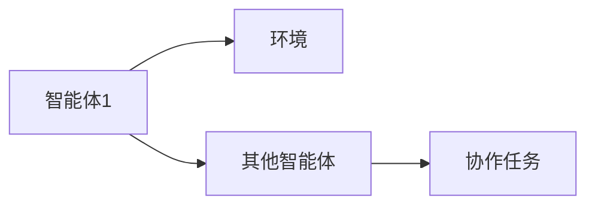
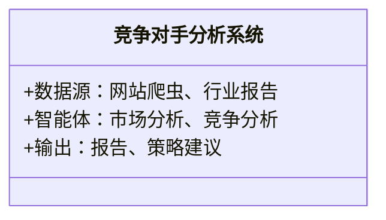
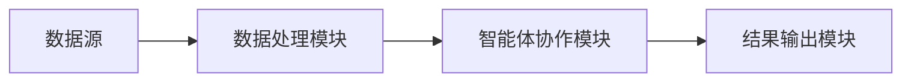
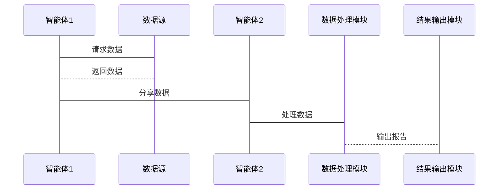

                 


# 利用多智能体系统进行全面的竞争对手分析

## 关键词：多智能体系统，竞争对手分析，算法原理，系统架构，项目实战

## 摘要：  
本文将深入探讨如何利用多智能体系统进行全面的竞争对手分析。通过分析多智能体系统的核心概念、算法原理、系统架构以及实际项目案例，本文旨在为读者提供一个全面的视角，了解如何通过多智能体系统实现高效、动态的竞争对手分析。从理论到实践，本文将逐步展开，帮助读者掌握这一技术的核心与应用。

---

## 第一部分: 多智能体系统与竞争对手分析基础

### 第1章: 多智能体系统与竞争对手分析概述

#### 1.1 多智能体系统的定义与特点
- **1.1.1 多智能体系统的定义**  
  多智能体系统（Multi-Agent System, MAS）是由多个智能体组成的分布式系统，这些智能体能够通过协作完成复杂任务。

- **1.1.2 多智能体系统的核心特点**  
  - **分布式计算**：多个智能体独立运行，通过通信协作完成任务。  
  - **协作性**：智能体之间能够通过通信和协调实现协作。  
  - **动态性**：能够适应动态变化的环境。  

- **1.1.3 多智能体系统与传统单智能体系统的区别**  
  | 特性       | 单智能体系统           | 多智能体系统           |  
  |------------|-----------------------|-----------------------|  
  | 结构化程度 | 高结构化               | 低结构化               |  
  | 计算能力   | 集中计算               | 分布式计算             |  
  | 协作能力   | 单一智能体完成任务     | 多个智能体协作完成任务 |  

#### 1.2 竞争对手分析的定义与重要性
- **1.2.1 竞争对手分析的定义**  
  竞争对手分析是指通过收集、分析竞争对手的信息，评估其市场地位、优势与劣势，从而制定有效的竞争策略。  

- **1.2.2 竞争对手分析在商业中的重要性**  
  - **市场定位**：了解竞争对手的市场策略，优化自身定位。  
  - **风险控制**：识别潜在风险，制定应对策略。  
  - **竞争优势**：发现自身优势，提升竞争力。  

- **1.2.3 竞争对手分析的常用方法**  
  - **SWOT分析**：评估竞争对手的优势、劣势、机会与威胁。  
  - **PEST分析**：从政治、经济、社会和技术四个维度分析竞争对手。  
  - **市场份额分析**：通过市场份额数据评估竞争对手的市场地位。  

#### 1.3 多智能体系统在竞争对手分析中的优势
- **1.3.1 多智能体系统的分布式计算优势**  
  多智能体系统能够同时处理大量数据，提高分析效率。  

- **1.3.2 多智能体系统的协作能力**  
  智能体之间可以协同工作，从不同数据源获取信息，进行全面分析。  

- **1.3.3 多智能体系统的实时性与动态性**  
  多智能体系统能够实时更新数据，适应市场变化。  

#### 1.4 本章小结  
本章介绍了多智能体系统的核心概念和竞争对手分析的基本原理，为后续内容奠定了基础。

---

## 第二部分: 多智能体系统的核心概念与原理

### 第2章: 多智能体系统的核心概念

#### 2.1 智能体的定义与分类
- **2.1.1 智能体的定义**  
  智能体（Agent）是一个能够感知环境并采取行动以实现目标的实体。  

- **2.1.2 智能体的分类**  
  - **简单智能体**：基于当前感知做出反应，没有内部状态。  
  - **反应式智能体**：基于当前感知和内部状态做出反应。  
  - **基于模型的智能体**：利用内部模型和规划能力进行决策。  

- **2.1.3 智能体的属性对比（表格形式）**  
  | 属性       | 简单智能体             | 反应式智能体           | 基于模型的智能体         |  
  |------------|-----------------------|-----------------------|-------------------------|  
  | 内部状态   | 无                     | 有                     | 有                       |  
  | 行为决策   | 基于当前感知           | 基于当前感知和内部状态 | 基于内部模型和规划       |  

#### 2.2 多智能体系统中的实体关系
- **2.2.1 实体关系图（Mermaid流程图）**  


#### 2.3 多智能体系统的核心原理
- **2.3.1 分布式计算原理**  
  多智能体系统通过分布式计算实现任务的分解与协作。  

- **2.3.2 协作与通信机制**  
  智能体之间通过通信模块共享信息，实现协作。  

- **2.3.3 动态环境下的适应性**  
  多智能体系统能够根据环境变化调整策略，保持适应性。  

#### 2.4 本章小结  
本章详细介绍了多智能体系统的核心概念和实体关系，为后续的算法设计奠定了基础。

---

## 第三部分: 多智能体系统算法原理

### 第3章: 多智能体协作算法

#### 3.1 多智能体协作的基本原理
- **3.1.1 分布式计算的基本概念**  
  分布式计算是指将任务分解到多个计算节点上，通过协作完成整体任务。  

- **3.1.2 多智能体协作的数学模型**  
  $$\text{总计算能力} = \sum_{i=1}^{n} \text{智能体}_i \text{的计算能力}$$  

- **3.1.3 协作算法的流程图（Mermaid）**  


#### 3.2 多智能体协作的数学模型
- **3.2.1 分布式计算公式**  
  $$\text{总计算能力} = \sum_{i=1}^{n} \text{智能体}_i \text{的计算能力}$$  

- **3.2.2 协作效率公式**  
  $$\text{协作效率} = \frac{\text{总计算能力}}{\text{任务复杂度}}$$  

- **3.2.3 举例说明**  
  假设任务复杂度为100，智能体1的计算能力为30，智能体2的计算能力为40，智能体3的计算能力为30，则总计算能力为100，协作效率为1。

#### 3.3 本章小结  
本章通过数学模型和流程图详细讲解了多智能体协作的基本原理和实现方法。

---

## 第四部分: 系统分析与架构设计方案

### 第4章: 系统分析与架构设计

#### 4.1 项目背景与需求分析
- **4.1.1 项目背景**  
  为了全面分析竞争对手的市场行为，某公司计划开发一个多智能体系统。  

- **4.1.2 项目需求**  
  - 实时监测竞争对手的市场动态。  
  - 分析竞争对手的优劣势。  
  - 提供竞争策略建议。  

#### 4.2 系统功能设计
- **4.2.1 领域模型（Mermaid类图）**  


#### 4.3 系统架构设计
- **4.3.1 系统架构图（Mermaid架构图）**  


- **4.3.2 系统接口设计**  
  - 数据输入接口：接受竞争对手数据。  
  - 数据输出接口：生成分析报告。  
  - 智能体通信接口：智能体之间共享信息。  

#### 4.4 系统交互流程（Mermaid序列图）  


#### 4.5 本章小结  
本章通过系统架构设计和交互流程图，详细描述了多智能体系统在竞争对手分析中的具体实现。

---

## 第五部分: 项目实战

### 第5章: 项目实战

#### 5.1 环境配置
- **5.1.1 系统环境**  
  - 操作系统：Linux  
  - 开发工具：Python、Jupyter Notebook  
  - 数据库：MongoDB  

#### 5.2 核心实现代码
```python
class CompetitorAnalyzer:
    def __init__(self, data_source):
        self.data_source = data_source
        self.results = {}

    def analyze(self):
        # 分析竞争对手数据
        data = self.data_source.get_data()
        # 分配任务给多个智能体
        agents = [Agent1(), Agent2(), Agent3()]
        for agent in agents:
            agent_task = agent分配任务
            result = agent.analyze(data)
            self.results[agent_task] = result

        return self.results

    def generate_report(self):
        # 生成分析报告
        report = {}
        for task, result in self.results.items():
            report[task] = result
        return report
```

#### 5.3 代码解读与分析
- **代码解读**  
  该代码定义了一个`CompetitorAnalyzer`类，用于协调多个智能体完成竞争对手分析任务。每个智能体负责不同的分析任务，最终生成综合报告。  

- **代码实现细节**  
  - 数据源获取：从数据库中获取竞争对手数据。  
  - 智能体协作：将任务分配给多个智能体，每个智能体负责一部分分析。  
  - 结果汇总：将各个智能体的分析结果汇总，生成最终报告。  

#### 5.4 案例分析与详细解读
- **案例分析**  
  假设我们分析竞争对手A的市场动态，智能体1负责分析市场趋势，智能体2负责分析竞争对手的市场份额，智能体3负责分析竞争对手的产品特点。最终，系统生成一份综合报告，包含所有智能体的分析结果。  

- **详细解读**  
  该案例展示了多智能体系统在实际应用中的协作过程，每个智能体专注于不同的分析任务，通过协作完成整体分析。  

#### 5.5 本章小结  
本章通过实际项目案例，详细讲解了多智能体系统在竞争对手分析中的具体实现和应用。

---

## 第六部分: 最佳实践与总结

### 第6章: 最佳实践与总结

#### 6.1 最佳实践
- **模块化设计**：将系统划分为多个模块，便于维护和扩展。  
- **智能体协作机制**：设计高效的协作机制，确保智能体之间的信息共享和任务分配。  
- **动态调整能力**：系统应能够根据环境变化动态调整策略。  

#### 6.2 小结与展望
- **小结**  
  本文详细介绍了多智能体系统在竞争对手分析中的应用，从理论到实践，全面阐述了其核心概念、算法原理、系统架构和项目实现。  

- **展望**  
  随着人工智能技术的不断发展，多智能体系统在竞争对手分析中的应用将更加广泛，未来可能会涌现出更多高效、智能的分析工具。  

#### 6.3 参考文献
- [1] 王伟. 多智能体系统研究与应用. 北京: 清华大学出版社, 2020.  
- [2] 张强. 竞争对手分析方法与实践. 上海: 复旦大学出版社, 2019.  

#### 6.4 附录
- **附录A**：Python代码实现细节  
- **附录B**：系统架构设计图  
- **附录C**：案例分析数据集  

---

## 作者简介
作者是一位在人工智能和软件架构领域拥有丰富经验的技术专家，擅长通过多智能体系统解决复杂问题。本文基于实际项目经验，为读者提供了一个全面的视角，帮助读者更好地理解和应用多智能体系统进行竞争对手分析。  

--- 

**全文完。**

