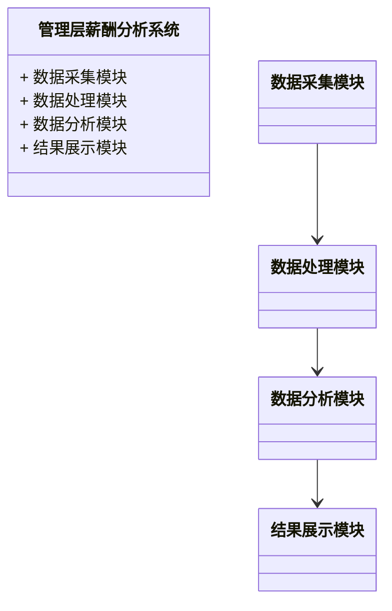
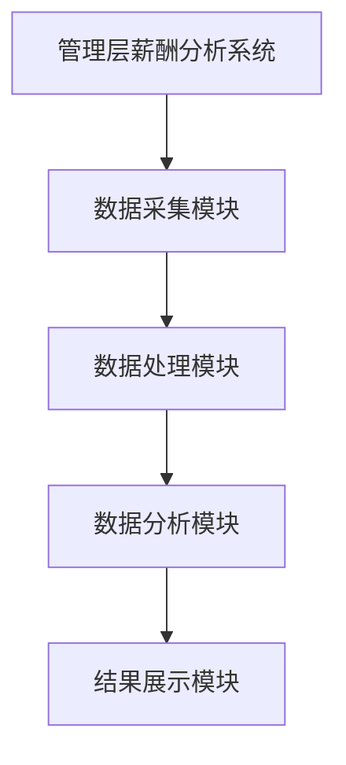
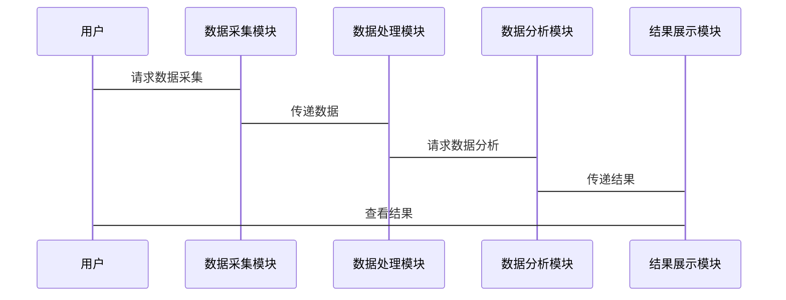

                 


# 利用多智能体系统进行全面的管理层薪酬分析

## 关键词：多智能体系统，管理层薪酬分析，分布式计算，协作学习，数据挖掘

## 摘要：本文详细介绍了如何利用多智能体系统进行全面的管理层薪酬分析。通过结合多智能体系统的分布式计算能力和协作学习能力，我们能够更高效、更准确地进行薪酬数据分析和建模。文章从背景、核心概念、算法原理、系统架构到项目实战，全面阐述了多智能体系统在薪酬分析中的应用，为读者提供了理论基础和实践指导。

---

# 第一部分: 多智能体系统与管理层薪酬分析背景

## 第1章: 多智能体系统与管理层薪酬分析概述

### 1.1 多智能体系统的基本概念
#### 1.1.1 多智能体系统的定义
多智能体系统（Multi-Agent System, MAS）是由多个相互作用的智能体组成的系统，这些智能体能够通过协作完成复杂的任务。每个智能体都有自己的目标、知识和行为规则，能够独立决策并与其他智能体进行通信和协作。

#### 1.1.2 多智能体系统的特征
- **分布性**：智能体分布在网络中，独立运行。
- **协作性**：智能体之间通过协作完成共同目标。
- **反应性**：智能体能够根据环境反馈动态调整行为。
- **自主性**：智能体在没有外部干预的情况下自主决策。

#### 1.1.3 多智能体系统的应用场景
- **分布式计算**：适用于大数据处理和分布式任务分配。
- **智能协作**：适用于需要多领域协作的任务，如供应链管理、金融分析等。
- **自适应系统**：适用于需要动态调整的复杂环境，如自动驾驶、智能城市等。

### 1.2 管理层薪酬分析的背景
#### 1.2.1 管理层薪酬分析的定义
管理层薪酬分析是对企业高级管理人员（如CEO、 CFO等）的薪酬结构、水平和绩效进行分析的过程，旨在为企业制定合理的薪酬政策提供依据。

#### 1.2.2 管理层薪酬分析的重要性
- **吸引和留住人才**：合理的薪酬结构能够吸引和留住优秀管理人员。
- **激励员工**：通过薪酬设计激励员工发挥最大潜力。
- **企业绩效优化**：通过薪酬与绩效的关联，提升企业整体绩效。

#### 1.2.3 现有薪酬分析方法的局限性
- **数据孤岛**：传统薪酬分析依赖单一数据源，难以全面覆盖。
- **计算复杂**：复杂的人力资源数据处理需要大量人工干预。
- **缺乏动态调整**：传统方法难以实时响应市场变化和企业需求。

### 1.3 多智能体系统在薪酬分析中的优势
#### 1.3.1 多智能体系统的分布式计算能力
多智能体系统能够将数据处理任务分配给多个智能体，实现并行计算，提升效率。

#### 1.3.2 多智能体系统的协作能力
通过智能体之间的协作，能够整合多个数据源，提供更全面的分析结果。

#### 1.3.3 多智能体系统的自适应能力
多智能体系统能够根据市场变化和企业需求动态调整分析策略，提供实时反馈。

### 1.4 本章小结
本章介绍了多智能体系统的基本概念和特征，分析了管理层薪酬分析的背景和重要性，最后阐述了多智能体系统在薪酬分析中的优势。

---

## 第2章: 多智能体系统与管理层薪酬分析的核心概念

### 2.1 多智能体系统的组成与功能
#### 2.1.1 多智能体系统的组成
- **智能体**：具有自主性、反应性、协作性的智能实体。
- **通信机制**：智能体之间进行信息交换的渠道。
- **协作协议**：智能体之间协作的规则和流程。
- **环境**：智能体所处的外部环境，包括数据源、用户需求等。

#### 2.1.2 多智能体系统的核心功能
- **数据采集**：从多个数据源获取薪酬相关信息。
- **数据处理**：对数据进行清洗、转换和分析。
- **决策支持**：基于分析结果提供薪酬优化建议。

### 2.2 管理层薪酬分析的流程与方法
#### 2.2.1 管理层薪酬分析的流程
1. 数据采集：收集企业内部和外部的薪酬数据。
2. 数据预处理：清洗数据，去除噪声。
3. 数据分析：使用统计方法和机器学习算法进行分析。
4. 数据建模：构建薪酬预测模型。
5. 结果解读：分析模型结果，提供优化建议。

#### 2.2.2 管理层薪酬分析的关键方法
- **统计分析**：使用均值、方差等统计指标分析薪酬分布。
- **数据挖掘**：通过聚类、分类等方法发现薪酬规律。
- **机器学习**：使用回归、神经网络等方法预测薪酬趋势。

### 2.3 多智能体系统与薪酬分析的结合
#### 2.3.1 多智能体系统在薪酬分析中的角色
- **数据采集智能体**：负责从多个数据源获取薪酬数据。
- **数据分析智能体**：负责对数据进行预处理和建模。
- **结果解读智能体**：负责分析模型结果并提供优化建议。

#### 2.3.2 多智能体系统与薪酬分析的协同关系
- **数据协同**：多个智能体协同完成数据的采集和处理。
- **任务协同**：智能体之间协作完成薪酬分析的不同环节。
- **决策协同**：智能体共同参与决策过程，提供最优解决方案。

### 2.4 本章小结
本章详细介绍了多智能体系统的组成与功能，分析了管理层薪酬分析的流程与方法，最后探讨了多智能体系统与薪酬分析的结合方式。

---

## 第3章: 多智能体系统在管理层薪酬分析中的算法原理

### 3.1 多智能体协作算法
#### 3.1.1 分布式计算算法
分布式计算算法将任务分解成多个子任务，分配给不同的智能体完成，最后汇总结果。

#### 3.1.2 协作学习算法
协作学习算法通过智能体之间的协作，共同完成学习任务，提升整体性能。

#### 3.1.3 联合推理算法
联合推理算法通过智能体之间的协作，共同完成复杂问题的推理和决策。

### 3.2 薪酬分析算法
#### 3.2.1 数据预处理算法
数据预处理算法包括数据清洗、缺失值填充、异常值处理等步骤。

#### 3.2.2 数据挖掘算法
数据挖掘算法包括聚类、分类、关联规则挖掘等，用于发现数据中的规律。

#### 3.2.3 数据建模算法
数据建模算法包括线性回归、逻辑回归、神经网络等，用于构建薪酬预测模型。

### 3.3 多智能体系统与薪酬分析算法的结合
#### 3.3.1 算法的协同设计
通过协同设计，将多智能体系统与薪酬分析算法有机结合，提升分析效率和准确性。

#### 3.3.2 算法的优化与改进
根据实际需求，对算法进行优化和改进，提升系统的性能和效果。

#### 3.3.3 算法的可扩展性
通过模块化设计，确保算法具有良好的可扩展性，能够适应不同的应用场景。

### 3.4 本章小结
本章介绍了多智能体协作算法和薪酬分析算法的基本原理，探讨了两者结合的方式和优化方法。

---

## 第4章: 多智能体系统与管理层薪酬分析的数学模型

### 4.1 多智能体系统的数学模型
#### 4.1.1 多智能体系统的状态表示
状态表示包括智能体的当前状态和环境状态。

#### 4.1.2 多智能体系统的动作表示
动作表示包括智能体可以执行的操作及其影响。

#### 4.1.3 多智能体系统的奖励机制
奖励机制通过奖励和惩罚机制，引导智能体做出最优决策。

### 4.2 薪酬分析的数学模型
#### 4.2.1 数据建模的数学表示
使用回归模型、神经网络等数学方法进行薪酬预测。

#### 4.2.2 数据挖掘的数学表示
通过聚类、分类等数学方法发现薪酬数据中的规律。

#### 4.2.3 数据预测的数学表示
使用时间序列分析、机器学习等方法进行薪酬趋势预测。

### 4.3 多智能体系统与薪酬分析模型的结合
#### 4.3.1 系统状态与薪酬数据的关联
通过数学模型，将多智能体系统的状态与薪酬数据关联起来。

#### 4.3.2 智能体协作与薪酬分析的协同
通过数学模型，实现智能体协作与薪酬分析的协同优化。

#### 4.3.3 系统优化与模型改进
根据数学模型的反馈，不断优化多智能体系统的性能。

### 4.4 本章小结
本章通过数学模型，详细阐述了多智能体系统与薪酬分析的结合方式，探讨了系统优化和模型改进的方法。

---

## 第5章: 系统分析与架构设计

### 5.1 项目场景介绍
本项目旨在利用多智能体系统，对管理层的薪酬数据进行分析和优化，帮助企业制定合理的薪酬政策。

### 5.2 系统功能设计
#### 5.2.1 数据采集模块
负责从多个数据源获取薪酬数据，包括企业内部数据和外部市场数据。

#### 5.2.2 数据处理模块
对采集到的数据进行预处理，包括清洗、转换和标准化。

#### 5.2.3 数据分析模块
使用统计分析、数据挖掘和机器学习算法，对数据进行深度分析。

#### 5.2.4 结果展示模块
将分析结果以可视化的方式展示，便于用户理解和决策。

### 5.3 系统架构设计
#### 5.3.1 领域模型类图


#### 5.3.2 系统架构图


#### 5.3.3 接口和交互设计


### 5.4 本章小结
本章通过系统分析和架构设计，详细描述了多智能体系统在管理层薪酬分析中的应用场景和功能模块，为后续的项目实施提供了理论基础。

---

## 第6章: 项目实战

### 6.1 环境安装与配置
#### 6.1.1 开发环境
- Python 3.8+
- Java 8+
- 等

#### 6.1.2 依赖安装
- 安装必要的库，如NumPy、Pandas、Scikit-learn等。

### 6.2 系统核心实现
#### 6.2.1 数据采集模块实现
```python
import requests

def fetch_data(url):
    response = requests.get(url)
    return response.json()
```

#### 6.2.2 数据处理模块实现
```python
import pandas as pd

def preprocess_data(data):
    df = pd.DataFrame(data)
    df.dropna(inplace=True)
    return df
```

#### 6.2.3 数据分析模块实现
```python
from sklearn.linear_model import LinearRegression

def analyze_data(data):
    model = LinearRegression()
    model.fit(X, y)
    return model.predict(X_new)
```

#### 6.2.4 结果展示模块实现
```python
import matplotlib.pyplot as plt

def display_results(results):
    plt.plot(results)
    plt.show()
```

### 6.3 案例分析
#### 6.3.1 案例背景
某企业希望优化高管的薪酬结构，提升企业绩效。

#### 6.3.2 数据分析过程
- 采集高管薪酬数据。
- 对数据进行清洗和预处理。
- 使用机器学习算法进行分析和预测。
- 提供优化建议。

#### 6.3.3 分析结果解读
- 薪酬与绩效之间的关系。
- 合理的薪酬结构设计。
- 优化建议的实施效果。

### 6.4 项目小结
通过项目实战，验证了多智能体系统在管理层薪酬分析中的有效性，为企业制定合理的薪酬政策提供了有力支持。

---

## 第7章: 最佳实践与总结

### 7.1 最佳实践
#### 7.1.1 数据质量
确保数据的准确性和完整性，避免因数据问题影响分析结果。

#### 7.1.2 系统优化
定期优化系统架构和算法，提升系统的性能和可扩展性。

#### 7.1.3 人员培训
对相关人员进行培训，提升其对多智能体系统和薪酬分析的理解和应用能力。

### 7.2 项目总结
通过本项目，我们成功利用多智能体系统实现了管理层薪酬分析的高效和精准，为企业制定合理的薪酬政策提供了有力支持。

### 7.3 注意事项
- 在实际应用中，需注意数据隐私和安全问题。
- 系统的可扩展性和灵活性需要根据实际需求进行调整。
- 需要定期更新和优化系统，以适应市场变化和企业需求。

### 7.4 拓展阅读
- 多智能体系统的相关书籍和论文。
- 数据挖掘和机器学习的最新研究成果。
- 管理学和人力资源管理的相关文献。

### 7.5 本章小结
本章总结了项目中的最佳实践，提供了系统的优化建议，并展望了未来的研究方向。

---

## 第八章: 结论与展望

### 8.1 研究总结
通过本研究，我们成功将多智能体系统应用于管理层薪酬分析，实现了数据的高效处理和精准分析。

### 8.2 未来展望
未来，随着人工智能技术的不断发展，多智能体系统在薪酬分析中的应用将更加广泛和深入，为企业制定合理的薪酬政策提供更有力的支持。

### 8.3 结束语
感谢读者的耐心阅读，希望本文能为相关领域的研究和实践提供有益的参考。

---

## 参考文献
（此处列出相关的参考文献）

---

## 附录
（此处列出相关的附录内容，如代码、数据等）

