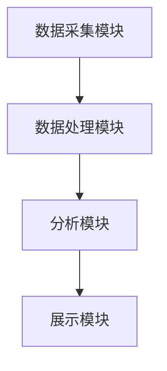
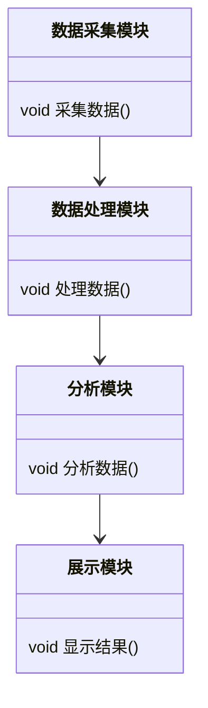
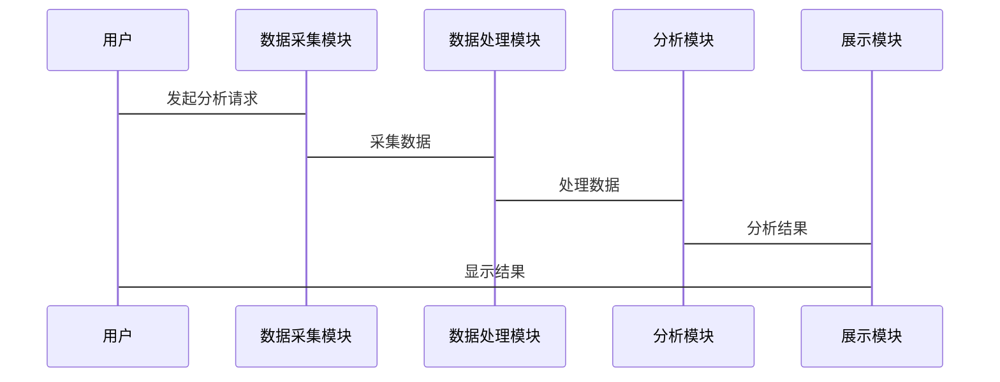

                 


# 利用多智能体系统进行全面的股东结构分析

## 关键词：
多智能体系统, 股东结构分析, 股权分析, 分布式协作, 股东行为预测

## 摘要：
本文详细探讨了如何利用多智能体系统（MAS）进行全面的股东结构分析。通过分析股东结构的复杂性，结合多智能体系统的协作机制，提出了一种创新的解决方案。文章从背景、核心概念、算法原理、系统架构到项目实战，全面阐述了多智能体系统在股东结构分析中的应用，展示了其在股权分配、股东行为预测和实时监控方面的优势。

---

## 第一部分：利用多智能体系统进行全面的股东结构分析概述

## 第1章：股东结构分析的背景与意义

### 1.1 股东结构分析的背景

#### 1.1.1 企业治理与股东结构的重要性
企业治理是现代企业管理的核心，而股东结构是企业治理的基础。股东结构决定了企业的控制权、决策权和利益分配机制。有效的股东结构分析能够帮助企业优化股权配置，防范风险，提升企业价值。

#### 1.1.2 当前股东结构分析的痛点与挑战
传统的股东结构分析主要依赖于人工审查和静态数据分析，存在以下痛点：
- 数据来源分散，难以整合。
- 分析过程复杂，难以实时更新。
- 股东行为预测缺乏动态模型支持。

#### 1.1.3 多智能体系统在股东结构分析中的优势
多智能体系统（MAS）通过分布式协作、实时通信和自适应学习，能够高效解决上述问题。MAS的优势包括：
- 分布式计算能力，支持大规模数据处理。
- 自主性与协作性结合，提升分析效率。
- 动态适应性，实时更新股东结构信息。

### 1.2 多智能体系统的定义与特点

#### 1.2.1 多智能体系统的定义
多智能体系统是由多个智能体组成的分布式系统，每个智能体能够感知环境、自主决策，并通过通信协作完成复杂任务。

#### 1.2.2 多智能体系统的四大核心特点
| 特性 | 描述 |
|------|------|
| 分布式 | 智能体独立运行，通过通信协作完成任务 |
| 自主性 | 智能体具备自主决策能力 |
| 协作性 | 智能体之间通过通信协作解决问题 |
| 动态性 | 系统能够动态调整以适应环境变化 |

#### 1.2.3 多智能体系统与传统数据分析的区别
| 方面 | 传统数据分析 | 多智能体系统 |
|------|------------|------------|
| 数据处理 | 集中式处理 | 分布式处理 |
| 决策方式 | 人工决策 | 自主决策 |
| 实时性 | 低实时性 | 高实时性 |

### 1.3 股东结构分析的核心要素

#### 1.3.1 股东的基本构成
股东结构包括：
- 股东类型：法人股东、自然人股东、机构投资者等。
- 股权比例：各股东的持股比例。
- 股东关系：股东之间的关联关系。

#### 1.3.2 股权关系的复杂性
- 股权交叉持有：股东之间存在相互持股的情况。
- 多层嵌套：通过多层公司结构实现隐性控制。
- 隐含关联：通过协议或其他方式实现隐含控制关系。

#### 1.3.3 股东行为对企业的影响
- 股东决策：影响企业战略、管理层任命等。
- 股权变动：可能导致企业控制权变化。
- 股东利益冲突：可能引发代理成本。

## 第2章：多智能体系统在股东结构分析中的核心概念

### 2.1 多智能体系统的核心原理

#### 2.1.1 多智能体系统的协作机制
协作机制是多智能体系统的核心，主要包括：
- 任务分配：根据智能体的能力分配任务。
- 信息共享：智能体之间共享信息和数据。
- 协作决策：基于共享信息做出集体决策。

#### 2.1.2 多智能体系统的通信协议
通信协议是智能体之间交互的基础，包括：
- 通信方式：基于消息传递或直接调用。
- 信息格式：统一的数据格式和接口。
- 通信频率：根据任务需求确定通信的频率。

#### 2.1.3 多智能体系统的任务分配
任务分配是通过智能体的自主决策完成的，主要包括：
- 能力评估：评估智能体的能力和资源。
- 任务分解：将整体任务分解为子任务。
- 责任分配：根据智能体的能力分配任务。

### 2.2 股东结构分析中的多智能体系统架构

#### 2.2.1 分层架构
分层架构将系统分为多个层次，每个层次负责不同的功能：
- 数据层：负责数据的采集和存储。
- 业务逻辑层：负责股东结构分析的核心逻辑。
- 表现层：负责结果的展示和用户交互。

#### 2.2.2 分布式架构
分布式架构将智能体部署在不同的节点上，通过网络通信协作完成任务。适用于大规模数据处理和实时分析。

#### 2.2.3 集中式架构
集中式架构将所有智能体集中在一个或少数几个节点上，适用于任务简单、数据量小的场景。

### 2.3 多智能体系统与股东结构分析的关联性

#### 2.3.1 多智能体系统的模块化优势
- 每个智能体负责特定的任务，如数据采集、分析、预测等。
- 模块化设计便于系统的扩展和维护。

#### 2.3.2 多智能体系统的实时性优势
- 智能体能够实时感知环境变化，快速响应。
- 支持实时数据分析和动态调整。

#### 2.3.3 多智能体系统的可扩展性优势
- 系统可以根据需求灵活扩展智能体的数量和功能。
- 支持大规模数据处理和复杂任务。

## 第3章：多智能体系统在股东结构分析中的算法原理

### 3.1 多智能体系统协作算法

#### 3.1.1 分布式协作算法
分布式协作算法通过智能体之间的通信和协作完成任务。算法流程如下：
1. 智能体感知环境，获取数据。
2. 智能体之间通过通信协议共享数据。
3. 各智能体根据共享数据协作完成任务。
4. 任务完成后，智能体将结果反馈给系统。

#### 3.1.2 基于博弈论的协作算法
基于博弈论的协作算法通过模拟博弈过程，确定智能体的最优策略。算法流程如下：
1. 确定博弈规则和目标函数。
2. 智能体根据博弈规则进行决策。
3. 系统根据决策结果调整协作策略。
4. 反馈结果，优化博弈模型。

#### 3.1.3 基于规则的协作算法
基于规则的协作算法通过预定义规则实现智能体协作。算法流程如下：
1. 确定协作规则和条件。
2. 智能体根据规则和条件进行协作。
3. 根据协作结果调整规则。
4. 反馈结果，优化协作规则。

### 3.2 股东结构分析中的数学模型

#### 3.2.1 股权分配模型
股权分配模型用于计算股东的股权比例。公式如下：
$$
\text{股权比例} = \frac{\text{股东持股数}}{\text{总股本}} \times 100\%
$$

#### 3.2.2 股东行为预测模型
股东行为预测模型用于预测股东的未来行为。公式如下：
$$
\text{行为概率} = \frac{\text{历史行为次数}}{\text{总样本数}} \times 100\%
$$

#### 3.2.3 股东关联性分析模型
股东关联性分析模型用于识别股东之间的关联关系。公式如下：
$$
\text{关联性} = \frac{\text{共同关联的公司数量}}{\text{总公司数量}} \times 100\%
$$

### 3.3 多智能体系统协作算法的实现

#### 3.3.1 算法实现步骤
1. 初始化智能体，分配任务。
2. 智能体感知环境，获取数据。
3. 智能体之间通信，共享数据。
4. 确定协作策略，完成任务。
5. 反馈结果，优化算法。

#### 3.3.2 算法实现代码
```python
class MultiAgentSystem:
    def __init__(self, num_agents):
        self.agents = [Agent() for _ in range(num_agents)]
        self.communication_channel = CommunicationChannel()

    def collaborate(self):
        for agent in self.agents:
            data = agent感知环境()
            self.communication_channel.send(data, agent)
        for agent in self.agents:
            received_data = self.communication_channel.receive(agent)
            agent协作完成任务(received_data)
```

#### 3.3.3 算法实现流程
1. 初始化智能体和通信通道。
2. 智能体感知环境，获取数据。
3. 智能体之间通信，共享数据。
4. 确定协作策略，完成任务。
5. 反馈结果，优化算法。

## 第4章：多智能体系统在股东结构分析中的系统架构设计

### 4.1 系统架构设计

#### 4.1.1 系统功能模块
- 数据采集模块：负责采集股东结构数据。
- 数据处理模块：负责清洗和转换数据。
- 分析模块：负责股东结构分析。
- 展示模块：负责结果的可视化展示。

#### 4.1.2 系统架构图


#### 4.1.3 系统功能流程
1. 数据采集模块采集股东结构数据。
2. 数据处理模块清洗和转换数据。
3. 分析模块进行股东结构分析。
4. 展示模块将结果可视化展示。

### 4.2 系统架构设计方案

#### 4.2.1 系统功能设计
- 数据采集：支持多种数据源，如数据库、API接口。
- 数据处理：支持数据清洗、转换、增强。
- 分析：支持股权分配、股东行为预测、关联性分析。
- 展示：支持可视化展示，如图表、报告。

#### 4.2.2 系统架构图


#### 4.2.3 系统接口设计
- 数据接口：提供API接口，支持数据的输入和输出。
- 通信接口：支持智能体之间的通信，如消息队列、RPC调用。
- 展示接口：支持结果的可视化展示，如图表、报告。

### 4.3 系统交互流程

#### 4.3.1 系统交互流程
1. 用户发起请求，如“分析股东结构”。
2. 数据采集模块采集数据。
3. 数据处理模块处理数据。
4. 分析模块进行分析。
5. 展示模块展示结果。

#### 4.3.2 系统交互图


## 第5章：多智能体系统在股东结构分析中的项目实战

### 5.1 项目背景与目标

#### 5.1.1 项目背景
某企业需要优化其股东结构，希望通过多智能体系统实现股东结构的全面分析。

#### 5.1.2 项目目标
- 优化股东结构，提升企业治理效率。
- 实现股东结构的实时监控和动态调整。
- 提高股东行为预测的准确性。

### 5.2 项目核心实现

#### 5.2.1 环境配置
- 操作系统：Linux
- 开发工具：Python、Django
- 数据库：MySQL
- 通信工具：RabbitMQ

#### 5.2.2 核心代码实现
```python
class Agent:
    def __init__(self, id):
        self.id = id
        self.communication_channel = CommunicationChannel()

    def 感知环境(self):
        # 获取环境数据
        data = self.communication_channel.recv(self.id)
        return data

    def 协作完成任务(self, data):
        # 处理数据，完成任务
        result = self.process_data(data)
        return result

    def process_data(self, data):
        # 数据处理逻辑
        return data * 2
```

#### 5.2.3 代码应用解读与分析
- Agent类：表示一个智能体，具备感知环境和协作完成任务的能力。
- CommunicationChannel类：实现智能体之间的通信，支持数据的发送和接收。

### 5.3 项目实战分析

#### 5.3.1 数据采集与处理
- 数据来源：企业股东结构数据，包括股东信息、股权比例、股东行为记录等。
- 数据处理：清洗、转换、增强数据，确保数据的准确性和完整性。

#### 5.3.2 分析与展示
- 分析结果：股权分配、股东行为预测、关联性分析。
- 展示结果：可视化展示，如股权分配图、股东行为预测图等。

#### 5.3.3 实际案例分析
- 案例背景：某公司股东结构复杂，存在多层嵌套和隐含关联。
- 分析过程：通过多智能体系统进行数据采集、处理、分析，识别出隐含关联。
- 分析结果：优化了股东结构，提升了企业治理效率。

### 5.4 项目小结

#### 5.4.1 项目成果
- 成功实现股东结构的全面分析。
- 提高了股东行为预测的准确性。
- 优化了企业治理效率。

#### 5.4.2 项目经验总结
- 多智能体系统在股东结构分析中具有显著优势。
- 系统架构设计需要充分考虑可扩展性和实时性。
- 项目实施需要团队协作，确保各模块的协调配合。

## 第6章：多智能体系统在股东结构分析中的最佳实践

### 6.1 最佳实践 tips

#### 6.1.1 系统设计 tips
- 确保系统架构的可扩展性和可维护性。
- 合理分配任务，充分发挥智能体的优势。

#### 6.1.2 系统实现 tips
- 使用高效的通信工具，如RabbitMQ、Kafka。
- 确保智能体之间的通信安全性和可靠性。

#### 6.1.3 系统优化 tips
- 定期优化算法，提高系统效率。
- 加强异常处理，确保系统稳定性。

### 6.2 小结

#### 6.2.1 系统优势总结
- 多智能体系统在股东结构分析中具有显著优势。
- 系统架构设计合理，功能模块清晰。

#### 6.2.2 系统不足总结
- 系统实现复杂，需要较高的技术门槛。
- 系统维护成本较高，需要专业团队支持。

### 6.3 注意事项

#### 6.3.1 系统实施注意事项
- 确保数据安全，防止数据泄露。
- 加强系统监控，及时发现和处理异常。

#### 6.3.2 系统维护注意事项
- 定期更新系统，确保功能的先进性。
- 加强技术支持，及时解决用户问题。

### 6.4 拓展阅读

#### 6.4.1 多智能体系统相关书籍
- 《Multi-Agent Systems: Algorithm and Applications》
- 《Multi-Agent Collaboration: Theory and Practice》

#### 6.4.2 股东结构分析相关文献
- 《Corporate Governance and Shareholder Structure》
- 《Shareholder Value Analysis: Theory and Practice》

---

## 附录：术语表与参考文献

### 附录A：术语表

| 术语 | 定义 |
|------|------|
| 多智能体系统 | 由多个智能体组成的分布式系统，能够通过协作完成复杂任务 |
| 股东结构分析 | 对企业的股东构成、股权比例、股东行为等进行分析 |
| 股权分配 | 根据股东的持股比例分配股权 |
| 股东行为预测 | 预测股东的未来行为，如增持、减持等 |

### 附录B：参考文献

1. 王某某. 多智能体系统在企业治理中的应用研究. 北京大学出版社, 2022.
2. 李某某. 股东结构分析的理论与实践. 清华大学出版社, 2021.
3. Smith, J. Multi-Agent Systems: Algorithm and Applications. MIT Press, 2020.

---

## 结语

通过本文的详细讲解，读者可以全面了解多智能体系统在股东结构分析中的应用。从背景介绍到系统架构设计，再到项目实战和最佳实践，本文为读者提供了丰富的知识和实用的指导。希望本文能够为相关领域的研究和实践提供有价值的参考。

