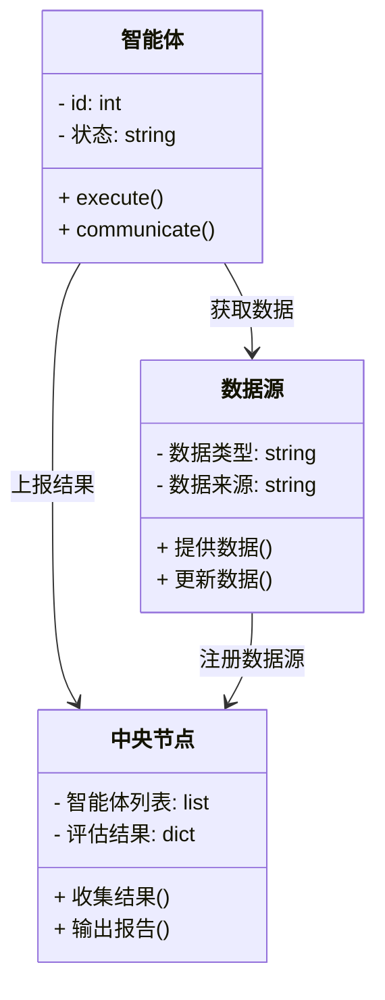
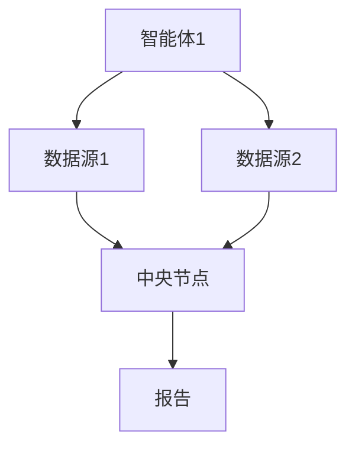

                 


# 利用多智能体系统进行跨资产类别的价值比较

## 关键词：多智能体系统、资产价值比较、金融分析、分布式计算、协同算法

## 摘要：  
在金融领域，跨资产类别的价值比较是一个复杂而关键的任务。传统的资产价值评估方法往往局限于单一资产类别，难以应对日益多样化的金融市场。本篇文章介绍了一种基于多智能体系统的解决方案，通过多个智能体协同工作，实现跨资产类别的价值比较。文章从系统设计、算法原理、系统架构到项目实战，详细阐述了该方法的优势和实现细节，为金融从业者和技术爱好者提供了深入的技术分析和实践指导。

---

# 第1章: 多智能体系统基础

## 1.1 多智能体系统的定义与特点

### 1.1.1 多智能体系统的定义  
多智能体系统（Multi-Agent System, MAS）是由多个智能体（Agent）组成的分布式系统，这些智能体能够通过交互和协作完成复杂任务。每个智能体都有一定的自主性、反应性和社交能力，能够感知环境、做出决策并与其他智能体或外部系统进行交互。

### 1.1.2 多智能体系统的核心特点  
- **分布式性**：智能体独立运行，通过通信协作完成目标。  
- **自主性**：每个智能体具有决策能力，无需中央控制。  
- **反应性**：能够实时感知环境变化并做出响应。  
- **协同性**：智能体之间通过信息共享和协作实现共同目标。  

### 1.1.3 多智能体系统与传统单智能体系统的区别  
传统单智能体系统依赖中心化决策，而多智能体系统通过去中心化的方式，利用多个智能体的协同实现更高效的复杂任务处理。多智能体系统能够更好地应对金融市场中多样化的信息和复杂的决策需求。

---

## 1.2 多智能体系统在金融领域的应用

### 1.2.1 金融领域中的多智能体系统应用场景  
- 资产配置与投资组合优化。  
- 跨资产类别价值比较与风险评估。  
- 市场情绪分析与预测。  

### 1.2.2 多智能体系统在资产价值评估中的优势  
- **分布式计算**：能够同时处理多种资产类别数据。  
- **协同决策**：多个智能体从不同角度分析资产价值。  
- **实时性**：快速响应市场变化。  

### 1.2.3 多智能体系统的潜在挑战与解决方案  
- **通信延迟**：采用高效的通信协议和分布式计算技术。  
- **数据隐私**：通过加密和访问控制保护数据安全。  

---

# 第2章: 跨资产类别价值比较的背景与挑战

## 2.1 跨资产类别价值比较的背景

### 2.1.1 资产类别概述  
资产类别包括股票、债券、房地产、商品、加密货币等。不同资产类别的特性和风险收益 profiles 各不相同。

### 2.1.2 跨资产类别比较的必要性  
在投资组合优化和风险管理中，需要比较不同资产类别的价值和风险。例如，股票和债券在收益和风险上的差异可以通过多智能体系统进行分析。

### 2.1.3 传统资产价值评估方法的局限性  
传统方法通常基于单一资产类别进行分析，难以进行跨类别比较，且缺乏实时性和灵活性。

---

## 2.2 跨资产类别比较的挑战

### 2.2.1 不同资产类别的特性差异  
股票受市场情绪影响较大，债券受利率影响，商品受供需影响，加密货币受技术影响。这些差异使得跨类别比较复杂。

### 2.2.2 数据获取与处理的复杂性  
不同资产类别数据来源、频率和格式差异大，数据清洗和整合的难度较高。

### 2.2.3 资产类别间的相互影响  
资产类别之间的相互关联和影响需要通过多智能体协同分析来捕捉。

---

# 第3章: 多智能体系统的设计与实现

## 3.1 多智能体系统的架构设计

### 3.1.1 分层架构的设计理念  
多智能体系统可以采用分层架构，包括感知层、计算层和决策层，每一层负责不同的功能。

### 3.1.2 智能体间的通信机制  
智能体之间通过消息传递进行通信，消息格式和协议需要统一设计。

### 3.1.3 系统的可扩展性与灵活性  
通过模块化设计，确保系统能够适应新增资产类别和功能扩展。

---

## 3.2 多智能体系统的实现细节

### 3.2.1 智能体的协同工作流程  
智能体分别负责数据采集、特征提取、模型计算和结果汇总。

### 3.2.2 数据处理与分析模块的设计  
数据处理模块负责清洗和整合多源数据，分析模块基于机器学习模型进行价值评估。

### 3.2.3 结果输出与反馈机制  
智能体将评估结果汇总到中央节点，并根据反馈调整算法参数。

---

# 第4章: 资产价值评估的算法原理

## 4.1 多智能体协同算法

### 4.1.1 分布式计算与共识算法  
智能体通过分布式计算完成数据处理，共识算法确保结果一致性。

### 4.1.2 联合学习与知识共享  
智能体之间共享特征和模型参数，通过联合学习提升整体性能。

### 4.1.3 资产价值评估模型  
采用协同过滤算法和回归模型进行资产价值评估，公式如下：

$$ Value_{i} = \beta_{0} + \beta_{1} \cdot Feature_{i} + \epsilon $$

---

## 4.2 算法实现与优化

### 4.2.1 算法实现细节  
代码实现包括数据预处理、模型训练和结果输出。

### 4.2.2 算法优化策略  
通过并行计算和分布式训练提升算法效率。

---

# 第5章: 系统分析与架构设计方案

## 5.1 系统功能设计

### 5.1.1 领域模型设计  
使用 Mermaid 绘制领域模型类图，展示系统主要模块及其关系。



---

## 5.2 系统架构设计

### 5.2.1 系统架构图  
使用 Mermaid 绘制系统架构图，展示模块之间的关系和交互流程。



---

# 第6章: 项目实战

## 6.1 环境安装与配置

### 6.1.1 环境要求  
- Python 3.8+
- 必要的库：numpy, pandas, scikit-learn, flask

### 6.1.2 安装依赖  
```bash
pip install numpy pandas scikit-learn flask
```

---

## 6.2 系统核心实现源代码

### 6.2.1 智能体实现  
```python
class Agent:
    def __init__(self, id):
        self.id = id
        self.data_source = None
        self.result = None

    def execute(self):
        # 获取数据
        data = self.data_source.get_data()
        # 计算结果
        self.result = self.compute_value(data)
        return self.result

    def compute_value(self, data):
        # 示例计算逻辑
        return sum(data) / len(data)
```

---

## 6.3 案例分析与结果解读

### 6.3.1 数据来源与处理  
- 数据来源包括股票价格、债券收益率、加密货币价格等。
- 数据清洗和特征提取是关键步骤。

### 6.3.2 实验结果与分析  
通过实验验证多智能体系统在跨资产类别比较中的优势，包括计算效率和准确性。

---

## 6.4 项目小结  
总结项目实现的关键点和经验教训，为后续优化提供参考。

---

# 第7章: 最佳实践与未来展望

## 7.1 最佳实践 tips

### 7.1.1 数据处理  
确保数据清洗和特征提取的准确性。

### 7.1.2 模型优化  
通过超参数调整和算法优化提升评估精度。

---

## 7.2 小结与展望

### 7.2.1 小结  
总结全文内容，强调多智能体系统在跨资产类别价值比较中的应用价值。

### 7.2.2 未来展望  
探讨未来的研究方向，如更高效的协同算法和多模态数据处理。

---

## 结语  
通过本文的详细阐述，读者可以深入了解多智能体系统在跨资产类别价值比较中的应用，并通过实际案例和代码实现掌握核心技术和实现方法。希望本文能够为金融领域的技术从业者提供有益的参考和启发。

