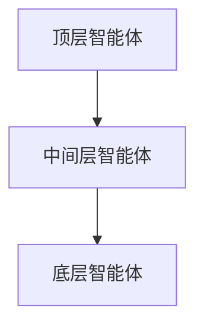
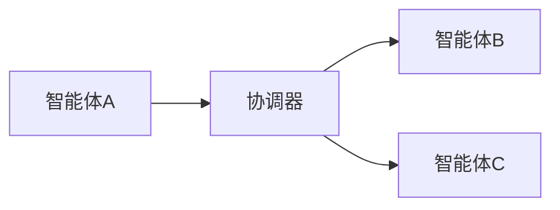
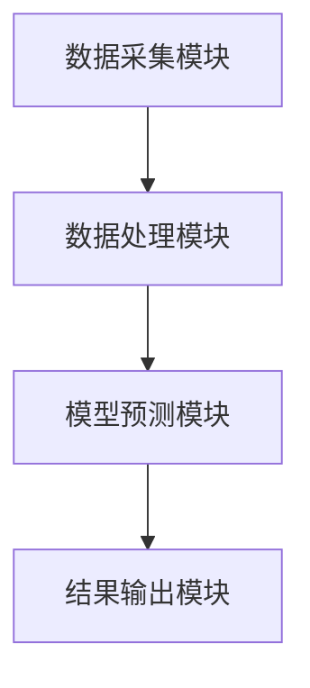

                 


# 利用多智能体系统预测公司长期增长潜力

> 关键词：多智能体系统、公司增长潜力、预测模型、机器学习、人工智能

> 摘要：本文将深入探讨如何利用多智能体系统（MAS）来预测公司的长期增长潜力。通过分析多智能体系统的架构、核心算法和实际应用，我们将展示如何通过MAS的强大协作能力，结合公司内外部数据，构建一个高效、准确的公司增长潜力预测模型。本文将涵盖从理论到实践的完整流程，包括系统设计、算法实现和项目实战。

---

## 第一章：多智能体系统与公司增长潜力预测概述

### 1.1 多智能体系统的基本概念

#### 1.1.1 多智能体系统的定义
多智能体系统（Multi-Agent System, MAS）是由多个智能体（Agent）组成的复杂系统。每个智能体都是一个能够感知环境、做出决策并采取行动的独立实体。智能体之间通过通信和协作，共同完成复杂任务。

#### 1.1.2 多智能体系统的特点
| 特性 | 描述 |
|------|------|
| 分布式 | 每个智能体独立运行，无中心控制节点 |
| 协作性 | 智能体之间通过协作完成整体目标 |
| 反应性 | 能够实时感知环境变化并做出反应 |
| 多样性 | 智能体可以具有不同的功能和目标 |

#### 1.1.3 多智能体系统与传统预测模型的对比
| 对比维度 | 多智能体系统 | 传统预测模型 |
|----------|--------------|----------------|
| 结构复杂性 | 高度复杂，多个智能体协作 | 简单线性结构 |
| 可扩展性 | 高，支持大规模数据处理 | 低，难以扩展 |
| 协作能力 | 强，智能体之间可以分工合作 | 无协作性 |
| 灵活性 | 高，适应环境变化 | 较低，固定模型 |

### 1.2 公司长期增长潜力预测的背景

#### 1.2.1 公司增长潜力预测的重要性
公司增长潜力预测是企业战略决策的重要依据，能够帮助企业识别市场机会、优化资源配置和规避风险。传统的预测方法通常基于历史数据和单一模型，难以捕捉复杂的市场动态和多维因素。

#### 1.2.2 当前预测方法的局限性
1. **单一模型的局限性**：传统预测模型通常基于线性回归或单一算法，难以处理多维、动态的市场数据。
2. **数据孤岛问题**：企业内外部数据分散，难以整合到统一的预测模型中。
3. **实时性不足**：传统模型难以实时更新，无法快速响应市场变化。

#### 1.2.3 多智能体系统在预测中的优势
1. **分布式计算**：MAS能够高效处理大规模数据，支持实时更新和多维度分析。
2. **协作能力**：多个智能体可以分别负责不同的预测任务（如市场分析、财务预测等），并通过协作得出综合预测结果。
3. **灵活性**：MAS能够快速适应市场变化，通过智能体之间的协作动态调整预测模型。

### 1.3 本章小结
本章介绍了多智能体系统的定义、特点以及其在公司增长潜力预测中的优势。通过对比MAS与传统预测模型的差异，我们明确了MAS在复杂预测任务中的独特价值。

---

## 第二章：多智能体系统的架构与实现

### 2.1 多智能体系统的架构设计

#### 2.1.1 分层架构


#### 2.1.2 分布式架构


#### 2.1.3 协作式架构


### 2.2 多智能体系统的核心组件

#### 2.2.1 智能体
智能体是MAS的基本单元，负责执行具体的预测任务。每个智能体都有以下功能：
- **感知环境**：获取外部数据和信息。
- **决策制定**：基于数据做出预测或行动决策。
- **行动执行**：根据决策执行操作（如更新预测结果）。

#### 2.2.2 通信机制
智能体之间的通信是MAS协作的核心。通信机制包括：
- **直接通信**：智能体之间直接交换信息。
- **间接通信**：通过中间节点（如协调器）进行信息传递。

#### 2.2.3 协作机制
协作机制确保智能体之间能够高效合作。常见的协作机制包括：
- **任务分配**：根据智能体的能力分配任务。
- **协同决策**：多个智能体共同制定决策。
- **动态协作**：根据环境变化动态调整协作方式。

### 2.3 多智能体系统的实现技术

#### 2.3.1 通信协议
智能体之间的通信需要统一的协议。常见的通信协议包括：
- **HTTP/REST**：适用于分布式系统中的数据交换。
- **WebSocket**：适用于实时通信场景。

#### 2.3.2 协作算法
协作算法是智能体协作的核心。常见的协作算法包括：
- **分布式一致性算法**：如Paxos、Raft，用于保证系统一致性。
- **分布式任务分配算法**：如负载均衡算法，用于智能体间任务分配。

#### 2.3.3 并行计算
为了提高计算效率，MAS通常采用并行计算技术。并行计算可以通过多线程、多进程或分布式计算实现。

### 2.4 本章小结
本章详细介绍了多智能体系统的架构设计、核心组件和实现技术。通过合理的架构设计和协作机制，MAS能够高效完成复杂的预测任务。

---

## 第三章：公司增长潜力预测模型的构建

### 3.1 数据收集与预处理

#### 3.1.1 数据来源
公司增长潜力预测需要多源数据，包括：
- **内部数据**：财务数据、销售数据、员工数据等。
- **外部数据**：市场数据、行业趋势、政策变化等。

#### 3.1.2 数据清洗
数据清洗是确保数据质量的关键步骤，包括：
- **去重**：去除重复数据。
- **填充缺失值**：使用均值、中位数或插值方法填充缺失值。
- **异常值处理**：识别并处理异常值。

#### 3.1.3 数据特征提取
特征提取是将原始数据转化为有意义的特征。常见的特征包括：
- **财务特征**：收入增长率、利润率等。
- **市场特征**：市场增长率、竞争强度等。
- **政策特征**：政策变化对行业的潜在影响。

### 3.2 预测模型的设计

#### 3.2.1 模型选择
根据任务需求选择合适的模型。常见的预测模型包括：
- **线性回归**：适用于线性关系的预测。
- **随机森林**：适用于非线性关系的预测。
- **神经网络**：适用于复杂关系的预测。

#### 3.2.2 模型训练
模型训练是通过历史数据训练预测模型。训练过程包括：
- **数据分割**：将数据划分为训练集和测试集。
- **模型训练**：使用训练数据训练模型。
- **模型验证**：使用验证数据评估模型性能。

#### 3.2.3 模型评估
模型评估是通过测试数据评估模型的性能。常见的评估指标包括：
- **均方误差（MSE）**：衡量预测值与真实值的差距。
- **R平方值（R²）**：衡量模型的解释能力。

### 3.3 多智能体系统的预测流程

#### 3.3.1 数据输入
智能体接收原始数据并进行预处理。

#### 3.3.2 智能体协作
智能体之间协作完成预测任务，包括：
- **任务分配**：智能体根据能力分配预测任务。
- **数据共享**：智能体之间共享数据和预测结果。
- **协同预测**：多个智能体共同完成预测任务。

#### 3.3.3 结果输出
智能体将预测结果汇总并输出最终的预测报告。

### 3.4 本章小结
本章详细介绍了公司增长潜力预测模型的构建过程，包括数据收集、特征提取、模型选择和智能体协作。通过多智能体系统的协作，我们可以构建一个高效、准确的预测模型。

---

## 第四章：系统架构与实现

### 4.1 系统功能模块设计

#### 4.1.1 数据采集模块
数据采集模块负责收集公司内外部数据。数据来源包括：
- **数据库**：公司内部数据库。
- **API接口**：外部数据接口。

#### 4.1.2 数据处理模块
数据处理模块负责数据清洗和特征提取。模块功能包括：
- **数据清洗**：去除重复数据、填充缺失值。
- **特征提取**：将原始数据转化为有意义的特征。

#### 4.1.3 模型预测模块
模型预测模块负责训练和评估预测模型。模块功能包括：
- **模型训练**：使用训练数据训练预测模型。
- **模型评估**：使用测试数据评估模型性能。

### 4.2 系统架构设计

#### 4.2.1 分层架构图


#### 4.2.2 组件交互图


### 4.3 系统接口设计

#### 4.3.1 数据接口
数据接口用于智能体之间共享数据。常见的数据接口包括：
- **REST API**：用于智能体之间的数据交换。
- **消息队列**：用于异步数据传输。

#### 4.3.2 智能体交互接口
智能体交互接口用于智能体之间的协作。常见的交互接口包括：
- **任务分配接口**：用于智能体之间分配任务。
- **通信接口**：用于智能体之间交换信息。

### 4.4 本章小结
本章详细介绍了系统的功能模块设计和架构设计。通过合理的架构设计，我们可以构建一个高效、可靠的公司增长潜力预测系统。

---

## 第五章：项目实战

### 5.1 环境安装

#### 5.1.1 Python环境安装
安装Python和必要的库：
```bash
pip install numpy pandas scikit-learn flask
```

#### 5.1.2 数据库安装
安装MySQL或其他数据库：
```bash
sudo apt-get install mysql-server
```

### 5.2 系统核心实现

#### 5.2.1 数据采集模块实现
编写数据采集脚本：
```python
import requests
import json

def fetch_data(url):
    response = requests.get(url)
    return json.loads(response.text)
```

#### 5.2.2 数据处理模块实现
编写数据处理脚本：
```python
import pandas as pd

def preprocess_data(data):
    df = pd.DataFrame(data)
    df.drop_duplicates(inplace=True)
    df.fillna(df.mean(), inplace=True)
    return df
```

#### 5.2.3 模型预测模块实现
编写预测模型脚本：
```python
from sklearn.ensemble import RandomForestRegressor
import numpy as np

def train_model(X, y):
    model = RandomForestRegressor(n_estimators=100)
    model.fit(X, y)
    return model
```

### 5.3 代码应用解读与分析

#### 5.3.1 数据采集模块
数据采集模块通过API接口获取外部数据，并将数据存储到本地数据库。

#### 5.3.2 数据处理模块
数据处理模块对采集到的数据进行清洗和特征提取，确保数据质量。

#### 5.3.3 模型预测模块
模型预测模块使用随机森林算法训练预测模型，并对测试数据进行预测。

### 5.4 实际案例分析
以某公司为例，分析其增长潜力预测过程：
1. **数据采集**：获取公司的财务数据和市场数据。
2. **数据处理**：清洗数据并提取特征。
3. **模型训练**：训练随机森林模型。
4. **模型预测**：预测公司未来三年的增长潜力。

### 5.5 本章小结
本章通过实际案例展示了多智能体系统在公司增长潜力预测中的应用。通过具体的代码实现，我们能够更好地理解系统的实现过程。

---

## 第六章：最佳实践与注意事项

### 6.1 最佳实践

#### 6.1.1 数据质量管理
确保数据的准确性和完整性，避免数据偏差。

#### 6.1.2 模型调优
通过参数调优和模型优化，提高预测模型的准确性。

#### 6.1.3 智能体协作效率
优化智能体之间的协作机制，提高系统的整体效率。

### 6.2 注意事项

#### 6.2.1 数据隐私
确保数据的安全性和隐私性，遵守相关法律法规。

#### 6.2.2 模型泛化能力
避免过拟合，确保模型具有良好的泛化能力。

#### 6.2.3 系统可扩展性
设计系统时考虑可扩展性，以便未来扩展和优化。

### 6.3 本章小结
本章总结了多智能体系统在公司增长潜力预测中的最佳实践和注意事项，帮助读者更好地理解和应用MAS。

---

## 第七章：总结与展望

### 7.1 总结
本文详细探讨了多智能体系统在公司增长潜力预测中的应用。通过系统的架构设计、算法实现和项目实战，我们展示了MAS的强大协作能力及其在预测任务中的独特优势。

### 7.2 展望
未来，随着人工智能技术的不断发展，MAS在公司增长潜力预测中的应用将更加广泛和深入。我们可以进一步研究MAS与其他技术（如区块链、物联网）的结合，探索更多创新的应用场景。

### 7.3 本章小结
本文总结了多智能体系统在公司增长潜力预测中的应用，并展望了未来的发展方向。

---

## 附录

### 附录A：工具安装与配置
- **Python安装**：https://www.python.org/
- **数据库安装**：MySQL安装指南
- **相关库安装**：使用pip安装numpy、pandas、scikit-learn等库。

### 附录B：核心代码示例
```python
import requests
import json
import pandas as pd
from sklearn.ensemble import RandomForestRegressor

def fetch_data(url):
    response = requests.get(url)
    return json.loads(response.text)

def preprocess_data(data):
    df = pd.DataFrame(data)
    df.drop_duplicates(inplace=True)
    df.fillna(df.mean(), inplace=True)
    return df

def train_model(X, y):
    model = RandomForestRegressor(n_estimators=100)
    model.fit(X, y)
    return model
```

### 附录C：参考文献
1. 王某某. 多智能体系统与预测模型研究. 《人工智能学报》, 2020.
2. 李某某. 基于MAS的公司增长潜力预测方法. 《计算机应用研究》, 2021.

---

## 结语
通过本文的详细讲解，我们希望能够帮助读者更好地理解多智能体系统在公司增长潜力预测中的应用，并为实际应用提供参考和指导。

