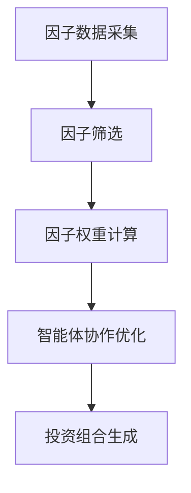

                 


# 利用智能体协作优化价值投资的多因子模型

## 关键词：
- 价值投资
- 多因子模型
- 智能体协作
- 金融数据分析
- 优化算法

## 摘要：
本文探讨如何利用智能体协作优化价值投资中的多因子模型。通过分析多因子模型的核心要素和智能体协作的基本原理，提出一种基于智能体协作的优化算法，以提升投资决策的准确性和效率。文章结合数学模型、系统架构设计和实际案例，详细阐述了如何构建和实现这一模型，为投资者提供科学的决策支持。

---

## 第一部分: 多因子模型与智能体协作概述

### 第1章: 价值投资与多因子模型概述

#### 1.1 价值投资的核心概念
##### 1.1.1 价值投资的定义与特点
价值投资是一种以内在价值为导向的投资策略，强调购买被市场低估的资产。其核心在于识别资产的内在价值，并在价格低于内在价值时进行投资。

##### 1.1.2 多因子模型在价值投资中的作用
多因子模型通过多个因子（如市盈率、市净率、股息率等）来评估资产的价值，帮助投资者更全面地分析资产的风险和收益。

##### 1.1.3 智能体协作在投资决策中的优势
智能体协作通过多个智能体的协同工作，能够更高效地处理复杂的投资决策问题，提升模型的优化效果。

#### 1.2 智能体协作的基本原理
##### 1.2.1 智能体的定义与分类
智能体是指能够感知环境并采取行动以实现目标的实体。在金融领域，智能体可以用于数据处理、风险评估等任务。

##### 1.2.2 智能体协作的机制与特点
智能体协作通过分布式计算和任务分配，能够在复杂环境中实现高效协作。其特点是去中心化、并行处理和自适应性。

##### 1.2.3 智能体在金融投资中的应用前景
智能体在金融投资中的应用前景广阔，特别是在高频交易、风险控制和组合优化等领域。

#### 1.3 多因子模型的构建与优化
##### 1.3.1 多因子模型的基本概念
多因子模型通过多个因子的线性组合来解释资产的超额收益。常用的模型包括Fama-French三因子模型和APT模型。

##### 1.3.2 多因子模型的构建步骤
1. 数据收集与预处理
2. 因子筛选与相关性分析
3. 因子权重的确定
4. 模型优化与验证

##### 1.3.3 模型优化的目标与方法
优化目标包括最大化收益、最小化风险等。常用方法包括均值-方差优化和风险中性优化。

#### 1.4 本章小结
本章介绍了价值投资和多因子模型的基本概念，分析了智能体协作在投资中的优势，并提出了构建和优化多因子模型的步骤。

---

## 第二部分: 多因子模型的核心概念与智能体协作的联系

### 第2章: 多因子模型的核心要素

#### 2.1 多因子模型的数学基础
##### 2.1.1 因子分析的基本原理
因子分析通过提取公因子来解释数据的变异。常用方法包括主成分分析（PCA）和因子分析（FA）。

##### 2.1.2 因子之间的相关性分析
因子之间的相关性需要通过协方差矩阵或相关系数矩阵进行分析，以避免因子多重共线性问题。

##### 2.1.3 因子权重的确定方法
因子权重可以通过回归分析、最大似然估计等方法确定。

#### 2.2 智能体协作的数学模型
##### 2.2.1 智能体协作的数学表达式
智能体协作可以通过分布式优化算法实现，例如分布式梯度下降。

##### 2.2.2 因子权重的动态调整公式
$$ w_i^{new} = w_i + \alpha \cdot \Delta w_i $$

##### 2.2.3 模型优化的数学推导
通过优化目标函数，利用拉格朗日乘数法或梯度下降等方法进行求解。

#### 2.3 多因子模型与智能体协作的关系
##### 2.3.1 因子之间的相互作用
因子之间的相互作用可以通过网络分析或图论方法进行建模。

##### 2.3.2 智能体协作对因子权重的影响
智能体协作能够动态调整因子权重，以适应市场环境的变化。

##### 2.3.3 模型优化的目标与实现路径
优化目标包括最大化夏普比率和最小化最大回撤等。实现路径包括智能体协作、分布式优化和在线更新。

#### 2.4 本章小结
本章详细探讨了多因子模型的数学基础和智能体协作的数学模型，分析了它们之间的关系和相互作用。

---

## 第三部分: 多因子模型的算法原理与实现

### 第3章: 多因子模型的算法原理

#### 3.1 多因子模型的构建算法
##### 3.1.1 因子筛选算法
通过回归分析或相关性分析筛选出相关因子。

##### 3.1.2 因子权重计算算法
使用回归系数或协方差矩阵进行因子权重计算。

##### 3.1.3 模型优化算法
通过优化算法（如遗传算法）进行因子权重优化。

#### 3.2 智能体协作的算法实现
##### 3.2.1 智能体协作的初始化步骤
1. 初始化智能体数量
2. 设置初始因子权重
3. 确定通信机制

##### 3.2.2 因子权重动态调整算法
通过分布式计算和局部优化，动态调整因子权重。

##### 3.2.3 模型优化的迭代过程
1. 智能体间通信与信息共享
2. 局部优化与全局优化
3. 迭代更新直到收敛

#### 3.3 算法的数学模型与公式
##### 3.3.1 因子权重计算公式
$$ w_i = \frac{var_i}{\sum_{j=1}^{n} var_j} $$

##### 3.3.2 智能体协作的优化公式
$$ w_i^{new} = w_i + \alpha \cdot \Delta w_i $$

##### 3.3.3 模型优化的收敛条件
$$ \epsilon = \max(|w_i^{new} - w_i|) < \theta $$

#### 3.4 本章小结
本章详细讲解了多因子模型的构建算法和智能体协作的实现步骤，分析了优化过程中的数学模型和收敛条件。

---

## 第四部分: 系统架构与设计

### 第4章: 系统架构设计

#### 4.1 系统功能设计
##### 4.1.1 因子数据采集模块
从数据源获取因子数据，包括股票价格、财务指标等。

##### 4.1.2 因子筛选与权重计算模块
对因子进行筛选和权重计算，生成初始因子权重。

##### 4.1.3 智能体协作优化模块
通过智能体协作动态调整因子权重，优化多因子模型。

##### 4.1.4 投资组合生成模块
根据优化后的因子权重生成投资组合。

#### 4.2 系统架构图


#### 4.3 系统接口设计
系统接口包括数据输入接口、优化算法接口和投资组合生成接口。

#### 4.4 系统交互流程
1. 数据采集与预处理
2. 因子筛选与权重计算
3. 智能体协作优化
4. 投资组合生成与输出

#### 4.5 本章小结
本章详细设计了系统的功能模块和架构，分析了各模块之间的交互流程。

---

## 第五部分: 项目实战

### 第5章: 项目实战与案例分析

#### 5.1 环境安装与配置
安装必要的Python库，如NumPy、Pandas、Scikit-learn和Federated-Learning框架。

#### 5.2 系统核心实现
##### 5.2.1 因子数据预处理代码
```python
import pandas as pd
import numpy as np

# 加载数据
data = pd.read_csv('factor_data.csv')
# 数据预处理
data = data.dropna().reset_index(drop=True)
```

##### 5.2.2 智能体协作优化代码
```python
class Agent:
    def __init__(self, weights):
        self.weights = weights

    def update(self, neighbor_weights, alpha=0.1):
        self.weights += alpha * (neighbor_weights - self.weights)

# 初始化智能体
agents = [Agent(np.random.rand(n_factors)) for _ in range(n_agents)]

# 迭代优化
for _ in range(n_iterations):
    for agent in agents:
        # 获取邻居权重
        neighbor_weights = np.mean([a.weights for a in agents if a != agent])
        agent.update(neighbor_weights)
```

##### 5.2.3 投资组合生成代码
```python
import numpy as np

# 定义优化目标函数
def objective(weights, returns, covariance):
    return -weights.T @ returns + 0.5 * weights.T @ covariance @ weights

# 约束条件
constraints = {'type': 'eq', 'fun': lambda w: np.sum(w) - 1}

# 使用SLSQP求解
from scipy.optimize import minimize

result = minimize(objective, initial_weights, constraints)
optimized_weights = result.x
```

#### 5.3 案例分析与结果解读
通过具体案例分析，展示智能体协作优化后的投资组合表现，包括夏普比率、最大回撤等指标。

#### 5.4 本章小结
本章通过实际案例展示了如何利用智能体协作优化多因子模型，并分析了优化结果。

---

## 第六部分: 总结与展望

### 第6章: 总结与展望

#### 6.1 总结
本文详细探讨了利用智能体协作优化价值投资的多因子模型，分析了其核心概念、算法原理和系统架构，并通过实际案例展示了优化效果。

#### 6.2 展望
未来研究可以进一步探索更高效的智能体协作算法，以及在更多金融场景中的应用。

#### 6.3 小结
智能体协作优化是一种有效的投资决策方法，具有广阔的应用前景。

---

## 参考文献

（此处可以列出相关的书籍、论文和技术文档）

---

以上是文章的大纲和部分内容的示例，具体内容可以根据实际需求进一步扩展和详细阐述。

