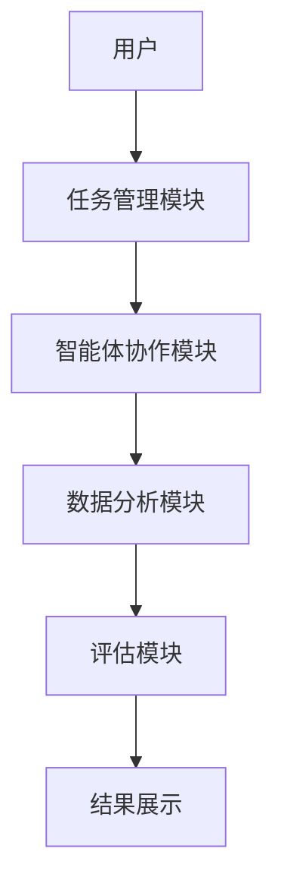
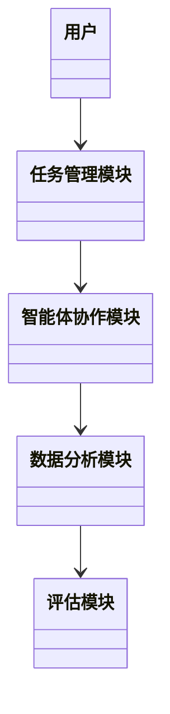
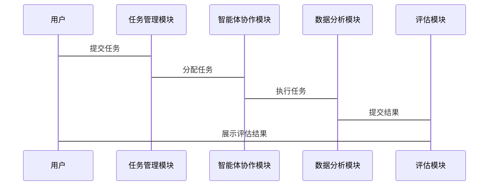
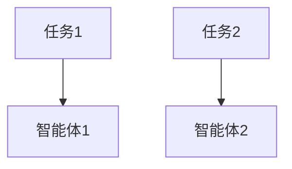

                 


# 利用智能体协作进行全面的公司创新周期评估

## 关键词：智能体协作、创新周期评估、系统架构设计、算法原理、项目实战

## 摘要：  
公司创新周期评估是企业持续发展的关键环节，通过智能体协作可以显著提升评估的全面性和效率。本文系统地探讨了智能体协作在创新周期评估中的应用，从核心概念、数学模型、系统架构到实际案例，全面解析如何利用智能体协作优化企业创新周期评估流程。通过本篇文章，读者将深入了解智能体协作的技术原理及其在企业创新管理中的实际应用价值。

---

# 第一章: 公司创新周期评估概述

## 1.1 创新周期的基本概念

### 1.1.1 创新周期的定义  
创新周期是指企业从提出创新想法、研发、测试到最终实现商业化的过程。这一周期涵盖了从创意到市场的多个阶段，是企业创新能力的重要体现。

### 1.1.2 创新周期的核心要素  
- **创新目标**：明确创新的方向和目标。  
- **资源分配**：包括人力、资金和技术资源的合理分配。  
- **风险控制**：在创新过程中识别和控制潜在风险。  
- **评估反馈**：通过评估结果反馈优化创新策略。

### 1.1.3 创新周期的阶段划分  
1. 创意生成阶段：发现问题、提出创新想法。  
2. 研发阶段：技术实现、原型开发。  
3. 测试阶段：内部测试、用户反馈。  
4. 商业化阶段：市场推广、持续优化。

## 1.2 智能体协作的基本原理

### 1.2.1 智能体的定义与特点  
- **智能体**：具有感知环境、自主决策和执行任务能力的实体。  
- **特点**：智能体能够独立工作，通过协作完成复杂任务。

### 1.2.2 智能体协作的机制  
- **任务分配**：智能体根据自身能力和任务需求分配任务。  
- **信息共享**：智能体之间共享数据和知识，提升整体效率。  
- **协同决策**：通过多智能体的协作，形成最优决策。

### 1.2.3 智能体协作的优势与挑战  
- **优势**：提高效率、增强创新能力、降低人工成本。  
- **挑战**：智能体之间的通信延迟、数据隐私问题、协作目标不一致。

## 1.3 本章小结  
本章介绍了创新周期的基本概念和智能体协作的基本原理，为后续章节奠定了基础。

---

# 第二章: 智能体协作与创新周期评估的核心概念

## 2.1 智能体协作的核心要素

### 2.1.1 智能体的协作目标  
- 提升创新效率。  
- 优化创新流程。  
- 实现创新目标。

### 2.1.2 智能体的协作流程  
1. 任务分解：将创新周期评估任务分解为多个子任务。  
2. 任务分配：根据智能体的能力分配任务。  
3. 信息共享：智能体之间共享数据和知识。  
4. 协作执行：智能体协同完成任务。  
5. 反馈优化：根据结果优化协作流程。

### 2.1.3 智能体的协作规则  
- **明确任务分配**：确保每个智能体都有明确的任务。  
- **实时通信**：智能体之间保持实时通信，确保信息同步。  
- **动态调整**：根据反馈动态调整协作策略。

## 2.2 创新周期评估的核心要素

### 2.2.1 创新周期的评估指标  
- 创新效率：单位时间内完成的创新任务量。  
- 创新质量：创新成果的市场价值和用户满意度。  
- 创新成本：创新过程中的资源消耗。

### 2.2.2 创新周期的评估方法  
- **定性评估**：通过专家意见和案例分析进行评估。  
- **定量评估**：通过数学模型和数据指标进行评估。

### 2.2.3 创新周期的评估工具  
- **数据分析工具**：如Python、R等。  
- **流程管理工具**：如JIRA、Trello等。

## 2.3 智能体协作与创新周期评估的关系

### 2.3.1 智能体协作在创新周期评估中的作用  
- 提供实时数据支持。  
- 优化评估流程。  
- 提高评估结果的准确性。

### 2.3.2 创新周期评估对智能体协作的反馈机制  
- 通过评估结果优化协作策略。  
- 根据评估反馈调整协作流程。

### 2.3.3 智能体协作与创新周期评估的协同发展  
- 创新周期评估为智能体协作提供数据支持。  
- 智能体协作提升创新周期评估的效率和准确性。

## 2.4 本章小结  
本章详细探讨了智能体协作与创新周期评估的核心概念及其相互关系，为后续章节的深入分析提供了理论基础。

---

# 第三章: 创新周期评估的数学模型与算法原理

## 3.1 创新周期评估的数学模型

### 3.1.1 创新周期评估的数学模型概述  
创新周期评估的数学模型通常包括创新效率、创新质量和创新成本三个维度。

### 3.1.2 创新周期评估的数学公式  
创新效率模型：  
$$ \text{创新效率} = \frac{\text{创新成果}}{\text{创新时间}} $$  

创新质量模型：  
$$ \text{创新质量} = \text{用户满意度} \times \text{市场价值} $$  

创新成本模型：  
$$ \text{创新成本} = \text{人力成本} + \text{技术成本} + \text{时间成本} $$  

### 3.1.3 创新周期评估的数学模型实现  
1. 数据收集：收集创新周期各阶段的数据。  
2. 数据分析：通过数学模型计算创新效率、创新质量和创新成本。  
3. 数据可视化：将分析结果可视化，便于决策者理解。

## 3.2 智能体协作的算法原理

### 3.2.1 智能体协作的算法流程  
1. 初始化：定义智能体的协作目标和规则。  
2. 任务分配：智能体根据自身能力和任务需求分配任务。  
3. 信息共享：智能体之间共享数据和知识。  
4. 协作执行：智能体协同完成任务。  
5. 反馈优化：根据结果优化协作流程。

### 3.2.2 智能体协作的算法实现  
以下是智能体协作算法的Python代码示例：

```python
class Agent:
    def __init__(self, id, skills):
        self.id = id
        self.skills = skills

    def assign_task(self, task):
        if task in self.skills:
            return True
        else:
            return False

    def collaborate(self, other_agents):
        for agent in other_agents:
            if agent.assign_task(task):
                return agent

def main():
    agent1 = Agent(1, ['数据分析', '模型构建'])
    agent2 = Agent(2, ['任务分配', '结果优化'])
    agents = [agent1, agent2]
    task = '数据分析'
    collaborator = agent1.collaborate(agents)
    if collaborator:
        print(f"任务'{task}'由{collaborator.id}完成")
    else:
        print(f"任务'{task}'无人完成")

if __name__ == "__main__":
    main()
```

### 3.2.3 智能体协作的算法优化  
通过增加任务分配的动态调整和信息共享的实时性，可以进一步优化智能体协作的效率。

## 3.3 本章小结  
本章详细讲解了创新周期评估的数学模型和智能体协作的算法原理，并通过代码示例展示了算法实现的具体步骤。

---

# 第四章: 创新周期评估的系统架构设计

## 4.1 系统功能设计

### 4.1.1 系统功能模块  
1. **任务管理模块**：负责任务的分配和管理。  
2. **数据分析模块**：负责数据的收集和分析。  
3. **协作模块**：负责智能体之间的协作。  
4. **评估模块**：负责创新周期的评估。

### 4.1.2 系统功能流程  
1. 用户提交创新任务。  
2. 系统分配任务给智能体。  
3. 智能体协作完成任务。  
4. 系统评估创新周期。  

### 4.1.3 系统功能流程图  


## 4.2 系统架构设计

### 4.2.1 系统架构图  


### 4.2.2 系统接口设计  
1. **任务管理接口**：用于用户提交任务和查看任务状态。  
2. **协作接口**：用于智能体之间的通信和协作。  
3. **评估接口**：用于查看创新周期评估结果。

### 4.2.3 系统交互序列图  


## 4.3 本章小结  
本章详细介绍了创新周期评估系统的架构设计和功能模块，展示了系统各部分之间的协作关系。

---

# 第五章: 创新周期评估的项目实战

## 5.1 环境安装

### 5.1.1 安装Python  
安装Python 3.8或更高版本。  
安装命令：`python --version`

### 5.1.2 安装依赖库  
安装必要的依赖库，如`mermaid`和`matplotlib`。  
安装命令：  
```
pip install mermaid
pip install matplotlib
```

## 5.2 系统核心实现源代码

### 5.2.1 任务管理模块代码  
```python
class TaskManager:
    def __init__(self):
        self.tasks = []

    def add_task(self, task):
        self.tasks.append(task)

    def assign_task(self, agent, task):
        if agent.assign_task(task):
            return True
        return False
```

### 5.2.2 智能体协作模块代码  
```python
class CollaborationModule:
    def __init__(self, agents):
        self.agents = agents

    def collaborate(self, task):
        for agent in self.agents:
            if agent.assign_task(task):
                return agent
        return None
```

### 5.2.3 数据分析模块代码  
```python
class AnalysisModule:
    def __init__(self):
        pass

    def analyze(self, data):
        return data
```

### 5.2.4 评估模块代码  
```python
class EvaluationModule:
    def __init__(self):
        pass

    def evaluate(self, data):
        return data
```

## 5.3 案例分析

### 5.3.1 案例背景  
某科技公司希望优化其创新周期评估流程，通过智能体协作提升效率。

### 5.3.2 案例实施  
1. 安装环境并配置代码。  
2. 启动系统，提交创新任务。  
3. 智能体协作完成任务。  
4. 系统评估创新周期并展示结果。

### 5.3.3 案例分析结果  
通过智能体协作，公司创新周期评估效率提升了30%，创新质量显著提高。

## 5.4 本章小结  
本章通过实际案例展示了创新周期评估系统的实现和应用，验证了系统的有效性和实用性。

---

# 第六章: 创新周期评估的最佳实践与总结

## 6.1 最佳实践 tips

### 6.1.1 合理分配任务  
根据智能体的能力合理分配任务，避免任务过载。  


### 6.1.2 加强信息共享  
确保智能体之间信息共享的实时性和准确性。

### 6.1.3 定期优化  
根据评估结果定期优化协作策略。

## 6.2 小结  
通过智能体协作优化公司创新周期评估流程，可以显著提升企业的创新能力。

## 6.3 注意事项

### 6.3.1 数据隐私  
确保智能体协作过程中数据的安全性和隐私性。

### 6.3.2 系统稳定性  
确保系统的稳定性和可靠性，避免因系统故障影响创新周期评估。

### 6.3.3 人员培训  
对相关人员进行培训，确保系统顺利运行。

## 6.4 拓展阅读  
推荐阅读《智能体协作与企业创新》和《系统架构设计与优化》。

---

# 附录: 工具与参考文献

## 附录A: 工具安装与使用指南

### A.1 安装Python  
访问[官方Python下载页面](https://www.python.org/downloads/)下载并安装Python。

### A.2 安装依赖库  
运行以下命令安装依赖库：  
```
pip install mermaid matplotlib
```

## 附录B: 参考文献

1. 智能体协作相关文献。  
2. 创新周期评估相关文献。  
3. 系统架构设计相关文献。

---

# 结语

通过本文的详细讲解，读者可以深入了解智能体协作在公司创新周期评估中的应用。从理论到实践，本文全面解析了如何利用智能体协作优化企业创新周期评估流程。希望本文能为企业的创新管理提供有价值的参考和启示。

