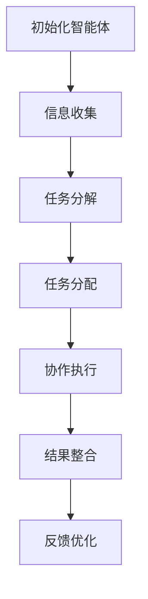
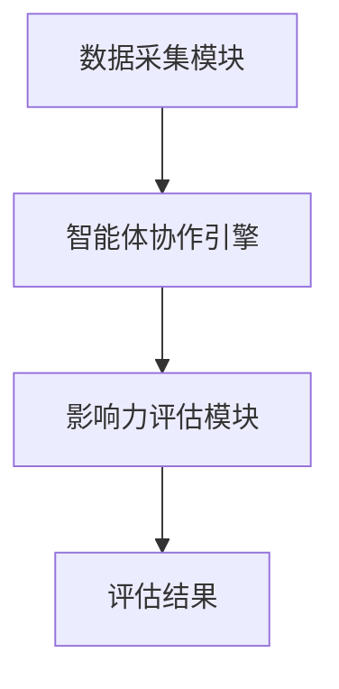
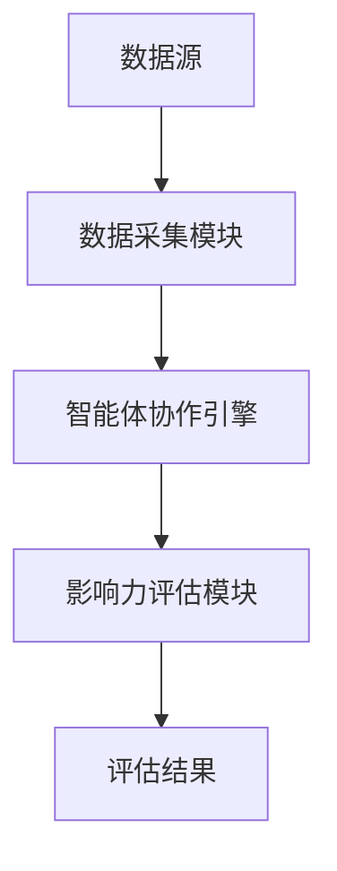

                 

# 利用智能体协作进行全面的公司创新网络影响力评估

## 关键词：智能体协作，创新网络，影响力评估，分布式计算，多智能体系统

## 摘要：  
本文探讨了利用智能体协作技术对公司的创新网络进行全方位影响力评估的方法。通过分析创新网络的核心要素、智能体协作的算法原理以及系统的架构设计，本文提出了一种基于智能体协作的创新网络影响力评估模型，并通过实际案例展示了该模型的应用与效果。文章最后总结了该方法的优势与不足，并提出了进一步研究的方向。

---

## 第1章: 公司创新网络影响力评估概述

### 1.1 创新网络的定义与特征

#### 1.1.1 创新网络的定义
创新网络是指由公司内部员工、外部合作伙伴、供应商、客户以及其他利益相关者构成的，围绕公司创新活动形成的复杂关系网络。它不仅包括公司内部的研发团队，还包括外部的技术服务商、学术机构、行业专家等。

#### 1.1.2 创新网络的核心特征
创新网络具有以下核心特征：
- **动态性**：创新网络随着市场需求和技术变化不断调整。
- **多样性**：网络中的参与者具有不同的知识背景和能力。
- **协作性**：创新网络依赖于多方协作来实现创新目标。
- **复杂性**：网络中的关系错综复杂，涉及多个利益相关者。

#### 1.1.3 创新网络的边界与外延
创新网络的边界并不固定，它可能延伸到公司的上下游供应链、合作伙伴以及客户群体。外延则包括与公司创新活动相关的所有潜在资源。

### 1.2 智能体协作的定义与特点

#### 1.2.1 智能体的基本概念
智能体（Agent）是指具有感知环境、自主决策和执行任务能力的实体。它可以是一个软件程序、机器人或其他具备智能行为的系统。

#### 1.2.2 智能体协作的核心特点
智能体协作是指多个智能体通过共享信息、协同决策来完成共同任务的过程。其核心特点包括：
- **分布式计算**：智能体之间通过分布式计算实现协作。
- **自主性**：每个智能体都具有自主决策的能力。
- **动态性**：智能体协作的过程具有高度的动态性，能够适应环境的变化。

#### 1.2.3 智能体协作与传统协作方式的对比
与传统协作方式相比，智能体协作具有以下优势：
- **效率更高**：通过自动化和智能化的方式提高协作效率。
- **灵活性更强**：能够快速适应环境变化和任务需求。
- **覆盖范围更广**：可以跨越地理和组织边界，实现更大范围的协作。

### 1.3 公司创新网络影响力评估的背景与意义

#### 1.3.1 当前企业创新面临的挑战
- 市场竞争日益激烈，创新周期不断缩短。
- 创新资源分散，难以高效整合。
- 创新网络中的信息孤岛问题突出。

#### 1.3.2 创新网络影响力评估的重要性
创新网络影响力评估能够帮助企业识别关键创新资源，优化资源配置，提升创新效率。

#### 1.3.3 智能体协作在创新网络评估中的作用
智能体协作技术能够帮助企业在创新网络中实现高效的信息共享和协同决策，从而提升创新网络的影响力。

### 1.4 本章小结
本章主要介绍了创新网络的定义与特征、智能体协作的定义与特点，以及创新网络影响力评估的背景与意义。通过这些内容，我们明确了创新网络的重要性以及智能体协作在创新网络评估中的关键作用。

---

## 第2章: 创新网络影响力评估的核心概念与联系

### 2.1 创新网络的核心要素

#### 2.1.1 创新网络的构成要素
创新网络的构成要素包括：
- **核心企业**：公司本身是创新网络的核心。
- **合作伙伴**：包括供应商、客户、技术服务商等。
- **创新资源**：包括技术、知识、数据等。
- **创新环境**：包括政策、市场、文化等因素。

#### 2.1.2 各要素之间的关系
核心企业是创新网络的核心，通过与合作伙伴的协作，整合创新资源，应对创新环境的变化。

#### 2.1.3 创新网络的动态演化特征
创新网络是一个动态演化的过程，随着市场需求和技术进步不断调整和优化。

### 2.2 智能体协作与创新网络的关系

#### 2.2.1 智能体协作在创新网络中的角色
智能体协作在创新网络中起到桥梁和纽带的作用，连接不同创新资源，促进知识共享和协同创新。

#### 2.2.2 智能体协作对创新网络影响力的影响
智能体协作能够提升创新网络的协作效率，增强创新网络的凝聚力和影响力。

#### 2.2.3 创新网络与智能体协作的协同机制
创新网络为智能体协作提供丰富的资源和场景，而智能体协作则为创新网络提供高效的协作工具和方法。

### 2.3 创新网络影响力评估的指标体系

#### 2.3.1 影响力评估的主要指标
- 创新资源的丰富程度
- 创新网络的协作效率
- 创新成果的数量与质量
- 创新网络的稳定性与可持续性

#### 2.3.2 指标之间的关系与权重分配
创新网络影响力评估需要综合考虑各指标之间的关系，并根据实际情况进行权重分配。

#### 2.3.3 指标体系的构建方法
可以通过层次分析法（AHP）等方法构建创新网络影响力评估的指标体系。

### 2.4 本章小结
本章主要介绍了创新网络的核心要素、智能体协作在创新网络中的角色，以及创新网络影响力评估的指标体系。通过这些内容，我们明确了创新网络的关键要素及其相互关系。

---

## 第3章: 智能体协作算法原理

### 3.1 智能体协作的基本原理

#### 3.1.1 分布式计算与多智能体通信
智能体协作基于分布式计算技术，通过多智能体之间的通信与协作完成任务。

#### 3.1.2 智能体之间的信息交换机制
智能体之间通过共享信息、协商任务来实现协作。

#### 3.1.3 协作任务的分解与分配
协作任务需要分解为子任务，并根据智能体的能力进行分配。

### 3.2 智能体协作的数学模型

#### 3.2.1 协作任务分解的数学表达
协作任务分解可以通过图论中的子图划分方法来实现。

#### 3.2.2 智能体间信息传递的数学模型
智能体之间的信息传递可以建模为一个概率分布问题。

#### 3.2.3 协作目标的优化函数
协作目标的优化可以通过多目标优化算法来实现。

### 3.3 智能体协作的实现步骤

#### 3.3.1 初始化智能体
每个智能体初始化其知识库和任务目标。

#### 3.3.2 信息收集与处理
智能体通过传感器或数据接口收集环境信息。

#### 3.3.3 任务分配与协作
智能体根据任务需求和自身能力进行任务分配，并通过协商确定协作方式。

#### 3.3.4 结果整合与反馈
协作结果整合后，智能体根据反馈信息调整后续行动。

### 3.4 智能体协作算法的流程图

### 3.5 本章小结
本章主要介绍了智能体协作的基本原理、数学模型和实现步骤。通过流程图展示了智能体协作的完整过程。

---

## 第4章: 创新网络影响力评估的系统架构设计

### 4.1 系统总体架构

#### 4.1.1 系统功能模块
- 数据采集模块
- 智能体协作引擎
- 影响力评估模块

#### 4.1.2 系统功能流程
数据采集模块收集创新网络数据，智能体协作引擎进行任务分解与分配，影响力评估模块生成评估结果。

#### 4.1.3 系统架构图

### 4.2 系统功能设计

#### 4.2.1 数据采集模块
数据采集模块负责从公司内外部获取创新网络数据，包括合作伙伴信息、技术资源等。

#### 4.2.2 智能体协作引擎
智能体协作引擎负责任务分解、协作执行和结果整合。

#### 4.2.3 影响力评估模块
影响力评估模块根据评估指标体系生成创新网络影响力评估结果。

### 4.3 系统架构设计

#### 4.3.1 系统架构图

#### 4.3.2 系统接口设计
系统接口设计包括数据接口、协作接口和评估接口。

#### 4.3.3 系统交互流程
数据采集模块与智能体协作引擎交互，智能体协作引擎与影响力评估模块交互，最终生成评估结果。

### 4.4 本章小结
本章主要介绍了创新网络影响力评估系统的总体架构、功能模块和系统架构设计。通过mermaid图展示了系统的整体结构和交互流程。

---

## 第5章: 项目实战

### 5.1 创新网络影响力评估的实际应用

#### 5.1.1 案例背景
选择一家科技公司作为案例，分析其创新网络影响力。

#### 5.1.2 环境配置
包括数据源、工具安装和系统部署。

#### 5.1.3 代码实现
展示创新网络影响力评估系统的核心代码实现。

#### 5.1.4 代码解读与分析
详细解读代码，分析系统的实现细节。

#### 5.1.5 实际案例分析
通过对实际案例的分析，验证系统的评估效果。

### 5.2 项目小结

---

## 第6章: 最佳实践、小结、注意事项和拓展阅读

### 6.1 最佳实践
- 定期更新创新网络数据
- 优化智能体协作算法
- 加强跨部门协作

### 6.2 小结
总结全文内容，强调智能体协作在创新网络影响力评估中的重要性。

### 6.3 注意事项
- 数据隐私保护
- 系统稳定性保障
- 智能体协作算法的可扩展性

### 6.4 拓展阅读
推荐相关领域的书籍和论文，供读者进一步学习。

---

## 附录: 参考文献

---

通过以上目录结构和内容安排，我们可以系统地探讨利用智能体协作进行全面的公司创新网络影响力评估的方法和实践。

