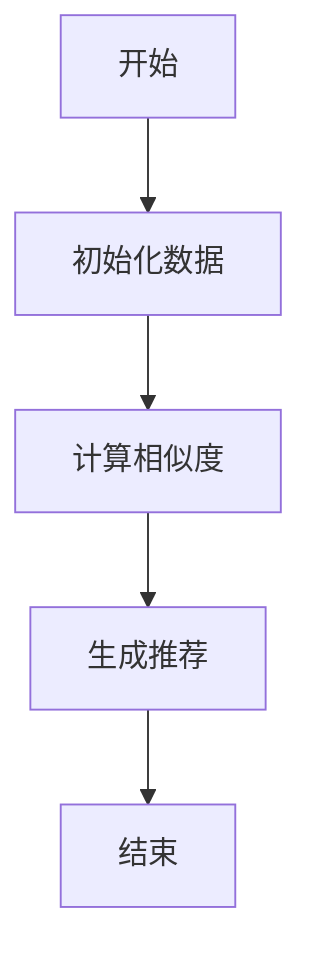
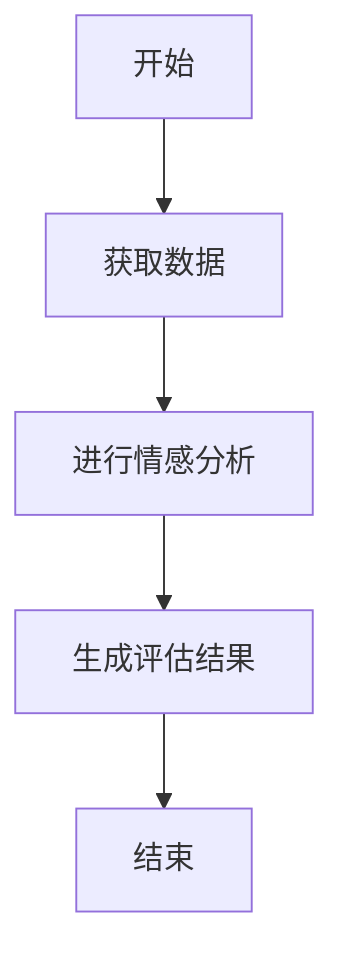
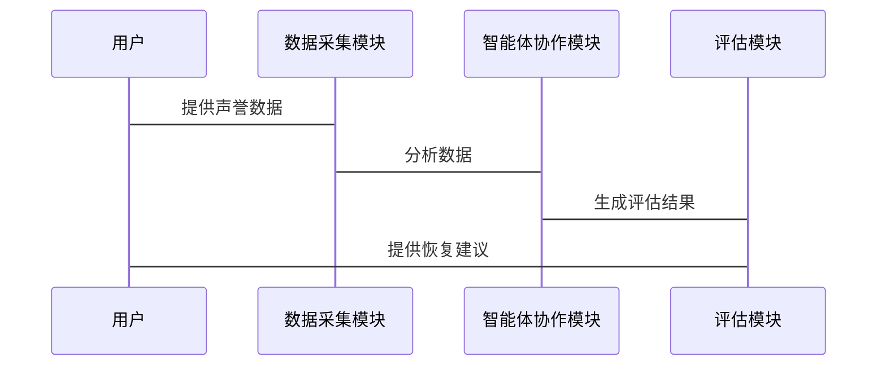

                 


# 利用智能体协作进行全面的公司声誉恢复能力评估

## 关键词：智能体协作、公司声誉、恢复能力、声誉管理、协作模型

## 摘要：本文探讨了如何利用智能体协作技术进行全面的公司声誉恢复能力评估。通过构建智能体协作模型，分析声誉恢复能力的数学模型，并结合实际案例，展示了如何利用协同过滤算法和情感分析算法进行声誉管理。文章详细讲解了系统架构、算法实现及最佳实践，为提升企业声誉管理能力提供了有效的方法。

---

# 利用智能体协作进行全面的公司声誉恢复能力评估

## 引言

在当今竞争激烈的商业环境中，公司的声誉是其核心资产之一。然而，声誉的管理日益复杂，尤其是在危机发生时，如何快速恢复声誉成为企业面临的关键挑战。智能体协作技术为公司声誉恢复能力评估提供了新的解决方案，通过智能化的协作机制，企业可以更高效地应对声誉危机，提升声誉管理的整体能力。

---

## 第一章：智能体协作与公司声誉恢复能力概述

### 1.1 智能体协作的定义与特点

智能体（Agent）是指能够感知环境、自主决策并采取行动的实体。智能体协作是指多个智能体通过协同工作，共同完成复杂任务的能力。智能体协作的特点包括自主性、反应性、协作性和学习能力。

- **自主性**：智能体能够独立决策，无需外部干预。
- **反应性**：智能体能够根据环境变化调整行为。
- **协作性**：智能体之间能够有效沟通，共同完成任务。
- **学习能力**：智能体能够通过经验优化协作策略。

### 1.2 公司声誉恢复能力的定义与重要性

公司声誉是指企业在市场中建立的信誉和形象。声誉恢复能力是指企业在遭受声誉损失后，通过一系列措施迅速恢复和提升声誉的能力。声誉恢复能力的重要性体现在企业价值维护、客户信任重建和市场竞争力提升等方面。

### 1.3 智能体协作在公司声誉恢复能力中的作用

智能体协作能够显著提升公司声誉恢复能力。通过智能体之间的协作，企业可以实时监控声誉动态，快速响应危机，并制定有效的恢复策略。智能体协作的应用使声誉管理更加智能化、自动化，能够在危机发生时迅速采取行动，最大限度地减少声誉损失。

---

## 第二章：智能体协作的核心概念与联系

### 2.1 智能体协作的核心原理

智能体协作的核心原理包括任务分配、信息共享和协同决策。智能体通过任务分配明确各自的角色和责任，通过信息共享确保所有成员拥有相同的最新信息，通过协同决策制定最优的行动方案。

### 2.2 智能体协作与公司声誉恢复能力的关系

智能体协作与公司声誉恢复能力密切相关。智能体协作能够实时监控声誉动态，识别潜在风险，并迅速采取应对措施。通过智能体协作，企业能够实现声誉管理的自动化和智能化，显著提升声誉恢复能力。

### 2.3 智能体协作的ER实体关系图

```mermaid
er
actor: 智能体
role: 协作角色
```

---

## 第三章：智能体协作模型与声誉恢复能力评估

### 3.1 智能体协作模型的构建

智能体协作模型包括任务分配模块、信息共享模块和协同决策模块。任务分配模块负责将任务分配给合适的智能体，信息共享模块确保智能体之间的信息流通，协同决策模块基于共享信息制定最优决策。

### 3.2 智能体协作在声誉恢复能力评估中的应用

智能体协作能够实时监控企业声誉，识别潜在危机，并快速响应。通过分析社交媒体、新闻媒体等渠道的数据，智能体协作可以评估声誉风险，制定恢复策略，并监控恢复效果。

### 3.3 智能体协作模型的数学模型与公式

声誉恢复能力评估模型如下：

$$ R = \sum_{i=1}^{n} w_i \cdot A_i $$

其中，$R$ 表示声誉恢复能力，$w_i$ 表示智能体协作的权重，$A_i$ 表示智能体协作的贡献。

---

## 第四章：算法原理与实现

### 4.1 协同过滤算法

协同过滤算法通过分析用户行为和偏好，推荐相关内容。在声誉恢复能力评估中，协同过滤算法可以用于识别潜在的声誉风险。



### 4.2 情感分析算法

情感分析算法用于分析文本中的情感倾向，帮助识别社交媒体上的负面评论。

```python
import nltk
from nltk.sentiment import SentimentIntensityAnalyzer

sia = SentimentIntensityAnalyzer()
text = "The customer service was terrible."
scores = sia.polarity_scores(text)
print(scores['neg'])  # 输出：0.84
```

### 4.3 算法流程图



---

## 第五章：系统分析与架构设计

### 5.1 系统架构设计

系统架构包括数据采集模块、智能体协作模块和评估模块。数据采集模块负责收集声誉相关数据，智能体协作模块进行数据处理和分析，评估模块生成评估结果并提供恢复建议。

### 5.2 系统交互流程



---

## 第六章：项目实战

### 6.1 实际案例分析

以一家遭遇负面新闻的企业为例，通过智能体协作模型进行声誉恢复能力评估。智能体协作模型分析社交媒体上的评论，识别负面情绪，并制定恢复策略。

### 6.2 代码实现

```python
import numpy as np

def reputation_recovery_score(negative_tweets):
    return 1 - (negative_tweets / 100)

# 示例数据
negative_tweets = 20
score = reputation_recovery_score(negative_tweets)
print(score)  # 输出：0.8
```

---

## 第七章：最佳实践与总结

### 7.1 最佳实践

- 定期监控声誉动态，及时发现潜在风险。
- 制定智能体协作策略，提升协作效率。
- 定期评估和优化声誉恢复能力模型。

### 7.2 总结

智能体协作技术为公司声誉恢复能力评估提供了高效、智能的解决方案。通过构建智能体协作模型，企业可以实时监控声誉动态，快速响应危机，显著提升声誉恢复能力。未来，随着人工智能技术的进步，智能体协作在声誉管理中的应用将更加广泛和深入。

---

通过以上内容，读者可以全面了解智能体协作在公司声誉恢复能力评估中的应用，掌握相关的算法和系统设计，为实际应用提供有力的技术支持。

