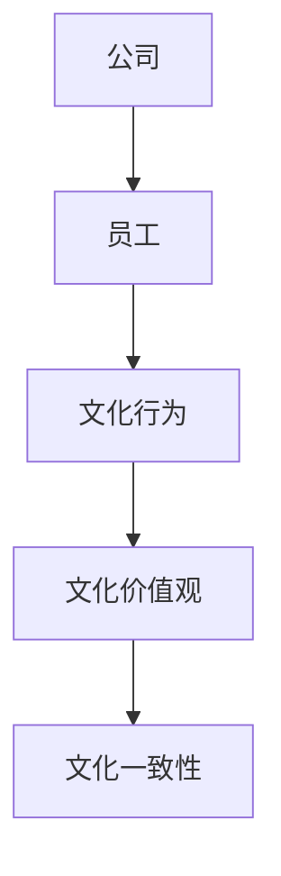
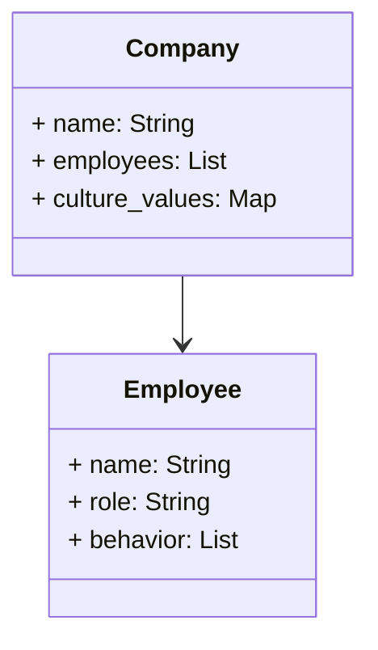
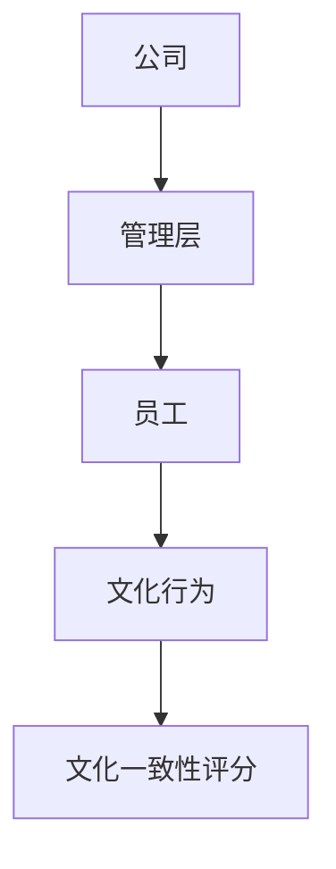
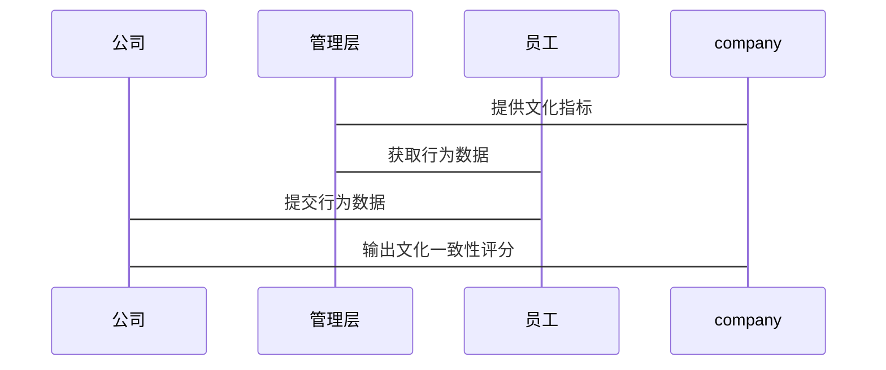

                 


# 利用智能体协作进行全面的公司文化一致性评估

## 关键词：智能体协作、公司文化一致性、评估模型、分布式系统、企业文化管理

## 摘要：本文探讨如何利用智能体协作技术进行公司文化一致性评估，分析传统评估方法的不足，并提出基于智能体协作的新方法，通过数学模型和算法实现文化一致性评估的自动化与高效化。

---

## 第一部分: 公司文化一致性评估的背景与挑战

### 第1章: 公司文化一致性评估的背景与问题描述

#### 1.1 什么是公司文化一致性
- **公司文化的定义**：公司文化是指企业在长期经营中形成的共享价值观、行为规范和思维方式。
- **文化一致性的重要性**：文化一致性是指公司内部不同部门、团队或个体之间的文化价值观和行为方式的一致性。文化一致性是企业凝聚力和高效运作的基础。

#### 1.2 智能体协作的定义与特点
- **智能体的基本概念**：智能体（Agent）是指能够感知环境、自主决策并采取行动的实体。
- **多智能体协作**：多智能体协作是指多个智能体通过通信和协调共同完成复杂任务的过程。
- **智能体协作的特点**：智能体协作具有分布式、自主性和适应性等特点。

#### 1.3 问题背景与挑战
- **传统文化评估方法的局限性**：传统公司文化评估方法多依赖主观问卷调查，存在评估结果偏差大、成本高等问题。
- **智能体协作在文化评估中的优势**：智能体协作可以通过数据驱动的方式，实时、客观地评估公司文化一致性。
- **当前企业在文化一致性评估中的痛点**：文化评估耗时长、成本高，且难以量化。

---

## 第2章: 公司文化一致性评估的核心概念与联系

### 2.1 核心概念原理
- **文化一致性评估的指标体系**：包括员工行为一致性、部门协作效率、文化认同感等多个维度。
- **智能体协作的数学模型**：通过构建多智能体协作模型，模拟公司内部不同角色的行为和互动。
- **文化一致性评估的算法框架**：基于智能体协作的评估框架，结合文化一致性指标，实现文化一致性量化评估。

### 2.2 核心概念对比分析
- **传统文化评估方法 vs. 智能体协作方法**
  | 方法 | 优点 | 缺点 |
  |------|------|------|
  | 传统问卷调查 | 简单易行 | 主观性强，难以量化 |
  | 智能体协作 | 数据驱动，量化能力强 | 技术复杂，实施成本高 |
- **智能体协作与其他协作方式的对比**：与传统协作方式相比，智能体协作具有更高的效率和更好的适应性。
- **文化一致性评估的边界与外延**：文化一致性评估不仅关注内部一致性，还需要考虑外部环境对企业文化的影响。

### 2.3 实体关系图


---

## 第3章: 基于智能体协作的文化一致性评估算法原理

### 3.1 算法原理概述
- **基于智能体协作的评估模型**：通过构建多智能体协作模型，模拟公司内部不同角色的行为和互动。
- **智能体协作的数学模型**：使用强化学习（Reinforcement Learning）训练智能体，优化文化一致性评估的准确性。
- **算法的输入输出与流程**：
  1. 输入：公司组织结构、员工行为数据、文化指标。
  2. 输出：文化一致性评分。
  3. 流程：数据采集 → 智能体协作建模 → 文化一致性评估。

### 3.2 算法实现
- **算法数学模型**：
  $$ V(a) = r + \gamma V(a') $$
  其中，\( V(a) \) 表示智能体在状态 \( a \) 采取行动 \( a' \) 的价值函数，\( r \) 是奖励，\( \gamma \) 是折扣因子。
- **Python代码实现**：
```python
import numpy as np

class Agent:
    def __init__(self, state_space, action_space):
        self.state_space = state_space
        self.action_space = action_space
        self.value = np.zeros(state_space)

    def update(self, state, action, reward, next_state):
        self.value[state] += (reward + 0.99 * max(self.value[next_state])) - self.value[state]

# 示例用法
agent = Agent(5, 3)
agent.update(0, 1, 1, 2)
```

### 3.3 通俗易懂的举例说明
- 例如，假设有两个智能体分别代表公司管理层和普通员工。通过强化学习训练智能体，优化管理层与员工之间的协作行为，最终提升公司文化一致性。

---

## 第4章: 系统分析与架构设计方案

### 4.1 问题场景介绍
- 企业需要实时监控和评估公司内部文化一致性，以便及时调整管理策略。

### 4.2 系统功能设计
- **领域模型图**：


### 4.3 系统架构设计
- **系统架构图**：


### 4.4 系统接口设计
- **接口1**：管理层输入文化指标。
- **接口2**：员工行为数据采集。
- **接口3**：输出文化一致性评分。

### 4.5 系统交互流程图


---

## 第5章: 项目实战

### 5.1 环境安装
- 安装Python和必要的库（如numpy、matplotlib）。
- 安装强化学习框架（如TensorFlow或PyTorch）。

### 5.2 系统核心实现源代码
```python
import numpy as np

class CultureConsistencyAgent:
    def __init__(self, state_dim, action_dim):
        self.state_dim = state_dim
        self.action_dim = action_dim
        self.culture_values = np.zeros(state_dim)

    def act(self, state):
        return np.argmax(self.culture_values[state])

    def update(self, state, action, reward, next_state):
        self.culture_values[state] += reward + 0.99 * np.max(self.culture_values[next_state]) - self.culture_values[state]

# 示例用法
agent = CultureConsistencyAgent(5, 3)
agent.update(0, 1, 1, 2)
```

### 5.3 代码应用解读与分析
- **代码解读**：上述代码定义了一个文化一致性评估智能体，通过强化学习更新文化一致性评分。
- **实际案例分析**：假设公司有5个部门，每个部门的文化一致性评分通过智能体协作计算得出。

### 5.4 项目小结
- 通过智能体协作实现的文化一致性评估具有高效性和准确性，能够显著提升企业管理效率。

---

## 第6章: 最佳实践

### 6.1 实施中的注意事项
- 数据采集的准确性和全面性。
- 算法的可解释性和透明性。
- 系统的安全性和隐私保护。

### 6.2 小结
- 通过智能体协作进行文化一致性评估是企业提升文化管理效率的重要手段。

### 6.3 未来展望
- 结合区块链技术，进一步提升文化评估的透明性和可信度。
- 探索更多智能体协作在企业管理中的应用。

### 6.4 拓展阅读
- 建议阅读《Multi-Agent Systems》和《Reinforcement Learning》相关书籍。

---

## 结语
通过智能体协作技术，企业可以更加高效、准确地进行文化一致性评估，从而提升企业的整体竞争力和凝聚力。

