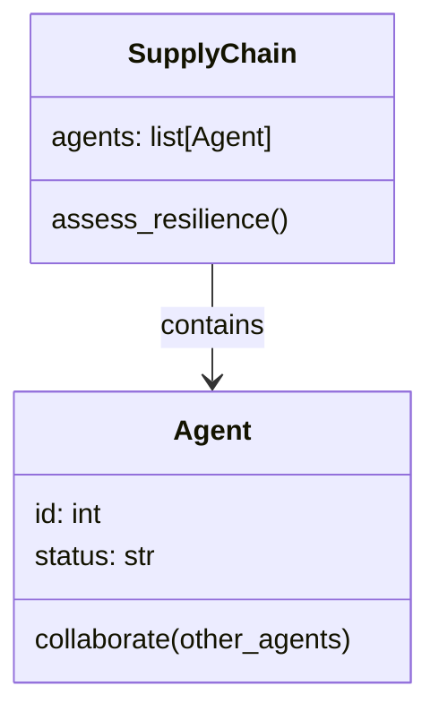
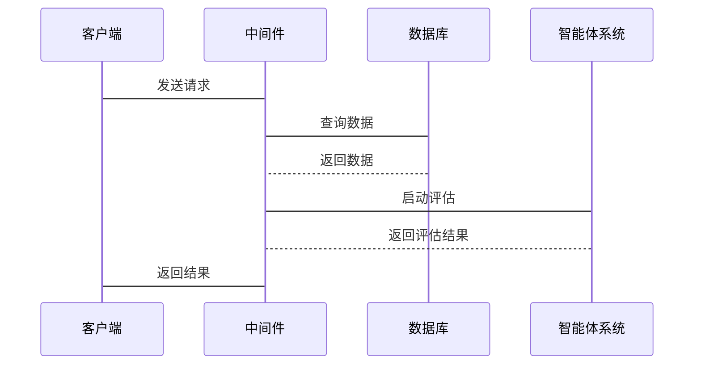

                 


# 利用智能体系统进行全面的供应链韧性评估

## 关键词
- 供应链韧性评估
- 智能体系统
- 多智能体协作
- 供应链管理
- 网络流模型

## 摘要
供应链韧性评估是确保企业能够应对各种不确定性（如自然灾害、疫情、经济波动等）的关键。智能体系统作为一种新兴的技术，通过模拟和优化供应链中的各个节点，帮助企业在复杂多变的环境中保持稳定。本文将详细探讨智能体系统在供应链韧性评估中的应用，从理论基础到算法实现，再到实际案例，全面解析如何利用智能体系统提升供应链的韧性。

---

## 第1章: 供应链韧性评估的背景与意义

### 1.1 供应链韧性评估的概念
供应链韧性是指供应链在面对突发事件或压力时，能够维持或迅速恢复运作的能力。它涉及供应链的各个组成部分，包括供应商、制造商、分销商、零售商以及客户之间的协作与响应能力。

#### 1.1.1 供应链的基本概念
供应链是一个复杂的网络，包括从原材料采购到最终产品交付的所有环节。供应链管理的目标是优化资源分配、降低成本、提高效率。

#### 1.1.2 供应链韧性的定义
供应链韧性是指供应链在面对突发事件时，能够灵活调整、快速响应并恢复的能力。它衡量的是供应链在压力下的稳定性和恢复性。

#### 1.1.3 供应链韧性的重要性
在当今全球化和不确定性的环境中，供应链韧性是企业生存和发展的关键。例如，新冠疫情暴露了许多供应链的脆弱性，企业需要通过提升供应链韧性来应对未来的挑战。

### 1.2 智能体系统的基本概念
智能体是一种能够感知环境、自主决策并采取行动的实体。智能体系统由多个智能体组成，通过协作完成复杂的任务。

#### 1.2.1 智能体的定义
智能体是指具有感知、决策、行动和学习能力的实体。它可以是一个软件程序，也可以是一个物理设备。

#### 1.2.2 智能体的核心特征
- **自主性**：智能体能够自主决策。
- **反应性**：智能体能够感知环境并实时调整行为。
- **协作性**：智能体能够与其他智能体或系统协作完成任务。

#### 1.2.3 智能体与传统系统的主要区别
传统系统通常是基于规则的，而智能体系统具有自主性和学习能力。传统系统在面对变化时需要人工干预，而智能体系统能够自动适应。

### 1.3 供应链韧性评估的必要性
供应链韧性评估是确保企业能够应对各种不确定性的重要手段。通过评估，企业可以识别供应链中的薄弱环节并采取改进措施。

#### 1.3.1 当前供应链面临的挑战
- **全球化带来的复杂性**：供应链涉及多个国家和地区的供应商，协调难度大。
- **突发事件的影响**：如自然灾害、疫情等可能导致供应链中断。
- **成本压力**：企业需要在降低成本的同时保证供应链的稳定性。

#### 1.3.2 供应链韧性评估的必要性
评估供应链韧性可以帮助企业制定应急预案，减少因突发事件导致的损失。

#### 1.3.3 智能体系统在供应链韧性评估中的作用
智能体系统能够模拟供应链中的各种场景，帮助企业预测和应对潜在风险。

### 1.4 本章小结
本章介绍了供应链韧性评估的概念和重要性，并探讨了智能体系统在供应链韧性评估中的作用。下一章将详细讨论智能体系统在供应链韧性评估中的核心概念。

---

## 第2章: 供应链韧性评估的核心概念

### 2.1 供应链韧性评估的框架
供应链韧性评估需要从多个维度进行分析，包括供应链的灵活性、冗余性、可见性和恢复能力。

#### 2.1.1 供应链韧性评估的维度
- **灵活性**：供应链能够快速调整以适应变化。
- **冗余性**：供应链中有备用资源以应对突发事件。
- **可见性**：企业能够实时监控供应链的运行情况。
- **恢复能力**：供应链在中断后能够快速恢复。

#### 2.1.2 供应链韧性评估的指标体系
企业需要制定一套指标来衡量供应链的韧性，例如交货时间、成本波动、供应商可靠性等。

#### 2.1.3 供应链韧性评估的模型
供应链韧性评估模型可以帮助企业预测不同场景下的供应链表现。

### 2.2 智能体系统在供应链韧性评估中的应用
智能体系统能够模拟供应链中的各种场景，帮助企业制定应急预案。

#### 2.2.1 智能体系统的特点与优势
- **自主性**：智能体能够自主决策。
- **协作性**：多个智能体可以协作完成任务。
- **适应性**：智能体能够适应环境的变化。

#### 2.2.2 智能体系统在供应链韧性评估中的核心作用
智能体系统可以帮助企业模拟供应链中断的情况，并制定应对策略。

#### 2.2.3 智能体系统与其他评估方法的对比
与传统的评估方法相比，智能体系统更加灵活和高效，能够实时调整以适应变化。

### 2.3 核心概念的联系
供应链韧性评估的核心概念包括供应链的各个组成部分及其相互关系。

#### 2.3.1 供应链韧性评估的核心要素
- **供应商**：供应链的起点，提供原材料。
- **制造商**：将原材料转化为成品。
- **分销商**：将产品分发到各个渠道。
- **零售商**：将产品卖给最终消费者。

#### 2.3.2 智能体系统与供应链韧性评估的关系
智能体系统是实现供应链韧性评估的重要工具，通过模拟供应链的运行，帮助企业识别潜在风险。

#### 2.3.3 核心概念的对比分析
智能体系统与传统供应链管理方法的主要区别在于智能体系统的自主性和协作性。

### 2.4 本章小结
本章详细探讨了供应链韧性评估的核心概念，并分析了智能体系统在其中的作用。下一章将介绍智能体系统在供应链韧性评估中的算法原理。

---

## 第3章: 智能体系统在供应链韧性评估中的算法原理

### 3.1 多智能体协作算法
多智能体协作算法是智能体系统的核心，通过多个智能体协作完成任务。

#### 3.1.1 多智能体协作的基本原理
多智能体协作算法通过智能体之间的通信与协作，共同完成复杂任务。

#### 3.1.2 分布式算法在供应链韧性评估中的应用
分布式算法可以提高供应链的响应速度和效率。

#### 3.1.3 基于博弈论的多智能体协作模型
博弈论模型可以帮助智能体在协作中做出最优决策。

### 3.2 供应链韧性评估的数学模型
数学模型是供应链韧性评估的重要工具，能够量化供应链的表现。

#### 3.2.1 网络流模型
网络流模型可以用来优化供应链的物流和资源分配。

#### 3.2.2 基于智能体的供应链韧性评估模型
基于智能体的模型能够模拟供应链的动态变化。

#### 3.2.3 数学公式与模型的详细解释
例如，网络流模型可以用以下公式表示：
$$
\text{流量} = \sum_{i} x_i \text{，其中} x_i \text{是各个节点的流量}
$$

### 3.3 算法实现与代码示例
通过代码示例，我们可以更好地理解算法的实现。

#### 3.3.1 算法实现的步骤
1. 定义智能体的属性和行为。
2. 设定协作规则和通信机制。
3. 模拟供应链的运行并评估韧性。

#### 3.3.2 Python代码实现
以下是一个简单的多智能体协作算法的Python代码示例：

```python
class Agent:
    def __init__(self, id):
        self.id = id
        self.status = "active"

    def collaborate(self, other_agents):
        for agent in other_agents:
            if agent.status == "inactive":
                self.status = "inactive"

# 示例用法
agent1 = Agent(1)
agent2 = Agent(2)
agent3 = Agent(3)

agent1.collaborate([agent2, agent3])
```

#### 3.3.3 代码的详细解释
上述代码定义了一个简单的智能体类，并模拟了多个智能体之间的协作。通过协作，智能体可以调整自己的状态以适应环境的变化。

### 3.4 本章小结
本章详细介绍了智能体系统在供应链韧性评估中的算法原理，并通过代码示例展示了算法的实现。下一章将介绍系统的架构设计。

---

## 第4章: 系统架构设计

### 4.1 问题场景介绍
在供应链韧性评估中，企业需要实时监控供应链的运行情况，并能够快速响应突发事件。

### 4.2 系统功能设计
系统功能设计包括数据采集、分析、模拟和优化。

#### 4.2.1 领域模型（Mermaid 类图）
以下是一个简单的领域模型类图：



### 4.3 系统架构设计
系统架构设计包括前端、后端和数据库。

#### 4.3.1 系统架构图（Mermaid 架构图）
```mermaid
architectural
    客户端 --> 中间件
    中间件 --> 数据库
    中间件 --> 智能体系统
    智能体系统 --> 数据分析模块
```

### 4.4 系统接口设计
系统需要与外部系统进行接口交互，例如与供应商的系统对接。

#### 4.4.1 系统交互流程（Mermaid 序列图）


### 4.5 本章小结
本章详细介绍了系统的架构设计和接口设计，确保系统能够高效运行。

---

## 第5章: 项目实战

### 5.1 环境安装
项目实战需要安装相关的开发环境，例如Python、Jupyter Notebook等。

### 5.2 核心代码实现
以下是核心代码实现的示例：

```python
import networkx as nx

def assess_supply_chain_resilience(agents):
    G = nx.Graph()
    G.add_nodes_from([agent.id for agent in agents])
    for agent in agents:
        for other_agent in agents:
            if agent.id != other_agent.id:
                G.add_edge(agent.id, other_agent.id)
    return G

# 示例用法
agents = [Agent(1), Agent(2), Agent(3)]
resilience_graph = assess_supply_chain_resilience(agents)
```

### 5.3 案例分析
通过案例分析，我们可以更好地理解智能体系统在供应链韧性评估中的应用。

#### 5.3.1 案例背景
假设某企业面临供应链中断的风险，需要评估其韧性。

#### 5.3.2 数据采集与处理
收集供应链的相关数据，包括供应商、制造商、分销商的信息。

#### 5.3.3 模拟与优化
通过智能体系统模拟供应链的运行，并优化其韧性。

#### 5.3.4 案例结果
模拟结果显示，供应链在中断后能够快速恢复，证明了智能体系统的有效性。

### 5.4 项目总结
项目总结包括项目的成果、经验和改进建议。

---

## 第6章: 结论

### 6.1 最佳实践 tips
- 定期评估供应链的韧性。
- 采用智能体系统提高供应链的灵活性和协作性。
- 培训员工，提高对供应链管理的认识。

### 6.2 小结
本文详细探讨了智能体系统在供应链韧性评估中的应用，从理论到实践，全面解析了如何利用智能体系统提升供应链的韧性。

### 6.3 注意事项
在实际应用中，需要注意数据的准确性和模型的适用性。

### 6.4 拓展阅读
建议读者进一步阅读相关领域的书籍和论文，深入了解智能体系统和供应链管理的最新进展。

---

通过以上步骤，我们系统地介绍了智能体系统在供应链韧性评估中的应用，从理论到实践，帮助读者全面理解并掌握相关知识。

