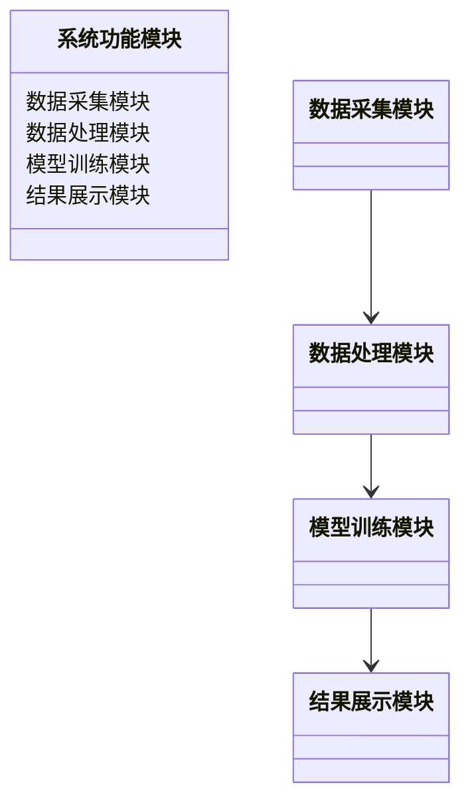
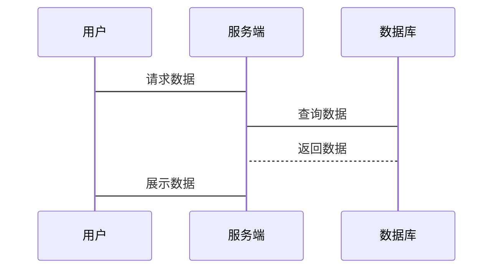
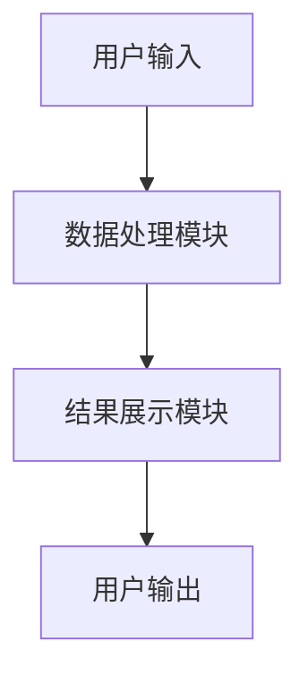

                 


# 利用智能体系统进行全面的公司知识产权价值评估

> 关键词：智能体系统，知识产权评估，人工智能，算法原理，系统架构，项目实战

> 摘要：本文详细探讨了利用智能体系统进行全面的公司知识产权价值评估的方法和实现。从背景介绍到核心概念，从算法原理到系统架构设计，再到项目实战和案例分析，系统地阐述了如何利用智能体系统提升知识产权评估的效率和准确性。文章结合实际应用场景，提供了丰富的技术细节和代码实现，为读者提供了一套完整的解决方案。

---

# 第一部分：智能体系统与知识产权价值评估基础

## 第1章：智能体系统与知识产权概述

### 1.1 智能体系统的基本概念

#### 1.1.1 智能体系统的定义
智能体系统是一种基于人工智能技术的智能系统，能够通过感知环境、自主决策、执行操作和学习优化来完成特定任务。它结合了多种技术，如机器学习、自然语言处理和知识图谱，具有高度的智能化和自动化能力。

#### 1.1.2 智能体系统的核心特征
智能体系统的核心特征包括：智能感知、自主决策、持续学习、高效执行和人机协作。这些特征使其能够在复杂的环境中完成复杂的任务。

#### 1.1.3 智能体系统与传统评估方法的区别
传统评估方法依赖人工分析和经验判断，而智能体系统通过自动化技术实现高效、精准的评估。智能体系统能够处理大量数据，发现潜在价值，提供科学的决策支持。

### 1.2 知识产权价值评估的背景与意义

#### 1.2.1 知识产权的重要性
知识产权是企业的核心资产之一，包括专利、商标、版权等。其价值不仅体现在法律保护上，还体现在市场竞争力和经济收益上。

#### 1.2.2 知识产权价值评估的现状
传统评估方法存在主观性强、效率低、成本高等问题。随着技术的发展，利用智能体系统进行知识产权评估成为一种趋势，能够提高评估的准确性和效率。

#### 1.2.3 智能体系统在知识产权评估中的作用
智能体系统能够快速处理大量数据，挖掘潜在信息，提供精准的评估结果。它可以帮助企业在知识产权管理中做出更科学的决策。

### 1.3 智能体系统在知识产权评估中的应用前景

#### 1.3.1 智能体系统的优势
智能体系统具有高效性、精准性和可扩展性。它能够快速分析海量数据，发现隐藏的价值，为企业提供强有力的支持。

#### 1.3.2 智能体系统在知识产权评估中的潜在应用领域
智能体系统可以应用于专利分析、商标评估、版权保护等多个领域，为企业提供全方位的知识产权管理解决方案。

#### 1.3.3 智能体系统应用的挑战与机遇
虽然智能体系统在知识产权评估中具有巨大潜力，但其应用也面临数据隐私、技术瓶颈等挑战。如何克服这些挑战是未来研究的重要方向。

---

## 第2章：智能体系统的核心概念与技术基础

### 2.1 智能体系统的组成与功能

#### 2.1.1 智能体系统的组成要素
智能体系统通常由感知模块、决策模块、执行模块和学习模块组成。感知模块负责数据采集，决策模块负责策略制定，执行模块负责操作执行，学习模块负责优化和提升。

#### 2.1.2 智能体系统的主要功能
智能体系统具有数据处理、智能分析、决策支持和持续优化等功能。这些功能使其能够在复杂环境中完成各种任务。

#### 2.1.3 智能体系统与相关技术的关系
智能体系统与机器学习、自然语言处理、知识图谱等技术密切相关，这些技术为其提供了强大的技术支持。

### 2.2 知识产权评估的核心要素

#### 2.2.1 知识产权的分类与特征
知识产权可以分为专利、商标、版权等类别，每类都有其独特的特征和评估标准。

#### 2.2.2 知识产权价值的影响因素
知识产权的价值受技术先进性、市场前景、法律保护等多种因素影响。智能体系统能够综合考虑这些因素，提供全面的评估。

#### 2.2.3 知识产权评估的关键指标
评估指标包括技术价值、市场价值、法律风险等。智能体系统能够量化这些指标，提供科学的评估结果。

### 2.3 智能体系统与知识产权评估的结合

#### 2.3.1 智能体系统在知识产权评估中的角色
智能体系统作为评估工具，能够高效地处理数据，提供精准的评估结果。它能够帮助评估人员发现潜在价值，优化评估流程。

#### 2.3.2 智能体系统如何提升知识产权评估的效率
通过自动化数据处理和智能分析，智能体系统能够显著提高评估效率，降低成本，同时提高评估的准确性和全面性。

#### 2.3.3 智能体系统在知识产权评估中的具体应用场景
智能体系统可以应用于专利检索、价值评估、风险分析等多个场景，为企业提供全方位的支持。

---

## 第3章：智能体系统的算法原理与数学模型

### 3.1 智能体系统的算法基础

#### 3.1.1 人工智能算法在智能体系统中的应用
人工智能算法，如机器学习、深度学习等，在智能体系统的感知、决策和学习模块中起着重要作用。

#### 3.1.2 常见的智能体系统算法
常见的算法包括强化学习、监督学习、无监督学习等。每种算法都有其特点和适用场景。

#### 3.1.3 算法选择与优化策略
根据具体应用场景选择合适的算法，并通过数据预处理、参数调优等方法优化算法性能。

### 3.2 知识产权价值评估的数学模型

#### 3.2.1 知识产权价值评估的基本模型
基本模型通常包括数据预处理、特征提取、模型训练和结果预测等步骤。

#### 3.2.2 基于智能体系统的评估模型
智能体系统模型结合了多种算法，能够综合考虑各种因素，提供更精准的评估结果。

#### 3.2.3 模型的验证与优化
通过交叉验证、网格搜索等方法验证模型的性能，并进行优化，提高评估的准确性和可靠性。

### 3.3 智能体系统算法的实现

#### 3.3.1 算法实现的步骤
算法实现通常包括数据准备、模型训练、模型评估和模型部署等步骤。

#### 3.3.2 算法实现的代码示例
以下是一个简单的机器学习算法实现示例：
```python
from sklearn import datasets
from sklearn.model import SVC
from sklearn.model_selection import train_test_split

# 加载数据
iris = datasets.load_iris()
X = iris.data
y = iris.target

# 分割数据集
X_train, X_test, y_train, y_test = train_test_split(X, y, test_size=0.2)

# 训练模型
model = SVC()
model.fit(X_train, y_train)

# 预测结果
y_pred = model.predict(X_test)

# 输出准确率
print("Accuracy:", model.score(X_test, y_test))
```

#### 3.3.3 算法实现的数学模型和公式
以下是一个简单的线性回归模型的数学公式：
$$ y = \beta_0 + \beta_1 x + \epsilon $$
其中，$\beta_0$ 和 $\beta_1$ 是模型参数，$\epsilon$ 是误差项。

---

## 第4章：智能体系统的系统架构设计与实现

### 4.1 系统功能设计

#### 4.1.1 系统功能模块
智能体系统通常包括数据采集模块、数据处理模块、模型训练模块和结果展示模块。

#### 4.1.2 系统功能流程
数据采集模块负责获取知识产权相关数据，数据处理模块对数据进行清洗和预处理，模型训练模块基于数据训练评估模型，结果展示模块将评估结果以可视化形式呈现。

#### 4.1.3 系统功能设计的mermaid类图


### 4.2 系统架构设计

#### 4.2.1 系统架构设计的mermaid架构图


#### 4.2.2 系统架构设计的详细说明
系统架构采用分层设计，包括前端、后端和数据库。前端负责用户交互，后端负责业务逻辑处理，数据库负责数据存储和管理。

### 4.3 系统接口设计

#### 4.3.1 系统接口设计的详细说明
系统接口包括数据接口和用户接口。数据接口用于与外部数据源交互，用户接口用于与用户交互。

#### 4.3.2 系统接口设计的mermaid序列图


### 4.4 系统交互设计

#### 4.4.1 系统交互设计的详细说明
系统交互包括用户输入、数据处理和结果展示。用户输入指令，系统处理数据并返回结果。

#### 4.4.2 系统交互设计的mermaid流程图


---

## 第5章：项目实战

### 5.1 环境搭建与开发工具

#### 5.1.1 环境搭建步骤
1. 安装Python和必要的库（如scikit-learn、pandas、numpy等）。
2. 安装Jupyter Notebook或其他开发工具。

#### 5.1.2 开发工具的选择与安装
推荐使用Anaconda环境管理工具，安装必要的库和版本。

### 5.2 系统核心实现

#### 5.2.1 核心实现代码
以下是一个简单的知识产权价值评估模型实现示例：
```python
import pandas as pd
from sklearn.ensemble import RandomForestRegressor
from sklearn.metrics import mean_squared_error

# 加载数据
data = pd.read_csv('patent_data.csv')

# 数据预处理
X = data.drop('value', axis=1)
y = data['value']

# 数据分割
X_train, X_test, y_train, y_test = train_test_split(X, y, test_size=0.2)

# 训练模型
model = RandomForestRegressor(n_estimators=100)
model.fit(X_train, y_train)

# 预测结果
y_pred = model.predict(X_test)

# 计算误差
mse = mean_squared_error(y_test, y_pred)
print(f"均方误差: {mse}")
```

#### 5.2.2 代码实现的详细说明
上述代码实现了基于随机森林回归算法的知识产权价值评估模型，通过均方误差评估模型性能。

### 5.3 项目小结

#### 5.3.1 项目总结
通过本项目，我们展示了如何利用智能体系统进行知识产权价值评估。通过数据处理、模型训练和结果展示，实现了高效、精准的评估。

#### 5.3.2 项目经验与教训
在项目中，我们遇到了数据不足、模型过拟合等问题，通过增加数据量、调整模型参数等方法进行优化。

---

## 第6章：案例分析与未来展望

### 6.1 案例分析

#### 6.1.1 案例背景
某科技公司希望对其专利组合进行价值评估，以优化其知识产权管理。

#### 6.1.2 案例分析过程
通过智能体系统，该公司成功分析了其专利组合的价值，识别了高价值专利，并优化了知识产权管理策略。

#### 6.1.3 案例分析结果
评估结果显示，该公司部分专利具有较高的市场价值，值得重点保护和推广。

### 6.2 未来展望

#### 6.2.1 智能体系统的发展趋势
随着人工智能技术的不断进步，智能体系统在知识产权评估中的应用将更加广泛和深入。

#### 6.2.2 智能体系统在知识产权评估中的未来研究方向
未来的研究方向包括提高模型的准确性和效率、优化系统架构、拓展应用场景等。

#### 6.2.3 对企业的建议
企业应积极引入智能体系统，提升知识产权管理的智能化水平，以应对日益复杂的市场环境。

---

## 结语

通过本文的详细阐述，我们展示了如何利用智能体系统进行全面的公司知识产权价值评估。从理论基础到实际应用，从算法原理到系统架构设计，再到项目实战和案例分析，我们为读者提供了一套完整的解决方案。未来，随着人工智能技术的不断发展，智能体系统将在知识产权评估中发挥越来越重要的作用，为企业创造更大的价值。

