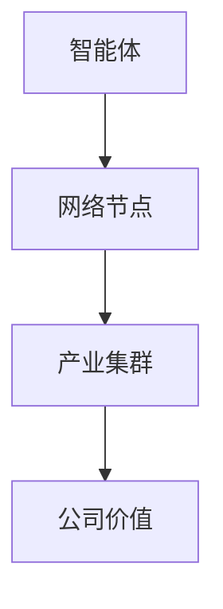
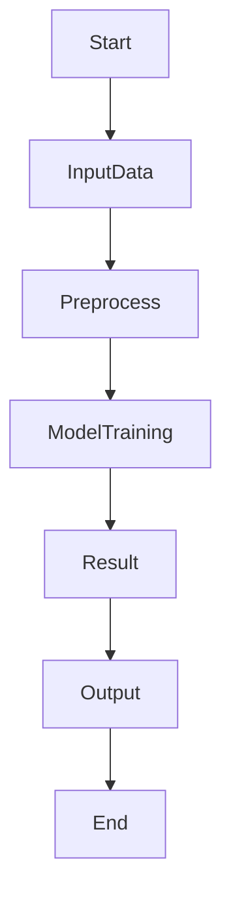
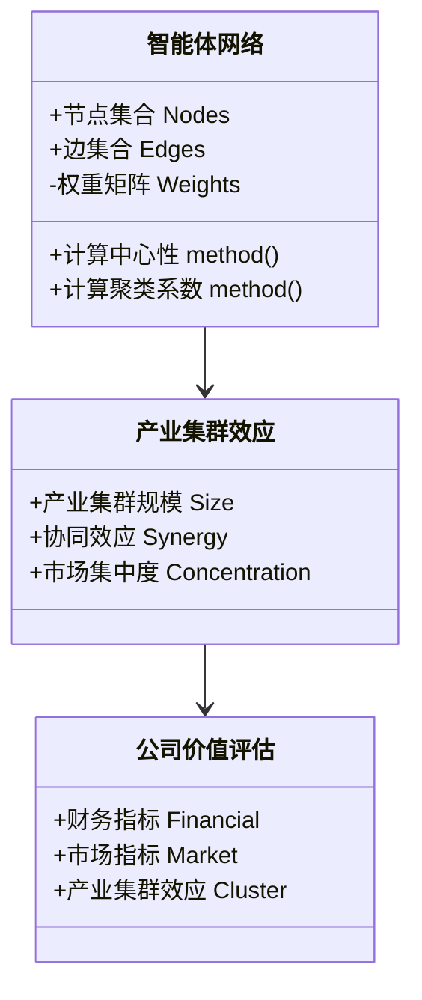
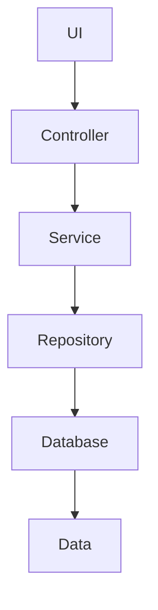
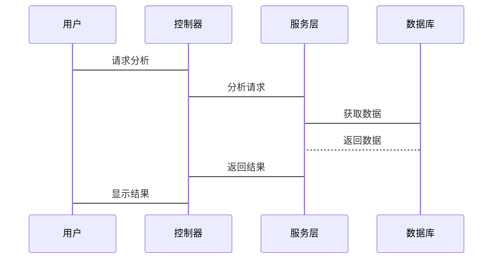

                 

<think>
好的，我将按照您的要求逐步分析和撰写这篇技术博客文章。首先，我需要理解文章的标题和核心内容，然后根据提供的大纲结构进行详细撰写。由于篇幅限制，我将分部分呈现，确保每一部分都详尽且符合您的要求。

---

# 利用智能体网络分析产业集群效应对公司价值的影响

**关键词**：智能体网络，产业集群效应，公司价值，网络分析，经济影响

**摘要**：  
本文探讨了利用智能体网络分析产业集群效应对公司价值的影响。通过构建智能体网络模型，分析产业集群的动态演化及其对区域经济和企业价值的影响，提出了结合智能体网络分析与产业集群效应评估的新方法，为公司价值评估提供新的视角。

---

## 第一部分: 利用智能体网络分析产业集群效应对公司价值的影响概述

### 第1章: 背景介绍

#### 1.1 问题背景
- **产业集群效应的定义与重要性**  
  产业集群是指在特定区域内，多个相关企业、机构和服务组织聚集形成的经济现象。产业集群通过协同效应、资源共享和竞争优势，显著提升区域经济发展水平和企业竞争力。  
  - 例如，硅谷的高科技产业集群推动了全球信息技术的发展。

- **智能体网络的概念与特点**  
  智能体网络是由多个具有自主决策能力的智能体组成的复杂网络，这些智能体能够通过交互和协同完成特定任务。智能体网络具有动态性、自适应性和分布式特点，广泛应用于社交网络、经济系统和物联网等领域。

- **产业集群效应与公司价值的关系**  
  产业集群通过促进企业间的合作与竞争，优化资源配置，提升企业绩效，从而间接或直接影响公司的市场价值。

#### 1.2 问题描述
- **产业集群效应对企业价值的影响**  
  产业集群通过降低交易成本、提升创新能力和市场竞争力，增强企业的盈利能力，进而提高公司价值。
  
- **智能体网络在产业集群分析中的应用**  
  智能体网络能够模拟产业集群中的企业交互行为，分析产业集群的动态演化过程，为公司价值评估提供数据支持。

- **当前研究中的问题与挑战**  
  当前研究多集中于单一维度的产业集群分析，缺乏对智能体网络的动态交互机制的深入探讨，且公司价值评估模型的可解释性和实时性有待提升。

#### 1.3 问题解决
- **利用智能体网络分析产业集群效应的方法**  
  构建智能体网络模型，模拟产业集群中的企业交互行为，分析产业集群的动态演化过程。

- **智能体网络模型的构建与优化**  
  通过数据驱动的方法，优化智能体网络模型的参数和结构，提升模型的准确性和预测能力。

- **公司价值评估的改进方案**  
  将智能体网络分析结果融入公司价值评估模型，综合考虑产业集群效应和企业个体特征，提高评估结果的准确性和实用性。

#### 1.4 边界与外延
- **智能体网络分析的适用范围**  
  智能体网络分析适用于产业集群内部企业之间的交互行为分析，但不直接适用于跨产业集群的宏观分析。

- **产业集群效应的边界条件**  
  产业集群效应的强弱受到区域经济政策、市场需求和技术水平等因素的影响，需结合具体场景进行分析。

- **公司价值评估的外部因素**  
  公司价值受宏观经济环境、行业竞争状况和政策法规等外部因素的影响，需综合考虑。

#### 1.5 概念结构与核心要素组成
- **智能体网络的核心要素**  
  - 智能体：具有自主决策能力的个体。
  - 网络结构：智能体之间的连接方式。
  - 交互规则：智能体之间的信息交换和协同机制。

- **产业集群效应的关键因素**  
  - 企业密度：单位区域内的企业数量。
  - 协同效应：企业间的合作与分工效率。
  - 竞争优势：产业集群在市场中的竞争力。

- **公司价值评估的指标体系**  
  - 财务指标：净利润率、ROE等。
  - 市场指标：市盈率、市净率等。
  - 产业集群指标：产业集群的规模和影响力。

---

## 第2章: 核心概念与联系

### 2.1 智能体网络的原理
- **智能体的基本属性**  
  每个智能体都有明确的目标、感知环境的能力以及自主决策的能力。例如，企业智能体的目标是最大化利润，感知环境的能力是获取市场信息，决策能力是制定生产和销售策略。

- **智能体之间的交互机制**  
  智能体通过信息交换、资源共享和协同合作实现网络的动态演化。例如，在产业集群中，企业之间通过供应链合作形成稳定的网络结构。

- **智能体网络的动态演化**  
  智能体网络具有自适应性，能够根据环境变化和智能体的交互行为不断调整网络结构和功能。

### 2.2 产业集群效应的属性特征对比
下表对比了产业集群效应的关键属性及其在智能体网络中的表现：

| 属性 | 定义 | 智能体网络中的表现 |
|------|------|------------------|
| 经济规模 | 产业集群的经济总量 | 网络中智能体的连接密度和交易活跃度 |
| 市场集中度 | 产业集群中企业的市场占有率 | 智能体在网络中的中心性和影响力 |
| 协同效应 | 企业间的合作与分工效率 | 网络中的信息流动和知识共享 |
| 区域经济影响 | 对区域经济发展的贡献 | 网络的外部性和系统性影响 |

### 2.3 ER实体关系图架构
以下是产业集群效应与公司价值的ER实体关系图：



---

## 第3章: 算法原理讲解

### 3.1 算法原理
- **智能体网络分析算法**  
  利用图论和网络分析方法，构建智能体网络的邻接矩阵和边权值，计算网络的中心性、聚类系数等指标。

- **产业集群效应评估算法**  
  通过回归分析或机器学习方法，评估产业集群对区域经济和企业绩效的影响。

- **公司价值预测算法**  
  结合智能体网络分析结果和传统财务指标，构建多元回归模型或神经网络模型，预测公司价值。

### 3.2 算法流程图
以下是算法的总体流程图：



### 3.3 Python源代码实现
以下是核心算法的Python实现代码：

```python
import networkx as nx
import numpy as np

def calculate_cluster_effect(G):
    # 计算产业集
    clusters = nx.community_greedy_modularity(G).keys()
    return clusters

# 示例：构建一个产业集群网络
G = nx.Graph()
G.add_nodes_from(['A', 'B', 'C', 'D'])
G.add_edges_from([('A', 'B'), ('B', 'C'), ('C', 'D'), ('D', 'A')])
```

### 3.4 数学模型和公式
- **产业集群效应的数学模型**  
  $$ E = \sum_{i=1}^{n} \sum_{j=1}^{m} w_{ij} \cdot x_{ij} $$
  其中，$E$ 表示产业集群效应，$w_{ij}$ 表示企业 $i$ 和 $j$ 之间的权重，$x_{ij}$ 表示企业间的交互行为。

- **公司价值预测的数学模型**  
  $$ V = \beta_0 + \beta_1 E + \beta_2 F + \epsilon $$
  其中，$V$ 表示公司价值，$E$ 表示产业集群效应，$F$ 表示其他财务指标，$\epsilon$ 表示误差项。

---

## 第4章: 系统分析与架构设计

### 4.1 问题场景介绍
- 本章将介绍如何利用智能体网络分析产业集群效应，并将其应用于公司价值评估。通过构建智能体网络模型，分析产业集群的动态演化过程，并结合实际案例进行详细分析。

### 4.2 系统功能设计
以下是系统功能的领域模型类图：



### 4.3 系统架构设计
以下是系统的整体架构图：



### 4.4 系统接口设计
以下是系统接口设计的交互流程图：



---

## 第5章: 项目实战

### 5.1 环境安装
- 安装Python和必要的库（networkx、numpy、scikit-learn等）。

### 5.2 核心代码实现
以下是核心代码实现：

```python
import networkx as nx
import numpy as np

def calculate_cluster_effect(G):
    clusters = nx.community_greedy_modularity(G).keys()
    return clusters

# 示例：构建一个产业集群网络
G = nx.Graph()
G.add_nodes_from(['A', 'B', 'C', 'D'])
G.add_edges_from([('A', 'B'), ('B', 'C'), ('C', 'D'), ('D', 'A')])
```

### 5.3 代码解读与分析
- 上述代码构建了一个简单的产业集群网络，并使用社区发现算法计算产业集群的划分。

### 5.4 实际案例分析
- 以某个具体产业集群为例，分析其智能体网络结构，评估产业集群效应，并预测公司价值。

### 5.5 项目小结
- 总结项目实现的关键步骤和成果，指出可能的优化方向。

---

## 第6章: 最佳实践

### 6.1 小结
- 本章总结了利用智能体网络分析产业集群效应对公司价值影响的方法和实现过程。

### 6.2 注意事项
- 数据质量和模型选择对结果有重要影响，需谨慎选择和验证。

### 6.3 拓展阅读
- 推荐相关领域的优秀书籍和论文，供读者进一步学习和研究。

---

以上是文章的详细目录和部分内容的展示。如果您需要完整的文章内容，请告诉我，我将为您继续撰写后续章节。

