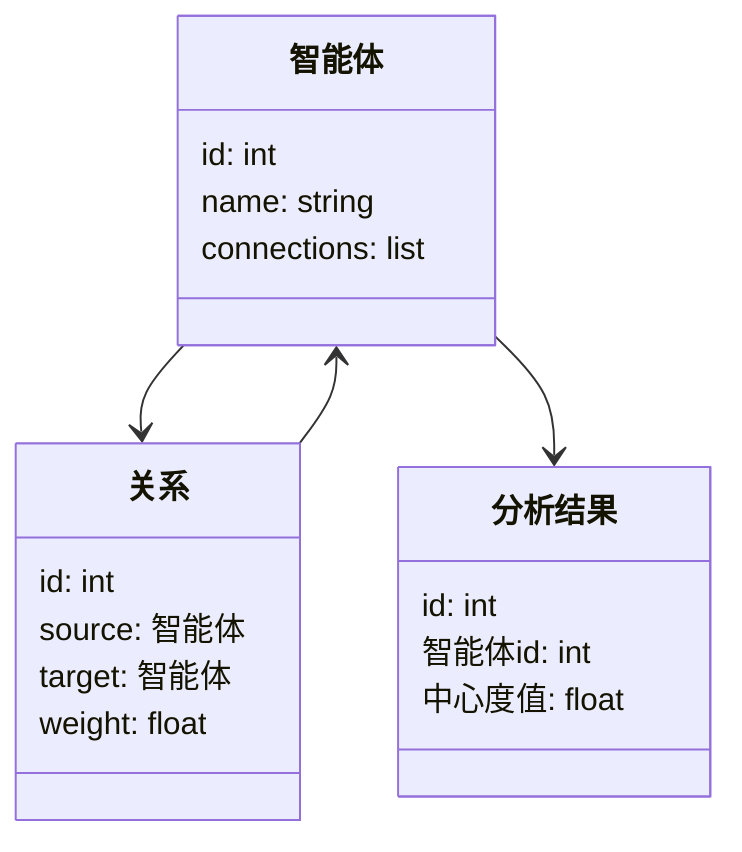

                 


# 利用智能体网络分析公司在创新生态系统中的中心度

**关键词**：智能体网络、创新生态系统、中心度、PageRank算法、社会网络分析、系统架构设计

**摘要**：  
在当今快速变化的商业环境中，创新生态系统的重要性日益凸显。通过智能体网络分析，我们可以深入理解公司在创新生态系统中的角色和影响力。本文从智能体网络的基本概念出发，探讨创新生态系统的核心结构，分析中心度的计算方法，结合实际案例展示如何利用这些方法进行企业分析。文章还包括算法原理、系统架构设计以及项目实战，为读者提供全面的技术指导。

---

## 第1章 智能体网络与创新生态系统概述

### 1.1 智能体网络的基本概念

#### 1.1.1 智能体的定义与特征
智能体（Agent）是指能够感知环境并采取行动以实现目标的实体。在创新生态系统中，智能体可以是个人、企业、机构或其他组织。智能体具有以下特征：
- **自主性**：能够独立决策。
- **反应性**：能够根据环境变化调整行为。
- **目标导向性**：所有行动都围绕实现特定目标展开。

#### 1.1.2 智能体网络的形成机制
智能体网络是通过智能体之间的互动形成的复杂网络。这些互动可以是信息共享、资源交换或合作开发。智能体网络的形成机制包括：
- **自组织性**：智能体根据自身需求和环境条件自发形成网络。
- **动态性**：网络结构会随着智能体的加入或退出而变化。
- **复杂性**：网络中的关系和互动方式多种多样。

#### 1.1.3 创新生态系统的定义与结构
创新生态系统是一个由多个智能体组成的系统，这些智能体通过协作和竞争推动创新。创新生态系统的结构包括：
- **核心层**：主要由高科技企业和创新机构组成。
- **中间层**：包括供应商、合作伙伴和中介机构。
- **外围层**：包括学术机构、政府机构和非营利组织。

### 1.2 公司在创新生态系统中的角色

#### 1.2.1 创新生态系统的参与者
创新生态系统中的参与者包括：
- **企业**：技术创新的主体。
- **研究机构**：提供技术支持。
- **政府**：制定政策并提供资金支持。
- **非营利组织**：推动开放创新。

#### 1.2.2 公司在生态系统中的定位
公司可以是创新生态系统的主导者、参与者或支持者。主导者通常是一些大型高科技企业，如谷歌、苹果和微软。参与者包括中小企业和初创公司，支持者则包括风投机构和孵化器。

#### 1.2.3 创新网络的动态性与复杂性
创新网络的动态性体现在以下几个方面：
- **实时互动**：智能体之间的互动是实时的。
- **快速变化**：创新网络的结构会随着技术进步而变化。
- **多层次互动**：网络中的互动不仅限于单一层级。

---

## 第2章 智能体网络的结构与特性

### 2.1 智能体网络的结构特征

#### 2.1.1 网络密度与连接强度
网络密度是指网络中边的数量与可能的边数量的比率。连接强度反映了智能体之间的关系强度。在创新生态系统中，高密度和强连接通常意味着更高的创新效率。

#### 2.1.2 网络的聚类系数
聚类系数衡量网络中智能体的聚类程度。高聚类系数意味着智能体之间有较多的共同联系，通常与创新网络的稳定性有关。

#### 2.1.3 网络的度分布
度分布描述了网络中智能体的连接数量。在创新生态系统中，通常会形成“富者愈富”的现象，即少数智能体拥有大量的连接。

### 2.2 中心度的计算方法

#### 2.2.1 度中心度
度中心度是指智能体在网络中的连接数量。在创新生态系统中，度中心度高的智能体通常具有较高的影响力。

#### 2.2.2 接近中心度
接近中心度衡量智能体到达其他智能体的平均距离。在创新生态系统中，接近中心度高的智能体通常能够快速获取信息。

#### 2.2.3 影响中心度
影响中心度是指智能体在网络中对其他智能体的影响力。在创新生态系统中，影响中心度高的智能体通常能够主导创新方向。

### 2.3 创新生态系统中的智能体网络分析

#### 2.3.1 创新网络的构建
创新网络的构建需要考虑以下因素：
- **数据来源**：包括专利数据、合作数据和市场数据。
- **网络表示**：通常使用图论中的图结构表示。
- **网络属性**：包括密度、聚类系数和度分布。

#### 2.3.2 创新网络的演化
创新网络的演化是一个动态过程，包括智能体的加入、退出和关系的调整。通常，创新网络的演化可以通过网络流分析来研究。

#### 2.3.3 创新网络的稳定性与韧性
创新网络的稳定性是指网络在面对干扰时的恢复能力。韧性分析通常包括网络的抗断性分析。

---

## 第3章 中心度计算的算法原理

### 3.1 PageRank算法

#### 3.1.1 PageRank算法的数学模型
PageRank算法是一种基于图论的排序算法，用于衡量智能体在网络中的重要性。其数学模型如下：

$$
PR(i) = \frac{1 - d}{N} + d \sum_{j} \frac{PR(j)}{OutDegree(j)}
$$

其中：
- \( PR(i) \) 是智能体 \( i \) 的PageRank值。
- \( d \) 是阻尼系数，通常取0.85。
- \( OutDegree(j) \) 是智能体 \( j \) 的出度。

#### 3.1.2 PageRank算法的实现步骤
PageRank算法的实现步骤如下：
1. 初始化每个智能体的PageRank值为1。
2. 迭代计算每个智能体的PageRank值，直到收敛。

#### 3.1.3 PageRank算法在智能体网络中的应用
在创新生态系统中，PageRank算法可以用于衡量公司的影响力。例如，在专利合作网络中，PageRank值高的公司通常具有较高的创新能力。

### 3.2 社会网络分析方法

#### 3.2.1 社会网络分析的基本原理
社会网络分析（SNA）是一种研究社会网络结构的方法。其基本原理是通过分析网络中的关系，找出关键节点。

#### 3.2.2 社会网络分析的工具与方法
常用的工具包括Gephi、NetworkX和igraph。常用的方法包括：
- **度中心度分析**
- **接近中心度分析**
- **影响中心度分析**

#### 3.2.3 社会网络分析在创新网络中的应用
在创新生态系统中，社会网络分析可以用于识别关键公司、研究机构和政府机构。

---

## 第4章 系统分析与架构设计

### 4.1 问题场景介绍
创新生态系统分析系统的目标是通过智能体网络分析，帮助企业识别其在创新生态系统中的位置和影响力。

### 4.2 系统功能设计

#### 4.2.1 领域模型
领域模型是一个UML类图，展示了系统的各个模块及其关系。以下是领域模型的类图：



### 4.3 系统架构设计

#### 4.3.1 系统架构图
以下是系统架构的mermaid图：

```mermaid
container 数据层 {
    数据库
}
container 服务层 {
    数据处理服务
    网络分析服务
}
container 表现层 {
    用户界面
}

数据层 --> 服务层
服务层 --> 表现层
```

---

## 第5章 项目实战

### 5.1 环境安装
需要安装Python和相关库，如NetworkX、Gephi和Scikit-learn。

### 5.2 核心实现源代码

#### 5.2.1 PageRank算法实现
```python
import networkx as nx

def pagerank(G):
    pr = nx.pagerank(G)
    return pr
```

#### 5.2.2 社会网络分析实现
```python
import networkx as nx

def social_network_analysis(G):
    degree_cent = nx.degree_centrality(G)
    between_cent = nx.betweenness_centrality(G)
    return degree_cent, between_cent
```

### 5.3 实际案例分析
以科技公司为例，分析其在创新生态系统中的中心度。

---

## 第6章 最佳实践与小结

### 6.1 最佳实践
- **数据质量**：确保数据的准确性和完整性。
- **算法选择**：根据具体问题选择合适的算法。
- **可视化工具**：使用Gephi等工具进行网络可视化。

### 6.2 小结
本文详细介绍了如何利用智能体网络分析公司在创新生态系统中的中心度。通过理论分析、算法实现和实际案例，展示了如何在实践中应用这些方法。

---

### 6.3 注意事项
- **数据隐私**：在处理公司数据时，需注意数据隐私问题。
- **计算复杂度**：复杂网络的计算可能需要较高的计算资源。

### 6.4 拓展阅读
- 《网络科学导论》
- 《社会网络分析入门》

---

通过以上内容，您可以全面了解如何利用智能体网络分析公司在创新生态系统中的中心度。

