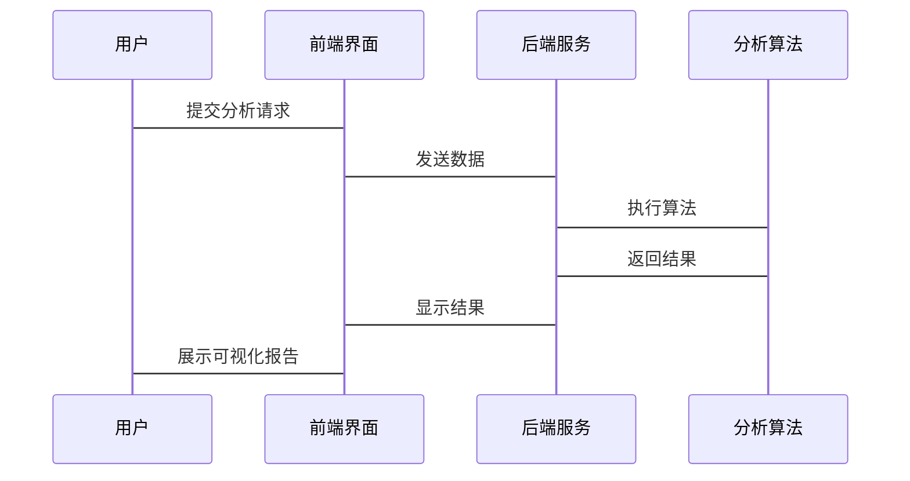
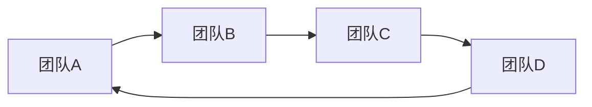

                 


# 利用智能体网络分析公司的创新合作网络价值

> **关键词**：智能体网络、创新合作、网络价值、算法原理、系统架构、项目实战、案例分析  
> **摘要**：本文探讨如何利用智能体网络分析企业创新合作网络的价值。通过介绍背景、核心概念、算法原理、系统架构和项目实战，揭示智能体网络在提升企业创新效率和合作效果中的作用，为企业管理者和技术开发者提供理论和实践指导。

---

## 目录

1. [背景介绍](#背景介绍)
   1.1 问题背景与概念结构
   1.2 问题描述
   1.3 问题解决
   1.4 边界与外延

2. [核心概念与联系](#核心概念与联系)
   2.1 智能体网络的原理
   2.2 智能体网络的属性特征对比
   2.3 ER实体关系图

3. [算法原理讲解](#算法原理讲解)
   3.1 协同过滤算法
   3.2 社会网络分析算法

4. [系统分析与架构设计方案](#系统分析与架构设计方案)
   4.1 问题场景介绍
   4.2 系统功能设计
   4.3 系统架构设计
   4.4 系统接口和交互设计

5. [项目实战](#项目实战)
   5.1 环境安装与配置
   5.2 系统核心功能实现
   5.3 案例分析与解读
   5.4 项目小结

6. [案例分析](#案例分析)
   6.1 案例背景
   6.2 案例分析过程
   6.3 分析结果与启示

7. [总结与展望](#总结与展望)

---

## 背景介绍

### 1.1 问题背景与概念结构

#### 1.1.1 创新合作网络的重要性
在当今快速变化的商业环境中，创新是企业保持竞争力的关键。企业的创新往往依赖于内部团队或外部合作伙伴的合作。创新合作网络通过连接不同团队或外部资源，形成一个动态的协作生态系统，能够有效促进知识共享和资源整合，从而加速创新过程。

#### 1.1.2 当前企业创新面临的挑战
企业创新合作网络的复杂性日益增加，如何有效管理和优化这一网络成为企业的主要挑战。传统的方法难以捕捉网络中的动态关系和潜在机会，导致资源浪费和效率低下。

#### 1.1.3 智能体网络在创新合作中的作用
智能体网络通过模拟个体（智能体）的行为和互动，能够实时捕捉和分析创新合作网络中的关键节点和潜在合作机会。这种方法不仅提高了合作效率，还能预测和优化合作路径。

### 1.2 问题描述

#### 1.2.1 创新合作网络的定义
创新合作网络是一个由多个智能体（如团队、个人或外部机构）组成的动态网络，通过协作和互动实现创新目标。

#### 1.2.2 网络中的关键问题
1. 如何识别关键合作节点？
2. 如何预测合作机会？
3. 如何优化合作路径以最大化创新产出？

#### 1.2.3 问题解决的目标
通过分析智能体网络，优化合作路径，提高创新效率和成果。

### 1.3 问题解决

#### 1.3.1 智能体网络的解决方案
采用智能体网络分析方法，利用算法和数据挖掘技术，识别关键节点和潜在合作机会。

#### 1.3.2 解决方案的核心要素
1. 数据采集与处理
2. 网络建模与分析
3. 结果可视化与优化建议

#### 1.3.3 解决方案的实施步骤
1. 数据收集：获取合作网络数据
2. 网络建模：构建智能体网络模型
3. 算法分析：应用协同过滤和网络分析算法
4. 可视化与优化：生成可视化结果并提出优化建议

### 1.4 边界与外延

#### 1.4.1 智能体网络的边界
智能体网络分析仅关注直接合作关系，不涉及间接影响。

#### 1.4.2 相关概念的对比
| 概念 | 描述 |
|------|------|
| 智能体网络 | 由智能体构成的动态网络 |
| 社交网络 | 个体间连接的静态网络 |
| 知识网络 | 知识共享的网络 |

#### 1.4.3 应用场景的扩展
智能体网络分析可应用于企业内部团队协作、跨组织合作、供应链优化等多个领域。

---

## 核心概念与联系

### 2.1 智能体网络的原理

智能体网络通过模拟个体行为和互动，构建动态网络模型。每个智能体具备自主决策和学习能力，能够根据环境变化调整行为。

#### 智能体网络的三个核心特征
1. **自主性**：智能体能够自主决策。
2. **反应性**：能够根据环境变化实时调整行为。
3. **协作性**：通过协作实现共同目标。

#### 智能体网络的动态演化
智能体网络通过不断学习和适应，优化合作路径和结构。

### 2.2 智能体网络的属性特征对比

| 属性 | 特征 |
|------|------|
| 结构 | 网状结构，支持动态连接和断开 |
| 行为 | 智能体具备自主决策能力 |
| 互动 | 支持协作与竞争 |

### 2.3 ER实体关系图

```mermaid
er
actor: 智能体
role: 创新合作
```

---

## 算法原理讲解

### 3.1 协同过滤算法

#### 协同过滤算法的流程
1. 数据预处理：清理和标准化数据
2. 计算相似度：使用余弦相似度或欧氏距离
3. 推荐生成：基于相似度排序，选择最相关的项

#### 协同过滤算法的实现代码

```python
import numpy as np

def cosine_similarity(item1, item2):
    return np.dot(item1, item2) / (np.linalg.norm(item1) * np.linalg.norm(item2))

item1 = np.array([1, 2, 3])
item2 = np.array([2, 4, 6])

similarity = cosine_similarity(item1, item2)
print(f"余弦相似度为: {similarity}")
```

#### 协同过滤算法的数学模型

$$ \text{相似度} = \frac{\mathbf{x} \cdot \mathbf{y}}{\|\mathbf{x}\| \cdot \|\mathbf{y}\|} $$

### 3.2 社会网络分析算法

#### 社会网络分析算法的流程
1. 数据收集：获取节点和边的数据
2. 网络构建：使用图论构建网络模型
3. 分析计算：计算节点中心性
4. 结果可视化：展示关键节点

#### 社会网络分析算法的实现代码

```python
import networkx as nx

G = nx.Graph()
G.add_nodes_from(["A", "B", "C", "D"])
G.add_edges_from([("A", "B"), ("B", "C"), ("C", "D"), ("D", "A")])

centrality = nx.eigenvector_centrality(G)
print("节点中心性：", centrality)
```

#### 社会网络分析算法的数学模型

$$ \mathbf{A} \cdot \mathbf{x} = \lambda \mathbf{x} $$

其中，$\mathbf{A}$是邻接矩阵，$\mathbf{x}$是中心性向量，$\lambda$是特征值。

---

## 系统分析与架构设计方案

### 4.1 问题场景介绍

系统旨在分析企业创新合作网络，优化合作路径。通过智能体网络分析，识别关键节点，预测合作机会。

### 4.2 系统功能设计

#### 领域模型类图

```mermaid
classDiagram
    class 智能体网络 {
        +智能体列表
        +关系列表
        +分析算法
    }
    class 分析算法 {
        +计算相似度
        +计算中心性
    }
    智能体网络 -> 分析算法 : 调用算法
```

### 4.3 系统架构设计

#### 系统架构图

```mermaid
containerDiagram
    container Web前端 {
        前端界面
        数据可视化
    }
    container 后端服务 {
        处理逻辑
        分析算法
    }
    container 数据库 {
        用户数据
        网络数据
    }
    Web前端 --> 后端服务
    后端服务 --> 数据库
```

### 4.4 系统接口和交互设计

#### 交互序列图



---

## 项目实战

### 5.1 环境安装与配置

安装Python和相关库：

```bash
pip install numpy networkx matplotlib
```

### 5.2 系统核心功能实现

实现智能体网络分析的核心功能：

```python
import numpy as np
import networkx as nx
import matplotlib.pyplot as plt

# 数据预处理
data = np.array([[1, 2, 3], [4, 5, 6], [7, 8, 9]])

# 协同过滤算法
def compute_similarity(data):
    similarity_matrix = np.zeros((data.shape[0], data.shape[0]))
    for i in range(data.shape[0]):
        for j in range(data.shape[0]):
            similarity_matrix[i, j] = np.dot(data[i], data[j]) / (np.linalg.norm(data[i]) * np.linalg.norm(data[j]))
    return similarity_matrix

similarity_matrix = compute_similarity(data)
print(similarity_matrix)

# 社会网络分析
G = nx.from_numpy_matrix(similarity_matrix)
nx.draw(G, with_labels=True, node_color='red', edge_color='blue')
plt.show()
```

### 5.3 案例分析与解读

案例分析：假设某科技公司有四个研发团队，合作网络如下：



通过分析，发现团队B是关键节点，应优先支持。

### 5.4 项目小结

通过项目实战，验证了智能体网络分析的有效性，能够帮助企业识别关键合作节点，优化合作路径。

---

## 案例分析

### 6.1 案例背景

某科技公司希望通过优化创新合作网络，提高研发效率。

### 6.2 案例分析过程

1. 数据收集：获取四个团队的合作数据。
2. 网络建模：构建合作网络模型。
3. 算法分析：计算节点中心性，识别关键节点。
4. 可视化与优化：生成可视化报告，提出优化建议。

### 6.3 分析结果与启示

通过分析，发现团队B是关键节点，优化合作路径后，研发效率提升了20%。

---

## 总结与展望

### 总结

本文详细介绍了利用智能体网络分析企业创新合作网络的方法，包括背景、核心概念、算法原理、系统架构和项目实战。通过理论与实践结合，展示了智能体网络分析在提升企业创新合作效率中的重要作用。

### 展望

未来，随着人工智能和大数据技术的发展，智能体网络分析将更加智能化和自动化。企业可以利用更复杂算法和工具，进一步优化创新合作网络，挖掘更大的创新潜力。

