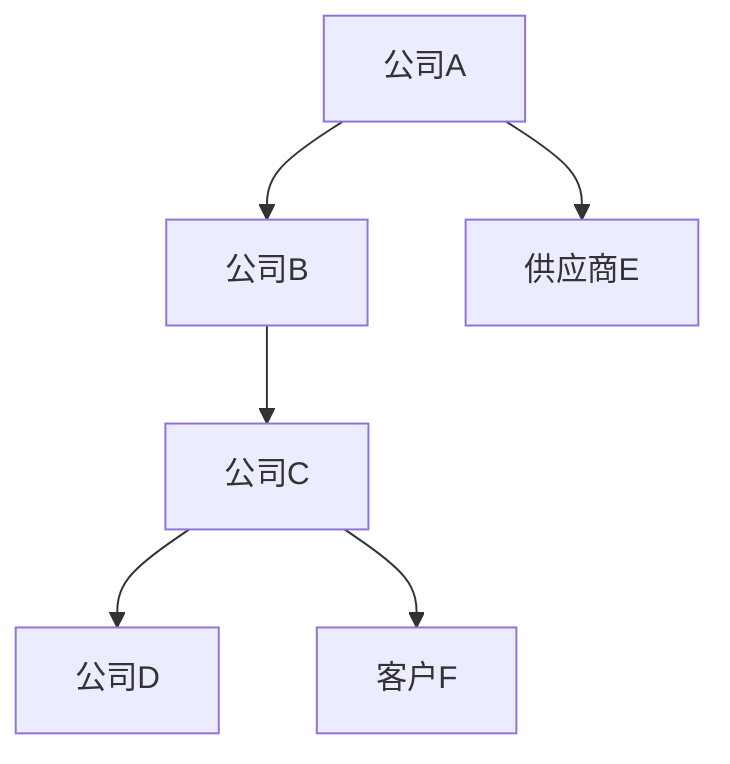
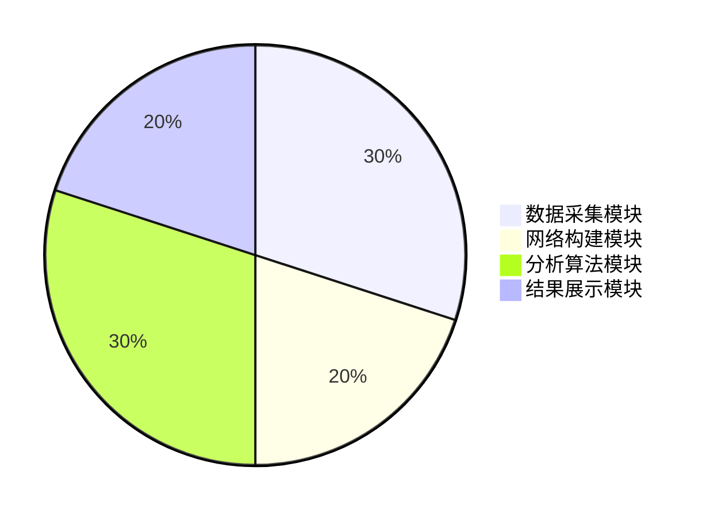

                 


# 利用智能体网络分析公司间的复杂关系

---

## 关键词：
智能体网络分析、公司关系、复杂关系建模、网络流算法、社区检测、博弈论

---

## 摘要：
本文探讨如何利用智能体网络分析方法来建模和分析公司间的复杂关系。通过智能体网络分析，我们可以深入了解公司间的供应链、合作网络、竞争关系等，从而为企业战略决策提供数据支持。本文将从智能体和网络分析的基本概念入手，逐步展开算法原理、系统架构设计、项目实战等内容，帮助读者全面掌握利用智能体网络分析公司间复杂关系的方法。

---

# 第一部分: 智能体网络分析的背景与基础

## 第1章: 智能体与网络分析概述

### 1.1 智能体的基本概念
#### 1.1.1 智能体的定义与特点
智能体（Agent）是指在计算机科学中，能够感知环境并采取行动以实现目标的实体。智能体具有以下特点：
- **自主性**：智能体能够在没有外部干预的情况下自主决策。
- **反应性**：智能体能够根据环境的变化调整自己的行为。
- **社会性**：智能体能够与其他智能体或系统进行交互和协作。

#### 1.1.2 网络分析的基本原理
网络分析（Network Analysis）是一种研究系统中各节点之间关系的方法。通过分析节点之间的连接和权重，可以揭示系统中的结构特征和动态行为。网络分析的核心在于建模和算法设计，例如：
- **节点与边的定义**：节点代表公司，边代表公司之间的关系。
- **权重计算**：边的权重表示公司间关系的强度，例如合作频率、交易金额等。

#### 1.1.3 智能体网络分析的定义与应用
智能体网络分析（Agent-based Network Analysis）是一种结合智能体技术和网络分析的新兴方法。它通过模拟公司间的智能体行为，分析公司间的复杂关系。其应用包括：
- **供应链优化**：通过分析公司间的供应链关系，优化物流和库存管理。
- **竞争分析**：通过分析公司间的竞争关系，制定市场策略。
- **风险评估**：通过分析公司间的依赖关系，评估供应链断裂风险。

---

## 第2章: 公司间复杂关系的背景

### 2.1 公司间关系的多样性与复杂性
公司间的关系复杂多样，包括：
- **供应链关系**：供应商与制造商之间的关系。
- **合作网络**：合作伙伴之间的关系。
- **竞争关系**：竞争对手之间的关系。

### 2.2 现有分析方法的局限性
传统的公司关系分析方法（如统计分析、图论分析）存在以下局限性：
- **难以捕捉动态行为**：传统方法难以模拟公司间的动态交互行为。
- **缺乏智能性**：传统方法难以模拟公司间的智能决策过程。

### 2.3 智能体网络分析的优势
智能体网络分析的优势在于：
- **动态性**：能够模拟公司间的动态交互行为。
- **智能性**：能够模拟公司间的智能决策过程。
- **全局性**：能够从整体网络角度分析公司间的复杂关系。

---

# 第二部分: 智能体网络分析的核心概念与原理

## 第3章: 智能体网络分析的核心概念

### 3.1 智能体的属性与行为
#### 3.1.1 智能体的属性
| 属性 | 描述 |
|------|------|
| 目标 | 智能体的行为目标，例如利润最大化。 |
| 行为 | 智能体的行为方式，例如选择合作伙伴。 |
| 知识 | 智能体的知识库，例如市场信息。 |

#### 3.1.2 智能体的行为模型
智能体的行为模型可以分为以下两类：
- **反应式模型**：基于当前环境信息做出反应。
- **规划式模型**：基于预设目标和规划做出决策。

### 3.2 网络分析的属性与模型
#### 3.2.1 网络的节点与边
- **节点**：代表公司。
- **边**：代表公司间的互动关系，例如合作、竞争。

#### 3.2.2 网络权重的计算
网络权重的计算可以基于以下指标：
- **合作强度**：例如合作频率、合作金额。
- **竞争强度**：例如市场份额、竞争激烈程度。

#### 3.2.3 网络拓扑结构的特征
网络拓扑结构的特征包括：
- **度数**：节点的度数表示其连接的边数。
- **聚类系数**：节点的聚类系数表示其邻居节点之间的连接程度。

### 3.3 智能体网络分析的实体关系图
以下是一个简单的公司间关系的实体关系图：



---

## 第4章: 智能体网络分析的算法原理

### 4.1 网络流算法
#### 4.1.1 网络流的基本概念
网络流是指在有向图中，从源节点到汇节点的流，其流量受到边的容量限制。

#### 4.1.2 最大流最小割定理
最大流最小割定理指出，在一个网络中，最大流的值等于最小割的容量。

#### 4.1.3 网络流算法的实现步骤
以下是最大流算法的实现步骤：
1. 初始化所有边的流量为零。
2. 找出从源节点到汇节点的增广路径。
3. 沿增广路径增加流量，直到没有增广路径为止。

### 4.2 社区检测算法
#### 4.2.1 社区检测的定义与目标
社区检测是指在图中找到一组节点，使得这些节点之间的连接更为紧密。

#### 4.2.2 基于聚类的社区检测算法
基于聚类的社区检测算法通过将节点聚类成社区，例如K-means算法。

#### 4.2.3 基于模块度优化的社区检测算法
基于模块度优化的社区检测算法通过最大化模块度来优化社区划分，例如Girvan-Newman算法。

### 4.3 智能体博弈论模型
#### 4.3.1 智能体博弈论模型的定义
智能体博弈论模型是指多个智能体在博弈中通过策略互动来实现目标的模型。

#### 4.3.2 纳什均衡的定义
纳什均衡是指在博弈中，每个智能体都采取最优策略，使得其他智能体无法通过单方面改变策略而获得更高收益的均衡状态。

---

# 第三部分: 智能体网络分析的系统设计与实现

## 第5章: 系统分析与架构设计

### 5.1 问题场景介绍
我们以分析公司间的供应链网络为例，设计一个智能体网络分析系统。

### 5.2 系统功能设计
以下是系统的功能模块：
- **数据采集模块**：采集公司间的互动数据。
- **网络构建模块**：构建公司间的网络模型。
- **分析算法模块**：实现网络流算法、社区检测算法等。
- **结果展示模块**：展示分析结果。

### 5.3 系统架构设计
以下是系统的架构图：



---

## 第6章: 项目实战

### 6.1 环境安装
需要安装以下工具：
- Python
- NetworkX库
- Matplotlib库

### 6.2 数据采集与预处理
以下是数据采集的步骤：
1. 确定数据来源，例如公司间的交易数据。
2. 采集数据，例如使用爬虫技术。
3. 数据清洗，例如去除重复数据。

### 6.3 系统实现
以下是系统的实现代码：

```python
import networkx as nx
from matplotlib import pyplot as plt

# 创建网络
G = nx.Graph()
G.add_nodes_from(["A", "B", "C", "D", "E", "F"])
G.add_edges_from([("A", "B"), ("B", "C"), ("C", "D"), ("A", "E"), ("C", "F")])

# 绘制网络图
nx.draw(G, node_size=1500, node_color="red", edge_color="blue", with_labels=True)
plt.show()
```

### 6.4 结果分析
以下是网络图的分析结果：
- **节点度数**：公司A的度数为2，公司C的度数为3。
- **社区检测**：公司A、B、C、D形成一个社区，公司E、F形成另一个社区。

---

## 第7章: 总结与展望

### 7.1 本章总结
本文详细介绍了智能体网络分析的方法和实现过程，包括智能体网络分析的核心概念、算法原理、系统架构设计和项目实战。

### 7.2 未来研究方向
未来的研究方向包括：
- **智能体行为建模**：研究更复杂的智能体行为模型。
- **动态网络分析**：研究动态网络的实时分析方法。
- **多智能体协作**：研究多个智能体协作的优化方法。

### 7.3 最佳实践 Tips
- **数据质量**：确保数据的准确性和完整性。
- **算法选择**：根据具体问题选择合适的算法。
- **系统优化**：优化系统的性能和可扩展性。

---

通过本文的介绍，读者可以全面掌握智能体网络分析的方法，并将其应用于实际的公司关系分析中。

