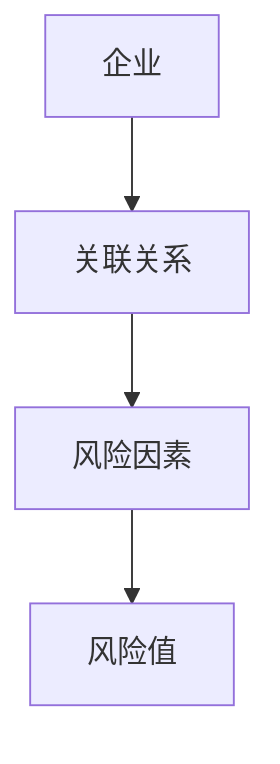
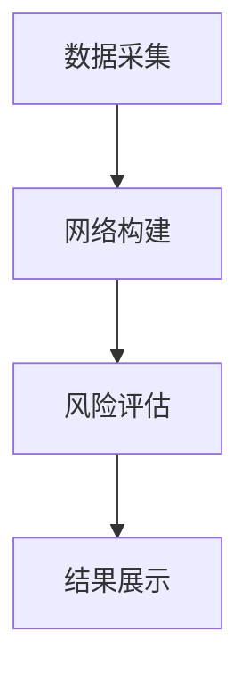

                 


# 利用智能体网络分析公司间的隐藏关联风险

> 关键词：智能体网络，隐藏关联，企业风险分析，网络表示学习，关联风险传播

> 摘要：本文探讨了如何利用智能体网络分析公司间的隐藏关联风险。通过介绍智能体网络的基本概念、算法原理、系统架构设计以及项目实战，详细分析了企业间隐藏关联风险的识别与评估方法。文章结合理论与实践，提供了丰富的案例分析和代码实现，为读者提供了全面的技术指导。

---

# 第一部分: 利用智能体网络分析公司间隐藏关联风险的背景与概念

## 第1章: 公司间隐藏关联风险的背景与问题描述

### 1.1 企业风险分析的现状与挑战

#### 1.1.1 传统企业风险分析方法的局限性

传统的企业风险分析方法通常依赖于财务数据和历史数据，难以捕捉企业间的隐性关联。例如，供应链上的企业可能通过非正式协议形成依赖关系，这种关联在财务报表中难以体现，但一旦某一企业出现问题，可能会引发连锁反应。

#### 1.1.2 全球化背景下企业间关联风险的复杂性

在全球化背景下，企业之间的关系变得更加复杂。例如，跨国公司可能通过多层供应商和合作伙伴形成复杂的网络关系。这种复杂性使得传统的线性分析方法难以捕捉所有潜在风险。

#### 1.1.3 数字化与网络化对企业风险分析的影响

随着企业数字化和网络化的发展，企业之间的关系变得更加动态和复杂。大数据和人工智能技术为企业风险分析提供了新的工具和方法，但同时也带来了新的挑战，例如数据隐私和模型复杂性。

### 1.2 智能体网络的概念与特点

#### 1.2.1 智能体网络的基本概念

智能体网络是一种基于图论的网络模型，其中节点代表企业和实体，边代表企业之间的关联关系。智能体网络通过分析节点之间的关系，可以识别企业间的隐性关联。

#### 1.2.2 智能体网络的核心属性与特征

智能体网络具有动态性、复杂性和关联性等核心属性。动态性指的是网络结构会随着时间变化而变化；复杂性指的是网络中可能存在多个层级的关联关系；关联性指的是节点之间的关系可能影响整体网络的风险。

#### 1.2.3 智能体网络与传统网络分析方法的区别

与传统网络分析方法相比，智能体网络更加注重节点之间的动态关系和隐性关联。传统方法通常关注网络的拓扑结构，而智能体网络则更关注网络中节点的交互和影响。

### 1.3 企业间隐藏关联风险的定义与分析框架

#### 1.3.1 隐藏关联风险的定义

隐藏关联风险是指企业间通过隐性协议或非正式关系形成的关联，这种关联可能在公开数据中难以体现，但可能在特定情况下引发连锁风险。

#### 1.3.2 隐藏关联风险的分析维度

隐藏关联风险的分析维度包括关联强度、关联类型和关联影响。关联强度指的是企业间关联的紧密程度；关联类型指的是关联的性质（如供应链、投资关系）；关联影响指的是关联对企业风险的影响程度。

#### 1.3.3 智能体网络在企业风险分析中的作用

智能体网络通过分析节点之间的关系，可以帮助识别企业间的隐性关联，评估关联的强度和影响，并预测潜在风险。

---

## 第2章: 智能体网络的核心概念与原理

### 2.1 智能体网络的基本原理

#### 2.1.1 智能体网络的构建过程

智能体网络的构建通常包括数据收集、数据预处理、网络建模和风险分析四个阶段。数据收集阶段需要获取企业之间的关联数据，数据预处理阶段需要清洗和标准化数据，网络建模阶段需要构建图模型，风险分析阶段需要评估关联风险。

#### 2.1.2 智能体网络的核心算法

智能体网络的核心算法包括图论算法、网络表示学习算法和关联风险传播算法。图论算法用于构建网络结构，网络表示学习算法用于提取节点特征，关联风险传播算法用于评估风险。

#### 2.1.3 智能体网络的动态特性

智能体网络具有动态特性，可以通过实时数据更新保持网络的准确性。动态特性使得智能体网络能够捕捉企业间关系的变化，及时发现潜在风险。

### 2.2 智能体网络的数学模型与公式

#### 2.2.1 智能体网络的图论基础

图论是智能体网络的基础，图论中的节点和边概念被用于表示企业及其关联关系。例如，节点代表企业，边代表企业间的关联关系。

#### 2.2.2 网络表示学习的数学模型

网络表示学习的目标是将网络结构转化为低维向量表示。常用的网络表示学习模型包括节点嵌入和边嵌入。节点嵌入可以表示为：

$$
\text{节点嵌入} = f(\text{网络结构})
$$

其中，\( f \) 是一个非线性函数，用于提取节点特征。

#### 2.2.3 关联风险传播的数学公式

关联风险传播模型用于评估企业间关联的风险传播。假设 \( r_i \) 表示企业 \( i \) 的风险值，\( w_{ij} \) 表示企业 \( i \) 和 \( j \) 之间的关联强度，则关联风险传播模型可以表示为：

$$
r_i = \sum_{j} w_{ij} r_j
$$

该公式表示企业 \( i \) 的风险值受到其关联企业 \( j \) 的影响。

### 2.3 智能体网络的ER实体关系图



上图展示了智能体网络的ER实体关系图。企业通过关联关系与风险因素相关联，风险因素影响企业的风险值。

### 2.4 本章小结

本章介绍了智能体网络的基本原理和核心概念，包括构建过程、核心算法和动态特性。同时，详细讲解了网络表示学习和关联风险传播的数学模型，并通过ER实体关系图展示了智能体网络的结构。

---

## 第3章: 智能体网络分析算法的实现与优化

### 3.1 基于图论的智能体网络分析算法

#### 3.1.1 图论基础

图论是智能体网络分析的基础，包括节点、边和图的属性。节点代表企业，边代表企业间的关联关系，图的属性包括度数、中心性和社区结构。

#### 3.1.2 基于邻接矩阵的算法实现

邻接矩阵是一种常用的图表示方法，可以用于计算节点的度数和中心性。例如，邻接矩阵 \( A \) 的元素 \( a_{ij} \) 表示企业 \( i \) 和 \( j \) 之间的关联强度。

#### 3.1.3 算法优化与改进

为了提高算法效率，可以采用以下优化措施：
1. 压缩邻接矩阵的存储空间。
2. 使用并行计算加速算法执行。
3. 优化算法的复杂度，例如从 \( O(n^2) \) 优化到 \( O(n) \)。

### 3.2 智能体网络分析的数学模型

#### 3.2.1 网络表示学习的数学模型

网络表示学习的目标是将网络结构转化为低维向量表示。常用的网络表示学习模型包括节点嵌入和边嵌入。节点嵌入可以表示为：

$$
\text{节点嵌入} = f(\text{网络结构})
$$

其中，\( f \) 是一个非线性函数，用于提取节点特征。

#### 3.2.2 关联风险传播的数学公式

关联风险传播模型用于评估企业间关联的风险传播。假设 \( r_i \) 表示企业 \( i \) 的风险值，\( w_{ij} \) 表示企业 \( i \) 和 \( j \) 之间的关联强度，则关联风险传播模型可以表示为：

$$
r_i = \sum_{j} w_{ij} r_j
$$

该公式表示企业 \( i \) 的风险值受到其关联企业 \( j \) 的影响。

#### 3.2.3 算法实现的伪代码

以下是一个关联风险传播算法的伪代码示例：

```python
def calculate_association_risk(network, node):
    risk = 0
    for neighbor in network[node]:
        risk += network[node][neighbor] * calculate_association_risk(network, neighbor)
    return risk
```

### 3.3 算法实现的Python源代码

以下是一个简单的关联风险传播算法实现：

```python
import networkx as nx

def calculate_association_risk(G, node):
    risk = 0
    for neighbor in G.neighbors(node):
        weight = G[node][neighbor]['weight']
        risk += weight * calculate_association_risk(G, neighbor)
    return risk

# 示例
G = nx.Graph()
G.add_nodes_from(['A', 'B', 'C'])
G.add_edges_from([('A', 'B'), ('B', 'C')])
G['A']['B']['weight'] = 0.5
G['B']['C']['weight'] = 0.3

print(calculate_association_risk(G, 'A'))
```

### 3.4 本章小结

本章详细讲解了智能体网络分析算法的实现与优化，包括基于图论的算法、网络表示学习模型和关联风险传播公式。通过Python源代码示例，展示了算法的具体实现过程。

---

## 第4章: 智能体网络分析的系统架构与设计

### 4.1 系统功能设计

#### 4.1.1 系统功能模块划分

智能体网络分析系统可以划分为数据采集、网络构建、风险评估和结果展示四个功能模块。数据采集模块负责获取企业数据，网络构建模块负责构建智能体网络，风险评估模块负责评估关联风险，结果展示模块负责输出分析结果。

#### 4.1.2 系统功能流程图



#### 4.1.3 系统功能实现的详细步骤

1. 数据采集：通过爬虫或API接口获取企业数据。
2. 网络构建：使用图论算法构建智能体网络。
3. 风险评估：通过关联风险传播模型评估企业间关联风险。
4. 结果展示：将分析结果可视化展示。

### 4.2 系统架构设计

#### 4.2.1 系统架构的分层设计

智能体网络分析系统可以分为数据层、算法层和应用层。数据层负责数据的存储和管理，算法层负责网络构建和风险评估，应用层负责结果的展示和交互。

#### 4.2.2 系统架构的模块化设计

系统架构的模块化设计包括数据采集模块、网络构建模块、风险评估模块和结果展示模块。每个模块负责特定的功能，模块之间通过接口进行交互。

#### 4.2.3 系统架构的可扩展性设计

为了提高系统的可扩展性，可以采用微服务架构。每个功能模块作为一个独立的服务，通过API进行交互。这种架构设计使得系统可以灵活扩展。

### 4.3 系统接口设计

#### 4.3.1 系统接口的定义

系统接口定义了模块之间的交互方式。例如，数据采集模块提供一个API接口，供网络构建模块调用。

#### 4.3.2 系统接口的交互流程

1. 数据采集模块通过API接口向网络构建模块提供数据。
2. 网络构建模块通过API接口向风险评估模块提供网络结构。
3. 风险评估模块通过API接口向结果展示模块提供风险评估结果。

#### 4.3.3 系统接口的安全性设计

为了保证系统的安全性，需要对API接口进行身份验证和权限控制。例如，使用JWT（JSON Web Token）进行身份验证。

### 4.4 本章小结

本章介绍了智能体网络分析系统的架构设计，包括功能设计、架构设计和接口设计。通过模块化设计和可扩展性设计，提高了系统的灵活性和可维护性。

---

## 第5章: 项目实战

### 5.1 环境配置

#### 5.1.1 系统环境

建议使用Python 3.8及以上版本，安装必要的库，例如NetworkX、Matplotlib等。

#### 5.1.2 数据集准备

需要准备企业数据，包括企业名称、关联关系和风险因素。数据可以从公开数据库获取，例如公司年报和新闻报道。

### 5.2 系统核心实现源代码

以下是一个简单的智能体网络分析系统的Python实现：

```python
import networkx as nx
import matplotlib.pyplot as plt

# 数据采集
G = nx.Graph()
G.add_nodes_from(['A', 'B', 'C', 'D'])
G.add_edges_from([('A', 'B'), ('B', 'C'), ('C', 'D'), ('D', 'A')])
G['A']['B']['weight'] = 0.5
G['B']['C']['weight'] = 0.3
G['C']['D']['weight'] = 0.2
G['D']['A']['weight'] = 0.4

# 风险评估
def calculate_association_risk(G, node):
    risk = 0
    for neighbor in G.neighbors(node):
        weight = G[node][neighbor]['weight']
        risk += weight * calculate_association_risk(G, neighbor)
    return risk

# 结果展示
print(calculate_association_risk(G, 'A'))
nx.draw(G, with_labels=True)
plt.show()
```

### 5.3 代码应用解读与分析

上述代码展示了如何使用NetworkX库构建智能体网络，并评估企业间关联风险。代码首先构建了一个包含四个节点的智能体网络，然后定义了一个递归函数来计算关联风险，并通过NetworkX库将网络可视化。

### 5.4 实际案例分析和详细讲解剖析

假设我们分析一家公司与其供应商的关系。通过智能体网络分析，可以识别出公司与供应商之间的隐性关联，并评估这些关联的风险。例如，如果公司依赖于一个单一的供应商，而该供应商存在较高的风险，则公司的风险也会增加。

### 5.5 项目小结

本章通过实际案例展示了智能体网络分析系统的实现过程，包括环境配置、代码实现和结果展示。通过案例分析，读者可以理解如何将理论应用于实际项目中。

---

## 第6章: 最佳实践 tips、小结、注意事项、拓展阅读

### 6.1 小结

本文详细介绍了如何利用智能体网络分析公司间的隐藏关联风险。通过理论讲解和实际案例分析，展示了智能体网络在企业风险分析中的应用。

### 6.2 注意事项

在实际应用中，需要注意以下几点：
1. 数据质量：数据的准确性和完整性直接影响分析结果。
2. 模型选择：根据具体问题选择合适的网络分析算法。
3. 隐私保护：在处理企业数据时，需要注意数据隐私问题。

### 6.3 拓展阅读

推荐阅读以下书籍和论文：
1. 《Network Science》（《网络科学》）：介绍了网络科学的基本概念和方法。
2. 《Deep Learning for Graph Representation》：讲解了网络表示学习的深度学习方法。

### 6.4 本章小结

本章总结了全文的主要内容，并提供了最佳实践的建议。通过注意事项和拓展阅读，帮助读者更好地理解和应用智能体网络分析技术。

---

# 结语

通过本文的介绍，读者可以全面了解如何利用智能体网络分析公司间的隐藏关联风险。从理论到实践，本文提供了详细的技术指导和实际案例分析，帮助读者在实际工作中有效应用这些方法。未来，随着人工智能和大数据技术的发展，智能体网络分析将在企业风险分析中发挥更大的作用。

