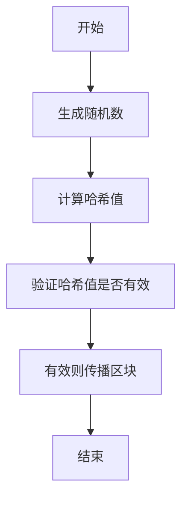
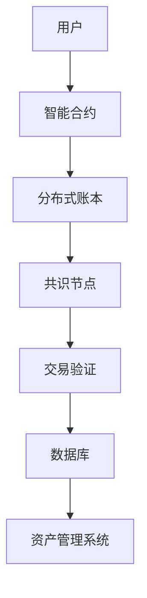
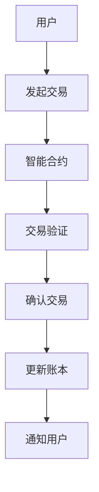

                 


# 区块链在投资理财中的应用与挑战

> 关键词：区块链，投资理财，智能合约，分布式账本，共识机制

> 摘要：区块链技术作为一种分布式账本技术，正在逐步改变投资理财的模式。本文将从区块链的基本概念出发，探讨其在投资理财中的应用场景、技术原理、面临的挑战以及未来的发展趋势。通过分析区块链在智能投顾、风险管理、资产管理等领域的具体应用，本文旨在为投资理财的数字化转型提供新的思路和解决方案。

---

## 第1章 区块链与投资理财的背景介绍

### 1.1 区块链的基本概念

区块链是一种分布式账本技术，通过去中心化的方式记录数据，确保数据的安全性和不可篡改性。区块链的核心要素包括：

1. **分布式账本**：数据分散存储在网络中的多个节点上，每个节点都有完整的账本副本。
2. **共识机制**：通过特定算法（如PoW、PoS等）确保所有节点达成一致，确认交易的有效性。
3. **智能合约**：基于区块链的自动化执行程序，能够在满足特定条件时自动执行操作。

区块链的特点包括去中心化、透明性、不可篡改性和高安全性。这些特点使其在金融领域具有广泛的应用潜力。

### 1.2 投资理财的数字化转型

传统的投资理财模式存在以下痛点：

1. **信息不对称**：投资者难以获取透明的市场信息和资产状况。
2. **交易成本高**：中间环节多，增加了交易成本和时间。
3. **风险管理难**：传统方法难以实时监控和管理风险。

区块链技术的出现，为投资理财的数字化转型提供了新的解决方案。通过区块链技术，可以实现资产的透明化管理、智能投顾服务以及风险管理的自动化。

### 1.3 区块链在投资理财中的应用场景

区块链在投资理财中的应用主要集中在以下几个方面：

1. **智能投顾**：通过智能合约自动化执行投资策略，实现个性化资产配置。
2. **资产管理**：利用区块链的透明性和不可篡改性，确保资产的安全和高效管理。
3. **风险管理**：实时监控市场波动和资产状态，及时发现和应对风险。

---

## 第2章 区块链的核心机制与投资理财的结合

### 2.1 区块链的核心机制

区块链的核心机制包括：

1. **分布式账本**：确保数据的安全性和一致性。
2. **共识机制**：通过PoW、PoS等算法确保网络的去中心化和安全性。
3. **智能合约**：自动化执行投资协议，减少人为干预。

### 2.2 区块链在投资理财中的具体应用

区块链在投资理财中的具体应用包括：

1. **智能投顾**：通过智能合约实现自动化的投资策略执行，投资者可以实时跟踪投资组合的动态。
2. **数字资产管理**：利用区块链技术实现数字资产的透明管理和高效交易。
3. **风险管理**：通过区块链的实时数据监控，快速识别和应对市场风险。

---

## 第3章 区块链在投资理财中的技术挑战

### 3.1 区块链技术的局限性

区块链技术在投资理财中的应用面临以下挑战：

1. **扩展性问题**：部分区块链系统在处理大规模交易时存在性能瓶颈。
2. **交易速度与成本**：区块链的交易速度和成本在某些场景下可能不如传统金融系统。
3. **数据隐私与合规性**：区块链的透明性可能导致隐私问题，同时需要符合相关法律法规。

### 3.2 投资理财中的监管与合规挑战

区块链在投资理财中的监管与合规挑战包括：

1. **匿名性与反洗钱（AML）法规**：区块链的匿名性增加了反洗钱的难度。
2. **跨境投资的监管协调**：区块链的去中心化特性可能与不同国家的监管要求冲突。
3. **数据隐私与 GDPR 等法律法规**：区块链的数据存储和传输需要符合隐私保护法规。

### 3.3 区块链在投资理财中的安全风险

区块链在投资理财中的安全风险包括：

1. **智能合约漏洞**：智能合约的漏洞可能导致资金损失。
2. **51% 攻击与双重支付**：部分区块链系统可能面临51%攻击，导致双重支付问题。
3. **网络攻击与数据泄露**：区块链系统可能成为网络攻击的目标，导致数据泄露。

---

## 第4章 区块链共识机制的算法原理与投资理财中的应用

### 4.1 共识机制的分类与对比

共识机制是区块链的核心机制之一，常见的共识机制包括：

1. **工作量证明（PoW）**：通过计算哈希值来验证交易的有效性。
2. **权益证明（PoS）**：通过持有代币的数量来决定验证权力。
3. ** delegated 权益证明（DPoS）**：通过选举节点来验证交易。

### 4.2 区块链共识机制的投资理财应用

区块链共识机制在投资理财中的应用包括：

1. **智能合约的验证与执行**：共识机制确保智能合约的正确执行。
2. **资产发行与转让**：通过共识机制实现数字资产的发行和转让。
3. **风险管理与监控**：共识机制确保风险管理数据的透明性和一致性。

---

## 第5章 区块链共识机制的数学模型与算法分析

### 5.1 共识机制的数学模型

以工作量证明（PoW）为例，其数学模型如下：

$$ H = \text{Hash}(nonce || \text{data}) $$

其中，$H$ 是哈希值，$nonce$ 是随机数，$\text{data}$ 是交易数据。验证节点通过计算$H$来确认交易的有效性。

### 5.2 共识算法的流程分析

以下是工作量证明（PoW）的流程图：



### 5.3 共识机制的性能优化

为了提高共识机制的效率，可以采用以下优化措施：

1. **轻量级共识算法**：减少计算复杂度，提高交易速度。
2. **分片技术**：将区块链网络划分为多个子链，提高并行处理能力。
3. **侧链技术**：通过侧链实现不同的共识机制，满足不同的应用场景需求。

---

## 第6章 区块链在投资理财中的系统架构设计

### 6.1 投资理财系统的功能设计

投资理财系统的功能模块包括：

1. **用户管理**：实现用户身份认证和权限管理。
2. **资产管理**：实现数字资产的存储和管理。
3. **智能投顾**：实现基于智能合约的自动化投资策略。
4. **风险管理**：实现实时风险监控和预警。

### 6.2 系统架构设计

以下是投资理财系统的架构图：



### 6.3 系统接口设计

系统接口设计包括：

1. **智能合约接口**：实现与智能合约的交互。
2. **交易验证接口**：实现交易的验证和确认。
3. **风险管理接口**：实现风险数据的采集和分析。

### 6.4 系统交互流程

以下是系统交互流程图：



---

## 第7章 区块链投资理财系统的项目实战

### 7.1 环境搭建

项目实战需要以下环境：

1. **区块链平台**：选择以太坊或其他支持智能合约的区块链平台。
2. **开发工具**：安装Solidity、Ganache等开发工具。
3. **编程语言**：掌握Solidity、JavaScript等编程语言。

### 7.2 核心代码实现

以下是智能合约的代码示例：

```solidity
// 智能合约实现简单投资策略
contract InvestmentStrategy {
    function invest(address beneficiary, uint amount) {
        // 执行投资操作
    }
    
    function withdraw(uint amount) {
        // 执行撤资操作
    }
}
```

### 7.3 代码应用解读

智能合约代码解读：

1. `invest`函数：实现资金的投资操作。
2. `withdraw`函数：实现资金的撤回操作。
3. 智能合约通过区块链平台实现自动化的投资管理。

### 7.4 实际案例分析

以下是一个实际案例分析：

1. **案例背景**：投资者通过智能合约进行自动化的投资。
2. **智能合约实现**：投资者将资金存入智能合约，智能合约根据设定的投资策略自动执行交易。
3. **风险管理**：智能合约实时监控市场波动，及时调整投资策略。

### 7.5 项目小结

项目实战展示了区块链在投资理财中的实际应用，通过智能合约实现了自动化的投资管理，提高了投资效率和风险管理能力。

---

## 第8章 总结与展望

### 8.1 总结

区块链技术为投资理财的数字化转型提供了新的解决方案。通过智能合约、分布式账本和共识机制等技术，区块链在智能投顾、资产管理、风险管理等领域展现出广阔的应用前景。

### 8.2 未来展望

1. **技术优化**：进一步优化共识机制，提高交易速度和降低成本。
2. **监管合规**：加强区块链技术与金融监管的结合，确保合规性。
3. **创新应用**：探索区块链在更多投资理财场景中的应用，推动行业的创新发展。

---

## 附录

### 附录A：区块链相关术语解释

1. **区块链**：分布式账本技术，通过去中心化的方式记录数据。
2. **智能合约**：基于区块链的自动化程序，实现自动化的投资策略。

### 附录B：参考文献

1. 《区块链技术与应用》
2. 《智能合约开发指南》

---

通过以上章节的详细分析，我们可以看到区块链在投资理财中的巨大潜力，同时也需要克服技术、监管和安全等多方面的挑战。未来，随着技术的不断发展，区块链将在投资理财领域发挥更加重要的作用。

