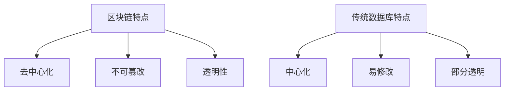
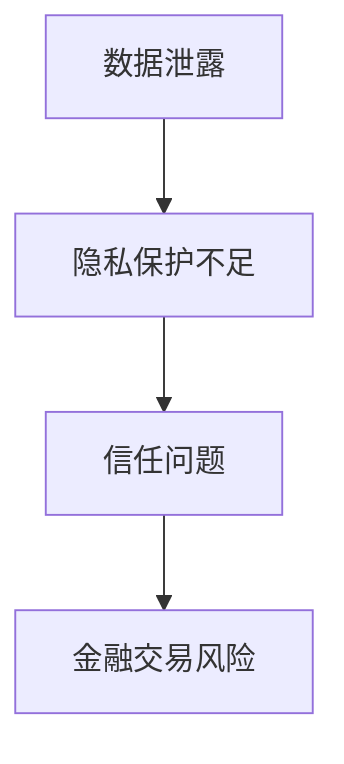
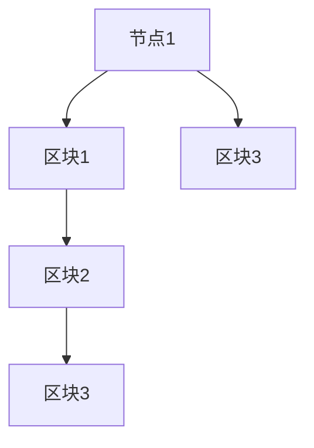
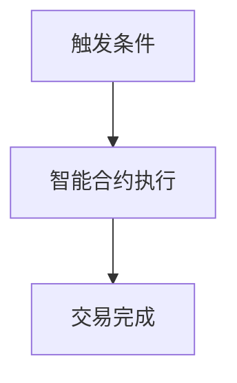
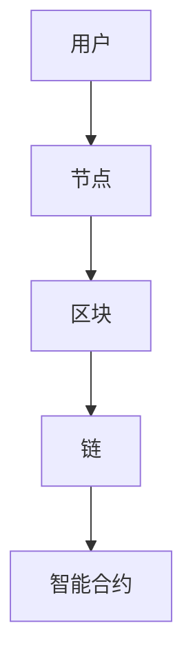
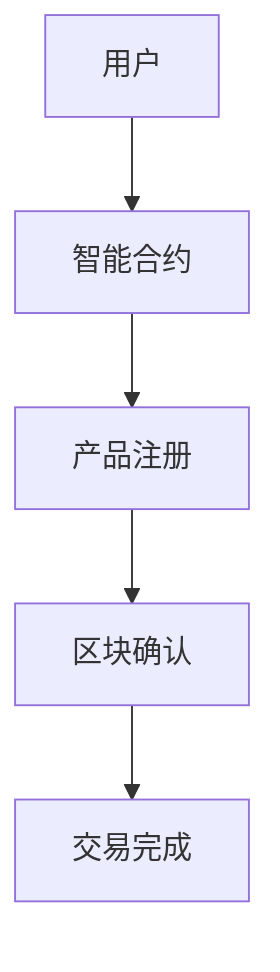

                 


# 区块链在金融数据安全中的创新应用

> 关键词：区块链，金融数据安全，分布式账本，共识机制，智能合约，哈希函数，数字签名

> 摘要：本文探讨了区块链技术在金融数据安全中的创新应用，从区块链的基本概念到其在金融领域的具体应用，详细分析了其如何通过分布式账本、共识机制、智能合约等技术手段解决传统金融数据安全的痛点。文章结合实际案例，深入讲解了区块链在金融支付、供应链金融和证券与资产管理等领域的应用，探讨了其在系统架构、算法原理、项目实战等方面的实现细节，并总结了区块链在金融数据安全中的优势与挑战，展望了未来的发展趋势。

---

## 第1章 区块链与金融数据安全的背景介绍

### 1.1 区块链技术的起源与发展

区块链技术起源于2008年的比特币白皮书，最初的设计目的是解决比特币的去中心化支付问题。随着技术的发展，区块链的概念逐渐扩展到更广泛的金融领域。其核心特点包括去中心化、不可篡改和透明性，这些特性使其成为金融数据安全的理想解决方案。

| 区块链特点 | 传统数据库特点 |
|------------|----------------|
| 去中心化   | 中心化         |
| 不可篡改   | 易修改         |
| 透明性     | 部分透明       |

图1-1展示了区块链与传统数据库的特点对比：



### 1.2 金融数据安全的挑战与问题

金融数据安全面临的主要挑战包括数据泄露、隐私保护与交易信任问题。传统的中心化数据库容易成为黑客攻击的目标，而区块链的去中心化特性能够有效降低数据泄露的风险。

图1-2展示了金融数据安全的主要挑战：



### 1.3 区块链技术如何解决金融数据安全问题

区块链通过去中心化、不可篡改和信任机制解决了金融数据安全的核心问题。以下是其具体实现：

1. **去中心化特性**：通过分布式账本技术，避免了单点故障，降低了数据被篡改的风险。
2. **不可篡改性**：每个区块通过哈希指针连接，确保数据一旦记录就无法被修改。
3. **信任机制**：通过共识机制（如PoW和PoS）和智能合约，确保交易的透明性和可追溯性。

### 1.4 区块链在金融领域的应用现状

区块链在金融领域的应用主要集中在以下几个方面：

1. **金融支付与结算**：通过区块链技术实现快速、透明的跨境支付。
2. **供应链金融**：利用区块链追踪供应链中的资金流动，提高透明度和信任度。
3. **证券与资产管理**：通过智能合约实现自动化的证券交易和资产托管。

---

## 第2章 区块链的核心技术原理

### 2.1 分布式账本技术

分布式账本是区块链的核心数据结构，每个节点都有一份完整的账本副本，确保数据的一致性和可靠性。

图2-1展示了分布式账本的结构：



### 2.2 共识机制

共识机制是区块链中确保所有节点达成一致的关键技术。以下是两种主要共识机制的对比：

| 共识机制 | 工作原理             | 优缺点                     |
|----------|----------------------|---------------------------|
| PoW     | 基于计算能力挖矿     | 安全性高，但能耗大         |
| PoS     | 基于持币者权益       | 能耗低，但安全性稍逊于PoW |

### 2.3 智能合约

智能合约是区块链中的自动执行程序，用于在满足特定条件时自动触发交易。其工作流程如下：



### 2.4 哈希函数与数字签名

哈希函数用于将数据转换为固定长度的哈希值，而数字签名用于验证数据的完整性和真实性。

图2-2展示了哈希函数的数学模型：

$$
H(x) = \text{hash}(x)
$$

数字签名的过程如下：

$$
\text{签名} = \text{sign}(x)
$$

---

## 第3章 区块链在金融数据安全中的技术实现

### 3.1 区块链的哈希函数实现

以下是使用Python实现的哈希函数示例：

```python
import hashlib

def compute_hash(data):
    return hashlib.sha256(data.encode()).hexdigest()
```

### 3.2 共识机制的实现

以下是工作量证明（PoW）的简单实现：

```python
def proof_of_work(block):
    while True:
        if block.hash.startswith('0000'):
            return block
        block.nonce += 1
```

### 3.3 智能合约的实现

以下是基于Solidity的智能合约示例：

```solidity
contract SimpleToken {
    mapping(address => uint) balances;

    function transfer(address recipient, uint amount) public {
        balances[msg.sender] -= amount;
        balances[recipient] += amount;
    }
}
```

### 3.4 区块链系统架构设计

图3-1展示了区块链系统的架构：



---

## 第4章 项目实战：基于区块链的供应链金融系统

### 4.1 环境搭建

以下是搭建区块链环境的步骤：

1. 安装以太坊节点：
   ```bash
   npm install -g ethereumjs-testrpc
   ```

2. 启动测试网络：
   ```bash
   testrpc
   ```

### 4.2 核心代码实现

以下是供应链金融系统的智能合约实现：

```solidity
contract SupplyChain {
    struct Product {
        string name;
        uint price;
        address owner;
    }

    mapping(uint => Product) products;

    function registerProduct(uint id, string name, uint price) public {
        products[id] = Product(name, price, msg.sender);
    }
}
```

### 4.3 功能解读与案例分析

通过智能合约实现产品注册、所有权转移和价格追踪，确保供应链中的数据透明且不可篡改。

### 4.4 系统交互序列图

图4-1展示了系统交互的流程：



---

## 第5章 最佳实践与总结

### 5.1 本章小结

区块链技术通过分布式账本、共识机制和智能合约解决了金融数据安全的核心问题，提高了交易的透明度和信任度。

### 5.2 注意事项

在实际应用中，需注意性能优化和合规性问题，选择适合的共识机制和处理大规模数据的方法。

### 5.3 未来趋势

随着技术的发展，区块链将在金融领域发挥更重要的作用，特别是在跨境支付、智能合约和数据共享方面。

### 5.4 拓展阅读

推荐阅读《区块链技术与应用》和《加密货币与区块链：金融的未来》。

---

通过以上内容，我们详细探讨了区块链在金融数据安全中的创新应用，从技术原理到实际案例，全面分析了其在金融领域的潜力与挑战。希望本文能为读者提供有价值的见解，进一步推动区块链技术在金融安全中的应用与发展。

