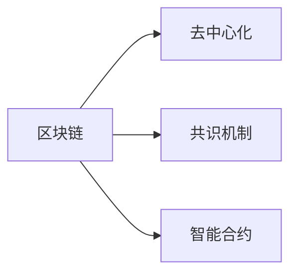
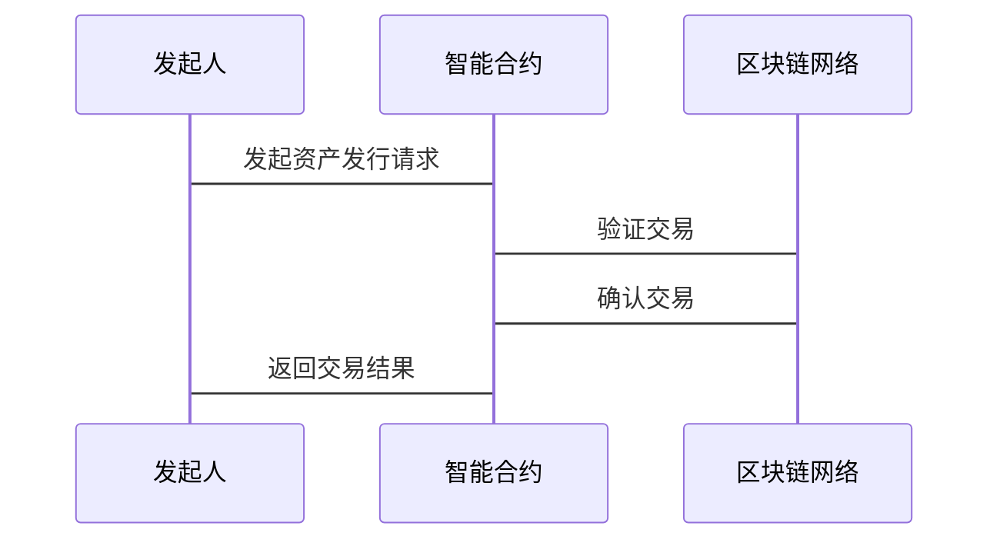

                 

# 区块链技术在资产证券化中的应用

> 关键词：区块链技术、资产证券化、智能合约、分布式账本、去中心化

> 摘要：本文探讨了区块链技术在资产证券化中的应用，分析了传统资产证券化模式的痛点，详细阐述了区块链技术的核心原理，以及如何通过区块链技术优化资产证券化流程。本文还结合了智能合约的应用场景，提出了基于区块链的资产证券化系统架构设计方案，并通过实际案例分析展示了区块链技术在资产证券化中的巨大潜力。

---

## 第1章 区块链技术与资产证券化的背景

### 1.1 区块链技术的定义与核心概念

区块链是一种去中心化的分布式账本技术，通过密码学和共识机制确保数据的安全性和不可篡改性。其核心概念包括：

1. **去中心化**：数据不依赖于单个中心节点，而是分布在多个节点上，形成分布式网络。
2. **共识机制**：通过算法确保所有节点对账本状态达成一致，常见的共识机制包括工作量证明（PoW）和权益证明（PoS）。
3. **智能合约**：基于区块链的自动化脚本，能够在满足特定条件时自动执行操作。

### 1.2 资产证券化的定义与流程

资产证券化是将缺乏流动性但具有未来现金流的资产转化为可以在市场上交易的证券的过程。其基本流程包括：

1. **资产选择与分类**：选择适合证券化的资产，并进行分类。
2. **资产打包与发行**：将资产打包成金融产品并发行。
3. **资产交易与结算**：在二级市场上进行交易和结算。

### 1.3 区块链技术在资产证券化中的应用背景

传统资产证券化模式存在以下痛点：

1. **透明度低**：投资者难以获取底层资产的真实信息。
2. **效率低**：交易和结算过程繁琐，耗时长。
3. **成本高**：中介参与增加了交易成本。

区块链技术通过去中心化和智能合约等特性，能够解决这些痛点，提升资产证券化的透明度、效率和降低成本。

---

## 第2章 区块链技术的核心原理

### 2.1 区块链的基本工作原理

区块链通过分布式账本记录数据，每个区块包含交易信息、时间戳和哈希值。区块之间通过哈希链连接，确保数据不可篡改。

### 2.2 区块链的共识机制

共识机制是区块链的核心，确保所有节点达成一致。工作量证明（PoW）和权益证明（PoS）是最常见的两种共识机制。

### 2.3 区块链的智能合约

智能合约是区块链上的自动化脚本，能够在特定条件下自动执行操作。其优势在于透明、不可篡改和自动执行。

---

## 第3章 资产证券化的流程与挑战

### 3.1 资产证券化的基本流程

资产证券化的基本流程包括资产选择、打包发行和交易结算三个阶段。

### 3.2 资产证券化中的主要挑战

1. **资产透明度低**：投资者难以获取底层资产的真实信息。
2. **资产流动性差**：传统资产证券化产品的流动性较低。
3. **信用风险**：底层资产的质量直接影响证券的价值。

### 3.3 区块链技术如何优化资产证券化流程

1. **提高资产透明度**：通过区块链记录底层资产信息，确保数据的透明和不可篡改。
2. **提升资产流动性**：区块链技术能够降低交易门槛，提高资产的流动性。
3. **降低信用风险**：通过智能合约和区块链的透明性，降低信用风险。

---

## 第4章 区块链技术在资产证券化中的应用场景

### 4.1 资产发行与管理

区块链技术能够实现资产的快速发行和管理，通过智能合约自动化处理发行流程。

### 4.2 资产交易与结算

区块链技术能够实现资产的快速交易和结算，降低交易成本和时间。

### 4.3 资产监控与风险管理

通过区块链技术，能够实时监控资产的状态，降低风险管理成本。

---

## 第5章 区块链技术与智能合约在资产证券化中的结合

### 5.1 智能合约的定义与特点

智能合约是区块链上的自动化脚本，能够根据预设条件自动执行操作。

### 5.2 区块链与智能合约的结合

区块链为智能合约提供信任机制，智能合约在区块链上执行，实现资产的自动化管理。

### 5.3 智能合约在资产证券化中的应用

通过智能合约实现资产发行、交易和结算的自动化，提高效率和降低成本。

---

## 总结

区块链技术在资产证券化中的应用具有巨大的潜力，能够解决传统模式的痛点，提升效率和降低成本。通过智能合约和区块链技术的结合，能够实现资产的透明化、自动化管理和高效交易。未来，随着技术的进一步发展，区块链将在资产证券化中发挥更大的作用。

---

以上是《区块链技术在资产证券化中的应用》的技术博客文章的目录和部分内容。希望这篇文章能够帮助读者更好地理解区块链技术在资产证券化中的应用和价值。

