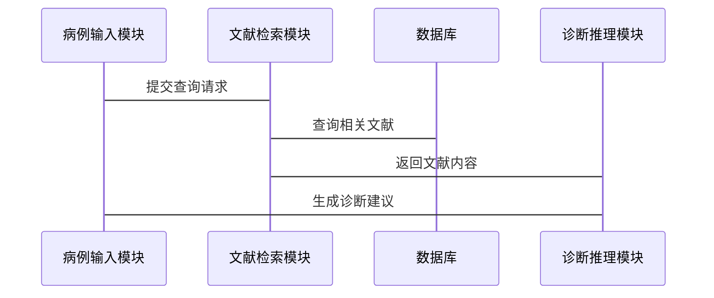
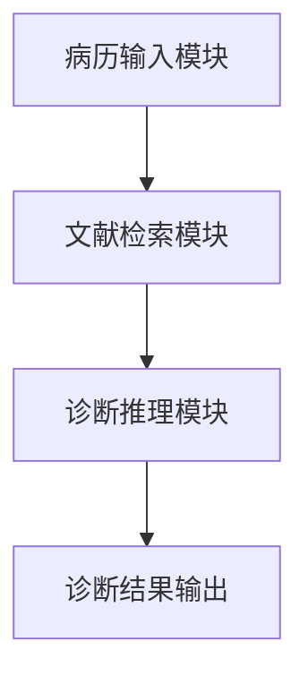
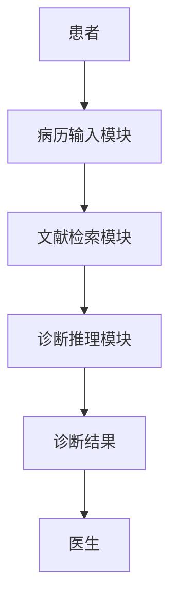

                 


# 医疗诊断 AI Agent：LLM 在临床决策支持中的角色

## 关键词：医疗诊断，LLM，人工智能，临床决策支持，深度学习，Transformer模型

## 摘要：随着人工智能技术的快速发展，大型语言模型（LLM）在医疗诊断中的应用逐渐成为研究热点。本文详细探讨了LLM在临床决策支持系统中的角色，从技术原理、系统架构到实际应用，全面分析了其在医疗诊断中的潜力与挑战，为医疗AI的发展提供了新的思路。

---

# 第一部分: 医疗诊断 AI Agent 的背景与核心概念

## 第1章: 医疗诊断 AI Agent 的背景与问题背景

### 1.1 医疗 AI 的发展现状

#### 1.1.1 医疗 AI 的发展历史
医疗人工智能（AI）的发展可以追溯到20世纪50年代。早期的医疗AI主要用于简单的数据分析和规则匹配，例如基于规则的专家系统。随着计算能力的提升和数据量的增加，AI在医疗影像识别、疾病预测和药物研发等领域逐渐展现出更大的潜力。

#### 1.1.2 当前医疗 AI 的主要应用领域
目前，医疗AI已在多个领域取得显著进展：
- **医疗影像分析**：如X光、MRI等影像的辅助诊断。
- **疾病预测与风险评估**：基于电子健康记录（EHR）预测疾病风险。
- **药物研发**：利用AI加速药物发现和优化。
- **虚拟健康助手**：提供个性化的健康建议和疾病管理。

#### 1.1.3 大型语言模型（LLM）在医疗领域的独特优势
LLM（如GPT系列模型）凭借其强大的自然语言处理能力，能够理解并生成复杂的医疗文本，如病历、医学文献和诊断报告。与传统AI相比，LLM的优势在于其通用性和灵活性，能够处理多种医疗相关的自然语言任务。

---

### 1.2 问题背景与问题描述

#### 1.2.1 传统医疗诊断的局限性
传统医疗诊断主要依赖医生的经验和病历数据，存在以下问题：
- **信息不全**：病历数据可能不完整或存在偏差。
- **经验限制**：医生的经验有限，难以覆盖所有领域的知识。
- **效率低下**：面对大量患者时，医生的工作效率可能受限。

#### 1.2.2 医疗数据的特点与挑战
医疗数据具有以下特点：
- **隐私性**：数据涉及患者隐私，处理时需严格遵守相关法规。
- **复杂性**：医疗数据包括结构化（如EHR）和非结构化（如医生笔记）数据，处理难度较大。
- **动态性**：患者的健康状况会随时间变化，数据需实时更新。

#### 1.2.3 LLM 在医疗诊断中的潜在解决方案
LLM可以通过自然语言处理技术，帮助医生快速分析病历、检索医学文献，并提供诊断建议。此外，LLM还可以辅助生成标准化的诊断报告，提高诊断效率和准确性。

---

### 1.3 问题解决与边界定义

#### 1.3.1 LLM 在医疗诊断中的核心问题
LLM在医疗诊断中的应用主要解决以下问题：
- **信息整合**：将结构化和非结构化的医疗数据整合，提供全面的诊断支持。
- **知识检索**：快速检索相关医学文献，辅助医生制定诊断方案。
- **诊断推理**：基于病历数据和文献知识，生成诊断建议。

#### 1.3.2 边界与外延
- **边界**：LLM主要用于辅助诊断，不能替代医生的临床判断。
- **外延**：LLM还可以应用于医疗教育、药物副作用监测等领域。

#### 1.3.3 核心概念与关键要素
核心概念包括：
- **LLM**：大型语言模型。
- **医疗数据**：结构化和非结构化的医疗信息。
- **诊断推理**：基于数据和知识的诊断过程。

---

## 第2章: 核心概念与技术原理

### 2.1 LLM 的核心概念

#### 2.1.1 大型语言模型的定义与特点
LLM是一种基于深度学习的自然语言处理模型，具有以下特点：
- **大规模训练**：通常使用海量文本数据进行训练。
- **上下文理解**：能够理解文本的上下文关系。
- **生成能力**：能够生成自然流畅的文本。

#### 2.1.2 LLM 与传统 AI 的区别
| 特性         | LLM                   | 传统 AI                 |
|--------------|-----------------------|--------------------------|
| 数据需求     | 需要大量数据          | 数据需求较低            |
| 任务通用性    | 能处理多种任务        | 通常针对特定任务设计    |
| 模型复杂度    | 模型复杂，参数众多     | 模型相对简单            |

#### 2.1.3 医疗诊断中的 LLM 特性
- **可解释性**：诊断建议需要具备较高的可解释性。
- **准确性**：诊断结果必须准确，避免误诊或漏诊。

---

### 2.2 核心概念的联系与对比

#### 2.2.1 核心概念属性特征对比表
| 概念         | 输入          | 输出          | 应用场景               |
|--------------|---------------|---------------|------------------------|
| LLM          | 文本数据       | 文本生成       | 医疗诊断、文献检索     |
| Transformer   | 序列数据       | 序列生成       | 语言模型训练           |

#### 2.2.2 ER 实体关系图
```mermaid
er
    entity 病例 {
        key 病例ID
        症状
        病史
        检查结果
    }
    entity 医学文献 {
        文献ID
        文献内容
        出版日期
    }
    病例 --> 关联关系：检索文献内容
```

---

### 2.3 LLM 的算法原理与数学模型

#### 2.3.1 Transformer 模型的工作原理
Transformer模型由编码器和解码器组成，主要步骤包括：
1. **编码器**：将输入序列转换为上下文向量。
2. **解码器**：基于编码器的输出生成目标序列。

#### 2.3.2 注意力机制的数学表达
注意力机制的计算公式如下：
$$
\text{Attention}(Q, K, V) = \text{softmax}\left(\frac{QK^T}{\sqrt{d_k}}\right)V
$$
其中，$Q$ 是查询向量，$K$ 是键向量，$V$ 是值向量，$d_k$ 是向量的维度。

#### 2.3.3 梯度下降与优化算法
常用的优化算法是Adam：
$$
\theta_{t+1} = \theta_t - \eta \frac{\nabla f}{1 - \beta_1^{t} + \frac{\beta_2^{t}}{1 - \beta_2^{t}}}
$$
其中，$\eta$ 是学习率，$\beta_1$ 和 $\beta_2$ 是动量参数。

---

## 第3章: 系统分析与架构设计

### 3.1 系统功能设计

#### 3.1.1 领域模型设计
医疗诊断AI Agent的领域模型包括以下模块：
- **病历输入模块**：接收患者的病历数据。
- **文献检索模块**：检索相关医学文献。
- **诊断推理模块**：基于病历和文献生成诊断建议。

#### 3.1.2 系统架构设计
系统的整体架构如下：


#### 3.1.3 接口设计与交互流程
交互流程图如下：


---

### 3.2 系统架构图

#### 3.2.1 系统架构 Mermaid 图


#### 3.2.2 数据流与交互流程图


---

## 第4章: 项目实战与实现

### 4.1 环境搭建与数据准备

#### 4.1.1 开发环境安装
需要安装以下工具：
- Python 3.8+
- PyTorch 1.9+
- Transformers库

#### 4.1.2 医疗数据集的获取与预处理
数据集包括：
- 病例文本数据
- 医学文献数据

预处理步骤：
1. 文本清洗：去除无关信息。
2. 分词处理：将文本分割成词语或短语。

---

### 4.2 系统核心实现

#### 4.2.1 模型训练代码示例
```python
from transformers import AutoTokenizer, AutoModelForCausalLM
import torch

tokenizer = AutoTokenizer.from_pretrained('gpt2')
model = AutoModelForCausalLM.from_pretrained('gpt2')

inputs = tokenizer("诊断结果：", return_tensors="pt")
outputs = model.generate(inputs.input_ids, max_length=50)
print(tokenizer.decode(outputs[0]))
```

#### 4.2.2 接口开发与实现
```python
def diagnose(disease, symptoms):
    # 检索相关文献
    # 进行诊断推理
    return diagnosis
```

---

### 4.3 实际案例分析

#### 4.3.1 典型案例解读
例如，对于一名咳嗽患者，系统可以分析病历并检索相关文献，生成诊断建议。

#### 4.3.2 代码应用与效果分析
通过上述代码，系统能够生成自然流畅的诊断建议，辅助医生进行诊断。

---

## 第5章: 最佳实践与未来展望

### 5.1 最佳实践与注意事项

#### 5.1.1 模型训练中的常见问题
- 数据不足：增加数据量或使用数据增强技术。
- 过度拟合：使用正则化或交叉验证。

#### 5.1.2 代码实现中的注意事项
- 确保代码的可读性和可维护性。
- 注重模型的可解释性。

---

### 5.2 总结与展望

#### 5.2.1 总结
本文详细探讨了LLM在医疗诊断中的应用，从技术原理到系统架构，再到实际应用，为医疗AI的发展提供了新的思路。

#### 5.2.2 未来展望
随着技术的进步，LLM在医疗诊断中的应用将更加广泛，诊断的准确性和效率将不断提升。

---

通过以上章节的详细分析，我们全面探讨了LLM在医疗诊断中的角色与应用，为医疗AI的发展提供了新的方向和思路。

