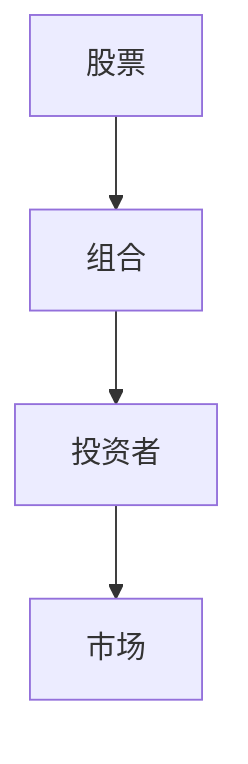

                 


# 《25只股票组合：彼得林奇的投资建议》

> 关键词：股票组合，彼得林奇，投资策略，价值投资，成长投资，风险管理

> 摘要：本文详细介绍了基于彼得林奇投资理念的25只股票组合构建方法，从背景、概念、算法到实战，全面解析了股票组合的投资策略和风险管理。通过实际案例分析和Python代码实现，帮助读者掌握如何构建和优化股票组合。

---

## 第一章: 背景介绍

### 1.1 彼得林奇的投资理念

彼得林奇是美国著名投资经理，以其管理的富达麦哲伦基金闻名。他的投资理念以“价值投资”为核心，注重寻找被市场低估的股票。他强调长期投资和分散投资，认为通过持有多种股票可以降低风险并实现稳健收益。

#### 1.1.1 彼得林奇的生平与投资成就

彼得林奇的职业生涯始于20世纪70年代，他通过深入研究和分析，成功地将麦哲伦基金从1977年的2000万美元资产增长到1990年的140亿美元。他的投资哲学强调长期持有优质股票，并避免短期市场波动的干扰。

#### 1.1.2 投资的核心理念：价值投资与成长投资

彼得林奇将价值投资与成长投资相结合。他寻找那些基本面良好、估值合理且具有增长潜力的公司。这种投资策略不仅注重当前的低估值，还关注公司的成长性和未来盈利能力。

#### 1.1.3 彼得林奇的投资风格：寻找低估的股票

彼得林奇善于发现市场中被低估的股票。他认为，市场先生的情绪波动为投资者提供了廉价买入优质股票的机会。通过深入分析公司的财务报表和行业前景，彼得林奇能够识别出具有长期增长潜力的公司。

### 1.2 25只股票组合的意义

#### 1.2.1 25只股票组合的定义

25只股票组合是指通过精选25只股票构建的投资组合。这种组合既能够分散风险，又能够集中投资于优质个股。彼得林奇认为，通过选择25只股票，投资者可以在分散风险的同时，抓住多个具有增长潜力的公司。

#### 1.2.2 25只股票组合的投资目标

25只股票组合的投资目标是通过长期持有优质股票，实现资本的稳健增长。与投资指数基金相比，25只股票组合更注重个股的选择和长期价值的挖掘。

#### 1.2.3 25只股票组合的适用场景

25只股票组合适用于有一定投资经验和风险承受能力的个人投资者。它适合中长期投资，尤其适合那些希望获得高于市场平均水平收益的投资者。

### 1.3 25只股票组合的核心要素

#### 1.3.1 股票选择的标准

彼得林奇在选择股票时，注重公司的财务健康状况、盈利能力、成长性和行业地位。他会重点分析公司的收入、利润、负债和现金流等财务指标，同时关注公司的管理团队和行业前景。

#### 1.3.2 组合的分散化原则

为了降低风险，25只股票组合需要分散投资于不同行业和市值的股票。通过选择多个不同行业的股票，可以降低某一行业波动对整个组合的影响。

#### 1.3.3 组合的动态调整策略

彼得林奇主张定期审视和调整股票组合。他会根据市场变化和公司基本面的变化，及时调整持仓。例如，当某只股票的估值过高或公司基本面出现问题时，他会考虑卖出该股票，换成更具吸引力的股票。

---

## 第二章: 核心概念与联系

### 2.1 股票组合的核心概念

#### 2.1.1 股票组合的定义与分类

股票组合是指将资金分散投资于多只股票，以达到风险分散和收益最大化的目的。根据不同的标准，股票组合可以分为不同的类型，如按风险、收益、行业等维度分类。

#### 2.1.2 股票组合的优缺点对比

| 特性 | 描述 |
|------|------|
| 优点 | 分散风险，降低个股波动对整体组合的影响 |
| 缺点 | 管理复杂，需要定期调整和监控 |

#### 2.1.3 股票组合与投资策略的关系

股票组合是投资策略的重要组成部分。不同的投资策略（如价值投资、成长投资）会影响股票组合的构建方式和调整策略。

### 2.2 股票组合的ER实体关系图



---

## 第三章: 算法原理讲解

### 3.1 股票组合优化的数学模型

#### 3.1.1 最优化目标函数

$$ \text{最大化收益} = \sum_{i=1}^{n} w_i r_i $$

#### 3.1.2 约束条件

$$ \sum_{i=1}^{n} w_i = 1 $$
$$ w_i \geq 0 \quad \text{对所有} i $$

### 3.2 股票组合优化的Python实现

```python
import numpy as np
from scipy.optimize import minimize

# 定义目标函数
def objective(weights, returns):
    return -(weights.T @ returns).item()

# 定义约束条件
def constraint(weights):
    return np.sum(weights) - 1

# 使用SLSQP优化算法
result = minimize(objective, np.ones(len(returns)) / len(returns), 
                  constraints={'type': 'equality', 'fun': constraint},
                  bounds=[(0, 1)] * len(returns))

# 输出优化结果
optimized_weights = result.x
print("优化后的权重:", optimized_weights)
```

---

## 第四章: 系统分析与架构设计方案

### 4.1 问题场景介绍

构建25只股票组合需要解决以下几个问题：
1. 如何筛选出优质股票？
2. 如何优化股票组合？
3. 如何监控和调整组合？

### 4.2 项目介绍

25只股票组合构建系统旨在帮助投资者根据彼得林奇的投资理念，快速筛选和优化股票组合。

### 4.3 系统功能设计

#### 4.3.1 领域模型


---

## 第五章: 项目实战

### 5.1 环境安装

安装必要的Python库：
```bash
pip install numpy pandas scipy matplotlib
```

### 5.2 核心实现源代码

```python
import numpy as np
import pandas as pd
from scipy.optimize import minimize

# 数据加载与预处理
data = pd.read_csv('stock_data.csv')
returns = data.pct_change().dropna().values.T

# 定义目标函数
def objective(weights, returns):
    return -(weights.T @ returns).item()

# 定义约束条件
def constraint(weights):
    return np.sum(weights) - 1

# 使用SLSQP优化算法
result = minimize(objective, np.ones(returns.shape[0]) / returns.shape[0], 
                  constraints={'type': 'equality', 'fun': constraint},
                  bounds=[(0, 1)] * returns.shape[0])

# 输出优化结果
optimized_weights = result.x
selected_stocks = np.where(optimized_weights > 0.01)[0]
print("优化后的权重:", optimized_weights)
print("精选股票:", selected_stocks)
```

### 5.3 代码应用解读与分析

代码首先加载数据并计算每只股票的收益率。然后定义目标函数和约束条件，使用优化算法求解最优权重。最终输出优化后的权重和精选股票。

### 5.4 实际案例分析

假设我们有25只股票，使用上述代码进行优化。结果将输出每只股票的权重和精选的股票列表。

---

## 第六章: 风险管理

### 6.1 如何应对市场波动

彼得林奇强调长期投资，避免频繁交易。当市场波动较大时，投资者应审视组合中的股票，调整权重或替换表现不佳的股票。

### 6.2 如何调整股票组合

定期审视组合，根据市场变化和公司基本面调整持仓。例如，当某只股票的估值过高时，可以将其部分权重转移到其他低估股票上。

### 6.3 如何监控组合表现

通过定期检查组合的收益和风险指标，评估组合的表现是否符合预期目标。必要时进行调整以适应市场变化。

---

## 第七章: 总结与展望

### 7.1 总结

本文详细介绍了彼得林奇的25只股票组合构建方法，从背景、概念、算法到实战，全面解析了股票组合的投资策略和风险管理。通过实际案例分析和Python代码实现，帮助读者掌握如何构建和优化股票组合。

### 7.2 投资策略建议

投资者在构建股票组合时，应结合市场环境和个人风险承受能力，合理配置股票和权重。定期审视和调整组合，以确保其表现符合预期目标。

### 7.3 拓展阅读

建议读者进一步阅读彼得林奇的著作，深入理解其投资理念。同时，可以研究其他投资策略，如指数基金投资和量化投资，以丰富自己的投资知识和技巧。

---

通过本文的学习，读者将能够掌握基于彼得林奇投资理念的股票组合构建方法，从而在投资实践中实现稳健收益。

