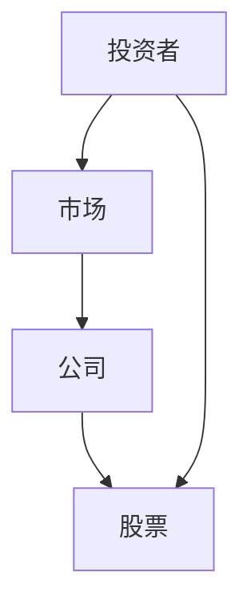
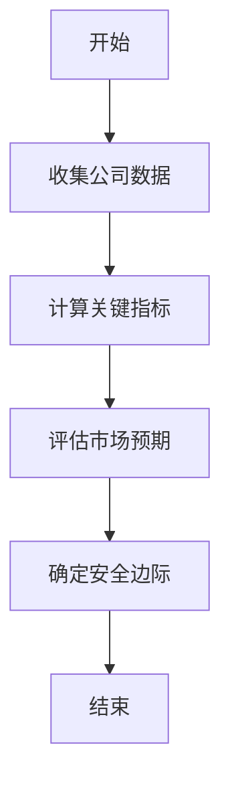
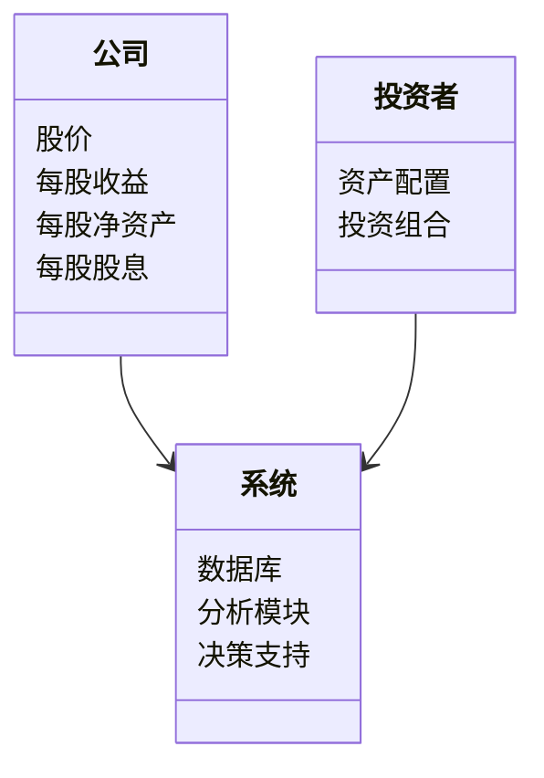
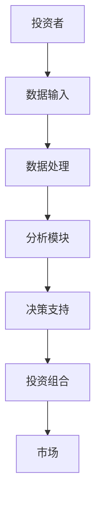
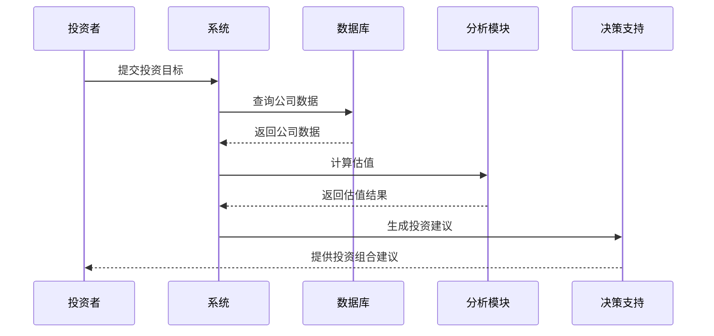

                 


# 唐纳德·约斯的深度价值投资：寻找被市场遗忘的公司

## 关键词：深度价值投资，唐纳德·约斯，市场遗忘公司，基本面分析，安全边际

## 摘要：本文系统介绍深度价值投资的核心理念与实践方法，通过唐纳德·约斯的投资策略，探讨如何识别被市场忽视的优质公司，结合基本面分析与估值模型，构建稳健的投资组合。文章从理论到实践，详细解析深度价值投资的数学模型、系统架构及实际案例，为投资者提供实用的指导与启示。

---

# 第一部分: 深度价值投资的背景与核心概念

---

## 第1章: 深度价值投资的背景与定义

### 1.1 价值投资的历史演变

#### 1.1.1 价值投资的起源与发展

价值投资是一种长期投资策略，起源于20世纪初，由本杰明·格雷厄姆和戴维·多德共同提出。格雷厄姆的学生沃伦·巴菲特继承并发展了这一理念，使其成为全球投资领域的主流方法之一。唐纳德·约斯作为现代价值投资的重要实践者和理论研究者，进一步将价值投资细化为“深度价值投资”，专注于寻找被市场遗忘的公司。

#### 1.1.2 唐纳德·约斯的贡献与影响

唐纳德·约斯在价值投资领域的主要贡献包括：
1. 提出“市场遗忘公司”的概念，强调投资那些被市场忽视但具备长期竞争优势的企业。
2. 发展了基于基本面分析的估值模型，尤其是对公司内在价值的计算方法进行了优化。
3. 强调安全边际的重要性，即买入价格低于内在价值，以降低投资风险。

#### 1.1.3 深度价值投资的定义与特点

深度价值投资是一种专注于寻找市场中被低估的公司，并通过长期持有实现超额收益的投资策略。其特点包括：
- 专注于基本面分析，而非市场趋势或情绪。
- 寻找具有竞争优势但被市场忽视的公司。
- 强调安全边际，即买入价格与内在价值的差距。

### 1.2 深度价值投资的核心要素

#### 1.2.1 市场遗忘的公司特征

被市场遗忘的公司通常具备以下特征：
1. **低估值**：市盈率、市净率等指标远低于行业平均水平。
2. **低关注度**：市场研究机构的关注度较低，投资者兴趣不大。
3. **低波动性**：股价波动较小，市场关注度低。
4. **竞争优势**：公司在行业内具备一定的竞争优势，但尚未被市场充分认识到。

#### 1.2.2 价值与价格的动态关系

在价值投资中，价值与价格的关系是核心。公司的真实价值（内在价值）与市场价格之间存在波动。当市场价格低于内在价值时，即是投资机会。唐纳德·约斯强调，内在价值是投资决策的核心，而市场价格是波动的。

#### 1.2.3 深度价值投资的边界与外延

深度价值投资的边界在于：
- 投资对象必须是具有持续竞争优势的公司。
- 公司的内在价值必须显著高于市场价格。
- 投资者必须具备足够的研究能力和信息来源。

---

## 第2章: 深度价值投资的核心概念与联系

### 2.1 核心概念原理

#### 2.1.1 市场有效性的假设

市场有效性假设认为，市场价格反映了所有可获得的信息。然而，市场并不总是有效，尤其是在短期和特定市场条件下，某些公司可能被市场低估或高估。深度价值投资正是基于这一假设的局限性，寻找市场定价错误的机会。

#### 2.1.2 价值与价格的动态关系

价值与价格的关系可以通过以下公式表示：
$$ \text{内在价值} = \text{未来现金流的现值} $$
市场价格与内在价值之间的差异为投资者提供了超额收益的机会。

#### 2.1.3 深度价值投资的内在逻辑

深度价值投资的内在逻辑是：
1. 找到被低估的公司。
2. 确定公司的内在价值。
3. 在市场价格低于内在价值时买入。
4. 长期持有，直到市场价格回归内在价值。

### 2.2 核心概念属性特征对比表格

表2.1: 深度价值投资与其它投资策略的核心特征对比

| 投资策略 | 核心特征 |
|----------|----------|
| 深度价值投资 | 低估值、竞争优势、安全边际 |
| 成长型投资 | 高增长、高市盈率、高风险 |
| 趋势投资 | 行业趋势、短期波动、高流动性 |
| 股息投资 | 高股息率、稳定收益、低增长 |

### 2.3 ER实体关系图



---

## 第3章: 深度价值投资的数学模型与算法原理

### 3.1 基本面分析的数学模型

#### 3.1.1 市盈率（P/E）模型

市盈率是衡量公司估值的重要指标，公式为：
$$ \text{P/E} = \frac{\text{股价}}{\text{每股收益}} $$

#### 3.1.2 市净率（P/B）模型

市净率是另一个常用的估值指标，公式为：
$$ \text{P/B} = \frac{\text{股价}}{\text{每股净资产}} $$

#### 3.1.3 股息率（Dividend Yield）模型

股息率是衡量公司分红能力的指标，公式为：
$$ \text{股息率} = \frac{\text{每股股息}}{\text{股价}} $$

### 3.2 估值模型的算法流程



### 3.3 代码实现

```python
def calculate_pe_ratio(price, earnings):
    return price / earnings

def calculate_pb_ratio(price, book_value):
    return price / book_value

def calculate_dividend_yield(dividend, price):
    return dividend / price

# 示例计算
price = 50
earnings = 5
book_value = 20
dividend = 2

pe_ratio = calculate_pe_ratio(price, earnings)
pb_ratio = calculate_pb_ratio(price, book_value)
dividend_yield = calculate_dividend_yield(dividend, price)

print(f"P/E 比率: {pe_ratio}")
print(f"P/B 比率: {pb_ratio}")
print(f"股息率: {dividend_yield}")
```

---

# 第二部分: 深度价值投资的系统分析与架构设计

---

## 第4章: 深度价值投资的系统分析

### 4.1 项目介绍

深度价值投资系统旨在通过量化分析和基本面研究，识别被低估的公司，构建稳健的投资组合。系统包括数据收集、分析模块和决策支持三个部分。

### 4.2 系统功能设计

#### 4.2.1 领域模型



#### 4.2.2 系统架构设计



### 4.3 系统接口设计

系统接口包括：
1. 数据输入接口：接收公司基本面数据。
2. 分析模块接口：执行估值模型计算。
3. 决策支持接口：生成投资建议。

### 4.4 系统交互设计



---

## 第5章: 深度价值投资的项目实战

### 5.1 项目环境安装

安装必要的Python库：
```bash
pip install pandas numpy matplotlib
```

### 5.2 核心代码实现

```python
import pandas as pd
import numpy as np

def calculate_intrinsic_value(earnings, growth_rate, discount_rate):
    return earnings / (1 + growth_rate) + earnings / (1 + discount_rate)

# 示例数据
data = {
    '公司': ['公司A', '公司B', '公司C'],
    '每股收益': [2, 3, 1],
    '增长率': [5%, 3%, 4%],
    '折现率': [8%, 7%, 6%]
}

df = pd.DataFrame(data)

# 计算内在价值
df['内在价值'] = df.apply(lambda x: calculate_intrinsic_value(x['每股收益'], x['增长率'], x['折现率']), axis=1)

print(df)
```

### 5.3 代码应用解读与分析

通过上述代码，我们可以计算每家公司的内在价值，并与市场价格进行对比。如果市场价格低于内在价值，即为投资机会。

### 5.4 案例分析

以公司A为例：
- 每股收益：2
- 增长率：5%
- 折现率：8%
- 内在价值：2 / (1 + 0.05) + 2 / (1 + 0.08) ≈ 2.105 + 1.851 ≈ 3.956

如果市场价格为3.5，即为投资机会。

### 5.5 项目小结

通过项目实战，我们验证了深度价值投资的理论，并展示了如何通过系统化的方法识别被低估的公司。

---

## 第6章: 深度价值投资的最佳实践与小结

### 6.1 最佳实践 tips

1. **长期持有**：深度价值投资需要耐心，市场波动短期可能影响股价，但长期会回归内在价值。
2. **持续学习**：投资需要不断学习新的知识和案例，保持对市场的敏感性。
3. **分散投资**：避免过度集中，降低风险。
4. **严格遵守安全边际**：买入价格必须低于内在价值。

### 6.2 小结

深度价值投资是一种有效的投资策略，通过系统化的方法识别被低估的公司，构建稳健的投资组合。唐纳德·约斯的理论为我们提供了宝贵的指导，但实践中的每一步都需要谨慎和耐心。

### 6.3 注意事项

1. **数据准确性**：基本面分析依赖于准确的数据，数据错误可能导致错误的结论。
2. **市场变化**：市场环境可能变化，需要及时调整投资策略。
3. **道德风险**：投资过程中需遵守法律法规，避免内幕交易等行为。

### 6.4 拓展阅读

1. 《价值》—— 查理·芒格
2. 《投资最重要的事》—— 约翰·邓普顿
3. 《股票作手回忆录》—— 杰西·利弗莫尔

---

通过本文的系统介绍，我们不仅了解了深度价值投资的理论，还通过实际案例和系统设计展示了如何将其应用于实践。希望读者能够通过本文，掌握深度价值投资的核心方法，并在实际投资中取得优异的成果。

