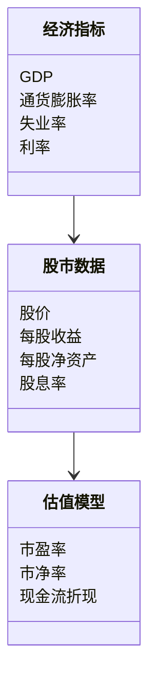
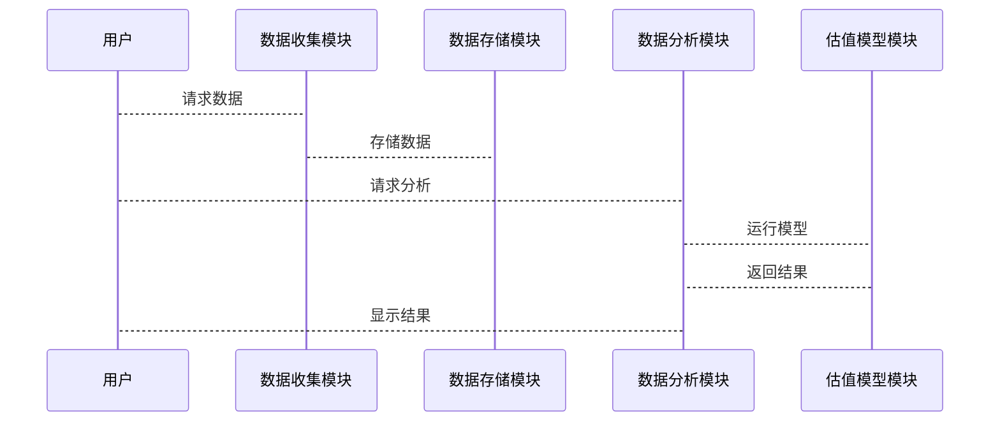

                 


# 国际化投资:全球26个经济体股市估值分析

> 关键词：国际化投资，股市估值分析，全球股市，经济指标，投资策略，时间序列分析

> 摘要：本文系统地分析了全球26个主要经济体的股市估值情况，从经济指标、市场结构、估值模型等多个维度展开，结合实际案例和数学模型，深入探讨了如何在全球化背景下进行有效的股市估值分析和投资决策。

---

# 第一部分: 国际化投资与全球股市估值分析基础

## 第1章: 国际化投资的背景与重要性

### 1.1 国际化投资的定义与特点

- **1.1.1 国际化投资的定义**
  - 国际化投资是指投资者在全球范围内配置资产，以分散风险、优化收益的投资策略。
  - 核心特点包括全球化、多元化、风险分散和收益最大化。

- **1.1.2 国际化投资的核心特点**
  - 跨国性：投资者可以跨越国界配置资产。
  - 多样性：不同国家的经济周期和市场表现存在差异。
  - 风险分散：通过全球化配置降低单一市场的风险。

- **1.1.3 全球化经济背景下的投资趋势**
  - 经济全球化推动了国际化投资的发展。
  - 技术进步和信息透明化为国际化投资提供了便利。

### 1.2 全球股市估值分析的重要性

- **1.2.1 股市估值分析的定义**
  - 股市估值分析是通过分析股票的价格、收益、现金流等指标，评估股票的内在价值。
  - 帮助投资者做出合理的买入或卖出决策。

- **1.2.2 全球化视角下股市估值分析的意义**
  - 通过分析全球不同市场的估值水平，投资者可以发现被低估的市场或资产。
  - 有助于制定跨市场的投资策略。

- **1.2.3 经济周期与股市估值的关系**
  - 在经济周期的不同阶段，股市估值会呈现不同的变化趋势。
  - 例如，在衰退期，低市盈率（PE）的股票可能更具吸引力。

### 1.3 本书的核心目标与内容框架

- **1.3.1 本书的核心目标**
  - 探讨如何在全球范围内进行有效的股市估值分析。
  - 提供26个主要经济体的股市估值数据和分析方法。

- **1.3.2 内容框架概述**
  - 分析全球经济指标对股市估值的影响。
  - 探讨不同市场的估值特征和投资策略。
  - 提供实际案例和数学模型支持投资决策。

- **1.3.3 预期读者与适用场景**
  - 适合投资者、金融从业者、研究人员和对股市估值分析感兴趣的学习者。
  - 适用于投资决策、学术研究和投资策略制定。

---

## 第2章: 全球26个经济体的经济与市场概况

### 2.1 全球主要经济体的经济指标

- **2.1.1 GDP与人均GDP**
  - GDP是衡量一个国家经济规模的重要指标。
  - 人均GDP反映了国家的经济发展水平和居民生活水平。

- **2.1.2 通货膨胀率与失业率**
  - 通货膨胀率影响股市估值和货币政策。
  - 失业率是衡量经济健康的重要指标。

- **2.1.3 财政政策与货币政策**
  - 财政政策通过政府支出和税收影响市场。
  - 货币政策通过利率和货币供应量影响股市。

### 2.2 各国股市的基本情况

- **2.2.1 主要股市指数**
  - 标普500（美国）、纳斯达克（美国）、富时100（英国）、日经225（日本）等。

- **2.2.2 市场规模与流动性**
  - 市场规模影响市场的抗风险能力和流动性。
  - 高流动性市场更容易进行买卖操作。

- **2.2.3 市场结构与参与者**
  - 包括散户、机构投资者、政府等不同类型的参与者。

### 2.3 经济体间的相互影响

- **2.3.1 经济全球化与区域化趋势**
  - 经济全球化促进了跨国投资和市场整合。
  - 区域化趋势可能导致区域市场的波动。

- **2.3.2 货币政策与汇率波动**
  - 货币政策影响汇率，进而影响跨国投资。
  - 汇率波动对出口型企业的影响较大。

- **2.3.3 贸易政策与市场波动**
  - 贸易政策变化可能导致市场的短期波动。
  - 贸易摩擦可能影响全球经济和股市表现。

---

## 第3章: 股市估值分析的核心概念与方法

### 3.1 股市估值的基本原理

- **3.1.1 股票估值的定义**
  - 股票估值是通过分析公司的财务数据和市场环境，确定股票的合理价格。
  - 包括内在价值和市场价值两个方面。

- **3.1.2 股票估值的核心要素**
  - 公司的盈利能力、成长性、财务状况和行业地位。
  - 市场利率、通货膨胀和宏观经济环境。

- **3.1.3 股票估值的分类与应用场景**
  - 相对估值法和绝对估值法。
  - 常用于投资决策、资产配置和风险管理。

### 3.2 常用的估值指标与公式

- **3.2.1 市盈率（PE）**
  - 公式：$PE = \frac{\text{股价}}{\text{每股收益}}$
  - 低PE值可能意味着被低估的股票。

- **3.2.2 市净率（PB）**
  - 公式：$PB = \frac{\text{股价}}{\text{每股净资产}}$
  - 适用于净资产驱动型的公司。

- **3.2.3 市销率（P/S）**
  - 公式：$P/S = \frac{\text{股价}}{\text{每股销售收入}}$
  - 适用于高成长性的公司。

- **3.2.4 股息率（Dividend Yield）**
  - 公式：$股息率 = \frac{\text{每股股息}}{\text{股价}} \times 100\%$
  - 用于评估投资回报。

### 3.3 股市估值分析的步骤与流程

- **3.3.1 数据收集与整理**
  - 收集各经济体的经济指标和股市数据。
  - 数据清洗和预处理。

- **3.3.2 数据分析与建模**
  - 使用统计方法和数学模型进行估值分析。
  - 对比不同模型的优劣。

- **3.3.3 结果解读与投资决策**
  - 根据估值结果制定投资策略。
  - 结合宏观经济环境和市场情绪进行调整。

---

## 第4章: 全球股市估值分析的数学模型与算法

### 4.1 股市估值的核心算法

- **4.1.1 市盈率模型**
  - 使用历史或预测的每股收益进行估值。
  - 适用于稳定增长的公司。

- **4.1.2 现金流折现模型（DCF）**
  - 公式：$V = \sum_{t=1}^{n} \frac{CF_t}{(1 + r)^t} + \frac{TV}{(1 + r)^n}$
  - 考虑未来现金流的现值。

- **4.1.3 市净率模型**
  - 使用历史或预测的净资产进行估值。
  - 适用于净资产驱动型的公司。

### 4.2 时间序列分析与预测

- **4.2.1 ARIMA模型**
  - 用于预测未来的股价或估值。
  - 包括自回归（AR）、移动平均（MA）和差分（I）部分。

- **4.2.2 GARCH模型**
  - 用于估计资产的波动性。
  - 广泛应用于风险管理。

- **4.2.3 长期记忆模型（LSTM）**
  - 基于循环神经网络的时间序列预测模型。
  - 能够捕捉长期依赖关系。

### 4.3 统计套利与风险控制

- **4.3.1 统计套利的基本原理**
  - 利用价格差异进行套利。
  - 适用于短期市场波动。

- **4.3.2 风险价值（VaR）模型**
  - 用于估计投资组合的最大可能损失。
  - 常用于风险管理和资本分配。

- **4.3.3 风险调整后的收益（RAROC）**
  - 考虑风险因素的投资收益指标。
  - 用于评估投资效率。

---

## 第5章: 系统架构与数据处理方案

### 5.1 问题场景介绍

- 全球26个经济体的股市数据收集与分析。
- 如何利用数学模型进行估值预测。

### 5.2 项目介绍

- 开发一个全球股市估值分析系统。
- 包括数据收集、分析和可视化模块。

### 5.3 系统功能设计（领域模型）



### 5.4 系统架构设计


### 5.5 系统接口设计

- 数据接口：从数据库或API获取数据。
- 分析接口：调用数学模型进行估值。
- 可视化接口：生成图表和报告。

### 5.6 系统交互设计



---

## 第6章: 项目实战

### 6.1 环境安装与配置

- 安装Python和必要的库（Pandas、NumPy、Scikit-learn、Plotly）。
- 配置数据源（如Yahoo Finance API）。

### 6.2 核心实现

```python
import pandas as pd
import numpy as np

# 示例：计算市盈率
def calculate_pe_ratio(stock_price, earnings_per_share):
    return stock_price / earnings_per_share

# 示例：计算市净率
def calculate_pb_ratio(stock_price, book_value_per_share):
    return stock_price / book_value_per_share
```

### 6.3 应用解读与分析

- 如何通过代码实现估值模型。
- 对实际案例进行分析和解读。

### 6.4 实际案例分析

- 使用具体经济体的数据进行分析。
- 对比不同模型的预测结果。

### 6.5 项目小结

- 总结项目的核心成果。
- 提出改进建议和未来研究方向。

---

## 第7章: 小结与注意事项

### 7.1 核心知识点回顾

- 全球化投资与股市估值的基本概念。
- 常用的估值指标与模型。

### 7.2 投资注意事项

- 风险控制的重要性。
- 数据来源的可靠性。

### 7.3 拓展阅读

- 推荐相关书籍和学术论文。
- 提供在线资源和工具建议。

---

通过以上结构，读者可以系统地了解国际化投资和股市估值分析的核心概念、方法和实际应用，掌握从理论到实践的完整流程。

