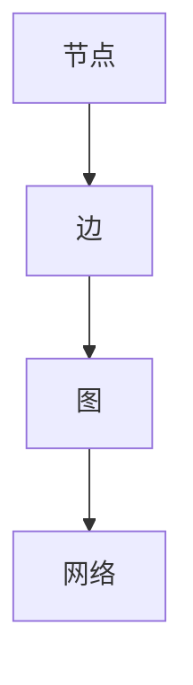
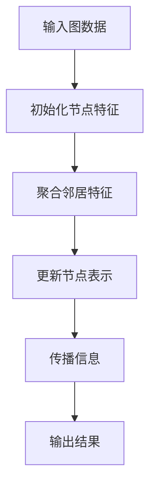

                 


# 图神经网络在AI Agent知识表示中的应用

## 关键词
图神经网络, AI Agent, 知识表示, 图结构, 机器学习, 深度学习, 知识图谱

## 摘要
本文深入探讨了图神经网络（Graph Neural Networks, GNN）在AI Agent知识表示中的应用。通过分析图神经网络的基本原理、核心概念及其在AI Agent中的具体应用场景，本文展示了如何利用GNN的强大能力来提升知识表示的效果和效率。文章从基础知识到高级应用，结合实际案例和系统设计，为读者提供了全面的视角。

---

# 目录

## 第一部分: 图神经网络基础

### 第1章: 图神经网络概述
1.1 图神经网络的基本概念  
1.2 图神经网络的模型结构  
1.3 图神经网络的训练方法  
1.4 图神经网络的应用案例  

### 第2章: 图神经网络的核心概念与联系
2.1 图神经网络的核心原理  
2.2 图神经网络的概念属性特征对比  
2.3 图神经网络的ER实体关系图  

### 第3章: 图神经网络的算法原理
3.1 图神经网络的数学模型  
3.2 图神经网络的算法流程  
3.3 图神经网络的Python实现  

## 第二部分: AI Agent知识表示的核心方法

### 第4章: AI Agent的知识表示方法
4.1 知识图谱表示  
4.2 符号逻辑表示  
4.3 向量空间表示  
4.4 图神经网络与知识表示的结合  

### 第5章: 图神经网络在AI Agent中的应用
5.1 问答系统中的应用  
5.2 对话生成中的应用  
5.3 推荐系统中的应用  
5.4 知识推理与分析中的应用  

## 第三部分: 图神经网络在AI Agent中的系统架构与设计

### 第6章: 系统架构与设计
6.1 问题场景分析  
6.2 系统功能设计  
6.3 系统架构设计  
6.4 系统接口设计  
6.5 系统交互流程  

## 第四部分: 图神经网络在AI Agent中的项目实战

### 第7章: 项目实战
7.1 环境安装与配置  
7.2 核心代码实现  
7.3 案例分析与解读  
7.4 项目总结与优化  

## 第五部分: 总结与展望

### 第8章: 总结与展望
8.1 全文总结  
8.2 未来发展方向  

---

## 正文

### 第一部分: 图神经网络基础

#### 第1章: 图神经网络概述

##### 1.1 图神经网络的基本概念

图神经网络（Graph Neural Networks, GNN）是一种基于图数据进行学习的神经网络模型。它能够处理图结构数据，其中节点表示为实体，边表示为实体之间的关系。GNN通过聚合节点及其邻居的信息来生成节点表示，从而捕捉图中的结构信息和语义信息。

##### 1.2 图神经网络的模型结构

图神经网络的模型结构主要包括以下几个部分：

1. **图的表示**：图由节点和边组成，节点表示为实体，边表示实体之间的关系。
2. **节点特征**：节点的初始特征可以是文本、数值或其他形式的数据。
3. **边特征**：边可以带有权重或标签，表示关系的强度或类型。
4. **聚合函数**：用于聚合节点及其邻居的特征，生成新的节点表示。
5. **传播机制**：信息通过图中的边传播，更新节点的表示。

##### 1.3 图神经网络的训练方法

图神经网络的训练方法包括监督学习、无监督学习和半监督学习：

1. **监督学习**：使用有标签的数据进行训练，目标是学习节点的分类或回归任务。
2. **无监督学习**：在无标签数据的情况下，学习节点的表示，通常用于聚类或降维任务。
3. **半监督学习**：结合有标签和无标签数据进行训练，适用于部分节点有标签的情况。

##### 1.4 图神经网络的应用案例

图神经网络在多个领域都有广泛的应用，例如：

1. **社交网络分析**：用于用户推荐、社交影响力分析等。
2. **分子图分析**：用于药物发现、分子性质预测等。
3. **交通网络分析**：用于交通流量预测、路径优化等。

---

#### 第2章: 图神经网络的核心概念与联系

##### 2.1 图神经网络的核心原理

图神经网络的核心原理包括以下几个方面：

1. **图的表示与传播机制**：图通过节点和边表示，信息通过边传播到整个图中。
2. **节点特征的聚合与更新**：节点的特征通过聚合邻居的特征进行更新，捕捉节点的局部结构信息。
3. **图结构信息的编码**：通过多层传播，编码图的全局结构信息，用于下游任务。

##### 2.2 图神经网络的概念属性特征对比

以下是一个对比分析表格，展示了图神经网络与其他模型的对比：

| 模型类型 | 输入 | 输出 | 特点 |
|--------|-----|-----|------|
| CNN    | 图像 | 特征向量 | 局部性，平移不变性 |
| RNN    | 序列数据 | 序列特征 | 时序依赖性 |
| GNN    | 图数据 | 节点/图特征 | 结构依赖性，全局性 |

##### 2.3 图神经网络的ER实体关系图

以下是图神经网络的ER实体关系图：



---

#### 第3章: 图神经网络的算法原理

##### 3.1 图神经网络的数学模型

图神经网络的数学模型主要包括以下几个部分：

1. **图的表示模型**：图由节点集合V和边集合E组成，节点v∈V，边e∈E。
2. **节点表示模型**：节点表示为向量h_v∈ℝ^d，d为嵌入维度。
3. **图的传播模型**：信息通过边传播，更新节点的表示，通常使用聚合函数和更新规则。

##### 3.2 图神经网络的算法流程

以下是图神经网络的算法流程图：



##### 3.3 图神经网络的Python实现

以下是一个简单的图神经网络实现示例：

```python
import dgl
import torch
import numpy as np

class GNNLayer(torch.nn.Module):
    def __init__(self, in_dim, out_dim):
        super(GNNLayer, self).__init__()
        self.w = torch.nn.Parameter(torch.randn(in_dim, out_dim))
    
    def forward(self, graph, h):
        with graph.local_scope():
            h = torch.matmul(h, self.w)
            return h

# 创建图
graph = dgl.graph(([0,1,2], [1,2,1]))

# 初始化节点特征
h = torch.randn(3, 2)

# 创建GNN层
gnn_layer = GNNLayer(2, 3)

# 前向传播
new_h = gnn_layer(graph, h)
print(new_h)
```

---

### 第二部分: AI Agent知识表示的核心方法

#### 第4章: AI Agent的知识表示方法

##### 4.1 知识图谱表示

知识图谱是一种图结构，由实体和关系组成，用于表示知识。例如，实体包括“人名”、“地名”等，关系包括“出生地”、“朋友”等。

##### 4.2 符号逻辑表示

符号逻辑表示通过符号和规则表示知识，例如，使用谓词逻辑表示“人名是张三”。

##### 4.3 向量空间表示

向量空间表示将知识表示为向量，例如，使用Word2Vec将实体表示为向量。

##### 4.4 图神经网络与知识表示的结合

图神经网络可以用于生成知识图谱的节点和边的嵌入，从而提升知识表示的效果。

#### 第5章: 图神经网络在AI Agent中的应用

##### 5.1 问答系统中的应用

图神经网络可以用于问答系统，通过分析问题和相关知识图谱中的实体关系，生成准确的答案。

##### 5.2 对话生成中的应用

图神经网络可以用于对话生成，通过分析对话历史和上下文，生成连贯且有意义的回复。

##### 5.3 推荐系统中的应用

图神经网络可以用于推荐系统，通过分析用户行为和物品关系，生成个性化的推荐列表。

##### 5.4 知识推理与分析中的应用

图神经网络可以用于知识推理和逻辑分析，通过分析知识图谱中的关系，进行复杂推理任务。

---

### 第三部分: 图神经网络在AI Agent中的系统架构与设计

#### 第6章: 系统架构与设计

##### 6.1 问题场景分析

分析AI Agent在知识表示中的问题场景，例如问答系统、对话生成等。

##### 6.2 系统功能设计

设计系统功能，包括知识表示、信息检索、推理分析等。

##### 6.3 系统架构设计

设计系统的架构，包括数据层、计算层、应用层等。

##### 6.4 系统接口设计

设计系统的接口，包括API接口、数据接口等。

##### 6.5 系统交互流程

设计系统的交互流程，包括用户输入、系统处理、结果输出等。

---

### 第四部分: 图神经网络在AI Agent中的项目实战

#### 第7章: 项目实战

##### 7.1 环境安装与配置

安装所需的环境和依赖，例如Python、TensorFlow、Keras等。

##### 7.2 核心代码实现

实现图神经网络的核心代码，例如节点特征聚合、信息传播等。

##### 7.3 案例分析与解读

分析具体案例，解读图神经网络在AI Agent中的应用效果。

##### 7.4 项目总结与优化

总结项目成果，提出优化建议。

---

### 第五部分: 总结与展望

#### 第8章: 总结与展望

##### 8.1 全文总结

总结全文内容，回顾图神经网络在AI Agent知识表示中的应用。

##### 8.2 未来发展方向

展望未来，图神经网络在AI Agent中的应用前景，例如更复杂的图结构、更高效的学习算法等。

---

通过以上结构和内容，您可以撰写一篇详细且专业的技术博客文章，深入探讨图神经网络在AI Agent知识表示中的应用。

