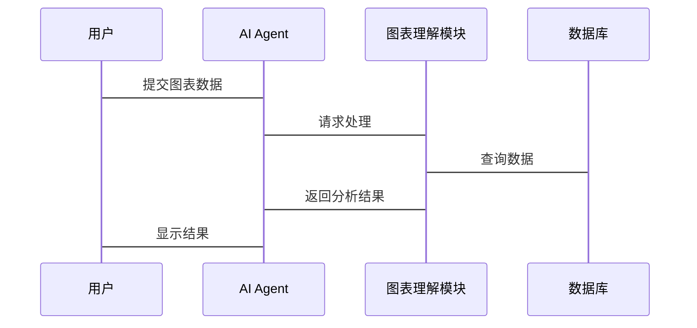

                 


# 图表理解技术：增强AI Agent的数据分析能力

## 关键词：
图表理解技术、AI Agent、数据分析能力、图像处理、模式识别、数学建模、系统架构

## 摘要：
图表理解技术是人工智能领域的重要研究方向，旨在通过自动化方法从图表数据中提取有用信息，从而增强AI Agent的数据分析能力。本文将从图表理解技术的基本概念入手，探讨其在AI Agent中的应用，分析相关算法原理，并通过实际案例展示如何通过图表理解技术提升数据分析能力。文章还将涉及系统架构设计和项目实战，为读者提供全面的技术指导。

---

## 第一部分：图表理解技术基础

### 第1章：图表理解技术概述

#### 1.1 图表理解技术的基本概念

##### 1.1.1 图表的定义与分类
图表是一种数据可视化工具，用于将复杂的数据关系以图形形式呈现。常见的图表类型包括：
- **柱状图**：用于比较不同类别的数据。
- **折线图**：用于展示数据随时间的变化趋势。
- **饼图**：用于展示数据的构成比例。
- **散点图**：用于分析变量之间的关系。
- **树状图**：用于展示层次结构。

##### 1.1.2 图表理解技术的背景与意义
随着数据量的爆炸式增长，如何高效地从图表中提取信息成为AI Agent面临的挑战。图表理解技术通过自动化方法处理图表数据，能够帮助AI Agent快速理解数据背后的意义，从而提升数据分析效率。

##### 1.1.3 图表理解技术的核心目标
图表理解技术的核心目标是通过图像处理、模式识别和语义分析等方法，从图表中提取结构化数据和语义信息，为后续的数据分析提供支持。

---

#### 1.2 图表分析的基本流程

##### 1.2.1 数据采集与预处理
数据采集是图表理解的第一步，通常包括图像获取和预处理。预处理步骤包括：
1. 图像去噪：去除图像中的噪声，提高识别精度。
2. 图像增强：通过调整亮度、对比度等提升图像质量。
3. 图像分割：将图表分割为独立的元素，如标题、轴、数据点等。

##### 1.2.2 图表识别与解析
图表识别阶段涉及图像分割和模式识别技术，用于识别图表中的元素并解析其含义。例如，识别柱状图中的柱体高度，或解析饼图中的扇区比例。

##### 1.2.3 数据分析与可视化
通过对图表数据的分析，生成结构化的数据表示，并将其用于进一步的分析和可视化。

---

## 第2章：AI Agent与数据分析能力

### 2.1 AI Agent的基本概念

#### 2.1.1 AI Agent的定义与特点
AI Agent是一种智能代理，能够感知环境、理解数据并做出决策。其特点包括：
- **自主性**：能够独立执行任务。
- **反应性**：能够实时感知环境变化并做出响应。
- **学习能力**：能够通过经验优化自身的行为。

#### 2.1.2 AI Agent在数据分析中的作用
AI Agent能够从大量数据中提取有用信息，帮助用户做出决策。例如，在商业分析中，AI Agent可以分析销售数据，预测市场趋势。

#### 2.1.3 AI Agent与图表理解技术的关系
图表理解技术是AI Agent实现数据分析能力的重要组成部分。通过图表理解技术，AI Agent能够从图表中提取结构化数据，从而增强其数据分析能力。

---

### 2.2 图表理解技术在AI Agent中的应用

#### 2.2.1 图表数据的获取与处理
AI Agent通过图像采集技术获取图表数据，并对其进行预处理，如去噪、增强等。

#### 2.2.2 图表信息的提取与分析
通过图像分割和模式识别技术，AI Agent能够从图表中提取关键信息，如数据点值、图表类型等。

#### 2.2.3 图表分析结果的反馈与应用
AI Agent将图表分析结果反馈给用户，并应用于实际场景中，如生成报告、优化决策等。

---

## 第3章：图表理解技术的核心概念与联系

### 3.1 图表分析的原理与方法

#### 3.1.1 图像处理与模式识别
图像处理是图表理解的基础，包括图像分割、边缘检测等技术。模式识别则用于识别图表中的模式，如文字、形状等。

#### 3.1.2 图表结构的解析与重建
通过对图表元素的识别和分类，重建图表的结构信息，如轴标签、数据点位置等。

#### 3.1.3 图表信息的语义理解
语义理解是图表理解的关键，涉及对图表内容的深度分析，如理解数据之间的关系和趋势。

---

### 3.2 图表类型与分析方法对比

#### 3.2.1 常见图表类型及其特点
通过表格对比不同图表类型的特点，如柱状图适合比较数据，折线图适合展示趋势。

| 图表类型 | 主要特点 | 适用场景 |
|----------|----------|----------|
| 柱状图    | 比较数据 | 数据对比 |
| 折线图    | 展示趋势 | 时间序列 |
| 饼图      | 显示比例 | 组成分析 |

#### 3.2.2 不同图表类型的分析方法
不同图表类型需要不同的分析方法，例如柱状图需要识别柱体高度，饼图需要识别扇区比例。

#### 3.2.3 图表类型选择的策略与优化
根据数据特点和分析目标选择合适的图表类型，以提高分析效率。

---

## 第4章：图表理解技术的算法原理

### 4.1 图像分割与图表识别

#### 4.1.1 图像分割算法概述
图像分割是将图像分割为多个区域的过程，常用于识别图表中的元素。

#### 4.1.2 图表区域的分割与提取
通过图像分割技术，识别并提取图表区域，如标题、轴、数据点等。

#### 4.1.3 图表元素的识别与分类
使用模式识别技术，识别图表中的元素并进行分类，如识别柱体、线条等。

---

### 4.2 图表信息提取的算法实现

#### 4.2.1 文本识别与OCR技术
通过OCR技术提取图表中的文字信息，如轴标签、数据点值等。

#### 4.2.2 图表结构的解析算法
通过算法解析图表结构，如识别柱状图的轴、数据点位置等。

#### 4.2.3 图表信息的语义分析
通过语义分析技术，理解图表内容的意义，如识别数据趋势、预测市场变化等。

---

## 第5章：图表理解技术的数学建模

### 5.1 图表理解的数学模型

#### 5.1.1 数据表示与特征提取
将图表数据表示为结构化的形式，并提取特征，如数据点的坐标、颜色等。

#### 5.1.2 图表识别的分类模型
使用分类算法，如支持向量机（SVM）、随机森林等，对图表元素进行分类。

#### 5.1.3 数据分析的回归模型
通过回归分析，预测数据趋势，如使用线性回归预测销售趋势。

---

## 第6章：系统分析与架构设计

### 6.1 问题场景介绍

#### 6.1.1 项目背景
假设我们正在开发一个AI Agent，用于分析销售数据并生成销售报告。

#### 6.1.2 项目目标
通过图表理解技术，帮助AI Agent从销售数据图表中提取信息，生成销售报告。

---

### 6.2 系统功能设计

#### 6.2.1 领域模型设计
通过领域模型（Mermaid类图）描述系统功能模块之间的关系。

```mermaid
classDiagram
    class 图表理解模块 {
        图像分割
        文本识别
        图表解析
    }
    class 数据分析模块 {
        数据清洗
        数据分析
        数据可视化
    }
    class AI Agent {
        接收输入
        调用模块
        输出结果
    }
    图表理解模块 <---> 数据分析模块
    AI Agent <---> 图表理解模块
```

---

### 6.3 系统架构设计

#### 6.3.1 系统架构图
通过Mermaid架构图展示系统架构。

```mermaid
archi
    title 图表理解系统架构
    client --> 中间件: 请求
    中间件 --> 图表理解模块: 处理请求
    图表理解模块 --> 数据库: 查询数据
    图表理解模块 --> AI Agent: 返回结果
```

---

### 6.4 系统接口设计

#### 6.4.1 API接口设计
定义API接口，如：
- `POST /chart/analyze`：接收图表数据，返回分析结果。
- `GET /chart/results`：获取分析结果。

---

### 6.5 系统交互设计

#### 6.5.1 交互流程图
通过Mermaid序列图展示系统交互流程。



---

## 第7章：项目实战

### 7.1 环境安装与配置

#### 7.1.1 安装Python环境
安装Python 3.8及以上版本，并配置虚拟环境。

#### 7.1.2 安装依赖库
安装必要的库，如：
- `numpy`
- `pandas`
- `matplotlib`
- `opencv-python`

### 7.2 核心代码实现

#### 7.2.1 图像分割与识别
使用OpenCV进行图像分割和识别。

```python
import cv2

def process_image(image_path):
    # 读取图像
    image = cv2.imread(image_path)
    # 转换为灰度图像
    gray = cv2.cvtColor(image, cv2.COLOR_BGR2GRAY)
    # 使用Canny边缘检测
    edges = cv2.Canny(gray, 50, 150)
    return edges
```

#### 7.2.2 文本识别与OCR
使用Tesseract进行文本识别。

```python
from PIL import Image
import pytesseract

def extract_text(image_path):
    # 读取图像
    image = Image.open(image_path)
    # 使用OCR提取文本
    text = pytesseract.image_to_string(image)
    return text
```

### 7.3 案例分析与解读

#### 7.3.1 数据可视化案例
分析销售数据，生成柱状图。

```python
import matplotlib.pyplot as plt

data = {'产品A': 10, '产品B': 15, '产品C': 8}
plt.bar(data.keys(), data.values())
plt.title('销售数据')
plt.show()
```

#### 7.3.2 数据分析案例
使用回归分析预测销售趋势。

```python
import numpy as np
from sklearn.linear_model import LinearRegression

# 示例数据
X = np.array([1, 2, 3, 4, 5]).reshape(-1, 1)
y = np.array([2, 4, 5, 4, 6])
# 训练模型
model = LinearRegression()
model.fit(X, y)
# 预测
print(model.predict([[6]]))  # 输出预测结果
```

---

## 第8章：总结与展望

### 8.1 最佳实践 tips
- 在处理图表数据时，注意数据的预处理和特征提取。
- 使用多种算法进行对比，选择最优方案。
- 定期更新模型，以适应数据变化。

### 8.2 小结
图表理解技术是AI Agent实现数据分析能力的重要手段，通过图像处理、模式识别和语义分析等技术，能够有效提升数据分析效率。

### 8.3 注意事项
- 注意数据的隐私和安全问题。
- 在实际应用中，考虑算法的计算效率和资源消耗。

### 8.4 拓展阅读
- 《深度学习入门：基于Python》
- 《Python数据分析 cookbook》
- 《计算机视觉：算法与应用》

---

通过以上内容，读者可以全面了解图表理解技术的核心概念、算法原理、系统架构设计和实际应用，为后续的研究和实践提供坚实的基础。

