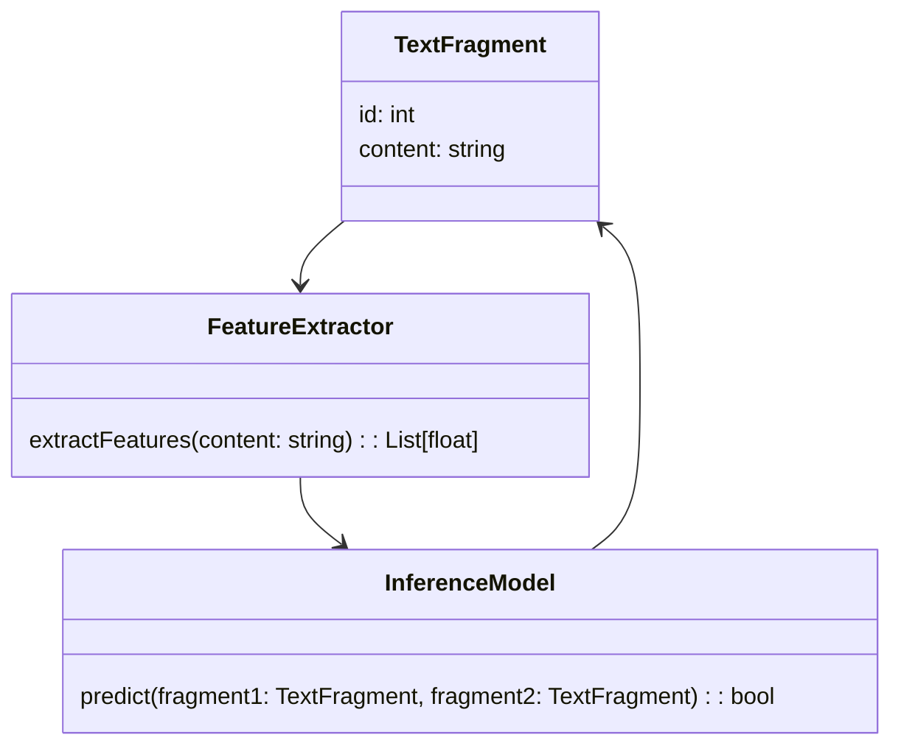
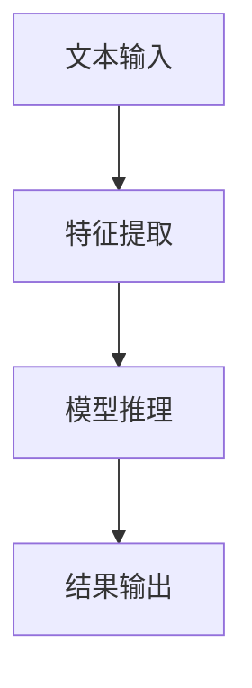
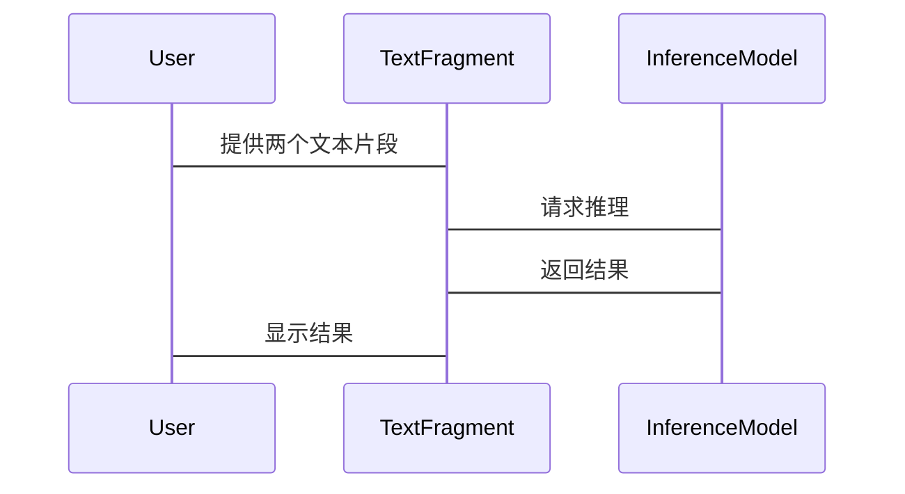

                 


# 基于LLM的AI Agent文本蕴含识别

## 关键词：大语言模型，AI Agent，文本蕴含识别，自然语言处理，机器学习，人工智能

## 摘要：本文深入探讨了基于大语言模型（LLM）的AI Agent在文本蕴含识别中的应用。通过分析LLM与AI Agent的核心概念，阐述了文本蕴含识别的算法原理、系统架构设计及实际项目实现，旨在为技术人员提供从理论到实践的全面指导。

---

# 第一部分: 基于LLM的AI Agent文本蕴含识别背景与概述

## 第1章: 基于LLM的AI Agent文本蕴含识别概述

### 1.1 问题背景与重要性

#### 1.1.1 自然语言处理的发展历程
自然语言处理（NLP）是人工智能领域的重要分支，经历了从基于规则的系统到深度学习驱动的转变。大语言模型（LLM）的出现，如GPT系列和BERT系列，彻底改变了NLP任务的处理方式。

#### 1.1.2 大语言模型的崛起
大语言模型通过海量数据的预训练，具备了强大的上下文理解和生成能力。这些模型能够处理复杂的文本任务，如文本生成、问答系统和文本摘要。

#### 1.1.3 AI Agent的定义与特点
AI Agent是一种智能体，能够感知环境、执行任务并做出决策。AI Agent的核心特点包括自主性、反应性、目标导向和社会能力。

### 1.2 文本蕴含识别的定义与挑战

#### 1.2.1 文本蕴含识别的定义
文本蕴含识别是指判断一段文本是否蕴含了另一段文本的信息。例如，判断“狗是动物”是否蕴含“狗是有生命的”。

#### 1.2.2 文本蕴含识别的核心挑战
- **语义理解**：需要准确理解文本的深层含义。
- **上下文依赖**：文本蕴含识别依赖于上下文信息。
- **模型泛化能力**：模型需要具备良好的泛化能力，以应对各种不同的输入。

#### 1.2.3 文本蕴含识别的应用场景
- **问答系统**：用于验证答案的合理性。
- **对话系统**：用于理解对话的逻辑关系。
- **文本摘要**：用于判断摘要是否涵盖了原文的信息。

### 1.3 基于LLM的AI Agent的创新点

#### 1.3.1 LLM在AI Agent中的作用
大语言模型为AI Agent提供了强大的自然语言处理能力，使其能够理解和生成人类语言。

#### 1.3.2 基于LLM的文本蕴含识别的优势
- **高效性**：大语言模型能够快速处理大规模文本数据。
- **准确性**：通过预训练和微调，模型在文本蕴含识别任务中表现出色。

#### 1.3.3 AI Agent与文本蕴含识别的结合
AI Agent通过文本蕴含识别技术，能够更好地理解用户意图和上下文关系，从而提供更智能的服务。

### 1.4 本章小结
本章介绍了基于LLM的AI Agent文本蕴含识别的背景、定义、挑战和创新点。接下来的章节将详细探讨核心概念与联系、算法原理、系统架构设计、项目实战以及最佳实践。

---

# 第二部分: 基于LLM的AI Agent文本蕴含识别核心概念与联系

## 第2章: 大语言模型（LLM）与AI Agent核心概念

### 2.1 大语言模型（LLM）的定义与特点

#### 2.1.1 LLM的定义
大语言模型是一种基于深度学习的自然语言处理模型，通过预训练技术，能够理解和生成人类语言。

#### 2.1.2 LLM的核心特点
- **大规模数据训练**：基于海量文本数据进行预训练。
- **上下文理解**：能够理解文本的上下文关系。
- **多任务处理能力**：能够处理多种NLP任务，如文本生成、问答系统等。

#### 2.1.3 LLM的训练与推理机制
- **预训练**：在大规模通用数据上进行无监督训练。
- **微调**：针对特定任务进行有监督微调。
- **推理**：基于训练好的模型进行文本处理。

### 2.2 AI Agent的定义与架构

#### 2.2.1 AI Agent的定义
AI Agent是一种智能体，能够感知环境、执行任务并做出决策。

#### 2.2.2 AI Agent的架构模型
- **反应式架构**：基于当前感知做出实时反应。
- **目标导向架构**：根据目标规划行动。
- **混合架构**：结合反应式和目标导向的特点。

#### 2.2.3 AI Agent的核心功能
- **感知环境**：通过传感器或API获取外部信息。
- **决策制定**：基于感知信息做出决策。
- **执行任务**：通过执行器或API完成任务。

### 2.3 LLM与AI Agent的关系

#### 2.3.1 LLM作为AI Agent的核心组件
大语言模型为AI Agent提供了强大的自然语言处理能力，使其能够理解和生成人类语言。

#### 2.3.2 LLM在AI Agent中的应用
- **对话生成**：生成自然的对话回应。
- **意图识别**：识别用户的意图和需求。
- **信息检索**：从大量文本中检索相关信息。

#### 2.3.3 LLM与AI Agent的协同工作
AI Agent通过调用大语言模型的API，完成文本处理任务，如对话生成、文本摘要和意图识别。

### 2.4 本章小结
本章详细探讨了大语言模型和AI Agent的核心概念及其关系。接下来的章节将重点讲解基于LLM的文本蕴含识别算法原理。

---

## 第3章: 基于LLM的文本蕴含识别算法原理

### 3.1 算法概述

#### 3.1.1 文本蕴含识别的定义
文本蕴含识别是指判断一段文本是否蕴含了另一段文本的信息。

#### 3.1.2 基于LLM的文本蕴含识别流程
1. **输入处理**：将输入的两个文本片段进行处理。
2. **特征提取**：提取文本片段的特征信息。
3. **模型推理**：通过大语言模型进行推理，判断是否存在蕴含关系。

### 3.2 算法实现细节

#### 3.2.1 预训练与微调
- **预训练**：在大规模通用数据上进行无监督训练。
- **微调**：针对文本蕴含识别任务进行有监督微调。

#### 3.2.2 模型推理
- **输入处理**：将两个文本片段输入模型。
- **特征提取**：模型提取文本片段的特征信息。
- **推理判断**：模型基于特征信息判断是否存在蕴含关系。

### 3.3 数学模型与公式

#### 3.3.1 概率计算
$$ P(h \text{蕴含} t) = \frac{e^{f(h,t)}}{1 + e^{f(h,t)}} $$

其中，$f(h,t)$表示模型对文本片段$h$和$t$的相似度计算。

#### 3.3.2 模型损失函数
$$ \text{损失} = -\sum_{i=1}^{n} y_i \log p_i + (1 - y_i) \log (1 - p_i) $$

其中，$y_i$表示标签，$p_i$表示模型预测的概率。

### 3.4 本章小结
本章详细介绍了基于LLM的文本蕴含识别算法原理，包括算法流程、实现细节和数学模型。接下来的章节将探讨系统架构设计。

---

## 第4章: 系统分析与架构设计

### 4.1 问题场景介绍

#### 4.1.1 应用场景
- **智能问答系统**：用于验证答案的合理性。
- **文本摘要系统**：用于判断摘要是否涵盖了原文的信息。
- **对话系统**：用于理解对话的逻辑关系。

### 4.2 项目介绍

#### 4.2.1 项目目标
设计并实现一个基于LLM的AI Agent文本蕴含识别系统。

#### 4.2.2 项目范围
- **输入处理**：处理用户输入的两个文本片段。
- **特征提取**：提取文本片段的特征信息。
- **模型推理**：通过大语言模型进行推理，判断是否存在蕴含关系。

### 4.3 系统功能设计

#### 4.3.1 领域模型


#### 4.3.2 系统架构设计


#### 4.3.3 接口设计
- **输入接口**：接收两个文本片段。
- **输出接口**：返回蕴含关系的判断结果。

#### 4.3.4 交互流程


### 4.4 本章小结
本章详细探讨了基于LLM的AI Agent文本蕴含识别系统的架构设计，包括功能设计、类图、架构图和交互图。接下来的章节将提供项目实战的具体实现步骤。

---

## 第5章: 项目实战

### 5.1 环境安装与配置

#### 5.1.1 安装Python
```bash
python --version
```

#### 5.1.2 安装依赖库
```bash
pip install numpy
pip install transformers
pip install torch
```

### 5.2 核心代码实现

#### 5.2.1 文本片段类
```python
class TextFragment:
    def __init__(self, id, content):
        self.id = id
        self.content = content
```

#### 5.2.2 特征提取器
```python
class FeatureExtractor:
    def extractFeatures(self, content):
        # 示例特征提取逻辑
        return [len(content), content.count(' '), content.count('.')]
```

#### 5.2.3 推理模型
```python
import torch
import torch.nn as nn

class InferenceModel(nn.Module):
    def __init__(self, input_size, output_size):
        super(InferenceModel, self).__init__()
        self.linear = nn.Linear(input_size, output_size)
        self.sigmoid = nn.Sigmoid()

    def forward(self, x):
        return self.sigmoid(self.linear(x))
```

### 5.3 案例分析与实现

#### 5.3.1 案例1
```python
fragment1 = TextFragment(1, "狗是动物")
fragment2 = TextFragment(2, "狗是有生命的")
fe = FeatureExtractor()
features = fe.extractFeatures(fragment1.content) + fe.extractFeatures(fragment2.content)
model = InferenceModel(len(features), 1)
output = model(torch.FloatTensor(features))
result = output.item() > 0.5
print(f"判断结果: {result}")
```

#### 5.3.2 案例2
```python
fragment1 = TextFragment(1, "猫是动物")
fragment2 = TextFragment(2, "猫有四条腿")
fe = FeatureExtractor()
features = fe.extractFeatures(fragment1.content) + fe.extractFeatures(fragment2.content)
model = InferenceModel(len(features), 1)
output = model(torch.FloatTensor(features))
result = output.item() > 0.5
print(f"判断结果: {result}")
```

### 5.4 本章小结
本章通过具体的代码实现，详细展示了基于LLM的AI Agent文本蕴含识别系统的实现过程。接下来的章节将总结最佳实践和注意事项。

---

## 第六部分: 最佳实践与小结

## 第6章: 最佳实践与小结

### 6.1 关键点总结

#### 6.1.1 核心概念
- 大语言模型（LLM）是AI Agent的核心组件。
- 文本蕴含识别是判断文本片段之间是否存在蕴含关系。

#### 6.1.2 算法实现
- 预训练与微调是提升模型性能的关键。
- 概率计算和损失函数是模型推理的核心。

### 6.2 注意事项

#### 6.2.1 数据预处理
- 数据清洗和特征提取是关键步骤。
- 数据标注需要准确无误。

#### 6.2.2 模型调优
- 超参数调优可以提升模型性能。
- 模型评估需要使用验证集。

### 6.3 拓展阅读

#### 6.3.1 推荐书籍
- 《Deep Learning》
- 《自然语言处理入门》

#### 6.3.2 推荐论文
- "Attention Is All You Need"
- "BERT: Pre-training of Deep Bidirectional Transformers for NLP"

### 6.4 本章小结
本章总结了基于LLM的AI Agent文本蕴含识别的核心点、注意事项和拓展阅读内容。通过本文的介绍，读者可以全面了解该技术的实现细节和应用价值。

---

# 结语
基于LLM的AI Agent文本蕴含识别是一项具有挑战性和应用前景的技术。通过本文的介绍，读者可以深入了解该技术的核心概念、算法原理和系统架构设计。希望本文能够为技术人员提供有价值的参考，进一步推动相关领域的研究与应用。

---

# 参考文献
（此处可以列出相关的书籍、论文和技术文档）

