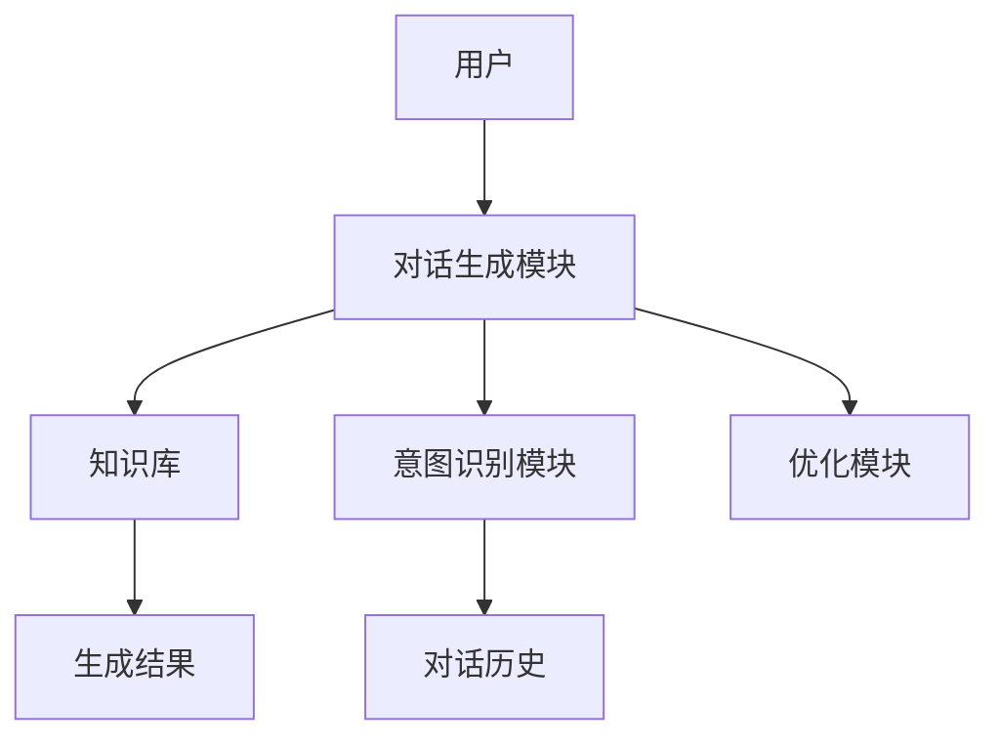
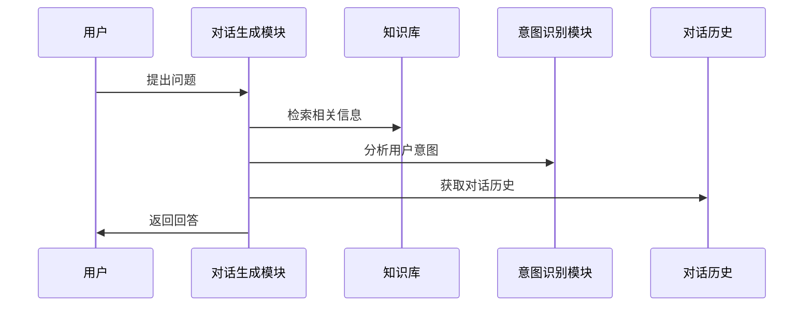

                 


# 基于LLM的金融对话系统开发实践

## 关键词：大语言模型（LLM）、金融对话系统、自然语言处理（NLP）、对话生成、金融领域知识

## 摘要：
本文详细探讨了基于大语言模型（LLM）的金融对话系统开发实践。首先介绍了金融对话系统的需求与挑战，分析了LLM的基本原理及其在金融领域的应用潜力。接着，从对话系统的组成要素、任务划分、流程与交互机制等角度，详细阐述了金融对话系统的构建基础。然后，深入讲解了LLM的数学模型与算法原理，包括Transformer模型的结构和训练优化方法。在系统架构设计部分，通过类图和架构图展示了系统的模块划分与组件关系。最后，通过具体的项目实战，展示了如何基于LLM构建金融对话系统，并总结了开发中的注意事项与最佳实践。

---

# 第1章: 问题背景与需求分析

## 1.1 问题背景

### 1.1.1 金融对话系统的需求与挑战
随着金融业务的复杂化和多样化，用户对金融信息服务的需求日益增长。传统的基于规则的对话系统难以应对复杂多变的金融场景，存在理解能力不足、知识覆盖不全、对话逻辑不严谨等问题。而基于LLM的金融对话系统能够利用大语言模型的强大生成能力和海量金融知识，提供更加智能、自然的对话服务。

### 1.1.2 大语言模型在金融领域的应用潜力
LLM（Large Language Model）通过海量数据的训练，掌握了丰富的金融知识和对话模式，能够理解复杂的金融术语和场景。结合金融领域的知识库，LLM可以在金融咨询、投资建议、风险提示等领域提供高度个性化的服务。

### 1.1.3 当前金融对话系统的主要痛点
- **知识覆盖不足**：传统系统依赖固定的规则和知识库，难以应对复杂的金融场景。
- **对话逻辑不严谨**：缺乏对上下文的深度理解和关联。
- **生成能力有限**：无法灵活应对多轮对话中的突发情况和复杂需求。

## 1.2 问题描述与目标

### 1.2.1 金融对话系统的功能需求
- 提供金融咨询、投资建议、风险评估等服务。
- 支持多轮对话，理解上下文关系。
- 提供个性化服务，满足不同用户的需求。

### 1.2.2 基于LLM的对话系统的优势
- 强大的生成能力：能够灵活应对各种对话场景。
- 深度理解能力：通过上下文理解用户意图。
- 知识覆盖广泛：结合金融知识库提供准确信息。

### 1.2.3 系统设计的核心目标与边界
- **核心目标**：构建一个基于LLM的金融对话系统，实现智能、高效的金融信息服务。
- **边界**：系统专注于金融领域，不涉及其他领域业务。

## 1.3 问题解决思路

### 1.3.1 LLM在对话生成中的作用
- 提供高质量的对话生成能力。
- 通过上下文理解对话内容。
- 支持多种对话模式（如多轮对话、打断对话等）。

### 1.3.2 金融领域知识的结合方法
- 引入金融知识库，增强系统对专业术语的理解。
- 结合领域特定的规则和逻辑，优化对话生成效果。

### 1.3.3 对话系统整体架构的设计思路
- 模块化设计：将对话系统划分为对话生成、知识库查询、意图识别等模块。
- 集成LLM：利用LLM的强大生成能力，提升对话质量。

## 1.4 本章小结
本章分析了金融对话系统的背景与需求，探讨了基于LLM的对话系统的优势与挑战，明确了系统的核心目标与边界。为后续的系统设计奠定了基础。

---

# 第2章: 大语言模型（LLM）基础

## 2.1 LLM的基本概念

### 2.1.1 大语言模型的定义与特点
大语言模型是一种基于深度学习的自然语言处理模型，具有以下特点：
- **大规模训练**：通过海量数据的训练，掌握了丰富的语言模式。
- **生成能力**：能够生成自然流畅的文本。
- **理解能力**：能够通过上下文理解对话内容。

### 2.1.2 LLM的核心技术原理
LLM的核心技术包括：
- **Transformer模型**：采用自注意力机制，捕捉文本中的语义关系。
- **大规模训练**：通过大量的金融数据进行预训练，提升模型的泛化能力。

### 2.1.3 LLM与传统NLP模型的区别
- **模型结构**：传统NLP模型通常基于RNN或LSTM，而LLM基于Transformer。
- **训练数据**：LLM使用海量数据进行训练，传统模型依赖特定领域的数据。
- **生成能力**：LLM具有更强的生成能力，能够应对复杂的对话场景。

## 2.2 LLM的训练与优化

### 2.2.1 基于Transformer的模型结构
Transformer模型由编码器和解码器组成，编码器负责理解输入文本，解码器负责生成输出文本。

### 2.2.2 大规模数据训练方法
- **预训练**：在通用数据集上进行预训练，提升模型的泛化能力。
- **微调**：在特定领域的数据上进行微调，提升模型的领域适应性。

### 2.2.3 模型优化与调优技巧
- **参数优化**：通过调整模型参数，提升生成质量。
- **温度调节**：通过调节温度参数，控制生成文本的多样性。

## 2.3 LLM在金融领域的适用性

### 2.3.1 金融领域的语言特点
- 专业术语多：如“股票”、“债券”、“收益率”等。
- 语义复杂：涉及多种金融产品和交易策略。
- 对话场景多样：包括咨询、交易、投资建议等。

### 2.3.2 LLM在金融对话中的优势
- 能够理解复杂的金融术语和场景。
- 提供个性化的对话服务。
- 支持多轮对话，保持对话的连贯性。

### 2.3.3 LLM的局限性与改进方向
- **知识覆盖不足**：需要结合金融知识库进行优化。
- **生成质量不稳定**：需要通过微调和参数优化提升生成质量。

## 2.4 本章小结
本章介绍了大语言模型的基本概念、训练方法和优化技巧，探讨了LLM在金融领域的适用性与挑战。为后续的系统设计提供了理论基础。

---

# 第3章: 金融对话系统的构建基础

## 3.1 对话系统的组成要素

### 3.1.1 对话生成模块
- 负责生成对话内容，基于LLM的生成能力。
- 支持多种对话模式，如自由对话、任务导向对话等。

### 3.1.2 知识库与领域理解模块
- 引入金融知识库，增强系统对金融术语的理解。
- 通过领域特定的规则和逻辑，优化对话生成效果。

### 3.1.3 用户意图识别模块
- 通过自然语言处理技术，识别用户的意图。
- 支持多轮对话，理解上下文关系。

## 3.2 金融对话的任务划分

### 3.2.1 信息检索任务
- 用户询问具体金融产品的信息，如“什么是指数基金？”。
- 系统从知识库中检索相关信息，生成回答。

### 3.2.2 问题解答任务
- 用户提出复杂的问题，如“如何进行风险管理？”。
- 系统结合知识库和对话历史，生成详细的解答。

### 3.2.3 情感分析与反馈任务
- 分析用户的语言和语气，识别情感倾向。
- 根据情感反馈，优化对话内容。

## 3.3 对话系统的流程与交互机制

### 3.3.1 对话流程的阶段划分
1. 用户输入：用户提出问题或需求。
2. 意图识别：系统识别用户的意图。
3. 知识检索：系统从知识库中检索相关信息。
4. 对话生成：系统生成对话内容。
5. 反馈优化：根据用户反馈优化对话内容。

### 3.3.2 基于LLM的对话生成机制
- 系统根据对话历史和上下文，生成自然流畅的对话内容。
- 支持多轮对话，保持对话的连贯性。

### 3.3.3 对话历史与上下文管理
- 系统维护对话历史，记录用户的问题和系统回答。
- 通过上下文理解对话内容，优化生成结果。

## 3.4 本章小结
本章详细介绍了金融对话系统的组成要素、任务划分和交互机制，为系统的实现奠定了基础。

---

# 第4章: LLM在金融对话中的数学模型与算法原理

## 4.1 Transformer模型的数学基础

### 4.1.1 自注意力机制的公式推导
$$ \text{Attention}(Q, K, V) = \text{softmax}\left(\frac{QK^T}{\sqrt{d_k}}\right)V $$
- **Q**：查询向量。
- **K**：键向量。
- **V**：值向量。
- **$d_k$**：向量的维度。

### 4.1.2 前馈神经网络的结构解析
- 输入层：接收输入向量。
- 隐藏层：通过多个神经元进行非线性变换。
- 输出层：生成最终的输出向量。

### 4.1.3 梯度下降与模型训练优化
- **损失函数**：计算预测值与真实值的差异。
- **梯度下降**：通过优化参数，最小化损失函数。
- **Adam优化器**：结合动量和自适应学习率，提升训练效果。

## 4.2 金融对话中的算法应用

### 4.2.1 基于LLM的对话生成算法
- 系统通过LLM生成对话内容，支持多种对话模式。
- 通过自注意力机制，捕捉对话中的语义关系。

### 4.2.2 金融知识库的检索算法
- 系统通过向量索引技术，快速检索相关知识。
- 结合对话历史，优化检索结果。

## 4.3 本章小结
本章深入讲解了LLM的数学模型与算法原理，特别是自注意力机制在金融对话中的应用。为系统的实现提供了理论支持。

---

# 第5章: 金融对话系统的架构设计

## 5.1 系统模块划分

### 5.1.1 对话生成模块
- 负责生成对话内容，基于LLM的生成能力。
- 支持多种对话模式，如自由对话、任务导向对话等。

### 5.1.2 知识库与领域理解模块
- 引入金融知识库，增强系统对金融术语的理解。
- 通过领域特定的规则和逻辑，优化对话生成效果。

### 5.1.3 用户意图识别模块
- 通过自然语言处理技术，识别用户的意图。
- 支持多轮对话，理解上下文关系。

## 5.2 系统架构图


## 5.3 交互流程图


## 5.4 本章小结
本章通过类图和流程图展示了金融对话系统的架构设计，明确了各模块之间的关系与交互流程。

---

# 第6章: 项目实战——基于LLM的金融对话系统实现

## 6.1 环境搭建

### 6.1.1 开发环境
- **编程语言**：Python 3.8+
- **框架**：TensorFlow 2.0+ 或 PyTorch 1.8+
- **LLM模型**：使用开源的LLM模型，如GPT-3、BERT等。

### 6.1.2 依赖安装
```python
pip install tensorflow transformers
```

## 6.2 系统核心实现

### 6.2.1 对话生成模块的实现
```python
def generate_response(input_text, model):
    response = model.generate(input_text)
    return response
```

### 6.2.2 知识库检索模块的实现
```python
def retrieveKnowledge(input_text, knowledge_base):
    result = knowledge_base.search(input_text)
    return result
```

### 6.2.3 对话历史管理模块的实现
```python
class DialogHistory:
    def __init__(self):
        self.history = []
    
    def add(self, input_text, response):
        self.history.append((input_text, response))
```

## 6.3 代码实现与解读

### 6.3.1 对话生成模块的代码实现
```python
import torch
from transformers import AutoModelForCausalLM, AutoTokenizer

class DialogGenerator:
    def __init__(self, model_name):
        self.tokenizer = AutoTokenizer.from_pretrained(model_name)
        self.model = AutoModelForCausalLM.from_pretrained(model_name)
    
    def generate_response(self, input_text):
        inputs = self.tokenizer(input_text, return_tensors="pt")
        outputs = self.model.generate(**inputs, max_length=100)
        response = self.tokenizer.decode(outputs[0], skip_special_tokens=True)
        return response
```

### 6.3.2 知识库检索模块的代码实现
```python
from elasticsearch import Elasticsearch

class KnowledgeRetriever:
    def __init__(self, es_host, index_name):
        self.es = Elasticsearch([es_host])
        self.index_name = index_name
    
    def search(self, query):
        body = {
            "query": {
                "multi_match": {
                    "query": query,
                    "fields": ["content"]
                }
            }
        }
        result = self.es.search(index=self.index_name, body=body)
        return result['hits']['hits']
```

### 6.3.3 对话历史管理模块的代码实现
```python
class DialogHistoryManager:
    def __init__(self):
        self.history = []
    
    def add_interaction(self, input_text, response):
        self.history.append((input_text, response))
    
    def get_history(self):
        return self.history
```

## 6.4 实际案例分析

### 6.4.1 案例背景
用户询问：“如何进行风险管理？”。

### 6.4.2 系统处理流程
1. **用户输入**：“如何进行风险管理？”
2. **意图识别**：识别用户的意图是“风险管理”。
3. **知识检索**：从知识库中检索相关知识，如风险管理的策略和方法。
4. **对话生成**：基于检索结果生成回答：“风险管理可以通过分散投资、设置止损点等方式进行，建议根据您的风险承受能力制定具体策略。”
5. **反馈优化**：用户确认理解后，系统优化后续对话内容。

## 6.5 本章小结
本章通过具体的代码实现和案例分析，展示了如何基于LLM构建金融对话系统。通过对系统核心模块的实现，验证了系统的可行性和实用性。

---

# 第7章: 最佳实践与总结

## 7.1 开发中的注意事项

### 7.1.1 模型选择与优化
- **选择合适的模型**：根据具体需求选择适合的LLM模型。
- **模型优化**：通过微调和参数优化提升生成质量。

### 7.1.2 知识库管理
- **知识覆盖**：确保知识库覆盖主要的金融领域。
- **更新维护**：及时更新知识库，保持内容的准确性。

### 7.1.3 对话流程优化
- **对话历史管理**：合理维护对话历史，提升对话连贯性。
- **生成结果优化**：通过多轮对话优化生成结果，提升用户体验。

## 7.2 项目小结

### 7.2.1 项目目标达成情况
- 成功构建了一个基于LLM的金融对话系统。
- 实现了对话生成、知识检索和意图识别等功能。

### 7.2.2 项目成果与意义
- 提供了高效的金融信息服务。
- 为金融领域的智能对话系统提供了参考。

## 7.3 未来拓展方向

### 7.3.1 模型优化
- 探索更先进的模型结构，如更大参数量的模型。
- 研究领域特定的优化方法。

### 7.3.2 功能扩展
- 引入多模态输入，如图像、语音等。
- 支持更多金融领域，如外汇交易、期权投资等。

### 7.3.3 应用场景拓展
- 探索金融对话系统在教育、培训等领域的应用。

## 7.4 本章小结
本章总结了项目开发的经验与教训，提出了未来的发展方向，为后续的研究提供了参考。

---

# 总结

本文详细探讨了基于LLM的金融对话系统开发实践，从背景分析到系统设计，再到项目实现，全面覆盖了系统的各个方面。通过具体的代码实现和案例分析，展示了系统的可行性和实用性。未来，随着LLM技术的不断发展，金融对话系统将更加智能化、个性化，为金融领域带来更多创新和机遇。

