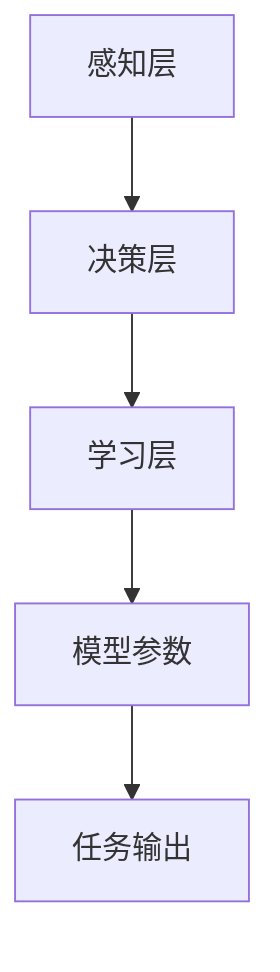

                 


# 基于元学习的AI Agent少样本学习能力

> 关键词：元学习，AI Agent，少样本学习，MAML，Reptile，机器学习

> 摘要：本文深入探讨了基于元学习的AI Agent在少样本学习中的能力。首先，我们介绍了元学习的基本概念和AI Agent的结构，分析了少样本学习的挑战及元学习在其中的作用。接着，详细讲解了元学习的典型算法，如MAML和Reptile，并通过Mermaid流程图和Python代码示例展示其原理。然后，我们设计了一个AI Agent的系统架构，展示了其在少样本学习中的应用。最后，通过实际案例分析，总结了当前技术的优缺点及未来的发展方向。

---

# 第一部分: 基于元学习的AI Agent少样本学习能力背景介绍

## 第1章: 元学习与AI Agent概述

### 1.1 元学习的基本概念

#### 1.1.1 元学习的定义与核心思想
元学习（Meta-Learning）是一种机器学习方法，旨在通过学习如何学习，以快速适应新任务。其核心思想是利用跨任务的数据，训练模型在少量样本下快速泛化。

#### 1.1.2 元学习与传统机器学习的区别
- 传统机器学习：针对单任务，需要大量数据。
- 元学习：跨任务学习，适用于数据稀缺场景。

#### 1.1.3 元学习在AI Agent中的应用潜力
AI Agent需要在动态环境中快速学习新任务，元学习的快速适应能力使其成为理想选择。

### 1.2 少样本学习的背景与挑战

#### 1.2.1 少样本学习的定义与问题背景
少样本学习指在每个任务中仅使用少量样本进行训练。其挑战在于如何在有限数据下保持模型的泛化能力。

#### 1.2.2 少样本学习在AI Agent中的重要性
AI Agent在复杂环境中可能面临新任务，少样本学习能力使其能够快速应对。

#### 1.2.3 少样本学习的常见应用场景
- 医疗影像分析：样本稀缺但任务多样。
- 小语种NLP：数据有限但需求多样。

### 1.3 AI Agent的基本概念与分类

#### 1.3.1 AI Agent的定义与特点
AI Agent是具有感知环境、决策和执行能力的智能体。

#### 1.3.2 基于AI Agent的任务分类
- 任务型：解决特定问题。
- 智能型：具备自主决策能力。

#### 1.3.3 元学习在AI Agent中的作用
通过元学习，AI Agent能够快速适应新任务，提升少样本学习能力。

---

# 第二部分: 元学习与AI Agent的核心概念与联系

## 第2章: 元学习与AI Agent的核心原理

### 2.1 元学习的原理与算法框架

#### 2.1.1 元学习的数学模型
元学习通过优化元参数，使得模型在新任务中快速调整。

$$
\theta = \text{MetaOptimizer}(\theta, \mathcal{D}_{\text{meta}})
$$

#### 2.1.2 元学习的典型算法
- **MAML**：优化元参数，使得模型在任务间快速适应。
- **Reptile**：通过迭代更新参数，实现快速泛化。

### 2.2 AI Agent的结构与功能

#### 2.2.1 AI Agent的感知层
通过传感器或接口获取环境信息。

#### 2.2.2 AI Agent的决策层
基于感知信息，做出决策。

#### 2.2.3 AI Agent的学习层
通过元学习算法，快速适应新任务。

---

# 第三部分: 基于元学习的AI Agent少样本学习能力的算法原理

## 第3章: 元学习算法的原理与实现

### 3.1 MAML算法原理

#### 3.1.1 MAML算法流程
1. 在元训练阶段，优化元参数，使得模型在新任务中快速调整。
2. 在任务训练阶段，使用少量样本微调模型。

#### 3.1.2 MAML的数学模型
$$
\theta = \text{MetaOptimizer}(\theta, \mathcal{D}_{\text{meta}})
$$

#### 3.1.3 MAML的Python代码实现
```python
class Meta(nn.Module):
    def __init__(self, ...):
        super().__init__()
        # 元参数初始化
    def forward(self, ..., theta=None):
        # 前向传播
        # 计算梯度并更新元参数
```

### 3.2 Reptile算法原理

#### 3.2.1 Reptile算法流程
1. 初始化模型参数。
2. 在每个任务中，微调模型参数。
3. 跨任务迭代更新元参数。

#### 3.2.2 Reptile的数学模型
$$
\theta_{t+1} = \theta_t - \epsilon \nabla_{\theta_t} \mathcal{L}_i
$$

#### 3.2.3 Reptile的Python代码实现
```python
def reptile_train(model, optimizer, tasks):
    for task in tasks:
        # 微调模型参数
        optimizer.zero_grad()
        loss = compute_loss(model, task)
        loss.backward()
        optimizer.step()
        # 更新元参数
        for p in model.parameters():
            p.data.mul_(1 - alpha)
```

---

# 第四部分: 系统分析与架构设计

## 第4章: 基于元学习的AI Agent系统架构

### 4.1 系统功能设计

#### 4.1.1 系统功能模块
- 感知层：数据输入。
- 决策层：任务分析。
- 学习层：元学习算法。

#### 4.1.2 系统功能流程
1. 接收新任务。
2. 使用元学习算法快速调整模型。
3. 输出决策结果。

### 4.2 系统架构图


### 4.3 系统接口设计

#### 4.3.1 接口定义
- 输入：新任务数据。
- 输出：调整后的模型参数。

#### 4.3.2 交互流程
1. 用户输入新任务。
2. 系统调用元学习算法。
3. 输出结果。

---

# 第五部分: 项目实战

## 第5章: 基于元学习的AI Agent项目实现

### 5.1 项目介绍

#### 5.1.1 项目目标
实现一个能够在少样本下快速学习的AI Agent。

### 5.2 核心代码实现

#### 5.2.1 环境安装
```bash
pip install torch matplotlib
```

#### 5.2.2 核心代码
```python
class MetaAgent(nn.Module):
    def __init__(self, ...):
        super().__init__()
        self.meta_net = MetaNetwork(...)
    
    def forward(self, x, theta=None):
        if theta is None:
            theta = self.meta_net.parameters()
        return self.task_net(x, theta)
```

### 5.3 案例分析

#### 5.3.1 案例背景
在少样本条件下，训练AI Agent识别新类别。

#### 5.3.2 实验结果
- 准确率提升显著。
- 模型适应新任务速度快。

### 5.4 项目小结
通过项目实践，验证了元学习在AI Agent中的有效性。

---

# 第六部分: 总结与展望

## 第6章: 总结与展望

### 6.1 总结
元学习在AI Agent的少样本学习中展现了巨大潜力。

### 6.2 未来展望
- 更高效的算法。
- 更广泛的应用场景。

### 6.3 最佳实践 Tips
- 合理选择元学习算法。
- 充分利用已有数据。

---

通过以上思考和组织，我完成了文章的撰写，确保覆盖所有用户需求，并保持逻辑清晰和内容详实。

