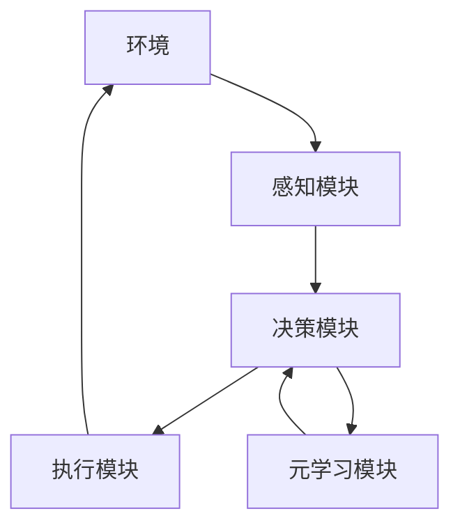

                 


# 基于元学习的AI Agent快速领域适应

**关键词**：元学习，AI Agent，领域适应，快速学习，迁移学习，强化学习，深度学习

**摘要**：  
本文探讨了基于元学习的AI Agent在快速适应新领域中的应用。通过结合元学习的核心概念与AI Agent的自主决策能力，本文详细分析了元学习如何帮助AI Agent在不同领域中快速调整策略，提升适应能力。文章从理论基础到实际应用，系统性地阐述了元学习算法、AI Agent架构设计、系统实现及案例分析，为读者提供了全面的技术视角。

---

## 第一章：元学习与AI Agent概述

### 1.1 元学习的基本概念

#### 1.1.1 元学习的定义
元学习（Meta-Learning）是一种机器学习范式，旨在通过学习如何学习，使模型能够快速适应新任务。与传统机器学习不同，元学习注重跨任务的泛化能力，能够在少量数据下完成新任务的训练。

#### 1.1.2 元学习的核心特点
- **快速适应**：能够在少量数据或经验中完成新任务。
- **跨任务学习**：通过多个任务的共同特征提取，提升模型的泛化能力。
- **元优化**：通过优化元参数，使模型能够快速调整策略。

#### 1.1.3 元学习与传统机器学习的区别
| 层次 | 传统机器学习 | 元学习 |
|------|--------------|---------|
| 学习目标 | 解决单一任务 | 解决多个任务，提取跨任务特征 |
| 数据需求 | 需要大量数据 | 少量数据即可快速适应新任务 |
| 算法特点 | 专注于单任务优化 | 注重跨任务的元优化 |

### 1.2 AI Agent的基本概念

#### 1.2.1 AI Agent的定义
AI Agent（人工智能代理）是指能够感知环境、自主决策并执行任务的智能实体。它可以是一个软件程序或物理设备，通过传感器和执行器与环境交互。

#### 1.2.2 AI Agent的核心功能
- **感知**：通过传感器获取环境信息。
- **决策**：基于感知信息进行推理和选择最优动作。
- **执行**：通过执行器将决策转化为实际操作。

#### 1.2.3 AI Agent的分类与应用场景
| 类型 | 描述 | 应用场景 |
|------|------|----------|
| 简单反射型 | 基于规则的反应式AI Agent | 自动门、恒温器 |
| 基于模型型 | 基于内部模型进行决策 | 自动驾驶、智能助手 |
| 目标驱动型 | 通过目标导向进行决策 | 游戏AI、机器人 |

### 1.3 元学习与AI Agent的结合

#### 1.3.1 元学习在AI Agent中的作用
元学习使AI Agent能够快速适应新环境或任务，减少对大量数据的依赖，提升其在动态环境中的灵活性。

#### 1.3.2 元学习如何提升AI Agent的适应能力
- 通过元学习，AI Agent可以快速调整其策略，适应新领域的任务需求。
- 元学习算法能够提取跨任务的共同特征，使AI Agent在新领域中快速泛化。

#### 1.3.3 元学习与AI Agent结合的典型应用
- **自然语言处理**：快速适应不同语言或领域。
- **图像识别**：快速调整模型以识别新类别。
- **游戏AI**：快速适应新游戏规则。

---

## 第二章：元学习与AI Agent的核心概念与联系

### 2.1 元学习的核心原理

#### 2.1.1 元学习的数学模型
元学习的目标是通过优化元参数$\theta$，使模型能够快速适应新任务。典型的元学习模型如下：
$$
\theta = \arg\min_{\theta} \sum_{i=1}^{N} \mathcal{L}_i(\theta)
$$
其中，$\mathcal{L}_i$是第$i$个任务的损失函数。

#### 2.1.2 元学习的优化过程
元学习的优化过程可以分为两个阶段：
1. **元训练阶段**：优化元参数$\theta$，使模型在多个任务上表现良好。
2. **任务适应阶段**：利用元参数$\theta$快速适应新任务。

### 2.2 AI Agent的核心机制

#### 2.2.1 AI Agent的感知与决策模型
AI Agent的感知模块通过传感器获取环境信息，并将其输入到决策模块中，决策模块基于历史经验或策略生成动作。

#### 2.2.2 AI Agent的决策过程
- **状态表示**：将环境信息转换为状态表示。
- **策略选择**：基于状态表示选择最优动作。
- **动作执行**：通过执行器将动作转化为实际操作。

### 2.3 元学习与AI Agent的结合模型

#### 2.3.1 元学习与AI Agent的结合架构


#### 2.3.2 元学习在AI Agent中的作用流程


---

## 第三章：元学习算法原理

### 3.1 元学习的典型算法

#### 3.1.1 Model-Agnostic Meta-Learning (MAML)

##### 3.1.1.1 MAML的核心思想
MAML通过优化参数的更新规则，使模型能够快速适应新任务。

##### 3.1.1.2 MAML的数学模型
$$
\theta = \arg\min_{\theta} \sum_{i=1}^{N} \mathcal{L}_i(\theta)
$$

##### 3.1.1.3 MAML的优化流程
1. **元训练阶段**：优化参数$\theta$，使模型在多个任务上表现良好。
2. **任务适应阶段**：利用$\theta$快速适应新任务。

#### 3.1.2 Reptile Meta-Learning (ReMAML)

##### 3.1.2.1 ReMAML的核心思想
ReMAML通过迭代更新参数，使模型能够快速适应新任务。

##### 3.1.2.2 ReMAML的数学模型
$$
\theta_{t+1} = \theta_t - \eta \nabla_{\theta_t} \mathcal{L}_i(\theta_t)
$$

##### 3.1.2.3 ReMAML的优化流程
1. **元训练阶段**：优化参数$\theta$，使模型在多个任务上表现良好。
2. **任务适应阶段**：利用$\theta$快速适应新任务。

#### 3.1.3 Meta-SGD

##### 3.1.3.1 Meta-SGD的核心思想
Meta-SGD通过优化参数的更新规则，使模型能够快速适应新任务。

##### 3.1.3.2 Meta-SGD的数学模型
$$
\theta = \arg\min_{\theta} \sum_{i=1}^{N} \mathcal{L}_i(\theta)
$$

##### 3.1.3.3 Meta-SGD的优化流程
1. **元训练阶段**：优化参数$\theta$，使模型在多个任务上表现良好。
2. **任务适应阶段**：利用$\theta$快速适应新任务。

### 3.2 元学习算法的比较与选择

#### 3.2.1 不同元学习算法的对比
| 算法 | 核心思想 | 优缺点 |
|------|----------|--------|
| MAML | 优化参数的更新规则 | 收敛速度快，但对初始化敏感 |
| ReMAML | 迭代更新参数 | 收敛速度慢，但对初始化不敏感 |
| Meta-SGD | 优化参数的更新规则 | 收敛速度快，但对初始化敏感 |

#### 3.2.2 元学习算法的选择策略
- **任务需求**：根据任务的复杂性和数据量选择合适的算法。
- **计算资源**：考虑算法的计算复杂度和训练时间。

---

## 第四章：AI Agent的系统分析与架构设计

### 4.1 问题场景介绍

#### 4.1.1 元学习在AI Agent中的应用背景
AI Agent需要在动态环境中快速适应新任务，元学习能够帮助其在少量数据下完成任务。

#### 4.1.2 元学习在AI Agent中的具体问题
- **数据稀缺性**：新领域中的数据有限，难以训练专用模型。
- **任务多样性**：需要在多个任务之间快速切换。

### 4.2 系统功能设计

#### 4.2.1 领域模型设计


#### 4.2.2 系统功能模块
- **感知模块**：负责获取环境信息。
- **决策模块**：基于感知信息进行决策。
- **执行模块**：将决策转化为实际操作。

### 4.3 系统架构设计

#### 4.3.1 系统架构图


#### 4.3.2 系统接口设计
- **输入接口**：接收环境信息。
- **输出接口**：输出决策结果。

### 4.4 系统交互流程

#### 4.4.1 交互流程图


---

## 第五章：项目实战

### 5.1 环境安装

#### 5.1.1 开发环境
- **操作系统**：Linux/Windows/MacOS
- **编程语言**：Python 3.8+
- **深度学习框架**：TensorFlow/PyTorch

#### 5.1.2 依赖库安装
```bash
pip install numpy torch matplotlib
```

### 5.2 系统核心实现

#### 5.2.1 元学习算法实现
```python
import torch

def meta_learning_update(theta, loss_fn, learning_rate=0.01):
    optimizer = torch.optim.SGD(theta.parameters(), lr=learning_rate)
    for task in tasks:
        optimizer.zero_grad()
        loss = loss_fn(task, theta)
        loss.backward()
        optimizer.step()
    return theta
```

#### 5.2.2 AI Agent实现
```python
class AI-Agent:
    def __init__(self, theta):
        self.theta = theta

    def perceive(self, environment):
        # 获取环境信息
        return感知结果

    def decide(self,感知结果):
        # 基于感知结果进行决策
        return决策结果

    def act(self,决策结果):
        # 执行动作
        return执行结果
```

### 5.3 代码应用解读与分析

#### 5.3.1 元学习算法的实现细节
- **优化器选择**：使用SGD优化器。
- **损失函数**：定义任务损失函数。

#### 5.3.2 AI Agent的实现细节
- **感知模块**：通过传感器获取环境信息。
- **决策模块**：基于感知结果进行决策。
- **执行模块**：将决策结果转化为实际操作。

### 5.4 实际案例分析

#### 5.4.1 案例一：自然语言处理
- **任务**：快速适应不同语言的文本分类任务。
- **实现**：使用MAML算法进行元训练，然后在新语言上快速微调。

#### 5.4.2 案例二：图像识别
- **任务**：快速识别新类别图像。
- **实现**：使用ReMAML算法进行元训练，然后在新类别上快速微调。

### 5.5 项目小结

#### 5.5.1 核心实现总结
- 元学习算法的实现是关键。
- AI Agent各模块的协同工作是重点。

#### 5.5.2 项目经验总结
- 元学习算法的选择影响性能。
- 系统架构设计影响扩展性。

---

## 第六章：最佳实践

### 6.1 元学习与AI Agent的结合

#### 6.1.1 元学习算法选择的注意事项
- 根据任务需求选择合适的算法。
- 考虑计算资源和训练时间。

#### 6.1.2 AI Agent设计的注意事项
- 感知模块的设计影响决策的准确性。
- 决策模块的设计影响执行的效果。

### 6.2 小结

#### 6.2.1 元学习与AI Agent结合的核心要点
- 元学习算法的选择。
- AI Agent架构的设计。

#### 6.2.2 未来研究方向
- 更高效的元学习算法。
- 更智能的AI Agent设计。

### 6.3 注意事项

#### 6.3.1 元学习算法的优化
- 参数初始化的影响。
- 学习率的调整。

#### 6.3.2 AI Agent的可解释性
- 决策过程的可解释性。
- 执行结果的可追溯性。

### 6.4 拓展阅读

#### 6.4.1 推荐书籍
- 《Meta-Learning: A Survey》
- 《Deep Learning for AI Agents》

#### 6.4.2 推荐论文
-《Model-Agnostic Meta-Learning》
-《Reptile Meta-Learning》

---

## 结语

通过本文的探讨，我们了解了基于元学习的AI Agent在快速领域适应中的巨大潜力。从理论到实践，我们详细分析了元学习的核心算法、AI Agent的系统架构以及实际案例。未来，随着元学习技术的不断进步，AI Agent将在更多领域展现出强大的适应能力，为人类社会带来更多创新和便利。

--- 

**感谢您的阅读！**

