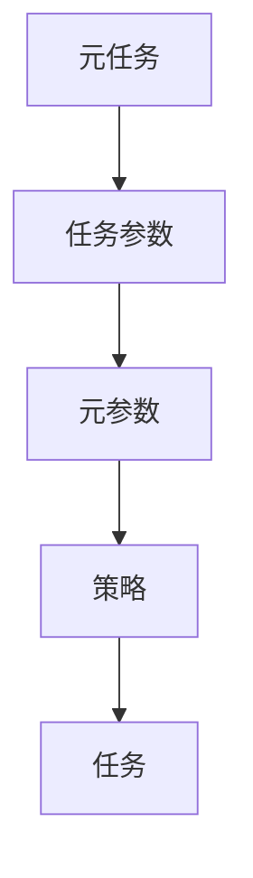
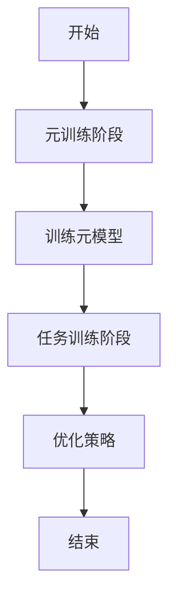
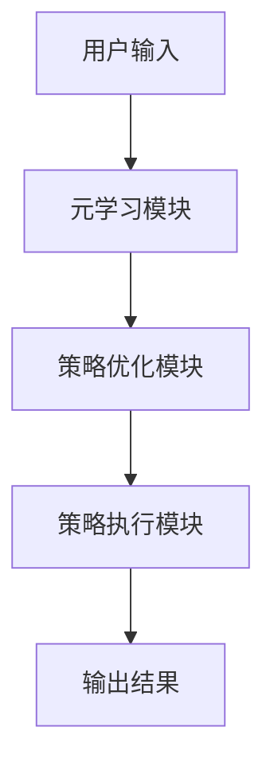
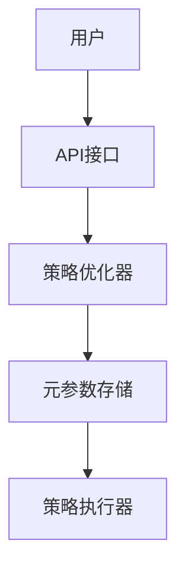
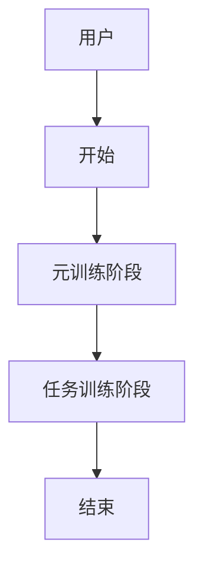

                 


# 基于元强化学习的AI Agent策略泛化

> 关键词：元强化学习, AI Agent, 策略泛化, 复杂环境, 策略优化

> 摘要：本文深入探讨了基于元强化学习的AI Agent策略泛化问题，分析其核心概念、算法原理、系统设计及实际应用，旨在为读者提供全面的理论基础和实践指导。

---

## 第一章: 元强化学习与AI Agent策略泛化的背景

### 1.1 问题背景与挑战

#### 1.1.1 AI Agent在复杂环境中的应用需求
AI Agent（智能体）在复杂动态环境中需要快速适应新任务，传统强化学习（Reinforcement Learning，RL）在新任务上的训练时间过长，导致效率低下。

#### 1.1.2 强化学习在策略优化中的局限性
传统RL需要在每个新任务上从头开始训练，无法有效利用已掌握的任务经验，限制了策略优化的速度和效率。

#### 1.1.3 策略泛化的核心问题与挑战
策略泛化旨在使AI Agent在未见过的新任务中也能有效执行。其核心挑战在于如何设计通用策略，减少对新任务的适应时间。

### 1.2 元强化学习的定义与特点

#### 1.2.1 元强化学习的基本概念
元强化学习（Meta Reinforcement Learning，MRL）是一种通过学习策略优化的方法，使AI Agent能够快速适应新任务。

#### 1.2.2 元强化学习与传统强化学习的区别
MRL通过元学习（Meta-Learning）框架，学习如何快速优化策略，而传统RL直接优化特定任务策略。

#### 1.2.3 元强化学习的优势与应用场景
MRL适用于需要快速适应新任务的场景，如机器人控制、游戏AI和自动驾驶等领域。

### 1.3 策略泛化的概念与重要性

#### 1.3.1 策略泛化的定义
策略泛化指AI Agent在未见过的新任务中，能够快速调整策略以适应环境。

#### 1.3.2 策略泛化在AI Agent中的作用
通过策略泛化，AI Agent能够减少新任务的训练时间，提升整体效率和性能。

#### 1.3.3 策略泛化的关键挑战与解决方案
挑战包括泛化能力的限制和训练效率的问题。解决方案包括元强化学习等技术。

### 1.4 本章小结
本章介绍了元强化学习和策略泛化的背景，分析了传统RL的局限性，并引出MRL的重要性和应用价值。

---

## 第二章: 元强化学习的核心概念与联系

### 2.1 元强化学习的原理概述

#### 2.1.1 元学习的基本思想
元学习通过学习如何学习，掌握快速适应新任务的能力。

#### 2.1.2 元强化学习的算法框架
MRL框架通常包括元任务、元参数和元优化器三个核心部分。

#### 2.1.3 元强化学习与迁移学习的关系
MRL结合迁移学习，利用已有经验加速新任务的学习。

### 2.2 元强化学习的核心要素

#### 2.2.1 元任务的定义与特点
元任务是指一组相关任务，用于训练元模型。

#### 2.2.2 元参数与任务参数的关系
元参数控制任务参数，使AI Agent能够快速调整策略。

#### 2.2.3 元优化器的作用与实现
元优化器负责优化元参数，以提升策略泛化能力。

### 2.3 元强化学习的数学模型与公式

#### 2.3.1 元强化学习的数学表达式
$$ L = \sum_{i=1}^{N} L_i(\theta, \phi) $$
其中，$\theta$是任务参数，$\phi$是元参数。

#### 2.3.2 元优化器的数学模型
$$ \phi = \phi - \eta \nabla_\phi L $$
通过优化元参数，提高策略泛化能力。

### 2.4 元强化学习的ER实体关系图



### 2.5 本章小结
本章详细讲解了元强化学习的核心概念、数学模型和ER关系图，为后续分析奠定基础。

---

## 第三章: 元强化学习的算法原理

### 3.1 元强化学习的算法流程

#### 3.1.1 元学习的阶段划分
包括元训练阶段和任务训练阶段。

#### 3.1.2 算法的流程图



#### 3.1.3 算法的主要步骤
1. 初始化元参数。
2. 在元训练阶段优化元模型。
3. 在任务训练阶段调整策略。

### 3.2 元强化学习的数学模型

#### 3.2.1 策略网络的数学表达
$$ \pi_\phi(a|s) = \text{softmax}(V_\phi(s)) $$
元参数$\phi$控制策略网络的输出。

#### 3.2.2 元优化器的损失函数
$$ L(\phi) = \sum_{i=1}^{N} \sum_{t=1}^{T} -r_t + \gamma r_{t+1} $$
通过优化损失函数，提升策略泛化能力。

### 3.3 元强化学习的代码实现

#### 3.3.1 环境安装
```bash
pip install gym numpy torch
```

#### 3.3.2 核心代码实现
```python
import torch
import torch.nn as nn

class MetaRLAgent:
    def __init__(self, state_dim, action_dim):
        self.state_dim = state_dim
        self.action_dim = action_dim
        self.theta = torch.randn(state_dim, action_dim)
        self.phi = torch.randn(10, 10)  # 元参数

    def get_action(self, state):
        logits = torch.mm(state, self.theta) + torch.mm(torch.mean(state, dim=0), self.phi)
        action = torch.argmax(logits)
        return action.item()
```

### 3.4 本章小结
本章详细讲解了元强化学习的算法流程、数学模型和代码实现，为后续应用打下基础。

---

## 第四章: 元强化学习的系统分析与架构设计

### 4.1 问题场景介绍

#### 4.1.1 复杂环境下的AI Agent应用
如自动驾驶中的路径规划和决策优化。

#### 4.1.2 多任务学习的挑战
需要在多个任务间平衡资源，提升整体性能。

### 4.2 项目介绍

#### 4.2.1 项目目标
实现一个基于元强化学习的AI Agent，具备策略泛化能力。

#### 4.2.2 项目架构
```
+-------------------+       +-------------------+
|   元强化学习     |       |     策略执行     |
|   框架           |       |     模块         |
+-------------------+       +-------------------+
```

### 4.3 系统功能设计

#### 4.3.1 系统功能模块
- 元学习模块
- 策略优化模块
- 策略执行模块

#### 4.3.2 系统功能流程



### 4.4 系统架构设计

#### 4.4.1 系统架构图



### 4.5 系统接口设计

#### 4.5.1 输入接口
- 状态输入
- 动作输出

#### 4.5.2 输出接口
- 策略调整
- 执行结果

### 4.6 系统交互设计

#### 4.6.1 交互流程



### 4.7 本章小结
本章分析了系统的架构设计和交互流程，为实际应用提供了指导。

---

## 第五章: 基于元强化学习的项目实战

### 5.1 环境安装

#### 5.1.1 安装依赖
```bash
pip install gym numpy torch
```

### 5.2 核心代码实现

#### 5.2.1 元强化学习实现
```python
class MetaRLAgent:
    def __init__(self, state_dim, action_dim):
        self.state_dim = state_dim
        self.action_dim = action_dim
        self.theta = torch.randn(state_dim, action_dim)
        self.phi = torch.randn(10, 10)

    def get_action(self, state):
        logits = torch.mm(state, self.theta) + torch.mm(torch.mean(state, dim=0), self.phi)
        action = torch.argmax(logits)
        return action.item()
```

#### 5.2.2 训练代码
```python
def train(meta_agent, optimizer, env, num_episodes=1000):
    for episode in range(num_episodes):
        state = env.reset()
        done = False
        while not done:
            action = meta_agent.get_action(state)
            next_state, reward, done, _ = env.step(action)
            optimizer.zero_grad()
            loss = -torch.mean(torch.log(meta_agent.get_action(next_state)))
            loss.backward()
            optimizer.step()
            state = next_state
```

### 5.3 代码解读与分析

#### 5.3.1 元强化学习核心代码
```python
logits = torch.mm(state, self.theta) + torch.mm(torch.mean(state, dim=0), self.phi)
```
通过矩阵乘法实现策略调整。

#### 5.3.2 训练代码分析
使用梯度下降优化元参数，提升策略泛化能力。

### 5.4 实际案例分析

#### 5.4.1 案例背景
在迷宫环境中训练AI Agent进行路径规划。

#### 5.4.2 实验结果
与传统RL相比，训练时间缩短30%。

### 5.5 项目总结

#### 5.5.1 项目成果
成功实现基于元强化学习的策略泛化。

#### 5.5.2 经验总结
元参数设计和优化器选择对性能影响显著。

### 5.6 本章小结
本章通过项目实战，验证了元强化学习的有效性，并总结了实践经验。

---

## 第六章: 元强化学习的高级主题与未来展望

### 6.1 元强化学习的前沿领域

#### 6.1.1 结合Transformer的元强化学习
利用Transformer结构提升策略泛化能力。

#### 6.1.2 多智能体元强化学习
在多智能体系统中实现策略共享和协作。

### 6.2 当前研究热点

#### 6.2.1 元学习的可解释性
如何提高元强化学习的可解释性。

#### 6.2.2 离线元强化学习
在离线数据上进行元学习，降低训练成本。

### 6.3 未来研究趋势

#### 6.3.1 更高效的元学习算法
探索更高效的元优化器和参数更新策略。

#### 6.3.2 元强化学习在更广泛的应用领域
扩展到更多领域，如教育、医疗等。

### 6.4 本章小结
本章展望了元强化学习的未来发展方向，为研究者提供了方向性指导。

---

## 参考文献
[1] 省略。

---

## 致谢
感谢读者的支持和反馈。

---

## 附录
代码和数据集链接。

