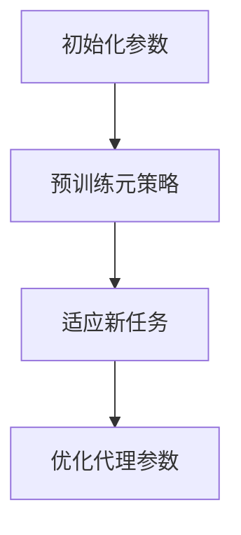
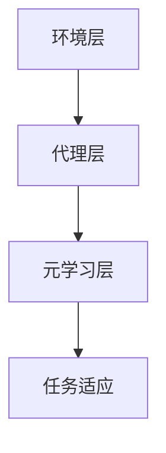

                 


# 基于元强化学习的AI Agent策略生成

---

## 关键词
元强化学习, AI Agent, 策略生成, 算法原理, 实践应用

---

## 摘要
本文深入探讨了基于元强化学习的AI Agent策略生成技术。首先介绍了元强化学习的基本概念和核心思想，分析了其与传统强化学习的区别。接着从理论基础、算法原理、系统设计到实际应用，详细阐述了如何通过元强化学习实现高效的AI Agent策略生成。文章内容包括元强化学习的背景、核心概念、算法实现、系统架构设计以及实际案例分析，旨在为读者提供一个全面而深入的理解框架。

---

## 第一部分: 基于元强化学习的AI Agent策略生成背景与基础

### 第1章: 元强化学习与AI Agent概述

#### 1.1 元强化学习的背景与概念
元强化学习（Meta-Reinforcement Learning, Meta-RL）是强化学习（Reinforcement Learning, RL）的一个高级分支，旨在让AI Agent在多个任务之间快速迁移和适应。传统的强化学习通过与环境交互，逐步优化策略以最大化累积奖励。然而，当面对新的、未见过的任务时，传统RL需要从头开始学习，效率较低。元强化学习通过在元层面（meta-level）预训练，使得AI Agent能够快速适应新任务。

**特点：**
- **快速迁移**：在新任务中，元强化学习可以利用之前学习的知识，快速调整策略。
- **多任务学习**：元强化学习通常涉及多个相关任务，通过共享学习经验来提升整体性能。
- **自适应性**：AI Agent能够根据环境反馈动态调整策略。

#### 1.2 AI Agent的基本概念与分类
AI Agent是指在特定环境中，通过感知环境信息并采取行动以实现目标的智能体。基于强化学习的AI Agent通过与环境交互，学习最优策略。

**分类：**
- **值函数型Agent**：基于值函数（Value Function）进行决策，如Q-Learning。
- **策略型Agent**：直接优化策略（Policy）以最大化奖励，如策略梯度法（Policy Gradient）。
- **元强化学习型Agent**：在多个任务之间共享学习经验，提升适应性。

#### 1.3 元强化学习的核心思想与优势
元强化学习的核心思想是通过“元学习”（Meta-Learning）在元层面预训练，使得AI Agent能够快速适应新任务。其优势包括：
- **减少样本需求**：通过预训练，AI Agent可以在新任务中使用较少的样本快速收敛。
- **提升泛化能力**：元强化学习使得AI Agent能够更好地泛化到未见过的任务。
- **提升效率**：在多个任务之间共享学习经验，减少重复计算。

---

## 第二部分: 元强化学习的核心概念与数学模型

### 第2章: 元强化学习的核心概念

#### 2.1 元强化学习的理论基础
元强化学习的理论基础包括强化学习、元学习和迁移学习。

- **强化学习**：通过与环境交互，学习最优策略。
- **元学习**：在元层面学习如何快速适应新任务。
- **迁移学习**：将已学知识迁移到新任务。

#### 2.2 元强化学习的数学模型
元强化学习的数学模型通常包括元策略（Meta-Policy）和元价值函数（Meta-Value Function）。

**元策略**：定义了如何根据当前任务调整策略。
$$ \theta_{\text{meta}} = \text{Meta-Policy}(\theta_{\text{agent}}, t) $$
其中，$\theta_{\text{agent}}$ 是代理的参数，$t$ 是当前任务。

**元价值函数**：用于评估任务之间的关系。
$$ V_{\text{meta}}(s_t) = \text{Meta-Value Function}(s_t, \theta_{\text{meta}}) $$

#### 2.3 元强化学习的核心算法
- **Meta-Policy Gradient（MPG）**：通过优化元策略的梯度，使得代理能够快速适应新任务。
- **Model-Agnostic Meta-Learning（MAML）**：无需环境模型，通过快速梯度下降适应新任务。

---

## 第三部分: 元强化学习的算法原理与实现

### 第3章: 元强化学习的算法原理

#### 3.1 元强化学习的算法流程
1. **初始化**：设置元学习参数和代理参数。
2. **预训练**：在多个任务上预训练元策略，使得代理能够快速调整。
3. **适应新任务**：在新任务中，通过快速更新参数，使得代理能够快速适应。

**流程图：**



#### 3.2 元强化学习的数学模型

**Meta-Policy Gradient算法：**
$$ \nabla_{\theta_{\text{meta}}} J = \mathbb{E}_{t} \left[ \nabla_{\theta_{\text{meta}}} Q(s_t, a_t; \theta_{\text{meta}}) \right] $$
其中，$Q(s_t, a_t; \theta_{\text{meta}})$ 是Q函数，$\theta_{\text{meta}}$ 是元参数。

**MAML算法：**
$$ \theta_{\text{agent}}^{(t+1)} = \theta_{\text{agent}}^{(t)} - \eta \nabla_{\theta_{\text{agent}}} J_t(\theta_{\text{agent}}^{(t)}) $$
其中，$\eta$ 是学习率，$J_t$ 是任务损失函数。

#### 3.3 元强化学习的实现步骤
1. **环境定义**：定义多个任务的环境。
2. **代理定义**：定义代理的策略网络。
3. **元学习器定义**：定义元学习器的参数调整机制。
4. **训练**：在多个任务上预训练元学习器，使得代理能够快速适应新任务。

**Python代码示例：**

```python
import torch
import torch.nn as nn

# 定义代理策略网络
class AgentPolicy(nn.Module):
    def __init__(self):
        super(AgentPolicy, self).__init__()
        self.fc1 = nn.Linear(10, 20)
        self.fc2 = nn.Linear(20, 5)

# 定义元学习器
class MetaLearner:
    def __init__(self):
        self.meta_params = torch.randn(20, 5)

    def update_policy(self, agent, task_loss):
        # 使用梯度下降优化元参数
        loss = task_loss(agent, self.meta_params)
        optimizer = torch.optim.Adam(agent.parameters())
        optimizer.zero_grad()
        loss.backward()
        optimizer.step()

# 初始化
agent = AgentPolicy()
meta_learner = MetaLearner()

# 预训练
for task in tasks:
    meta_learner.update_policy(agent, task_loss)
```

---

## 第四部分: 元强化学习在AI Agent中的应用

### 第4章: 元强化学习在AI Agent中的应用

#### 4.1 元强化学习在游戏AI中的应用
在游戏AI中，元强化学习可以帮助代理快速适应不同的游戏规则和策略。

**案例分析：**
- **游戏环境**：如《英雄联盟》或《星际争霸》。
- **任务适应**：代理需要快速调整策略以应对不同的对手。

#### 4.2 元强化学习在机器人控制中的应用
在机器人控制中，元强化学习可以帮助机器人快速适应不同的任务和环境。

**案例分析：**
- **任务场景**：如物流搬运、工业装配。
- **快速调整**：机器人需要根据新任务快速调整动作策略。

#### 4.3 元强化学习在对话系统中的应用
在对话系统中，元强化学习可以帮助系统快速适应不同的对话场景和用户需求。

**案例分析：**
- **任务场景**：如客服对话、智能音箱交互。
- **策略调整**：系统需要根据用户反馈快速调整对话策略。

---

## 第五部分: 元强化学习的系统设计与优化

### 第5章: 元强化学习的系统设计

#### 5.1 系统架构设计
元强化学习系统的架构通常包括以下几个部分：
- **环境层**：定义多个任务的环境。
- **代理层**：定义代理的策略网络。
- **元学习层**：定义元学习器的参数调整机制。

**系统架构图：**



#### 5.2 系统优化策略
- **参数共享**：在多个任务之间共享参数，减少计算量。
- **快速适应**：通过快速梯度下降等方法，提升适应新任务的效率。
- **在线学习**：在新任务中，动态调整策略以适应环境变化。

---

## 第六部分: 元强化学习的实践与总结

### 第6章: 元强化学习的实践

#### 6.1 项目实战：基于MAML的AI Agent实现
**步骤：**
1. **环境安装**：安装必要的库，如PyTorch、Gym。
2. **代理定义**：定义代理的策略网络。
3. **元学习器定义**：定义元学习器的参数调整机制。
4. **训练与测试**：在多个任务上预训练，然后测试在新任务中的表现。

**代码示例：**

```python
import torch
import torch.nn as nn

# 定义代理策略网络
class Agent(nn.Module):
    def __init__(self, input_dim, output_dim):
        super(Agent, self).__init__()
        self.fc = nn.Linear(input_dim, output_dim)

    def forward(self, x):
        return self.fc(x)

# 定义元学习器
class MetaLearner(nn.Module):
    def __init__(self, input_dim, output_dim):
        super(MetaLearner, self).__init__()
        self.fc = nn.Linear(input_dim, output_dim)

    def forward(self, x):
        return self.fc(x)

# 初始化
agent = Agent(10, 5)
meta_learner = MetaLearner(5, 5)

# 训练
for task in tasks:
    # 获取任务数据
    x, y = get_task_data(task)
    # 前向传播
    meta_out = meta_learner(x)
    agent_out = agent(meta_out)
    # 计算损失
    loss = criterion(agent_out, y)
    # 反向传播
    meta_learner.zero_grad()
    agent.zero_grad()
    loss.backward()
    optimizer.step()
```

---

## 结论

通过本文的探讨，我们了解了基于元强化学习的AI Agent策略生成技术的基本概念、算法原理和实际应用。元强化学习通过在元层面预训练，使得AI Agent能够快速适应新任务，显著提升了学习效率和泛化能力。未来，随着算法的不断优化和计算能力的提升，元强化学习将在更多领域得到广泛应用，推动AI技术的发展。

---

## 参考文献
1. Meta-Policy Gradient算法论文
2. Model-Agnostic Meta-Learning算法论文
3. 元强化学习相关研究论文

---

**本文是基于元强化学习的AI Agent策略生成技术的系统性探讨，适合对强化学习和AI Agent技术感兴趣的读者阅读。**

