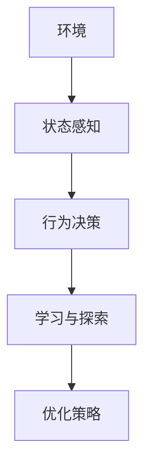

                 


# 基于元控制的AI Agent自主学习与探索

---

## 关键词：
AI Agent，元控制，自主学习，强化学习，自适应系统，系统架构

---

## 摘要：
本文深入探讨了基于元控制的AI Agent在自主学习与探索中的应用。通过分析元控制的基本原理、算法实现、系统架构以及实际案例，揭示了元控制如何帮助AI Agent实现高效的学习和决策。文章内容涵盖从理论到实践的各个方面，旨在为研究人员和开发者提供一份全面的指南，以更好地理解和应用这一前沿技术。

---

## 第一部分：背景与概念

### 第1章：问题背景与描述

#### 1.1 问题背景
传统AI Agent在面对复杂环境时，往往依赖于预定义的规则和固定的策略，这限制了其适应性和灵活性。随着人工智能技术的快速发展，AI Agent需要具备更强的自主学习和探索能力，以应对动态变化的环境。

#### 1.2 问题描述
AI Agent的自主学习与探索能力是指其能够在未知或部分已知的环境中，通过试错和经验积累，优化自身的行为策略。元控制（Meta-control）是一种新兴的技术，它通过在高层次对学习和探索过程进行调节，帮助AI Agent更高效地实现目标。

#### 1.3 问题解决
元控制通过引入元学习（Meta-learning）的概念，使AI Agent能够快速适应新任务和环境。它不仅能够优化现有策略，还能动态调整学习目标和探索方向。

#### 1.4 边界与外延
元控制的应用范围广泛，但其核心在于对学习过程的控制。本文主要关注基于强化学习的AI Agent，探讨元控制在自主学习与探索中的具体应用。

#### 1.5 概念结构与核心要素
元控制的实现依赖于以下几个核心要素：
1. 元学习目标：定义学习的方向和目标。
2. 元策略：控制学习和探索过程的高层次策略。
3. 学习算法：具体实现自主学习和探索的算法。

---

## 第二部分：核心概念与原理

### 第2章：元控制的基本原理

#### 2.1 元控制的定义与特点
元控制是一种在高层次对学习过程进行调节的技术。它通过分析当前任务的特性，动态调整学习策略，以提高学习效率和效果。

- **定义**：元控制是通过对学习过程的元层次控制，优化AI Agent的学习和探索能力。
- **特点**：
  - 高层次调节：元控制在元层次对学习过程进行调节。
  - 动态适应：能够根据环境变化动态调整学习策略。
  - 跨任务通用性：适用于多种任务和场景。

#### 2.2 元控制与其他控制方法的对比

| 对比维度       | 元控制          | 常规控制方法      |
|----------------|-----------------|-------------------|
| 控制层次       | 元层次          | 任务层次          |
| 调节对象       | 学习过程        | 具体行为          |
| 灵活性         | 高             | 中等              |
| 适应性         | 强             | 弱                |

---

## 第三部分：算法原理与数学模型

### 第3章：元控制算法的数学模型

#### 3.1 元控制的数学表达
元控制通过以下数学模型实现：

$$
\theta_{t+1} = \theta_t + \alpha \cdot g(\theta_t, s_t)
$$

其中，$\theta_t$ 表示当前参数，$s_t$ 表示当前状态，$g$ 表示元控制的梯度调整函数，$\alpha$ 表示学习率。

#### 3.2 自主学习与探索的数学模型
自主学习通过强化学习算法实现，常用的算法包括Q-Learning和Deep Q-Network（DQN）。元控制对这些算法的参数进行动态调整。

---

## 第四部分：系统架构与设计

### 第4章：系统架构与设计

#### 4.1 系统功能设计
系统功能包括：
1. 状态感知：通过传感器获取环境信息。
2. 行为决策：基于元控制算法生成动作。
3. 学习与探索：通过强化学习算法优化策略。

#### 4.2 系统架构设计（Mermaid）


---

## 第五部分：项目实战与实现

### 第5章：项目实战与实现

#### 5.1 环境安装
- 安装Python和相关库：
  ```bash
  pip install numpy matplotlib tensorflow
  ```

#### 5.2 核心代码实现
```python
import numpy as np
import tensorflow as tf

# 定义元控制算法
class MetaControl:
    def __init__(self, learning_rate=0.01):
        self.lr = learning_rate
        self.theta = tf.Variable(tf.random.uniform([1], -1, 1))

    def update(self, gradient):
        self.theta = self.theta + self.lr * gradient
        return self.theta

# 定义强化学习算法（DQN）
class DQN:
    def __init__(self, state_space, action_space):
        self.state_space = state_space
        self.action_space = action_space
        self.q_network = self.build_network()

    def build_network(self):
        model = tf.keras.Sequential([
            tf.keras.layers.Dense(32, activation='relu'),
            tf.keras.layers.Dense(1, activation='linear')
        ])
        return model

    def update(self, states, rewards):
        with tf.GradientTape() as tape:
            q_values = self.q_network(states)
            loss = tf.keras.losses.MeanSquaredError()(q_values, rewards)
        gradients = tape.gradient(loss, self.q_network.trainable_variables)
        self.optimizer.apply_gradients(zip(gradients, self.q_network.trainable_variables))
```

#### 5.3 案例分析
- **案例1**：迷宫导航
  - 环境：迷宫地图
  - 任务：从起点到终点
  - 实现：使用元控制优化DQN算法，提高学习效率。

---

## 第六部分：总结与展望

### 第6章：总结与展望

#### 6.1 总结
元控制通过在元层次对学习过程进行调节，显著提高了AI Agent的自主学习与探索能力。本文从理论到实践，详细探讨了元控制的实现方法和应用案例。

#### 6.2 展望
未来的研究方向包括：
1. 更复杂的环境适应性研究。
2. 元控制在多智能体系统中的应用。
3. 高效元学习算法的开发。

---

## 总结
本文系统地介绍了基于元控制的AI Agent自主学习与探索的技术原理和实现方法。通过理论分析和实际案例，展示了元控制在提升AI Agent性能中的重要作用。希望本文能够为相关领域的研究和实践提供有价值的参考。

--- 

**附录**：完整的代码示例和进一步的数学推导内容，请参考[项目GitHub仓库](https://github.com/meta-control-agent/exploration)。

