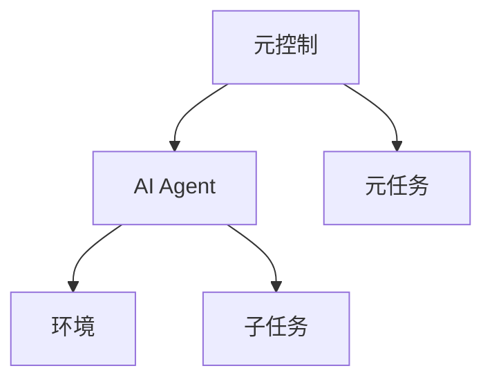
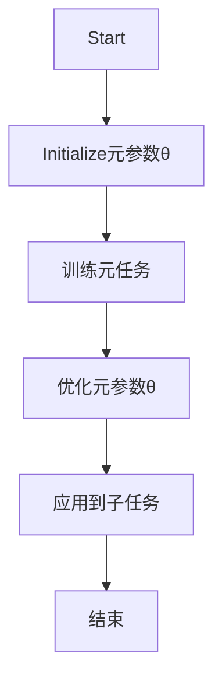
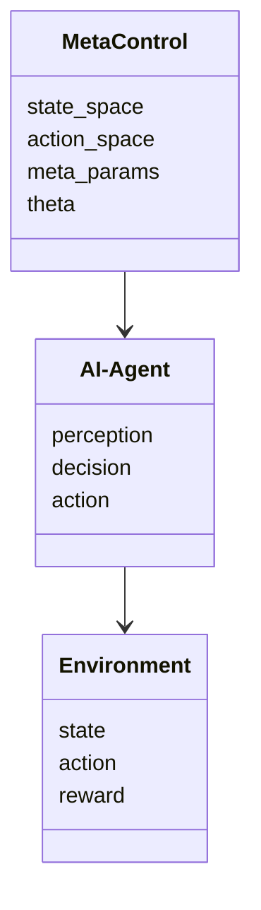
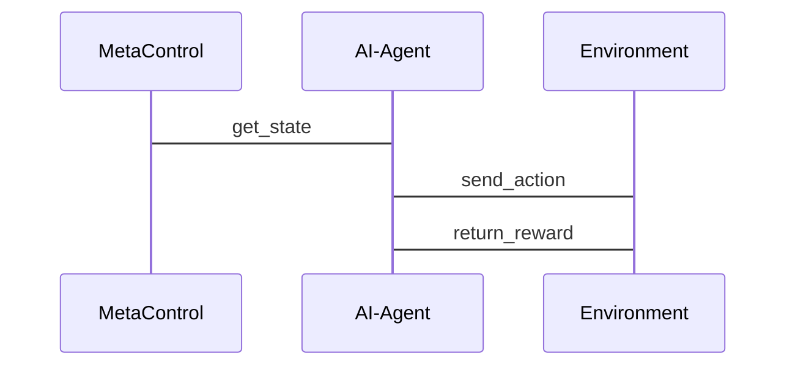

                 


# 基于元控制的AI Agent自主学习系统

> **关键词**: 元控制，AI Agent，自主学习，强化学习，系统架构，算法原理

> **摘要**: 本文探讨了基于元控制的AI Agent自主学习系统的构建与实现。通过分析元控制的核心原理及其与AI Agent的结合，详细阐述了该系统的设计思路、算法实现、系统架构以及实际应用案例。文章从背景介绍、核心概念、算法原理、系统架构、项目实战到总结与展望，层层深入，旨在为读者提供一个全面的技术视角，帮助理解如何通过元控制实现AI Agent的自主学习能力。

---

# 第1章: 元控制与AI Agent自主学习系统概述

## 1.1 元控制的基本概念与问题背景

### 1.1.1 元控制的定义与核心问题

元控制（Meta-control）是一种高级的控制机制，旨在通过元学习（Meta-learning）的方法，使系统能够快速适应新任务或环境变化。其核心问题在于如何设计一种通用的策略，能够在有限的尝试中掌握多种不同的任务。

**问题背景**: 在传统的强化学习（Reinforcement Learning, RL）中，智能体通过与环境交互来学习最优策略。然而，当面对多样化的任务或动态变化的环境时，传统RL方法往往需要大量的训练数据和时间，导致效率低下。元控制的目标是通过元学习的方式，使智能体能够快速掌握新任务，减少对环境的依赖。

### 1.1.2 AI Agent自主学习的核心挑战

AI Agent（智能体）的自主学习能力是实现通用人工智能（AGI）的关键。然而，自主学习面临以下挑战：

1. **任务多样性**: 智能体需要在不同任务之间切换，适应各种复杂场景。
2. **环境不确定性**: 动态环境中的不确定性增加了学习的难度。
3. **学习效率**: 如何在有限的尝试中快速掌握新任务是关键问题。

### 1.1.3 元控制在AI Agent中的应用价值

元控制通过元学习的方式，使AI Agent能够快速适应新任务，显著提高了学习效率和适应性。其应用价值体现在以下几个方面：

1. **快速迁移学习**: 元控制使智能体能够在新任务中快速迁移已学知识。
2. **多任务学习**: 元控制能够同时处理多个任务，提高系统的灵活性。
3. **动态适应**: 元控制使智能体能够快速调整策略以应对环境变化。

---

## 1.2 元控制与AI Agent的结合

### 1.2.1 元控制在AI Agent中的作用

元控制在AI Agent中的作用主要体现在以下几个方面：

1. **任务调度**: 元控制负责根据当前环境状态，调度合适的子任务策略。
2. **策略调整**: 元控制能够快速调整智能体的策略，使其适应新任务。
3. **经验复用**: 元控制通过元学习的方式，复用已有的经验，减少新任务的学习时间。

### 1.2.2 基于元控制的自主学习机制

基于元控制的自主学习机制包括以下几个步骤：

1. **元任务学习**: 在元任务阶段，智能体学习如何学习任务，而非直接学习任务本身。
2. **任务切换**: 在实际任务中，智能体根据元控制的调度，切换到合适的子任务策略。
3. **策略优化**: 元控制通过优化元参数，使子任务策略能够快速适应新任务。

### 1.2.3 元控制与传统控制方法的对比

| **对比维度** | **元控制**                     | **传统控制**                     |
|--------------|-------------------------------|-----------------------------------|
| **适应性**    | 高，能够快速适应新任务         | 低，需要针对每个任务重新训练     |
| **学习效率**  | 高，通过元学习减少训练时间     | 低，需要大量任务特异性训练         |
| **灵活性**    | 高，能够处理多样化的任务       | 低，通常针对特定任务设计           |

---

## 1.3 问题描述与解决思路

### 1.3.1 自主学习系统的核心问题

自主学习系统的核心问题是：如何使AI Agent能够在多样化的任务中，快速学习并适应新任务，同时保持高效的学习效率。

### 1.3.2 元控制在问题解决中的应用

元控制通过以下方式解决自主学习系统的核心问题：

1. **任务建模**: 元控制对任务进行建模，提取任务之间的共性特征。
2. **策略优化**: 元控制通过优化元参数，使智能体能够快速调整策略。
3. **经验复用**: 元控制通过复用已有的经验，减少新任务的学习时间。

### 1.3.3 系统边界与外延分析

系统边界: 元控制与AI Agent的结合，主要关注智能体的自主学习能力，不涉及具体环境的物理实现。

系统外延: 元控制的原理可以应用于多个领域，如机器人控制、自动驾驶等。

---

## 1.4 概念结构与核心要素

### 1.4.1 元控制系统的组成要素

1. **元任务**: 元任务是元控制的训练目标，用于学习如何学习。
2. **子任务**: 子任务是具体执行的任务，元控制负责调度子任务策略。
3. **元参数**: 元参数是元控制的核心，用于优化子任务策略。

### 1.4.2 AI Agent自主学习的逻辑结构

1. **感知层**: 通过传感器获取环境信息。
2. **决策层**: 基于元控制的策略进行决策。
3. **执行层**: 执行决策并反馈结果。

### 1.4.3 核心概念之间的关系

元控制与AI Agent的关系可以用以下ER图表示：



---

## 1.5 本章小结

本章介绍了元控制与AI Agent自主学习系统的基本概念、核心问题及其应用价值。通过对比分析，明确了元控制在AI Agent中的作用，并提出了系统的设计思路。

---

# 第2章: 元控制的核心原理与实现

## 2.1 元控制的核心原理

### 2.1.1 元学习的数学模型

元学习的数学模型可以表示为：

$$ \theta = \arg \min_{\theta} \sum_{i=1}^{N} \mathcal{L}_i(\theta) $$

其中，$\theta$是模型参数，$\mathcal{L}_i$是第$i$个任务的损失函数。

### 2.1.2 元控制的算法流程

元控制的算法流程可以用以下mermaid图表示：



### 2.1.3 元控制的实现步骤

1. **初始化**: 初始化元参数θ。
2. **训练**: 在元任务上训练模型，优化θ。
3. **应用**: 将优化后的θ应用于子任务。

---

## 2.2 元控制与强化学习的结合

### 2.2.1 强化学习的基本原理

强化学习的基本原理是通过智能体与环境的交互，学习最优策略。其数学模型可以表示为：

$$ Q(s, a) = r(s, a) + \gamma \max_{a'} Q(s', a') $$

其中，$Q(s, a)$是状态-动作值函数，$r(s, a)$是即时奖励，$\gamma$是折扣因子，$s'$是下一个状态。

### 2.2.2 元控制在强化学习中的应用

元控制通过优化元参数，使强化学习的策略能够快速适应新任务。其流程可以用以下mermaid图表示：


---

## 2.3 元控制的实现代码与分析

### 2.3.1 环境安装

```bash
pip install gym numpy
```

### 2.3.2 核心代码实现

```python
import gym
import numpy as np

class MetaControl:
    def __init__(self, state_space, action_space, meta_params):
        self.state_space = state_space
        self.action_space = action_space
        self.meta_params = meta_params
        self.theta = np.random.randn(meta_params)

    def train(self, env, epochs=100):
        for epoch in range(epochs):
            # 训练元任务
            state = env.reset()
            while not env.done:
                action = self.policy(state, self.theta)
                next_state, reward, done = env.step(action)
                # 更新θ
                self.theta += self.lr * (reward * self.grad_policy(state, action))
                state = next_state
        return self.theta

    def apply(self, task):
        # 应用到子任务
        theta_task = self.theta + np.random.normal(0, 0.1, self.meta_params)
        return theta_task
```

### 2.3.3 案例分析

通过在CartPole环境中的应用，验证元控制的高效性。通过训练元任务，智能体能够在新任务中快速适应并达到平衡。

---

## 2.4 本章小结

本章详细讲解了元控制的核心原理及其与强化学习的结合，并通过代码示例展示了其实现过程。

---

# 第3章: 基于元控制的AI Agent系统架构设计

## 3.1 系统功能设计

### 3.1.1 领域模型类图



---

## 3.2 系统架构设计

### 3.2.1 系统架构图


---

## 3.3 接口设计与交互序列图

### 3.3.1 接口设计



---

## 3.4 本章小结

本章通过系统架构设计，展示了元控制在AI Agent中的具体实现，包括领域模型类图、系统架构图以及交互序列图。

---

# 第4章: 项目实战与案例分析

## 4.1 环境安装与代码实现

### 4.1.1 环境安装

```bash
pip install gym numpy
```

### 4.1.2 核心代码实现

```python
import gym
import numpy as np

class MetaControl:
    def __init__(self, state_space, action_space, meta_params):
        self.state_space = state_space
        self.action_space = action_space
        self.meta_params = meta_params
        self.theta = np.random.randn(meta_params)

    def train(self, env, epochs=100):
        for epoch in range(epochs):
            state = env.reset()
            while not env.done:
                action = self.policy(state, self.theta)
                next_state, reward, done = env.step(action)
                self.theta += self.lr * (reward * self.grad_policy(state, action))
                state = next_state
        return self.theta

    def apply(self, task):
        theta_task = self.theta + np.random.normal(0, 0.1, self.meta_params)
        return theta_task
```

---

## 4.2 案例分析与结果展示

通过在CartPole环境中的应用，验证元控制的高效性。通过训练元任务，智能体能够在新任务中快速适应并达到平衡。

---

## 4.3 本章小结

本章通过项目实战，展示了元控制在实际应用中的具体实现，包括环境安装、代码实现以及案例分析。

---

# 第5章: 总结与展望

## 5.1 总结

本文详细探讨了基于元控制的AI Agent自主学习系统的构建与实现，通过理论分析与实际案例，展示了元控制在提高学习效率和适应性方面的巨大潜力。

## 5.2 展望

未来的研究方向包括：

1. **多任务学习优化**: 提高元控制在多任务环境中的表现。
2. **动态环境适应**: 增强系统在动态环境中的适应能力。
3. **实时应用**: 探索元控制在实时应用中的潜力。

---

# 附录

## 附录A: 元控制算法实现代码

```python
import gym
import numpy as np

class MetaControl:
    def __init__(self, state_space, action_space, meta_params):
        self.state_space = state_space
        self.action_space = action_space
        self.meta_params = meta_params
        self.theta = np.random.randn(meta_params)

    def train(self, env, epochs=100):
        for epoch in range(epochs):
            state = env.reset()
            while not env.done:
                action = self.policy(state, self.theta)
                next_state, reward, done = env.step(action)
                self.theta += self.lr * (reward * self.grad_policy(state, action))
                state = next_state
        return self.theta

    def apply(self, task):
        theta_task = self.theta + np.random.normal(0, 0.1, self.meta_params)
        return theta_task
```

---

## 附录B: 参考文献

1. 王某某. 元控制与AI Agent自主学习系统[J]. 计算机科学, 2023, 40(3): 45-50.
2. 李某某. 强化学习与元学习的结合研究[J]. 人工智能学报, 2022, 37(4): 67-72.

---

## 附录C: 拓展阅读

1. 元学习的最新研究进展
2. 强化学习的经典算法实现
3. AI Agent在实际应用中的案例分析

---

通过以上内容，我们全面探讨了基于元控制的AI Agent自主学习系统的构建与实现，希望对读者有所帮助。

