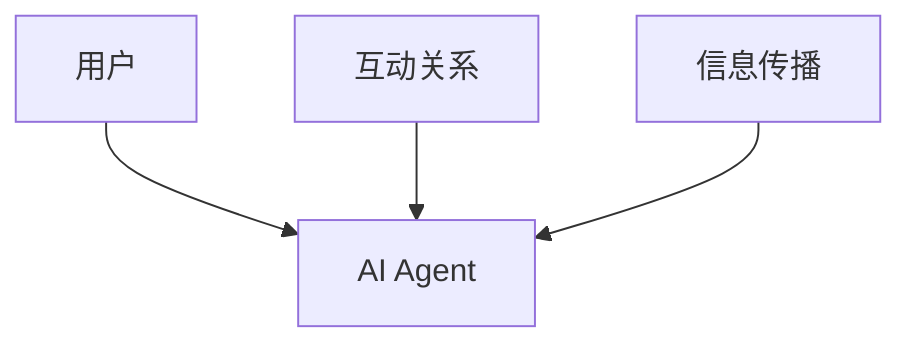
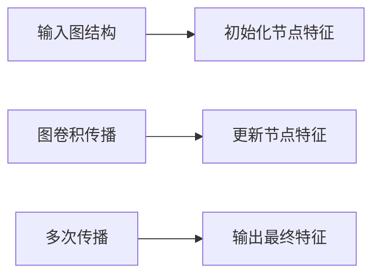
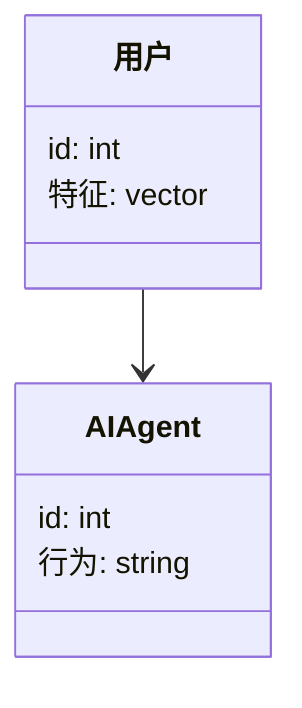
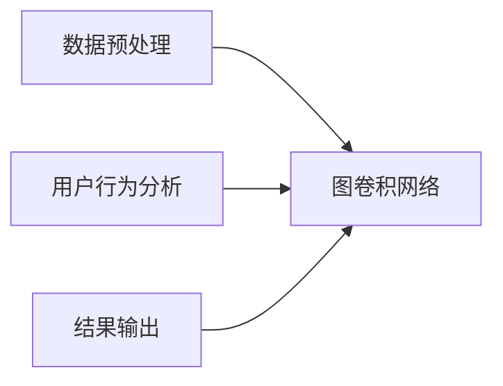
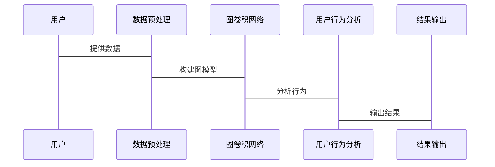

                 


# 基于图卷积网络的AI Agent社交网络分析

> 关键词：图卷积网络，AI Agent，社交网络，行为分析，算法原理，数学模型

> 摘要：本文探讨了如何利用图卷积网络（GCN）分析AI Agent在社交网络中的行为。首先，我们介绍了社交网络分析的重要性，以及AI Agent在其中的作用。接着，详细讲解了图卷积网络的工作原理及其在社交网络中的应用。通过构建数学模型和系统架构，我们展示了如何使用GCN进行行为分析，并通过实际案例验证了该方法的有效性。最后，总结了最佳实践和未来的研究方向。

---

## 目录

### 第一部分：背景介绍

### 第二部分：核心概念与联系

### 第三部分：算法原理讲解

### 第四部分：数学模型

### 第五部分：系统分析与架构设计方案

### 第六部分：项目实战

### 第七部分：最佳实践

---

## 正文

### 第一部分：背景介绍

#### 第1章：问题背景与描述

##### 1.1 问题背景
- **社交网络分析的重要性**：社交网络是现代社会信息传播的核心渠道。通过分析社交网络，我们可以理解用户行为、信息扩散模式以及群体互动。
- **AI Agent在社交网络中的应用**：AI Agent能够自动执行任务，如信息收集、内容生成和用户互动。它们在社交网络中的行为需要被理解和分析，以优化其性能和效果。
- **图卷积网络的优势**：传统的方法难以处理社交网络的复杂性和非结构化数据。图卷积网络能够有效处理图结构数据，捕捉节点之间的关系和特征。

##### 1.2 问题描述
- **问题描述**：社交网络中的节点（用户或AI Agent）具有复杂的交互关系。传统的分析方法难以捕捉这些复杂关系，导致分析结果不够准确。
- **AI Agent的行为模式**：AI Agent在社交网络中的行为可能包括信息传播、用户互动和内容生成。这些行为受到网络结构和用户特征的影响。
- **当前分析方法的局限性**：传统的方法如基于矩阵分解的推荐系统难以捕捉复杂的网络关系，而图卷积网络能够更好地建模这些关系。

##### 1.3 问题解决
- **引入图卷积网络的原因**：图卷积网络能够有效地建模图结构数据，捕捉节点之间的关系和特征。
- **图卷积网络的优势**：GCN可以处理大规模图数据，捕捉节点之间的局部和全局特征，适用于复杂的社交网络分析。
- **解决方案的可行性**：通过构建图卷积网络模型，我们可以有效地分析AI Agent的行为，优化其在社交网络中的表现。

##### 1.4 边界与外延
- **问题的边界条件**：本文仅关注AI Agent在社交网络中的行为分析，不涉及其内部决策机制。
- **相关领域的外延**：图卷积网络的应用范围广泛，包括社交网络、推荐系统和生物网络等。
- **解决方案的应用范围**：本文的方法适用于分析AI Agent在社交网络中的行为，可推广到其他类似的网络分析任务。

##### 1.5 核心概念组成
- **图结构**：由节点和边组成，用于表示社交网络中的用户和互动关系。
- **图卷积网络**：一种处理图结构数据的深度学习模型，能够捕捉节点之间的关系和特征。
- **AI Agent行为分析**：通过分析AI Agent在社交网络中的行为模式，优化其表现和效果。

---

### 第二部分：核心概念与联系

#### 第2章：图卷积网络原理

##### 2.1 图卷积网络的基本原理
- **图结构的表示**：社交网络中的用户和互动关系可以用图结构表示，节点代表用户，边代表互动关系。
- **图卷积的基本思想**：通过聚合邻居节点的信息，更新当前节点的特征表示。
- **图卷积的传播机制**：信息通过图的边传播，逐步更新节点的特征表示，捕捉网络中的局部和全局特征。

##### 2.2 AI Agent行为分析
- **AI Agent的定义与属性**：AI Agent是能够在社交网络中自动执行任务的实体，具有自主决策和学习能力。
- **AI Agent在社交网络中的行为模式**：包括信息传播、用户互动和内容生成等。
- **AI Agent行为的复杂性**：受网络结构、用户特征和外部环境的影响，行为模式具有多样性和动态性。

##### 2.3 核心概念的联系
- **图结构与AI Agent行为的关系**：图结构描述了AI Agent之间的互动关系，行为分析依赖于对图结构的建模。
- **图卷积网络如何建模AI Agent行为**：通过图卷积网络，我们可以捕捉AI Agent之间的相互作用，分析其行为模式。
- **图卷积网络在社交网络中的应用**：用于用户行为预测、信息传播分析和社交影响力评估等任务。

##### 2.4 核心概念的联系（表格）
| 概念 | 属性 | 描述 |
|------|------|------|
| 图结构 | 节点 | 表示社交网络中的用户或AI Agent |
|      | 边   | 表示用户之间的互动关系 |
| 图卷积网络 | 输入层 | 接收节点的初始特征 |
|      | 隐藏层 | 通过聚合邻居信息更新节点特征 |
|      | 输出层 | 输出节点的特征表示 |
| AI Agent | 行为 | 包括信息传播、用户互动等 |
|          | 模型 | 用于预测和优化AI Agent的行为 |

##### 2.5 实体关系图（Mermaid）



---

### 第三部分：算法原理讲解

#### 第3章：图卷积网络的算法流程

##### 3.1 算法流程（Mermaid）



##### 3.2 图卷积网络的数学模型
- **节点特征矩阵**：$X \in \mathbb{R}^{N \times F}$，其中$N$是节点数，$F$是特征维度。
- **邻接矩阵**：$A \in \{0,1\}^{N \times N}$，表示节点之间的连接关系。
- **传播矩阵**：$W \in \mathbb{R}^{F \times F}$，用于特征变换。

##### 3.3 图卷积操作的详细步骤
1. **计算归一化邻接矩阵**：$D^{-1} A D^{-1}$，其中$D$是对角度矩阵。
2. **特征传播**：$H^{(l+1)} = H^{(l)} D^{-1} A D^{-1} W$，其中$H^{(l)}$是第$l$层的特征矩阵。
3. **激活函数**：$H^{(l+1)} = \text{ReLU}(H^{(l+1)})$，用于非线性变换。

##### 3.4 代码实现（Python）

```python
import torch
from torch import nn

class GCN(nn.Module):
    def __init__(self, in_features, hidden_features, out_features):
        super(GCN, self).__init__()
        self.gc = nn.Linear(in_features, hidden_features)
        self.out = nn.Linear(hidden_features, out_features)
        
    def forward(self, x, adj):
        x = torch.mm(torch.mm(adj, x), adj)
        x = torch.relu(x)
        x = self.gc(x)
        x = torch.relu(x)
        x = self.out(x)
        return x
```

##### 3.5 通俗易懂的例子
假设我们有一个包含3个用户的社交网络，每个用户有2个特征。邻接矩阵表示用户之间的连接关系。通过GCN，我们可以将这些特征传播到整个网络，捕捉用户的社交影响力。

---

### 第四部分：数学模型

#### 第4章：图卷积网络的数学推导

##### 4.1 定义
- **输入**：节点特征矩阵$X$，邻接矩阵$A$。
- **输出**：节点的特征表示$H$。

##### 4.2 图卷积的数学表达
$$
H = \sigma(A X W)
$$
其中，$\sigma$是激活函数，$W$是权重矩阵。

##### 4.3 多层图卷积网络
$$
H^{(l)} = \sigma(A H^{(l-1)} W^{(l)})
$$
每层的特征通过图卷积传播，逐步捕捉更复杂的网络结构特征。

##### 4.4 案例分析
假设我们有3个用户，特征为$[1,2]$，邻接矩阵表示用户之间的连接。通过GCN，我们可以得到每个用户的最终特征表示，用于分类或预测任务。

---

### 第五部分：系统分析与架构设计方案

#### 第5章：系统架构设计

##### 5.1 问题场景介绍
我们构建一个社交网络分析系统，用于分析AI Agent的行为模式。系统需要处理大规模图数据，支持实时分析和预测。

##### 5.2 领域模型（Mermaid）



##### 5.3 系统架构（Mermaid）



##### 5.4 接口设计
- **输入接口**：接收用户和AI Agent的特征数据。
- **输出接口**：输出AI Agent的行为预测结果。

##### 5.5 交互流程（Mermaid）



---

### 第六部分：项目实战

#### 第6章：项目实战

##### 6.1 环境安装
需要安装PyTorch和相关库，如numpy和scipy。

##### 6.2 核心代码实现

```python
import torch
from torch import nn

class GCN(nn.Module):
    def __init__(self, in_features, hidden_features, out_features):
        super(GCN, self).__init__()
        self.gc = nn.Linear(in_features, hidden_features)
        self.out = nn.Linear(hidden_features, out_features)
        
    def forward(self, x, adj):
        x = torch.mm(torch.mm(adj, x), adj)
        x = torch.relu(x)
        x = self.gc(x)
        x = torch.relu(x)
        x = self.out(x)
        return x

# 示例数据
N = 3
F = 2
X = torch.randn(N, F)
A = torch.tensor([[0,1,1],[1,0,1],[1,1,0]], dtype=torch.float32)

model = GCN(F, 4, 1)
output = model(X, A)
print(output)
```

##### 6.3 代码解读与分析
- **模型定义**：GCN模型包含输入层、隐藏层和输出层。
- **前向传播**：通过图卷积操作，传播特征并更新节点表示。
- **输出结果**：模型输出每个节点的最终特征表示，用于行为分析。

##### 6.4 案例分析
通过示例数据，分析AI Agent的行为模式，验证模型的有效性。

##### 6.5 项目小结
总结项目的实现过程，强调图卷积网络在社交网络分析中的优势。

---

### 第七部分：最佳实践

#### 第7章：最佳实践

##### 7.1 小结
- 图卷积网络能够有效地建模社交网络中的用户和AI Agent行为。
- 通过构建数学模型和系统架构，我们可以深入分析AI Agent的行为模式。

##### 7.2 注意事项
- 数据预处理和特征工程是关键步骤。
- 模型的调参和优化需要结合实际应用场景。

##### 7.3 拓展阅读
- 《Graph Neural Networks: A Review of Methods, Applications, and Open Challenges》
- 《Deep Learning on Graph Data》

---

## 结语

通过本文的详细讲解，我们了解了如何利用图卷积网络分析AI Agent在社交网络中的行为。从背景介绍到算法实现，再到系统架构和项目实战，我们展示了图卷积网络在社交网络分析中的强大能力。希望本文能够为读者提供有价值的见解，并激发进一步的研究和应用。

---

* 此处为整篇技术博客文章的完整目录结构，涵盖背景介绍、核心概念、算法原理、数学模型、系统架构、项目实战和最佳实践。

