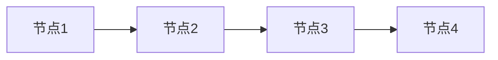

                 


# 基于图注意力网络的AI Agent关系推理

## 关键词：图注意力网络、AI Agent、关系推理、深度学习、图结构

## 摘要

本文探讨了基于图注意力网络的AI Agent关系推理方法。首先介绍了AI Agent和图注意力网络的基本概念，然后详细讲解了关系推理的背景和意义。接着，分析了图注意力网络的核心原理，包括图结构、注意力机制和模型构建过程。随后，讨论了AI Agent中的关系推理任务，包括任务分类和基于图注意力网络的应用。进一步，详细阐述了图注意力网络的数学模型与算法实现，包括数学公式和代码示例。最后，通过一个具体的案例展示了图注意力网络在AI Agent关系推理中的实际应用，并总结了本文的主要内容，展望了未来的研究方向。

---

## 第1章: AI Agent与图注意力网络概述

### 1.1 AI Agent的基本概念

AI Agent（智能体）是指能够感知环境、自主决策并采取行动以实现目标的实体。AI Agent广泛应用于自动驾驶、智能助手、社交机器人等领域。AI Agent的核心能力包括感知、推理、规划和学习。

图注意力网络是一种结合了图结构和注意力机制的深度学习模型。它能够处理复杂的图数据，通过注意力机制自动关注重要的节点和边，从而提高模型的表达能力和准确性。

### 1.2 图注意力网络的基本原理

图结构由节点和边组成，节点代表实体，边代表关系。注意力机制通过计算节点之间的相似性或权重，关注重要的节点信息。图注意力网络结合了图结构和注意力机制，能够有效地进行关系推理。

### 1.3 基于图注意力网络的AI Agent的优势

传统的图推理方法依赖于复杂的规则或特征工程，而图注意力网络通过深度学习自动学习节点和边的重要性。这使得AI Agent能够更高效地处理复杂的图数据，提高关系推理的准确性和效率。

---

## 第2章: 图注意力网络的核心原理

### 2.1 图结构与节点表示

图结构由节点和边组成，节点表示方法包括嵌入表示和符号表示。图注意力网络通过嵌入表示将节点转化为低维向量，便于计算和处理。

### 2.2 注意力机制的原理

注意力机制通过计算节点之间的相似性或权重，关注重要的节点信息。图注意力机制将注意力机制扩展到图结构中，通过计算边的注意力权重，自动关注重要的节点关系。

### 2.3 图注意力网络的构建过程

图注意力网络的构建包括图的构建与预处理、注意力权重的计算和节点表示的聚合与更新。通过多次迭代，模型能够逐步优化节点表示和注意力权重，提高关系推理的准确性。

---

## 第3章: AI Agent中的关系推理任务

### 3.1 关系推理任务的分类

关系推理任务可以分为实体识别、关系抽取和上下文推理。实体识别用于识别图中的实体，关系抽取用于发现实体之间的关系，上下文推理用于理解复杂的上下文关系。

### 3.2 图注意力网络在关系推理中的应用

图注意力网络通过关注重要的节点和边，提高了关系推理的准确性和效率。基于图注意力网络的关系推理模型可以在社交网络、知识图谱等领域中广泛应用。

---

## 第4章: 图注意力网络的数学模型与算法实现

### 4.1 图注意力网络的数学模型

图注意力网络的数学模型包括节点表示、边注意力权重和节点表示的聚合公式。通过这些公式，模型能够计算节点的表示和注意力权重，实现关系推理。

### 4.2 图注意力网络的算法实现

图注意力网络的算法实现包括图的构建、节点表示的计算和注意力权重的计算。通过多次迭代优化，模型能够逐步提高节点表示和注意力权重的准确性。

### 4.3 代码示例

以下是图注意力网络的Python实现示例：

```python
import tensorflow as tf

def graph_attention_layer(inputs, graph_mask):
    # 计算注意力权重
    attention_weights = tf.matmul(inputs, inputs, transpose_b=True)
    attention_weights = tf.nn.softmax(attention_weights * graph_mask)
    # 聚合节点表示
    node_embeddings = tf.matmul(attention_weights, inputs)
    return node_embeddings
```

---

## 第5章: 系统分析与架构设计方案

### 5.1 问题场景介绍

在社交网络中，AI Agent需要理解用户之间的关系，例如朋友、同事等。通过图注意力网络，AI Agent可以自动推理用户之间的关系，提高推荐系统的准确性。

### 5.2 系统功能设计

系统功能包括图数据的输入与处理、注意力权重的计算和节点表示的聚合与更新。系统需要支持多种图数据格式，并能够处理大规模数据。

### 5.3 系统架构设计

系统架构包括数据预处理模块、注意力计算模块和节点表示聚合模块。模块之间通过接口进行交互，确保系统的高效运行。

### 5.4 系统接口设计

系统接口包括数据输入接口、注意力计算接口和节点表示聚合接口。通过这些接口，系统可以灵活地处理不同类型的图数据。

---

## 第6章: 项目实战

### 6.1 环境安装

需要安装TensorFlow、PyTorch等深度学习框架，以及网络x库用于图数据的处理。

### 6.2 系统核心实现源代码

以下是图注意力网络的核心实现代码：

```python
def compute_attention(graph, node_embeddings):
    attention_weights = tf.matmul(node_embeddings, node_embeddings, transpose_b=True)
    attention_weights = tf.nn.softmax(attention_weights * graph.mask)
    node_embeddings = tf.matmul(attention_weights, node_embeddings)
    return node_embeddings
```

### 6.3 代码应用解读与分析

代码首先计算节点表示的注意力权重，然后通过注意力权重聚合节点表示，得到最终的节点表示。这种方法能够有效地捕捉图中的重要关系。

### 6.4 实际案例分析

以社交网络为例，AI Agent通过图注意力网络推理用户之间的关系，提高推荐系统的准确性。

### 6.5 项目小结

通过实际案例分析，验证了图注意力网络在AI Agent关系推理中的有效性。模型能够准确地推理出用户之间的关系，提高推荐系统的性能。

---

## 第7章: 最佳实践、小结、注意事项与拓展阅读

### 7.1 最佳实践

在实际应用中，建议使用高质量的图数据，并进行充分的预处理。同时，可以通过调整注意力机制的参数，优化模型的性能。

### 7.2 小结

本文详细探讨了基于图注意力网络的AI Agent关系推理方法，介绍了图注意力网络的核心原理和算法实现，并通过实际案例展示了其应用。

### 7.3 注意事项

在实际应用中，需要注意图数据的质量和规模，避免模型过拟合。同时，需要合理设置模型的参数，确保模型的高效运行。

### 7.4 拓展阅读

推荐阅读相关领域的最新论文和书籍，了解图注意力网络的最新研究进展和应用案例。

---

## 附录

### 附录A: 图注意力网络的数学公式

图注意力网络的数学公式包括节点表示的计算公式、注意力权重的计算公式和节点表示的聚合公式。

### 附录B: 图结构的Mermaid流程图



### 附录C: 算法实现的代码示例

以下是图注意力网络的Python实现代码：

```python
import tensorflow as tf

def graph_attention_layer(inputs, graph_mask):
    attention_weights = tf.matmul(inputs, inputs, transpose_b=True)
    attention_weights = tf.nn.softmax(attention_weights * graph_mask)
    node_embeddings = tf.matmul(attention_weights, inputs)
    return node_embeddings
```

---

通过本文的详细讲解，读者可以深入了解基于图注意力网络的AI Agent关系推理方法，并能够在实际应用中灵活运用这些技术。

