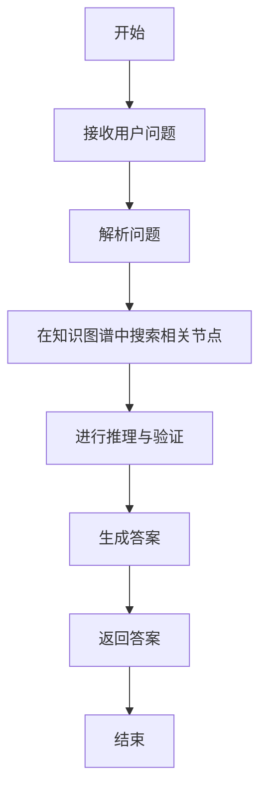
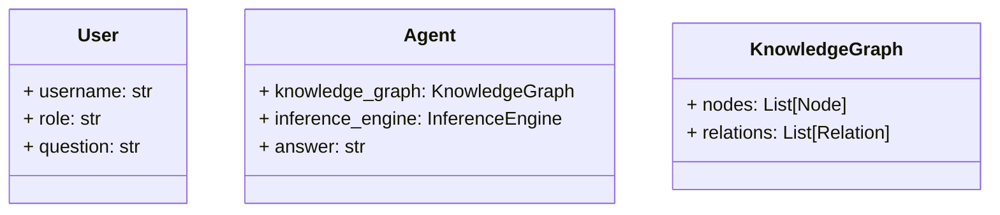
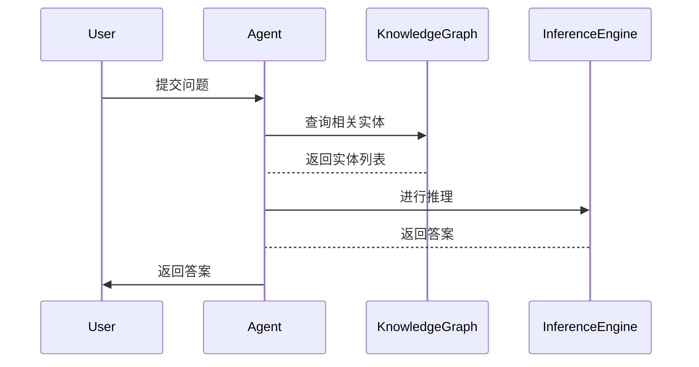

                 


# 基于图谱的AI Agent知识推理与问答

## 关键词：知识图谱、AI Agent、问答系统、图谱推理、符号逻辑

## 摘要：  
本文深入探讨了基于知识图谱的AI Agent在知识推理与问答系统中的应用。通过分析图谱技术与AI Agent的结合，阐述了知识图谱构建、符号逻辑推理、图谱问答算法及其系统架构设计。文章从背景介绍、核心概念、算法原理到系统实现，层层展开，结合实际案例和代码示例，为读者呈现了一个完整的基于图谱的AI Agent知识推理与问答系统的构建过程。

---

## 第一部分: 基于图谱的AI Agent知识推理与问答概述

### 第1章: 问题背景与核心概念

#### 1.1 问题背景
##### 1.1.1 知识推理与问答的挑战
传统问答系统（如基于关键词匹配的系统）难以处理复杂语义和上下文推理问题。知识图谱的引入为AI Agent提供了结构化的知识表示和推理能力，使其能够更好地理解和回答复杂问题。

##### 1.1.2 图谱技术在AI Agent中的作用
知识图谱通过实体和关系的形式化表示，为AI Agent提供了丰富的背景知识。AI Agent可以基于图谱进行符号逻辑推理，从而实现更智能的问答和决策。

##### 1.1.3 当前技术的局限性与改进方向
当前问答系统主要依赖于大数据和深度学习模型，但在小数据或领域知识不足的情况下表现不佳。知识图谱的引入弥补了这一不足，但如何高效结合图谱推理与深度学习是当前研究的重点。

#### 1.2 问题描述
##### 1.2.1 知识图谱与问答系统的结合
知识图谱为问答系统提供了结构化的知识库，使得问答系统能够基于知识推理生成答案，而不仅仅依赖于预训练的语料库。

##### 1.2.2 AI Agent的知识推理需求
AI Agent需要具备基于知识图谱进行推理的能力，以支持复杂的问答任务和决策任务。

##### 1.2.3 图谱问答的核心问题与目标
图谱问答的核心问题是将自然语言问题映射到知识图谱中的实体和关系上，通过符号逻辑推理生成准确的答案。

#### 1.3 问题解决与边界
##### 1.3.1 图谱AI Agent的解决方案
通过构建领域知识图谱，结合符号逻辑推理和深度学习模型，实现高效的问答和推理。

##### 1.3.2 技术边界与适用场景
图谱AI Agent适用于需要领域知识推理的任务，如医疗、教育、金融等领域的智能问答系统。

##### 1.3.3 图谱问答的外延与扩展
图谱问答可以扩展到更复杂的知识推理任务，如多轮对话和动态知识更新。

#### 1.4 概念结构与核心要素
##### 1.4.1 知识图谱的基本结构
知识图谱由实体（node）、关系（edge）和属性（property）组成，形成一个语义网络。

##### 1.4.2 AI Agent的核心功能
AI Agent具备感知、推理、决策和执行功能，其中推理是基于知识图谱的核心能力。

##### 1.4.3 图谱问答系统的组成要素
图谱问答系统包括知识图谱构建、问题解析、图谱推理和答案生成四个主要部分。

---

## 第2章: 核心概念与联系

### 2.1 图谱AI Agent的原理
#### 2.1.1 知识图谱的构建与表示
知识图谱的构建包括数据抽取、实体识别、关系抽取和数据整合等步骤，通常使用RDF或图数据库进行存储。

#### 2.1.2 AI Agent的知识推理机制
AI Agent通过符号逻辑推理、路径搜索和概率推理等方法，在知识图谱中找到问题的答案。

#### 2.1.3 图谱问答的实现流程
图谱问答系统将自然语言问题转换为图谱查询，通过推理算法找到最相关的实体和关系，生成答案。

### 2.2 核心概念对比表
| 对比维度 | 知识图谱 | 传统问答系统 |
|----------|----------|---------------|
| 数据结构 | 结构化语义网络 | 非结构化文本 |
| 推理能力 | 支持符号逻辑推理 | 基于关键词匹配 |
| 知识表示 | 显式表示实体关系 | 隐式表示知识 |

### 2.3 ER实体关系图
```mermaid
er
actor: 用户
agent: AI Agent
knowledge_graph: 知识图谱
question: 问题
answer: 答案
```

---

## 第3章: 算法原理讲解

### 3.1 图谱问答算法
#### 3.1.1 基于图的最短路径搜索
通过广度优先搜索（BFS）或深度优先搜索（DFS）在知识图谱中找到问题对应的实体或关系的最短路径。

#### 3.1.2 基于符号逻辑的推理
使用谓词逻辑和规则推理，在知识图谱中验证问题的逻辑关系。

#### 3.1.3 基于概率的推理方法
利用贝叶斯网络或马尔可夫逻辑网络（MLN）对图谱中的实体关系进行概率推理。

### 3.2 算法流程图


### 3.3 算法实现代码
```python
def graph_question_answering(question, knowledge_graph):
    nodes = knowledge_graph.nodes
    relations = knowledge_graph.relations
    # 解析问题
    parsed_question = parse(question)
    # 搜索相关实体
    candidate_entities = search_entities(parsed_question, nodes)
    # 推理答案
    answer = infer_answer(parsed_question, candidate_entities, relations)
    return answer
```

---

## 第4章: 系统分析与架构设计

### 4.1 问题场景介绍
本系统旨在构建一个基于知识图谱的问答系统，支持领域知识推理和复杂问题解答。

### 4.2 系统功能设计
#### 4.2.1 领域模型


#### 4.2.2 系统架构


#### 4.2.3 系统接口设计
用户通过前端提交问题，后端调用知识图谱和推理引擎生成答案。

#### 4.2.4 系统交互图


---

## 第5章: 项目实战

### 5.1 环境安装
安装必要的依赖库，如`networkx`、`spacy`和`py2neo`。

### 5.2 核心代码实现
```python
# 知识图谱构建
from py2neo import Graph, Node, Relationship
graph = Graph("http://localhost:7474", auth=("neo4j", "password"))
# 实体节点
alice = Node("Person", name="Alice")
bob = Node("Person", name="Bob")
# 关系边
graph.create(Relationship(alice, "KNOWS", bob))
```

### 5.3 代码解读与分析
代码展示了知识图谱的构建过程，包括节点创建和关系建立。

### 5.4 案例分析
以医疗领域为例，构建疾病-症状-治疗关系的知识图谱，实现疾病诊断的问答功能。

### 5.5 项目小结
通过实际案例展示了基于图谱的问答系统构建过程，强调了知识图谱构建和推理算法的重要性。

---

## 第6章: 最佳实践与拓展

### 6.1 最佳实践 tips
1. 知识图谱的质量直接影响问答系统的性能，需注重数据清洗和实体消歧。
2. 结合深度学习模型（如BERT）可以提升问答系统的性能。

### 6.2 小结
本文详细介绍了基于图谱的AI Agent知识推理与问答系统的构建过程，从理论到实践，为读者提供了完整的解决方案。

### 6.3 注意事项
- 知识图谱的构建需要领域专家参与。
- 推理算法的选择需根据具体场景和数据规模决定。

### 6.4 拓展阅读
推荐阅读《知识图谱构建与应用》和《符号逻辑与机器学习》等书籍，深入理解图谱技术与AI结合的应用。

---

通过本文的系统介绍，读者可以全面理解基于图谱的AI Agent知识推理与问答系统的构建过程，并能够将其应用于实际项目中。

