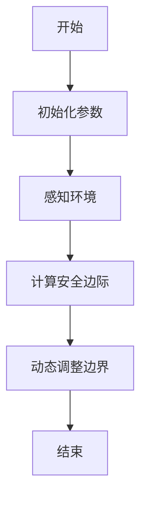
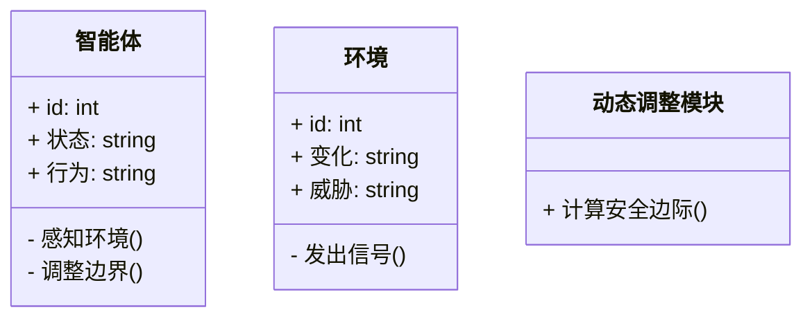
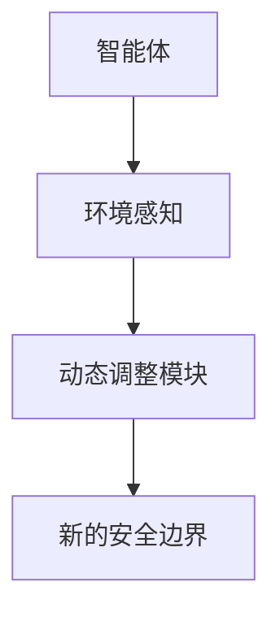
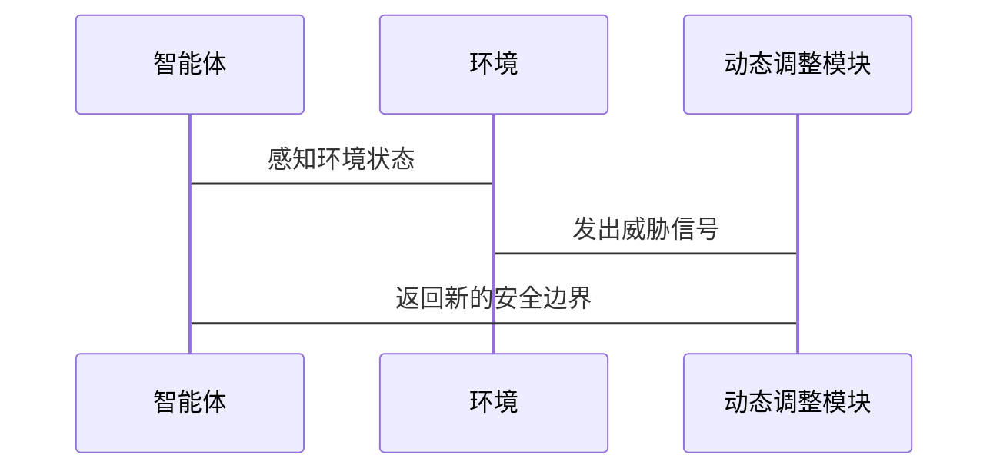

                 


# 基于多智能体的动态安全边际计算模型

> 关键词：多智能体系统、动态安全边际、安全计算、人工智能、系统架构

> 摘要：本文介绍了一种基于多智能体的动态安全边际计算模型，探讨了多智能体系统中的安全问题，提出了动态安全边际的概念，并详细分析了模型的构建过程、算法原理、系统架构设计以及实际应用案例。通过本文，读者可以深入了解如何在多智能体系统中实现动态安全边际计算，从而提高系统的安全性和稳定性。

---

## 第一部分: 基于多智能体的动态安全边际计算模型背景介绍

### 第1章: 问题背景与问题描述

#### 1.1 问题背景
多智能体系统（Multi-Agent System, MAS）是由多个智能体组成的复杂系统，这些智能体能够自主决策、协作和竞争。随着人工智能技术的发展，多智能体系统在许多领域得到了广泛应用，例如自动驾驶、机器人协作、智能电网等。然而，这些系统面临着动态环境中的安全问题，例如恶意攻击、信息泄露和系统故障。如何在动态环境中计算和维护安全边际，是当前研究的热点问题。

#### 1.2 问题描述
动态安全边际是指在多智能体系统中，智能体在动态环境中能够安全运行的区域范围。这个范围会随着环境的变化而变化，因此需要动态调整。传统的安全边际计算方法通常基于静态环境，无法应对动态环境中的不确定性。本文提出了一种基于多智能体的动态安全边际计算模型，能够实时感知环境变化，动态调整安全边界。

#### 1.3 问题解决方法
现有解决方案主要依赖静态的安全边界计算方法，这些方法在动态环境中表现不佳，容易受到攻击或环境变化的影响。本文提出了一种新的模型，通过多智能体之间的协作和信息共享，动态调整安全边界。这种方法能够实时感知环境变化，适应动态环境的需求。

---

### 第2章: 模型边界与外延

#### 2.1 模型的边界
模型的边界是指其适用的范围和限制。动态安全边际计算模型适用于多智能体系统，但不适用于单智能体系统或静态环境。此外，模型主要关注安全问题，不涉及系统的性能优化或其他方面的计算。

#### 2.2 模型的外延
模型的外延是指其潜在的应用范围和扩展方向。动态安全边际计算模型不仅适用于多智能体系统，还可以扩展到其他领域，例如网络安全、机器人协作等。未来的研究可以进一步优化算法，提高计算效率。

---

### 第3章: 模型组成与核心要素

#### 3.1 模型组成
动态安全边际计算模型由以下几个部分组成：
1. 智能体感知模块：用于感知环境和智能体的状态。
2. 动态调整模块：根据感知信息动态调整安全边界。
3. 协作通信模块：用于智能体之间的信息共享和协作。

#### 3.2 核心要素
1. 智能体的行为特征：包括智能体的决策能力、协作能力等。
2. 安全边际的计算参数：包括环境变化、威胁等级等。
3. 动态调整的机制：包括反馈机制、自适应算法等。

---

## 第二部分: 核心概念与联系

### 第4章: 核心概念原理

#### 4.1 多智能体系统
多智能体系统是由多个智能体组成的系统，这些智能体能够自主决策、协作和竞争。多智能体系统的特点包括：
- 分布式结构：智能体之间没有中心控制。
- 协作性：智能体之间可以通过协作完成复杂任务。
- 竞争性：智能体之间可能会存在竞争关系。

#### 4.2 动态安全边际
动态安全边际是指在动态环境中，智能体能够安全运行的区域范围。这个范围会随着环境的变化而变化，因此需要动态调整。

#### 4.3 核心概念对比

| 特性      | 多智能体系统                | 动态安全边际                |
|-----------|-----------------------------|-----------------------------|
| 定义      | 由多个智能体组成的系统      | 智能体在动态环境中的安全区域 |
| 动态性     | 系统动态性由智能体行为决定  | 边界动态变化                 |
| 目标      | 完成复杂任务                | 保障系统安全                 |

#### 4.4 ER实体关系图
```mermaid
er
    actor 智能体 {
        attribute id: int
        attribute 状态: string
        attribute 行为: string
    }
    actor 环境 {
        attribute id: int
        attribute 变化: string
        attribute 威胁: string
    }
    relation 感知 {
        智能体 --> 环境
        感知环境状态
    }
```

---

## 第三部分: 算法原理讲解

### 第5章: 算法原理

#### 5.1 算法流程


#### 5.2 关键算法实现
以下是一个动态调整模块的Python实现示例：
```python
def dynamic_adjust(bounds, current_state):
    # 计算威胁等级
    threat_level = calculate_threat(current_state)
    # 动态调整边界
    new_bounds = adjust_bounds(bounds, threat_level)
    return new_bounds
```

#### 5.3 数学模型
动态安全边际计算的数学模型如下：
$$
\text{安全边际} = \text{当前状态} \times \text{威胁系数}
$$
例如，当前状态为高威胁时，威胁系数为0.8，计算如下：
$$
\text{安全边际} = 100 \times 0.8 = 80
$$

---

## 第四部分: 系统分析与架构设计方案

### 第6章: 系统架构设计

#### 6.1 问题场景介绍
多智能体系统中，智能体需要动态调整安全边界以应对环境变化。例如，在自动驾驶中，车辆需要根据交通状况动态调整安全距离。

#### 6.2 系统功能设计


#### 6.3 系统架构设计


#### 6.4 系统接口设计
系统接口包括：
- 智能体与环境的接口：用于感知环境状态。
- 动态调整模块的接口：用于计算和调整安全边界。

#### 6.5 系统交互序列图


---

## 第五部分: 项目实战

### 第7章: 项目实现

#### 7.1 环境安装
读者需要安装以下工具：
- Python 3.8+
- Mermaid CLI
- Markdown编辑器

#### 7.2 核心代码实现
以下是动态调整模块的核心代码：
```python
def calculate_threat(environment_state):
    # 计算威胁等级
    threat_level = 0
    if environment_state == 'high':
        threat_level = 0.8
    elif environment_state == 'medium':
        threat_level = 0.5
    else:
        threat_level = 0.2
    return threat_level

def adjust_bounds(bounds, threat_level):
    # 根据威胁等级调整边界
    new_bounds = bounds * (1 - threat_level)
    return new_bounds
```

#### 7.3 代码解读与分析
- `calculate_threat`函数根据环境状态计算威胁等级。
- `adjust_bounds`函数根据威胁等级调整安全边界。

#### 7.4 实际案例分析
假设环境状态为“high”，初始边界为100：
$$
\text{威胁等级} = 0.8 \\
\text{新边界} = 100 \times (1 - 0.8) = 20
$$

---

## 第六部分: 最佳实践

### 第8章: 总结与注意事项

#### 8.1 小结
本文提出了一种基于多智能体的动态安全边际计算模型，详细分析了模型的构建过程、算法原理和系统架构设计，并通过案例展示了模型的实际应用。

#### 8.2 注意事项
- 模型的动态调整能力依赖于环境感知的准确性。
- 需要定期更新威胁模型以应对新威胁。

#### 8.3 拓展阅读
建议读者进一步研究以下内容：
- 多智能体系统中的协作算法。
- 动态安全边际的优化算法。

---

通过本文的详细讲解，读者可以深入了解基于多智能体的动态安全边际计算模型，并将其应用于实际项目中。希望本文对读者有所帮助！

