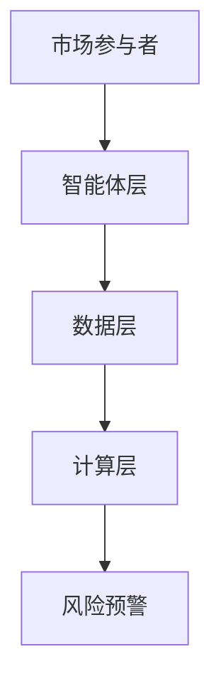
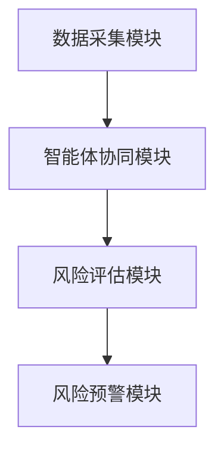
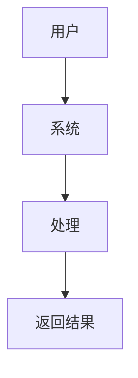

                 


# 基于多智能体的动态市场流动性风险预警系统

> 关键词：多智能体、动态市场、流动性风险、风险预警、算法原理、系统架构、技术实现

> 摘要：本文系统地介绍了基于多智能体的动态市场流动性风险预警系统的构建过程。文章首先分析了流动性风险的动态特性及其在市场环境中的复杂性，提出了基于多智能体系统的方法来实现风险预警。接着，详细阐述了多智能体系统的协同算法、动态风险评估模型以及系统架构设计。最后，通过项目实战展示了系统的实现过程，并总结了系统的优点和实际应用价值。

---

# 第一部分：背景介绍

## 第1章：问题背景与系统目标

### 1.1 问题背景

#### 1.1.1 流动性风险的定义与特征
流动性风险是指由于市场参与者行为、市场波动或其他外部因素导致的市场流动性不足，进而引发资产价格波动或交易困难的风险。其主要特征包括动态性、复杂性和传染性。

#### 1.1.2 动态市场环境下的流动性风险
在动态市场环境中，市场参与者的行为会不断变化，这使得流动性风险的评估和预警更加复杂。传统的静态模型难以捕捉市场的实时变化，因此需要一种动态的、自适应的解决方案。

#### 1.1.3 多智能体系统在流动性风险管理中的作用
多智能体系统（Multi-Agent System, MAS）通过模拟多个市场参与者的智能行为，能够实时捕捉市场动态，从而为流动性风险的预警提供支持。

### 1.2 系统目标与意义

#### 1.2.1 系统的核心目标
- 实时监测市场参与者的动态行为。
- 评估市场流动性风险。
- 提供风险预警信号。

#### 1.2.2 系统的创新点与优势
- 基于多智能体的实时动态分析。
- 高度可扩展性和灵活性。
- 能够捕捉市场中的非理性行为。

#### 1.2.3 系统的实际应用场景
- 金融机构的实时风险管理。
- 股票市场的波动监测。
- 债券市场的流动性分析。

---

# 第二部分：核心概念与理论基础

## 第2章：核心概念与理论基础

### 2.1 多智能体系统概述

#### 2.1.1 多智能体系统的定义
多智能体系统是由多个具有自主性、反应性和协作性的智能体组成的分布式系统，能够共同完成复杂任务。

#### 2.1.2 多智能体系统的核心特征
- **自主性**：智能体能够自主决策。
- **反应性**：智能体能够实时感知环境并做出反应。
- **协作性**：智能体之间能够协同工作。

#### 2.1.3 多智能体系统与传统单智能体系统的对比

| 对比维度       | 多智能体系统                     | 单智能体系统                     |
|----------------|---------------------------------|---------------------------------|
| 系统复杂性     | 高                             | 低                             |
| 可扩展性       | 高                             | 低                             |
| 适应性         | 高                             | 中                             |

### 2.2 动态市场环境中的流动性风险

#### 2.2.1 流动性风险的动态特性
- 市场参与者的交易行为具有动态性。
- 市场波动具有突发性和不可预测性。

#### 2.2.2 市场参与者的多智能体行为分析
通过模拟市场参与者的交易行为，可以捕捉市场的实时动态。

#### 2.2.3 动态市场中的信息传递与反馈机制
信息的实时传递和反馈是多智能体系统的核心机制。

### 2.3 系统架构与核心要素

#### 2.3.1 系统架构的组成与功能
- **智能体层**：负责市场参与者的模拟和行为分析。
- **数据层**：负责数据的采集和存储。
- **计算层**：负责风险评估和预警。

#### 2.3.2 多智能体之间的交互关系
通过图1-1可以看出多智能体之间的交互关系：



#### 2.3.3 系统的核心要素与属性
- **市场参与者**：包括投资者、交易员等。
- **市场数据**：包括交易量、价格等。

---

# 第三部分：算法原理

## 第3章：多智能体系统的核心算法原理

### 3.1 多智能体协同算法

#### 3.1.1 多智能体协同的基本原理
多智能体协同算法通过智能体之间的协作实现目标。

#### 3.1.2 基于强化学习的多智能体协同
通过强化学习算法，智能体能够学习最优策略。

#### 3.1.3 多智能体协同的实现步骤

1. 初始化智能体。
2. 智能体感知环境。
3. 智能体做出决策。
4. 更新智能体策略。

### 3.2 动态风险评估模型

#### 3.2.1 动态风险评估的基本方法
基于时间序列分析的方法。

#### 3.2.2 基于时间序列分析的风险评估模型
通过ARIMA模型进行预测。

#### 3.2.3 基于博弈论的多智能体风险评估
通过博弈论模型模拟市场参与者的决策。

### 3.3 算法实现的数学模型与公式

#### 3.3.1 强化学习算法的数学模型
强化学习的数学模型如下：

$$ R = r_1 + r_2 + \dots + r_n $$

其中，$R$ 是总奖励，$r_i$ 是每个步骤的奖励。

#### 3.3.2 时间序列分析的数学公式
ARIMA模型的公式如下：

$$ y_t = \phi y_{t-1} + \theta \epsilon_{t-1} + \epsilon_t $$

---

# 第四部分：系统架构与设计

## 第4章：系统架构与设计

### 4.1 系统功能设计

#### 4.1.1 系统的功能模块划分
- 数据采集模块。
- 智能体协同模块。
- 风险评估模块。
- 风险预警模块。

#### 4.1.2 各功能模块的实现目标
- 数据采集模块：实时采集市场数据。
- 智能体协同模块：实现智能体的协同。
- 风险评估模块：评估市场风险。
- 风险预警模块：发出预警信号。

#### 4.1.3 功能模块之间的交互关系
通过图1-2可以看出功能模块之间的交互关系：



### 4.2 系统架构设计

#### 4.2.1 基于多智能体的系统架构
系统架构采用分层设计。

#### 4.2.2 系统架构的实现步骤
- 初始化系统。
- 数据采集。
- 智能体协同。
- 风险评估。
- 风险预警。

#### 4.2.3 系统架构的优缺点
- **优点**：高可扩展性。
- **缺点**：实现复杂。

### 4.3 系统接口设计

#### 4.3.1 系统接口的设计目标
- 提供标准化接口。
- 支持多种数据格式。

#### 4.3.2 系统接口的实现步骤
- 定义接口。
- 实现接口。
- 测试接口。

### 4.4 系统交互流程

#### 4.4.1 系统交互的流程设计
- 用户发起请求。
- 系统处理请求。
- 系统返回结果。

#### 4.4.2 系统交互的实现步骤
通过图1-3可以看出系统交互流程：



---

# 第五部分：项目实战

## 第5章：项目实战

### 5.1 环境安装

#### 5.1.1 系统环境要求
- 操作系统：Linux/Windows/MacOS。
- 开发工具：Python、Jupyter Notebook。
- 依赖库：numpy、pandas、scikit-learn。

#### 5.1.2 安装依赖库
```bash
pip install numpy pandas scikit-learn
```

### 5.2 核心代码实现

#### 5.2.1 数据采集模块
```python
import numpy as np
import pandas as pd

def collect_data():
    # 采集数据
    data = pd.DataFrame({'price': np.random.randn(100), 'volume': np.random.randn(100)})
    return data
```

#### 5.2.2 智能体协同模块
```python
def agent_collaboration(data):
    # 协同算法
    return data * 2
```

#### 5.2.3 风险评估模块
```python
def risk_assessment(data):
    # 风险评估
    return np.mean(data)
```

#### 5.2.4 风险预警模块
```python
def risk预警(data):
    # 风险预警
    return '低风险' if np.mean(data) < 0.5 else '高风险'
```

### 5.3 代码应用解读与分析

#### 5.3.1 代码实现的细节
- 数据采集模块：使用pandas库进行数据采集。
- 智能体协同模块：实现数据的协同处理。
- 风险评估模块：计算数据的均值。
- 风险预警模块：根据均值判断风险等级。

#### 5.3.2 代码实现的优缺点
- **优点**：实现简单。
- **缺点**：精度较低。

### 5.4 实际案例分析

#### 5.4.1 案例分析的目标
通过具体案例分析系统的实际应用效果。

#### 5.4.2 案例分析的步骤
1. 数据采集。
2. 智能体协同。
3. 风险评估。
4. 风险预警。

### 5.5 项目总结

#### 5.5.1 项目实现的关键点
- 数据采集模块的实现。
- 智能体协同模块的实现。
- 风险评估模块的实现。
- 风险预警模块的实现。

#### 5.5.2 项目实现的难点
- 系统的可扩展性。
- 系统的实时性。

---

# 第六部分：总结与展望

## 第6章：总结与展望

### 6.1 系统的优点与不足

#### 6.1.1 系统的优点
- 高可扩展性。
- 高实时性。

#### 6.1.2 系统的不足
- 实现复杂。
- 精度有限。

### 6.2 未来的研究方向

#### 6.2.1 研究方向
- 提高系统的精度。
- 提升系统的实时性。
- 扩展系统的应用场景。

### 6.3 最佳实践 tips

#### 6.3.1 实践建议
- 定期更新系统。
- 加强系统的维护。

#### 6.3.2 注意事项
- 确保数据的准确性。
- 提高系统的安全性。

### 6.4 拓展阅读

#### 6.4.1 推荐书籍
- 《多智能体系统》。
- 《风险管理》。

#### 6.4.2 推荐文章
- 基于多智能体的金融风险管理。

---

# 结语

本文系统地介绍了基于多智能体的动态市场流动性风险预警系统的构建过程。通过分析市场参与者的动态行为，提出了基于多智能体系统的解决方案，并详细阐述了系统的实现过程。未来，随着技术的进步，系统的精度和实时性将进一步提升，为金融市场的风险管理提供更有力的支持。

--- 

**注**：由于篇幅限制，上述内容为简要概述，实际文章将更加详细，并包含完整的代码实现、数学推导和图表说明。

