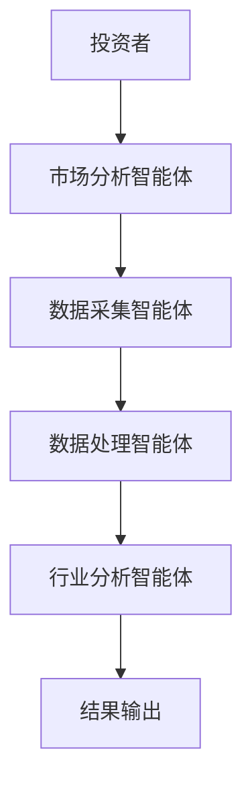
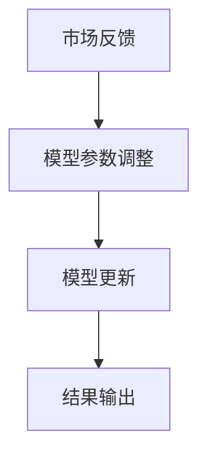
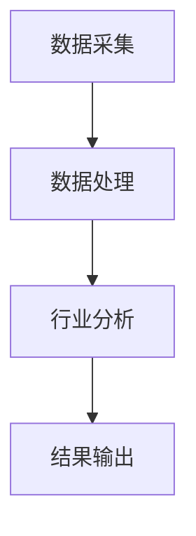
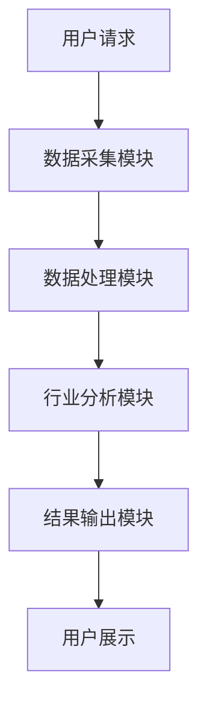

                 


# 基于多智能体的动态行业分析模型在价值投资中的应用

## 关键词：多智能体系统、动态行业分析模型、价值投资、机器学习、协作算法

## 摘要：  
本文探讨了基于多智能体的动态行业分析模型在价值投资中的应用，详细介绍了多智能体系统的概念、动态行业分析模型的构建方法，以及如何利用这些技术提高投资决策的准确性和效率。文章从理论基础到算法实现，再到系统架构设计，结合实际案例分析，展示了多智能体动态行业分析模型的优势和实际应用价值。

---

# 第1章: 引言

## 1.1 背景介绍  
在价值投资中，行业分析是识别投资机会和风险的关键步骤。传统的行业分析方法依赖于静态数据和单一分析模型，难以应对市场动态变化和多维度信息的复杂性。随着人工智能和多智能体技术的发展，如何利用这些技术构建动态、实时的行业分析模型成为研究的热点。

## 1.2 问题描述  
传统行业分析模型存在以下问题：  
1. 数据单一，难以捕捉市场动态变化；  
2. 分析结果缺乏实时性，无法快速响应市场波动；  
3. 缺乏协作机制，难以综合多维度信息进行决策。  

## 1.3 研究目标与意义  
本文旨在构建一个基于多智能体的动态行业分析模型，通过多智能体协作和动态调整算法，实现对行业数据的实时分析和预测。该模型能够帮助投资者更准确地把握市场动态，提高投资决策的科学性和效率。

## 1.4 本章小结  
本章介绍了研究的背景、问题和目标，为后续内容奠定了基础。

---

# 第2章: 多智能体系统与动态行业分析模型

## 2.1 多智能体系统的概念与特点  
多智能体系统（Multi-Agent System, MAS）是由多个智能体组成的系统，每个智能体具有自主性、反应性、协作性和学习能力。与单智能体系统相比，MAS能够更好地处理复杂问题。

### 2.1.1 多智能体系统的组成  
1. **智能体（Agent）**：能够感知环境、自主决策并执行任务的实体。  
2. **通信机制**：智能体之间的信息交互方式，如消息传递、共享数据库等。  
3. **协作机制**：智能体之间协同工作的规则和协议。  

### 2.1.2 多智能体系统的优点  
1. **分布式计算**：避免单点故障，提高系统的鲁棒性；  
2. **协作能力**：通过智能体协作，能够综合多维度信息，提升分析结果的准确性；  
3. **动态适应性**：智能体能够根据环境变化实时调整策略。  

## 2.2 动态行业分析模型的构建  
动态行业分析模型的核心在于实时更新行业数据，并根据市场变化动态调整分析结果。  

### 2.2.1 数据来源与预处理  
1. **数据来源**：包括行业报告、财务数据、市场新闻等多源数据；  
2. **数据预处理**：数据清洗、特征提取、标准化等步骤。  

### 2.2.2 模型构建与训练  
1. **模型选择**：根据数据特点选择回归、聚类或神经网络等模型；  
2. **模型训练**：使用历史数据训练模型，优化参数；  
3. **模型评估**：通过测试数据验证模型的准确性和稳定性。  

---

# 第3章: 基于多智能体的动态行业分析模型算法实现

## 3.1 多智能体协作算法  
### 3.1.1 算法原理  
多智能体协作算法通过智能体之间的信息共享和协同决策，实现对行业数据的实时分析。  

### 3.1.2 算法流程图  


### 3.1.3 算法实现  
```python
class Agent:
    def __init__(self, role):
        self.role = role
        self.data = None

    def receive_message(self, message):
        self.data = message

    def send_message(self, message):
        return message

# 初始化智能体
investor = Agent("investor")
market_analyzer = Agent("market_analyzer")
data_collector = Agent("data_collector")
data_processor = Agent("data_processor")
industry_analyzer = Agent("industry_analyzer")

# 智能体协作流程
message = investor.send_message("行业数据请求")
market_analyzer.receive_message(message)
market_analyzer.send_message("市场数据更新")  # 传递给数据采集智能体
# ...
```

## 3.2 动态调整算法  
动态调整算法通过实时更新模型参数，确保分析结果能够适应市场变化。  

### 3.2.1 算法原理  
动态调整算法基于反馈机制，根据市场反馈调整模型参数。  

### 3.2.2 算法流程图  


### 3.2.3 算法实现  
```python
def dynamic_adjustment(model, feedback):
    # 根据反馈调整模型参数
    model.params = update_params(model.params, feedback)
    return model.predict()

# 示例
model = IndustryModel()
feedback = {"accuracy": 0.85, "error": 0.15}
result = dynamic_adjustment(model, feedback)
print(result)
```

---

# 第4章: 系统架构设计

## 4.1 系统功能设计  
系统功能包括数据采集、数据处理、行业分析和结果输出。  

### 4.1.1 功能模块划分  
1. **数据采集模块**：负责采集行业数据；  
2. **数据处理模块**：对数据进行清洗和特征提取；  
3. **行业分析模块**：基于多智能体进行行业分析；  
4. **结果输出模块**：展示分析结果。  

### 4.1.2 系统功能流程图  


## 4.2 系统架构设计  
系统架构采用分层设计，包括数据层、业务逻辑层和表现层。  

### 4.2.1 系统架构图  


## 4.3 系统接口设计  
系统接口包括数据接口、分析接口和结果展示接口。  

### 4.3.1 接口设计示例  
```python
# 数据接口
def get_data(source):
    # 获取数据
    return data

# 分析接口
def analyze_industry(data):
    # 行业分析
    return result

# 结果展示接口
def display_result(result):
    # 展示结果
    pass
```

## 4.4 系统交互流程图  


---

# 第5章: 项目实战与案例分析

## 5.1 项目实战  
### 5.1.1 环境安装  
需要安装Python、机器学习库（如scikit-learn、TensorFlow）和Mermaid图生成工具。  

### 5.1.2 核心代码实现  
```python
# 数据处理模块
def preprocess_data(data):
    # 数据清洗和特征提取
    return processed_data

# 行业分析模块
def industry_analysis(data):
    # 基于多智能体的行业分析
    return analysis_result
```

## 5.2 案例分析  
以某行业为例，展示模型的应用和分析结果。  

### 5.2.1 数据分析  
1. **数据来源**：行业报告、财务数据等；  
2. **数据分析结果**：行业趋势、龙头企业、风险因素等。  

### 5.2.2 模型评估  
1. **评估指标**：准确率、召回率、F1分数等；  
2. **评估结果**：模型在测试数据上的表现。  

## 5.3 结果解读  
解读分析结果，提出投资建议。  

---

# 第6章: 扩展与优化

## 6.1 模型优化  
1. **参数优化**：通过网格搜索或随机搜索优化模型参数；  
2. **模型融合**：结合多种模型提升性能。  

## 6.2 应用扩展  
1. **多行业分析**：将模型扩展到多个行业；  
2. **实时监控**：实现实时数据分析和预警。  

## 6.3 未来研究方向  
1. **强化学习应用**：探索强化学习在多智能体协作中的应用；  
2. **边缘计算结合**：利用边缘计算提升模型的实时性和效率。  

---

# 第7章: 总结与展望

## 7.1 本文总结  
本文构建了一个基于多智能体的动态行业分析模型，展示了其在价值投资中的应用。通过多智能体协作和动态调整算法，提高了行业分析的准确性和效率。

## 7.2 未来展望  
未来，随着人工智能和大数据技术的发展，多智能体动态行业分析模型将在更多领域得到应用，为投资决策提供更强大的支持。

---

# 参考文献  
（此处列出相关文献和参考资料）

---

通过本文的系统介绍和详细分析，读者可以全面了解基于多智能体的动态行业分析模型在价值投资中的应用，掌握其实现方法和实际案例，为后续研究和实践提供参考。

