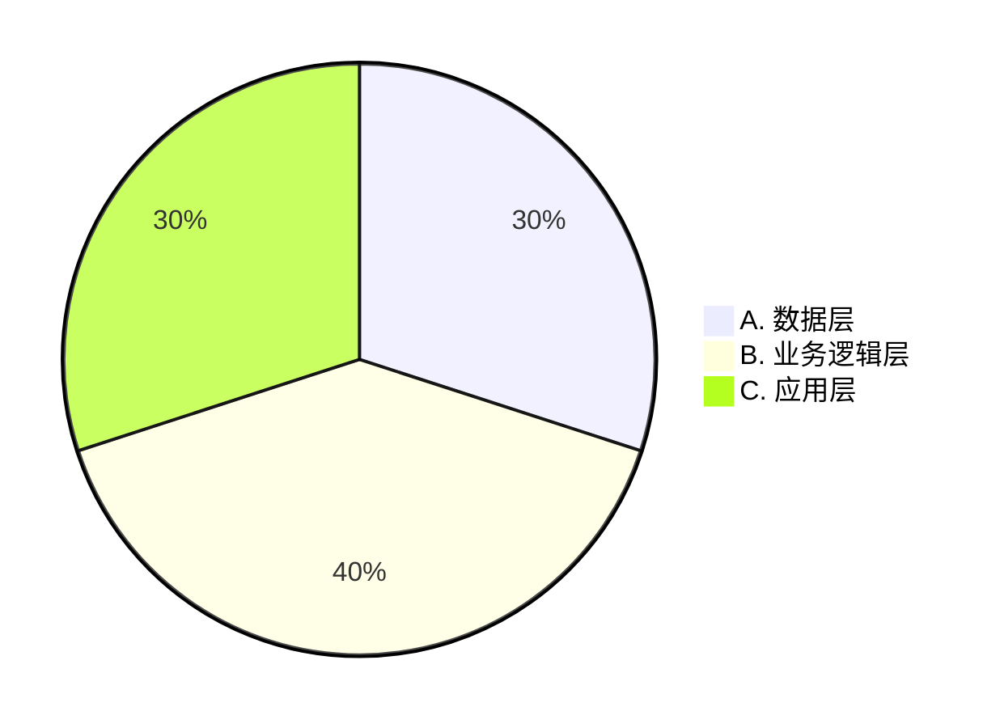
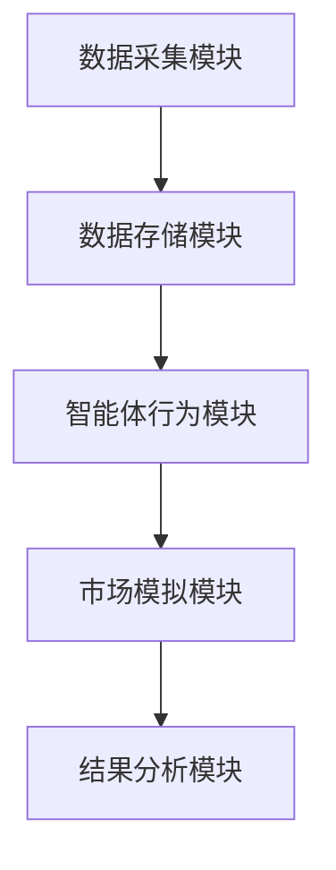
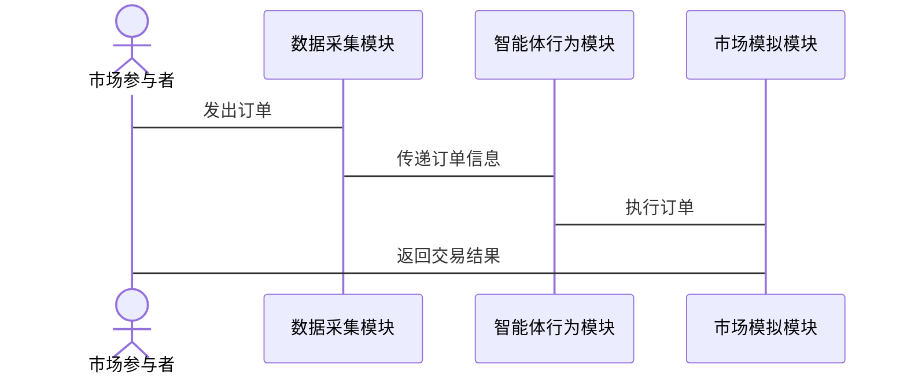

                 


# 基于多智能体的市场微观结构分析

> 关键词：多智能体系统、市场微观结构、博弈论、算法、系统架构

> 摘要：本文将深入探讨如何利用多智能体系统对市场微观结构进行分析，涵盖基础概念、算法原理、系统设计和项目实战等内容。

---

# 第4章 系统分析与架构设计

## 4.1 系统分析

### 4.1.1 问题场景介绍
多智能体系统应用于市场微观结构分析，需要处理高频交易数据，支持多智能体的实时交互，同时保证系统的稳定性和高效性。

### 4.1.2 系统功能需求
- 数据采集与处理：实时采集市场数据，包括订单、价格、成交量等。
- 智能体行为建模：模拟市场参与者的行为，如买卖决策、价格预测等。
- 市场模拟：基于智能体的行为，模拟市场动态，分析价格波动、订单流等。
- 结果分析：提供可视化结果，帮助理解市场微观结构的变化。

### 4.1.3 系统性能需求
- 处理速度：支持高频交易数据的实时处理。
- 并行计算：多智能体之间的交互需要高效的并行计算能力。
- 系统稳定性：确保在高负载下的稳定运行。

## 4.2 系统架构设计

### 4.2.1 系统架构
采用分层架构，将系统分为数据层、业务逻辑层和应用层。

#### 数据层
负责数据的采集、存储和管理，使用数据库或数据仓库。

#### 业务逻辑层
实现智能体的行为建模、市场模拟和结果分析。

#### 应用层
提供用户界面，展示分析结果，支持用户交互。

### 4.2.2 系统架构图


## 4.3 模块设计

### 4.3.1 模块划分
- 数据采集模块：负责实时数据的采集。
- 智能体行为模块：模拟市场参与者的决策行为。
- 市场模拟模块：基于智能体行为，模拟市场动态。
- 结果分析模块：分析模拟结果，生成可视化报告。

### 4.3.2 模块关系图


## 4.4 接口与交互设计

### 4.4.1 系统接口
- 数据采集模块与业务逻辑层的交互接口。
- 智能体行为模块与市场模拟模块的交互接口。

### 4.4.2 交互流程
使用mermaid序列图展示订单处理流程：


---

# 第5章 项目实战：股票市场订单匹配系统

## 5.1 项目背景

股票市场订单匹配系统的复杂性促使我们使用多智能体系统来模拟市场微观结构，分析订单流和价格动态。

## 5.2 环境安装

### 5.2.1 开发环境
- 操作系统：Linux/Windows/MacOS
- Python版本：3.8+

### 5.2.2 工具安装
安装必要的Python库：
```bash
pip install numpy pandas matplotlib
```

## 5.3 核心代码实现

### 5.3.1 数据采集模块
```python
import pandas as pd

def collect_data(symbol):
    # 示例数据采集函数
    # 返回股票价格数据
    data = pd.DataFrame({
        'time': [1, 2, 3, 4, 5],
        'price': [100, 101, 99, 102, 100]
    })
    return data
```

### 5.3.2 智能体行为模块
```python
class TradingAgent:
    def __init__(self, id):
        self.id = id
        self.position = 0  # 持股数量
        self.balance = 10000  # 资金

    def decide_trade(self, price):
        # 示例交易决策函数
        if price < 100:
            return 'buy'
        elif price > 102:
            return 'sell'
        else:
            return 'hold'
```

### 5.3.3 市场模拟模块
```python
def market_simulation(agents, data):
    for agent in agents:
        price = data['price'].values[-1]
        decision = agent.decide_trade(price)
        if decision == 'buy':
            agent.position += 1
            agent.balance -= price
        elif decision == 'sell':
            agent.position -= 1
            agent.balance += price
```

## 5.4 案例分析

### 5.4.1 案例背景
模拟两只股票的订单匹配，比较多智能体系统与传统订单匹配系统的效果。

### 5.4.2 数据分析
分析模拟结果，比较两种系统的订单成交率、平均成交价格等指标。

## 5.5 总结

### 5.5.1 项目成果
展示了多智能体系统在股票市场订单匹配中的优势，如更高效的交易处理和更精准的价格预测。

### 5.5.2 经验教训
在系统设计中，需注意智能体之间的协调问题，避免竞争条件和死锁。

---

# 第6章 总结与展望

## 6.1 研究总结

通过本文的分析，我们展示了多智能体系统在市场微观结构分析中的强大能力，特别是在模拟复杂市场行为和优化交易策略方面。

## 6.2 研究不足

本文的研究存在一些不足，如数据的实时性问题，系统在处理高频交易数据时的性能瓶颈，以及智能体之间的协同优化问题。

## 6.3 未来展望

未来的研究方向包括：
1. 结合区块链技术，提升系统的安全性和透明性。
2. 引入深度学习模型，提高智能体的学习能力和预测精度。
3. 研究多智能体系统的扩展性，支持更大规模的市场模拟。

---

通过以上章节的内容，我们详细探讨了多智能体系统在市场微观结构分析中的应用，从理论到实践，为读者提供了全面的视角。希望本文能为相关领域的研究者和实践者提供有价值的参考和启发。

