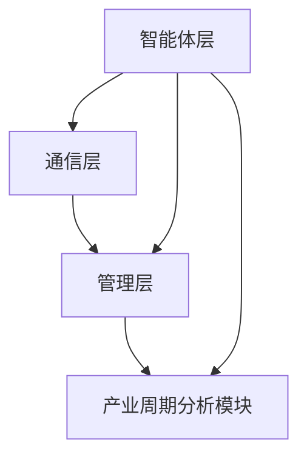
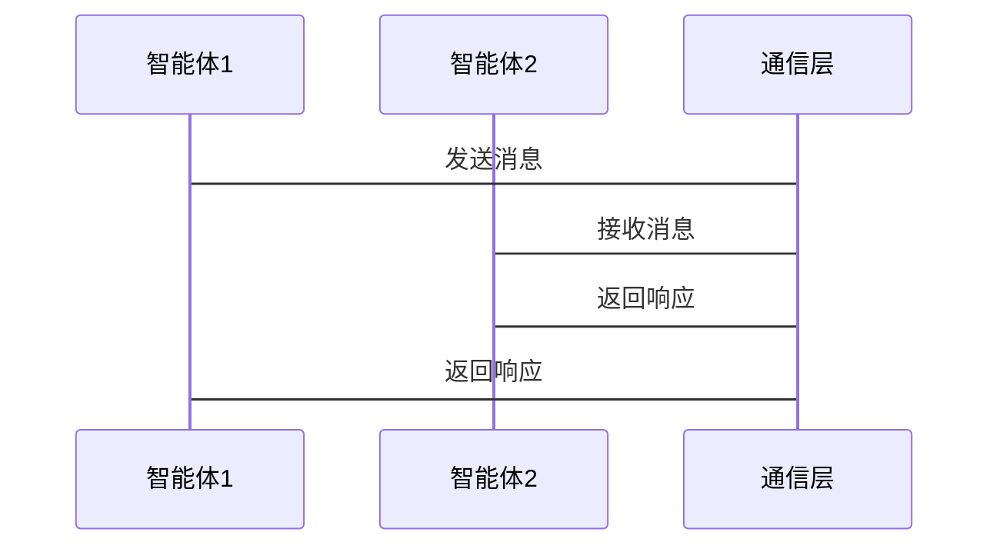

                 


# 基于多智能体的自动化产业周期分析

> 关键词：多智能体系统、产业周期分析、分布式计算、博弈论、强化学习

> 摘要：本文详细介绍了基于多智能体的自动化产业周期分析方法，结合多智能体系统的数学模型、算法原理和系统架构设计，探讨了其在实际应用中的优势和挑战。通过案例分析和项目实战，展示了如何利用多智能体系统实现产业周期的智能化分析。

---

## 第一章: 多智能体系统概述

### 1.1 多智能体系统的基本概念

#### 1.1.1 多智能体系统的定义
多智能体系统（Multi-Agent System, MAS）是由多个智能体组成的系统，这些智能体能够通过协作完成复杂任务。智能体是具有感知、推理、决策和行动能力的实体。

#### 1.1.2 多智能体系统的特征
- **自主性**：智能体能够自主决策。
- **反应性**：能够实时感知环境并做出反应。
- **协作性**：多个智能体能够协作完成任务。
- **分布性**：智能体分布在网络中，通过通信协作。

#### 1.1.3 多智能体系统的分类
- **简单协调系统**：智能体之间协作简单。
- **分布式问题求解系统**：智能体协作解决复杂问题。
- **动态协作系统**：智能体能够动态调整协作策略。

### 1.2 产业周期分析的基本概念

#### 1.2.1 产业周期的定义
产业周期是指一个产业从发展到成熟再到衰退的过程，通常包括复苏、增长、成熟和衰退四个阶段。

#### 1.2.2 产业周期的阶段划分
- **复苏阶段**：产业从衰退中恢复。
- **增长阶段**：产业快速发展。
- **成熟阶段**：产业增长放缓，竞争加剧。
- **衰退阶段**：产业需求减少，企业倒闭。

#### 1.2.3 产业周期分析的重要性
- **投资决策**：帮助投资者选择合适的投资时机。
- **企业战略**：帮助企业制定应对产业变化的策略。
- **政策制定**：帮助政府制定产业政策。

### 1.3 多智能体系统在产业周期分析中的应用

#### 1.3.1 多智能体系统的应用场景
- **市场预测**：通过多智能体模拟市场行为，预测产业周期。
- **竞争分析**：分析企业之间的竞争关系，判断产业所处阶段。
- **政策模拟**：模拟政策对企业及产业的影响。

#### 1.3.2 多智能体系统的优势
- **实时性**：能够实时分析市场变化。
- **准确性**：通过多个智能体的协作，提高分析的准确性。
- **可扩展性**：适用于大规模数据分析。

#### 1.3.3 产业周期分析的挑战与机遇
- **挑战**：数据获取困难，模型复杂度高。
- **机遇**：利用多智能体系统实现智能化分析，提高决策效率。

---

## 第二章: 多智能体系统的核心原理

### 2.1 多智能体系统的组成与结构

#### 2.1.1 智能体的定义与属性
- **智能体**：具有自主性、反应性、目标导向和社交能力的实体。
- **属性**：智能体具有感知、决策、行动和通信能力。

#### 2.1.2 多智能体系统的组成
- **智能体**：系统的最小单元。
- **环境**：智能体所处的外部环境。
- **通信机制**：智能体之间的通信方式。
- **协作机制**：智能体之间的协作规则。

#### 2.1.3 多智能体系统的分类
- **集中式系统**：所有智能体共享一个中央控制中心。
- **分布式系统**：智能体之间通过分布式通信协作。
- **混合式系统**：结合集中式和分布式的特点。

### 2.2 多智能体系统的协作机制

#### 2.2.1 协作的基本概念
协作是指多个智能体为了共同目标而合作的过程。

#### 2.2.2 协作的实现方法
- **基于规则的协作**：通过预定义规则进行协作。
- **基于意图的协作**：通过智能体的意图进行动态协作。
- **基于博弈论的协作**：通过博弈论模型实现协作。

#### 2.2.3 协作中的冲突解决
- **冲突检测**：识别潜在的冲突。
- **冲突解决**：通过协商或仲裁解决冲突。

### 2.3 多智能体系统的决策机制

#### 2.3.1 决策的基本概念
决策是指智能体根据环境信息做出选择。

#### 2.3.2 基于博弈论的决策模型
博弈论模型通过分析智能体之间的策略互动，确定最优决策。

#### 2.3.3 基于强化学习的决策模型
强化学习通过智能体与环境的交互，学习最优策略。

---

## 第三章: 多智能体系统的数学模型与算法

### 3.1 多智能体系统的数学模型

#### 3.1.1 基于博弈论的模型
- **纳什均衡**：所有智能体都采取最优策略，使得没有任何一方能够单方面改变策略而受益。
- **囚徒困境**：两个智能体在非合作情况下可能无法实现最优解。

#### 3.1.2 基于图论的模型
- **图模型**：将智能体之间的关系表示为图，分析其结构和连接。

#### 3.1.3 基于动态系统的模型
- **动态模型**：描述智能体状态随时间的变化。

### 3.2 多智能体系统的算法原理

#### 3.2.1 分布式计算算法
- **分布式计算**：智能体之间通过分布式方式完成计算任务。
- **算法示例**：分布式聚类算法。

#### 3.2.2 协作算法
- **协作算法**：通过协作完成特定任务。
- **算法示例**：分布式任务分配算法。

#### 3.2.3 决策算法
- **决策算法**：基于环境信息做出决策。
- **算法示例**：强化学习算法（Q-Learning）。

### 3.3 基于多智能体的产业周期分析算法

#### 3.3.1 产业周期分析的数学模型
- **模型构建**：通过博弈论模型描述产业周期变化。
- **模型参数**：包括市场参与者的策略、市场需求等。

#### 3.3.2 多智能体协作的算法实现
- **算法实现**：通过多智能体协作，模拟产业周期变化。

#### 3.3.3 算法的优化与改进
- **优化策略**：通过改进算法结构，提高计算效率。

---

## 第四章: 多智能体系统的系统架构设计

### 4.1 系统架构概述

#### 4.1.1 系统架构的目标
- **目标**：设计一个高效、可扩展的系统架构，支持多智能体协作。

#### 4.1.2 系统架构的组成
- **智能体层**：包括多个智能体，负责具体任务。
- **通信层**：智能体之间的通信机制。
- **管理层**：负责系统管理和资源分配。

#### 4.1.3 系统架构的设计原则
- **模块化**：系统分为多个模块，便于维护和扩展。
- **可扩展性**：系统能够适应业务需求的变化。

### 4.2 系统功能设计

#### 4.2.1 产业周期分析模块
- **功能**：分析产业周期，预测未来趋势。

#### 4.2.2 多智能体协作模块
- **功能**：实现智能体之间的协作。

#### 4.2.3 用户交互模块
- **功能**：提供用户友好的交互界面。

### 4.3 系统架构图



### 4.4 系统接口设计

#### 4.4.1 系统接口的定义
- **接口**：智能体之间通信的接口。

#### 4.4.2 系统接口的实现
- **实现方式**：通过API实现智能体之间的通信。

#### 4.4.3 系统接口的测试
- **测试方法**：通过单元测试验证接口功能。

### 4.5 系统交互设计



---

## 第五章: 多智能体系统的项目实战

### 5.1 项目背景与目标

#### 5.1.1 项目背景
- **背景**：分析某一产业的周期变化，制定相应的战略。

#### 5.1.2 项目目标
- **目标**：利用多智能体系统，实现产业周期的自动化分析。

### 5.2 环境安装与配置

#### 5.2.1 开发环境
- **工具**：Python、机器学习库（如TensorFlow、Scikit-learn）。

#### 5.2.2 系统配置
- **配置要求**：安装必要的Python包，配置开发环境。

### 5.3 核心代码实现

#### 5.3.1 智能体实现
```python
class Agent:
    def __init__(self, id):
        self.id = id
        self.state = 'idle'  # 状态：空闲、忙碌、等待
    
    def receive_message(self, message):
        # 处理消息
        pass
    
    def send_message(self, message):
        # 发送消息
        pass
```

#### 5.3.2 通信层实现
```python
class CommunicationLayer:
    def __init__(self):
        self.agents = {}  # 存储智能体
    
    def register_agent(self, agent):
        self.agents[agent.id] = agent
    
    def send_message(self, sender, receiver, message):
        if receiver in self.agents:
            self.agents[receiver].receive_message(message)
```

### 5.4 项目总结

#### 5.4.1 项目成果
- **成果**：成功实现了一个基于多智能体的产业周期分析系统。

#### 5.4.2 经验总结
- **经验**：多智能体系统的协作机制设计是关键。

#### 5.4.3 改进建议
- **建议**：进一步优化算法，提高系统的运行效率。

---

## 总结

本文详细介绍了基于多智能体的自动化产业周期分析方法，结合数学模型、算法原理和系统架构设计，探讨了其在实际应用中的优势和挑战。通过案例分析和项目实战，展示了如何利用多智能体系统实现产业周期的智能化分析。

---

## 注意事项

- **数据质量**：确保数据的准确性和完整性。
- **系统安全性**：注意系统的安全性，防止数据泄露。
- **算法优化**：不断优化算法，提高系统的运行效率。

---

## 拓展阅读

- 《Multi-Agent Systems: Complexity and Cognitive Models》
- 《Game Theory and Its Applications in Economics》
- 《Reinforcement Learning: Theory and Applications》

