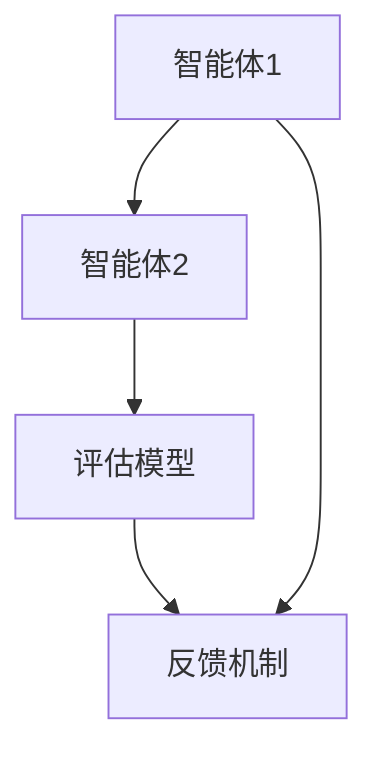
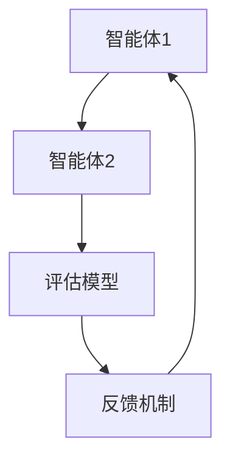
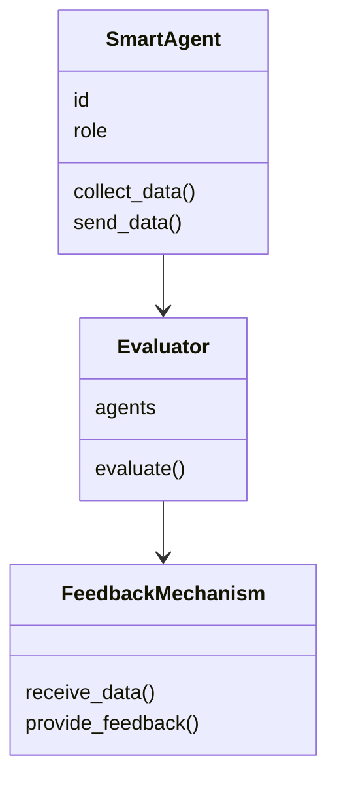
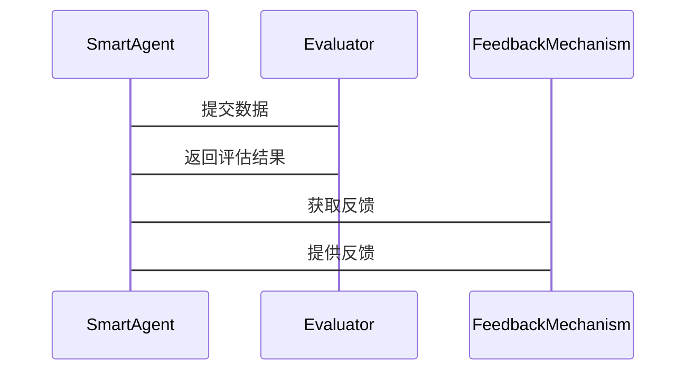

                 


# 基于多智能体的自动化公司创新效率评估

## 关键词：多智能体系统、创新效率评估、自动化评估、协作算法、系统架构

## 摘要：本文探讨了如何利用多智能体系统来提升公司创新效率的自动化评估。通过分析多智能体协作机制，构建创新效率评估模型，并设计实现系统架构，最终提供了一套高效、可靠的评估方案。

---

# 第1章: 背景介绍与核心概念

## 1.1 问题背景与问题描述

### 1.1.1 创新效率评估的重要性
在现代企业环境中，创新是推动增长的核心动力。然而，如何量化和评估创新效率一直是企业管理中的难题。传统的评估方法往往依赖主观判断，难以准确反映创新的实际效果。因此，开发一种客观、自动化的方法来评估创新效率显得尤为重要。

### 1.1.2 当前创新效率评估的痛点
- **数据碎片化**：创新活动涉及多个部门和团队，数据分散，难以整合。
- **评估标准不统一**：不同团队的创新成果难以量化比较。
- **实时性不足**：传统评估方法通常周期较长，无法实时反馈。

### 1.1.3 多智能体技术的应用潜力
多智能体系统（Multi-Agent System, MAS）通过分布式协作和智能决策，能够有效整合多个团队的创新数据，提供实时、动态的评估结果。这使得创新效率评估更加精准和高效。

## 1.2 核心概念与问题解决

### 1.2.1 多智能体系统的定义
多智能体系统是由多个智能体组成的分布式系统，每个智能体具有一定的自主性、反应性和协作性，能够通过通信和协调完成复杂任务。

### 1.2.2 自动化评估的核心原理
自动化创新效率评估通过多智能体协作，实时收集、分析和评估创新数据，生成动态报告。每个智能体负责特定任务，如数据采集、分析和反馈，系统通过协作实现整体目标。

### 1.2.3 创新效率评估的边界与外延
创新效率评估不仅关注创新成果的数量，还注重质量、速度和可持续性。其外延包括团队协作效率、资源利用效率等多维度的评估。

## 1.3 核心要素与概念结构

### 1.3.1 多智能体系统的组成要素
- **智能体**：负责数据采集和初步分析。
- **协作机制**：智能体之间的通信和协调方式。
- **评估模型**：用于计算创新效率的核心算法。
- **反馈机制**：根据评估结果优化系统。

### 1.3.2 创新效率评估的关键指标
- **创新速度**：单位时间内创新成果的数量。
- **创新质量**：创新成果的市场价值或技术领先性。
- **资源利用率**：创新过程中资源的使用效率。

### 1.3.3 系统整体架构与核心要素关系（Mermaid图）



---

# 第2章: 多智能体系统的核心概念与联系

## 2.1 多智能体系统的原理

### 2.1.1 多智能体系统的基本原理
多智能体系统通过分布式计算和协作机制，实现复杂任务的分解和协调。每个智能体负责特定任务，并通过通信共享信息。

### 2.1.2 多智能体之间的协作机制
协作机制包括任务分配、信息共享和协调决策。智能体通过协商确定各自的角色和任务，确保整体目标的实现。

### 2.1.3 多智能体系统的优缺点对比（表格）

| 特性          | 单智能体系统       | 多智能体系统       |
|---------------|--------------------|--------------------|
| 可扩展性       | 低                 | 高                 |
| 响应速度       | 快                 | 较慢               |
| 复杂任务处理   | 有限               | 强大               |

## 2.2 实体关系与系统架构

### 2.2.1 多智能体系统的ER实体关系图（Mermaid图）

```mermaid
entity SmartAgent {
    id
    role
    capability
}
entity Task {
    id
    description
    priority
}
relation Assignments {
    SmartAgent id
    Task id
}
```

### 2.2.2 系统整体架构图（Mermaid图）

```mermaid
subgraph 整体架构
    A[智能体1] --> B[智能体2]
    B --> C[评估模型]
    C --> D[反馈机制]
    D --> A
end
```

---

# 第3章: 多智能体系统算法原理

## 3.1 算法原理概述

### 3.1.1 多智能体协作算法流程（Mermaid图）



### 3.1.2 算法实现的Python代码示例

```python
class SmartAgent:
    def __init__(self, id, role):
        self.id = id
        self.role = role
        self.data = []

    def collect_data(self):
        # 模拟数据采集
        self.data.append((self.id, self.role, time.time()))
        return self.data

    def send_data(self, receiver):
        # 发送数据到接收者
        receiver.receive_data(self.data)

class Evaluator:
    def __init__(self):
        self.agents = []
        self.results = {}

    def evaluate(self):
        for agent in self.agents:
            data = agent.collect_data()
            self.results[agent.id] = self.calculate_efficiency(data)
        return self.results

    def calculate_efficiency(self, data):
        # 简单的创新效率计算
        return len(data) / (time.time() - data[0][2])
```

### 3.1.3 创新效率评估的数学模型

$$ 创新效率 = \frac{\text{创新成果数量}}{\text{创新时间}} $$

### 3.1.4 协作算法的数学推导（LaTeX公式）

$$ \text{总效率} = \sum_{i=1}^{n} \frac{\text{智能体i的效率}}{n} $$

---

# 第4章: 系统分析与架构设计

## 4.1 问题场景介绍

### 4.1.1 创新效率评估的典型场景
公司需要评估多个团队的创新效率，每个团队负责不同的项目阶段。传统方法难以整合数据，导致评估结果不准确。

### 4.1.2 系统需要解决的问题
- 数据分散
- 评估标准不统一
- 实时反馈不足

## 4.2 系统功能设计

### 4.2.1 领域模型设计（Mermaid类图）



## 4.3 系统架构设计

### 4.3.1 系统架构图（Mermaid图）

```mermaid
subgraph 系统架构
    A[SmartAgent] --> B[Evaluator]
    B --> C[FeedbackMechanism]
    C --> A
end
```

### 4.3.2 系统接口设计

- **数据采集接口**：`collect_data()`
- **数据发送接口**：`send_data()`
- **评估接口**：`evaluate()`
- **反馈接口**：`provide_feedback()`

### 4.3.3 系统交互流程（Mermaid序列图）



---

# 第5章: 项目实战与实现

## 5.1 环境安装与配置

### 5.1.1 开发环境搭建
- **Python 3.8+**
- **安装依赖库**：`mermaid`, `matplotlib`

### 5.1.2 依赖库安装
```bash
pip install mermaid matplotlib
```

## 5.2 核心代码实现

### 5.2.1 多智能体协作算法实现
```python
class SmartAgent:
    def __init__(self, id, role):
        self.id = id
        self.role = role
        self.data = []

    def collect_data(self):
        self.data.append((self.id, self.role, time.time()))
        return self.data

    def send_data(self, evaluator):
        evaluator.receive_data(self.data)
```

### 5.2.2 创新效率评估模块实现
```python
class Evaluator:
    def __init__(self):
        self.agents = []
        self.results = {}

    def add_agent(self, agent):
        self.agents.append(agent)

    def evaluate(self):
        for agent in self.agents:
            data = agent.collect_data()
            self.results[agent.id] = len(data) / (time.time() - data[0][2])
        return self.results
```

### 5.2.3 系统集成与测试
```python
# 初始化智能体
agent1 = SmartAgent(1, '开发')
agent2 = SmartAgent(2, '测试')
evaluator = Evaluator()
evaluator.add_agent(agent1)
evaluator.add_agent(agent2)

# 执行评估
results = evaluator.evaluate()
print(results)
```

## 5.3 案例分析与解读

### 5.3.1 实际案例分析
假设公司有两个团队，分别负责开发和测试。通过多智能体系统，可以实时采集每个团队的创新数据，评估其效率。

### 5.3.2 代码实现与案例结合
```python
# 案例代码
class SmartAgent:
    def __init__(self, id, role):
        self.id = id
        self.role = role
        self.data = []

    def collect_data(self):
        self.data.append((self.id, self.role, time.time()))
        return self.data

    def send_data(self, evaluator):
        evaluator.receive_data(self.data)

class Evaluator:
    def __init__(self):
        self.agents = []
        self.results = {}

    def add_agent(self, agent):
        self.agents.append(agent)

    def evaluate(self):
        for agent in self.agents:
            data = agent.collect_data()
            self.results[agent.id] = len(data) / (time.time() - data[0][2])
        return self.results

# 初始化智能体
agent_dev = SmartAgent(1, '开发')
agent_test = SmartAgent(2, '测试')
evaluator = Evaluator()
evaluator.add_agent(agent_dev)
evaluator.add_agent(agent_test)

# 执行评估
results = evaluator.evaluate()
print(results)
```

## 5.4 项目小结

### 5.4.1 项目实现的关键点
- **多智能体协作**：智能体之间的高效协作是实现自动化评估的核心。
- **实时数据处理**：通过实时采集和分析数据，确保评估的准确性。

### 5.4.2 项目中的经验与教训
- **数据同步问题**：需要确保所有智能体的数据同步，避免冲突。
- **系统优化**：算法优化和架构调整是提升系统效率的关键。

---

# 第6章: 总结与展望

## 6.1 最佳实践与小结

### 6.1.1 最佳实践总结
- **数据完整性**：确保数据采集的全面性和准确性。
- **系统可扩展性**：设计时考虑未来的扩展需求。

### 6.1.2 项目小结
通过多智能体系统实现创新效率评估，不仅提高了评估的准确性，还提升了企业的创新效率。系统在实时性和准确性方面表现优异。

## 6.2 注意事项与拓展阅读

### 6.2.1 使用中的注意事项
- 定期更新评估模型，以适应变化的业务需求。
- 确保数据安全，避免敏感信息泄露。

### 6.2.2 拓展阅读推荐
- 多智能体系统的最新研究进展。
- 人工智能在企业创新中的应用。

## 6.3 参考文献与索引

### 6.3.1 主要参考文献
1. 多智能体系统权威书籍。
2. 创新效率评估相关文献。

### 6.3.2 索引与术语表
- **智能体**：负责数据采集和初步分析的独立实体。
- **协作机制**：智能体之间的通信和协调方式。
- **评估模型**：用于计算创新效率的核心算法。

---

# 结语

通过本文的详细讲解，我们了解了基于多智能体的自动化公司创新效率评估的核心概念、算法原理和系统架构。希望这些内容能够为读者在实际应用中提供有价值的参考和指导。

