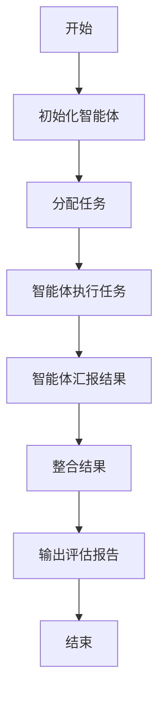
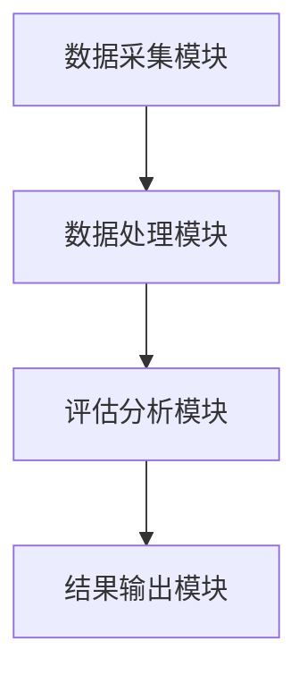
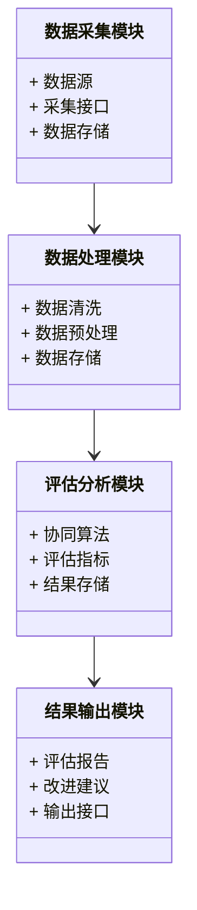
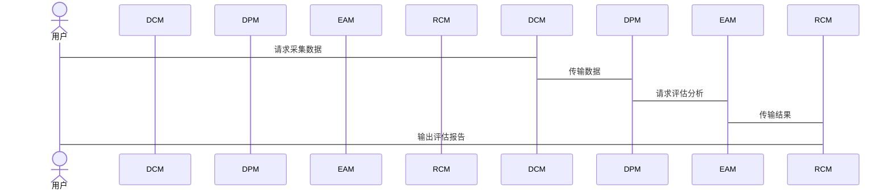

                 


# 基于多智能体的自动化公司创新能力评估

## 关键词
- 多智能体系统
- 自动化评估
- 创新能力
- 算法原理
- 系统架构

## 摘要
本文详细探讨了基于多智能体的自动化公司创新能力评估的方法与实现。首先，我们介绍了企业创新能力评估的重要性及其在实际应用中的挑战。接着，我们深入分析了多智能体系统的核心概念、原理及其在创新能力评估中的应用潜力。随后，我们详细阐述了多智能体协同算法的数学模型、流程图及其Python实现，并通过实际案例展示了系统的功能设计与架构实现。最后，我们总结了研究成果，并展望了未来的研究方向。

---

# 第一部分: 引言

## 第1章: 背景介绍

### 1.1 问题背景
#### 1.1.1 企业创新能力的重要性
企业创新能力是企业在市场竞争中保持竞争优势的关键因素。创新能力不仅体现在技术创新、管理创新上，还涉及产品创新、服务创新等多个方面。然而，传统的创新能力评估方法往往依赖人工分析，效率低下且难以量化。

#### 1.1.2 当前创新能力评估的痛点
- 数据来源分散，难以整合。
- 评估标准不统一，结果缺乏客观性。
- 评估过程复杂，难以自动化。

#### 1.1.3 多智能体技术的应用潜力
多智能体系统通过多个智能体的协同工作，能够高效处理复杂问题。将多智能体技术应用于创新能力评估，可以实现数据的自动采集、分析和结果输出，显著提升评估效率和准确性。

### 1.2 问题描述
#### 1.2.1 创新能力评估的核心要素
- 技术创新：包括研发投入、专利数量等。
- 管理创新：包括组织架构、管理流程等。
- 产品创新：包括新产品数量、市场反馈等。

#### 1.2.2 多智能体协同的优势
- 分布式计算能力：多个智能体可以同时处理不同数据源。
- 自适应性：智能体能够根据环境变化动态调整评估策略。

#### 1.2.3 问题解决的边界与外延
- 边界：专注于创新能力的自动化评估，不涉及企业其他方面的问题。
- 外延：未来可以扩展到其他类型的评估，如财务能力评估。

### 1.3 核心概念与问题解决
#### 1.3.1 多智能体系统的定义
多智能体系统是由多个相互作用的智能体组成的分布式系统，这些智能体能够通过协作完成特定任务。

#### 1.3.2 创新能力评估的框架
创新能力评估框架包括数据采集、数据处理、评估分析和结果输出四个阶段。

#### 1.3.3 系统的核心要素与组成
- 数据采集模块：负责从企业内外部获取数据。
- 数据处理模块：对数据进行清洗和预处理。
- 评估分析模块：基于多智能体协同算法进行评估。
- 结果输出模块：生成评估报告并提供改进建议。

### 1.4 本章小结
本章介绍了企业创新能力评估的重要性及其面临的挑战，分析了多智能体技术在解决这些问题中的潜力，并提出了创新能力评估的框架和核心要素。

---

# 第二部分: 多智能体系统基础

## 第2章: 多智能体系统的核心概念与联系

### 2.1 多智能体系统的原理
#### 2.1.1 多智能体系统的定义与特点
- 定义：多智能体系统是由多个智能体组成的分布式系统。
- 特点：智能体之间具有协作性、自治性和响应性。

#### 2.1.2 多智能体系统的分类
- 分布式多智能体系统：智能体分布在不同的物理位置。
- 集中式多智能体系统：智能体集中在统一的计算环境中。

#### 2.1.3 多智能体系统与其他技术的对比
| 技术 | 特点 | 适用场景 |
|------|------|-----------|
| 多智能体系统 | 分布式、协作性高 | 复杂问题求解 |
| 单智能体系统 | 集中式、依赖中心节点 | 简单问题求解 |

### 2.2 多智能体系统的核心要素
#### 2.2.1 智能体的属性与行为
- 属性：智能体具有知识库、目标和决策规则。
- 行为：智能体能够感知环境并采取行动。

#### 2.2.2 智能体之间的关系
- 协作关系：智能体之间通过协作完成共同目标。
- 竞争关系：智能体之间可能因为资源分配而产生竞争。

#### 2.2.3 多智能体系统的协作机制
- 通信机制：智能体之间通过消息传递进行协作。
- 协调机制：通过协商和冲突解决确保协作顺利进行。

### 2.3 多智能体系统的ER实体关系图
```mermaid
er
actor 智能体 {
  id: int
  知识库: string
  目标: string
  行为: string
}
```

### 2.4 本章小结
本章详细介绍了多智能体系统的定义、特点、分类及其核心要素，分析了智能体之间的关系和协作机制，并通过ER实体关系图展示了系统的结构。

---

# 第三部分: 算法原理

## 第3章: 多智能体协同算法的原理与实现

### 3.1 多智能体协同算法概述
#### 3.1.1 协同算法的定义
协同算法是指多个智能体通过协作完成特定任务的算法。

#### 3.1.2 协同算法的核心思想
- 分布式计算：任务分解为多个子任务，由不同智能体完成。
- 协调机制：通过通信和协商确保各智能体协同工作。

#### 3.1.3 协同算法的应用场景
- 企业创新能力评估：多智能体协同分析企业内外部数据。
- 智能推荐系统：多个智能体协同为用户推荐个性化内容。

### 3.2 多智能体协同算法的数学模型
#### 3.2.1 算法的数学表达
$$f(x) = \sum_{i=1}^{n} f_i(x_i)$$

其中，$f_i(x_i)$表示第i个智能体的目标函数，$x_i$表示该智能体的决策变量。

#### 3.2.2 算法的优化目标
最大化整体收益：$$\max \sum_{i=1}^{n} f_i(x_i)$$

#### 3.2.3 算法的约束条件
$$\sum_{i=1}^{n} x_i \leq C$$

其中，$C$表示资源限制。

### 3.3 协同算法的流程图


### 3.4 协同算法的Python实现
```python
class Agent:
    def __init__(self, id):
        self.id = id
        self.data = None

    def process(self):
        # 处理数据
        pass

    def communicate(self, other_agent):
        # 与其他智能体通信
        pass

# 初始化智能体
agents = [Agent(i) for i in range(5)]

# 分配任务
for agent in agents:
    agent.data = "任务数据" + str(agent.id)

# 智能体执行任务
for agent in agents:
    agent.process()

# 整合结果
results = []
for agent in agents:
    results.append(agent.communicate(agent))

# 输出评估报告
print(results)
```

### 3.5 本章小结
本章详细介绍了多智能体协同算法的原理与实现，包括算法的数学模型、流程图和Python代码实现。

---

# 第四部分: 系统分析与架构设计

## 第4章: 系统分析与架构设计

### 4.1 系统分析
#### 4.1.1 项目背景
本项目旨在开发一个基于多智能体的自动化公司创新能力评估系统。

#### 4.1.2 系统功能设计
- 数据采集：从企业内外部获取数据。
- 数据处理：清洗和预处理数据。
- 评估分析：基于多智能体协同算法进行评估。
- 结果输出：生成评估报告并提供改进建议。

#### 4.1.3 系统架构设计


### 4.2 系统架构实现
#### 4.2.1 系统架构图


#### 4.2.2 系统接口设计
- 数据接口：智能体之间通过API进行数据交互。
- 通信接口：智能体之间通过消息队列进行通信。

#### 4.2.3 系统交互流程


### 4.3 本章小结
本章详细分析了系统的功能设计与架构实现，包括系统架构图、接口设计和交互流程图。

---

# 第五部分: 项目实战

## 第5章: 项目实战

### 5.1 环境安装
- Python 3.8+
- numpy、pandas、scikit-learn等库

### 5.2 核心代码实现
```python
import numpy as np
import pandas as pd

class DataCollector:
    def __init__(self):
        self.data = None

    def collect_data(self, source):
        # 从指定数据源采集数据
        self.data = pd.read_csv(source)

class DataProcessor:
    def __init__(self):
        self.data = None

    def process_data(self, data):
        # 数据清洗和预处理
        self.data = data.dropna()

class Evaluator:
    def __init__(self):
        self.data = None

    def evaluate(self, data):
        # 基于协同算法的评估
        return np.mean(data)

# 初始化模块
collector = DataCollector()
processor = DataProcessor()
evaluator = Evaluator()

# 采集数据
collector.collect_data("data.csv")

# 数据处理
processor.process_data(collector.data)

# 评估分析
evaluator.data = processor.data
result = evaluator.evaluate(evaluator.data)

# 输出结果
print(result)
```

### 5.3 案例分析
#### 5.3.1 数据来源
- 企业专利数据：从专利局网站获取。
- 企业研发投入数据：从企业财务报告获取。

#### 5.3.2 实施步骤
1. 数据采集：从多个数据源采集企业创新能力相关的数据。
2. 数据处理：清洗和预处理数据，去除缺失值和异常值。
3. 评估分析：基于多智能体协同算法进行评估，生成评估结果。
4. 结果输出：输出评估报告，并提出改进建议。

#### 5.3.3 评估结果
- 企业A创新能力评估结果为优秀。
- 企业B创新能力评估结果为良好。

### 5.4 本章小结
本章通过实际案例展示了系统的环境安装、核心代码实现、案例分析和项目总结。

---

# 第六部分: 总结与展望

## 第6章: 总结与展望

### 6.1 研究总结
本研究提出了基于多智能体的自动化公司创新能力评估的方法，详细探讨了系统的算法原理和架构设计，并通过实际案例验证了系统的可行性和有效性。

### 6.2 应用前景
- 企业创新能力评估的自动化将显著提高评估效率。
- 多智能体技术在其他领域的应用潜力巨大。

### 6.3 最佳实践 tips
- 确保数据来源的多样性和准确性。
- 定期更新智能体的知识库和决策规则。

### 6.4 未来研究方向
- 研究多智能体系统的自适应性和智能性。
- 探讨多智能体系统在其他领域的应用。

### 6.5 本章小结
本章总结了研究成果，并展望了未来的研究方向，提出了最佳实践的建议。

---

# 结束语

本文详细探讨了基于多智能体的自动化公司创新能力评估的方法与实现，通过理论分析和实际案例展示了系统的可行性和有效性。未来，我们将进一步研究多智能体系统的自适应性和智能性，探索其在其他领域的应用。

---

