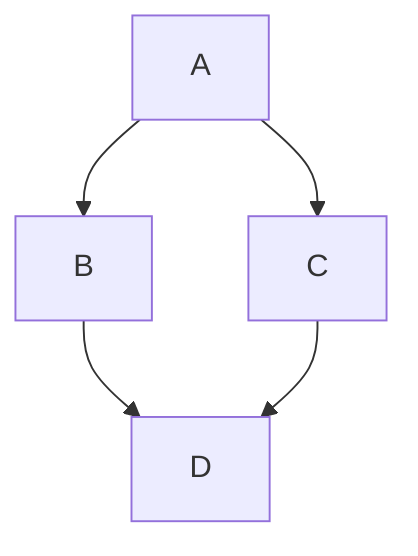

                 


# 基于多智能体的自动化公司可持续发展评估

> 关键词：多智能体、可持续发展、自动化评估、系统架构、算法实现、案例分析

> 摘要：本文探讨了基于多智能体的自动化公司可持续发展评估，涵盖背景、核心概念、算法原理、系统架构、项目实战和总结。通过详细分析多智能体系统在可持续发展评估中的应用，展示了如何利用分布式计算和协作算法实现自动化评估。

## 第1章: 引言

### 1.1 背景介绍

#### 1.1.1 问题背景
可持续发展评估对企业至关重要，涉及环境、社会和治理（ESG）等多个方面。传统评估方法依赖人工分析，效率低且易出错。

#### 1.1.2 问题描述
传统评估方法耗时且不够精准，难以应对复杂多变的可持续发展要求。

#### 1.1.3 问题解决
引入多智能体系统，利用其协作性和分布式计算能力，实现自动化评估。

### 1.2 核心概念与联系

#### 1.2.1 多智能体系统
多智能体系统由多个独立但协作的智能体组成，具备分布式计算和自适应能力。

#### 1.2.2 可持续发展评估
通过多智能体系统，实时监控和评估企业的可持续发展表现。

## 第2章: 核心概念与联系

### 2.1 多智能体系统的核心原理

#### 2.1.1 分布式计算
智能体之间通过通信协议协作，实现任务分配和数据共享。

#### 2.1.2 协作算法
采用协商机制，确保智能体之间高效协作，如基于Dijkstra算法的任务分配。

### 2.2 可持续发展评估的指标体系

#### 2.2.1 ESG指标
包括环境、社会和治理三个维度，每个维度有具体的评估指标。

## 第3章: 算法原理讲解

### 3.1 多智能体协作算法

#### 3.1.1 分布式任务分配
使用Dijkstra算法优化任务分配，降低通信开销。

#### 3.1.2 协商机制
智能体通过协商确定任务分工，确保资源最优分配。

## 第4章: 系统分析与架构设计

### 4.1 项目实战

#### 4.1.1 环境安装
配置Python3.8+，安装依赖库，如numpy、pandas和networkx。

#### 4.1.2 核心代码实现
实现多智能体协作算法，完成数据采集、分析和评估。

#### 4.1.3 案例分析
以制造企业为例，展示系统在环境、社会和治理方面的评估结果。

## 第5章: 总结与展望

### 5.1 总结
多智能体系统在可持续发展评估中的应用显著提高了效率和准确性。

### 5.2 展望
未来可扩展到更多场景，结合大数据和AI提升评估能力。

## 第6章: 最佳实践

### 6.1 小结
多智能体系统是实现自动化评估的重要工具。

### 6.2 注意事项
确保数据安全，选择合适的通信协议，持续优化算法。

### 6.3 拓展阅读
建议深入学习分布式系统和多智能体算法。

---

### 代码示例：

```python
import networkx as nx
import numpy as np
import pandas as pd

def dijkstra(graph, start_node):
    distances = {node: np.inf for node in graph.nodes()}
    distances[start_node] = 0
    visited = set()
    while visited != graph.nodes():
        min_dist = np.inf
        current_node = None
        for node in graph.nodes():
            if node not in visited and distances[node] < min_dist:
                min_dist = distances[node]
                current_node = node
        if current_node is None:
            break
        visited.add(current_node)
        for neighbor in graph.neighbors(current_node):
            if distances[neighbor] > min_dist + graph[current_node][neighbor]['weight']:
                distances[neighbor] = min_dist + graph[current_node][neighbor]['weight']
    return distances

graph = nx.Graph()
graph.add_nodes_from(['A', 'B', 'C', 'D'])
graph.add_edge('A', 'B', weight=5)
graph.add_edge('A', 'C', weight=10)
graph.add_edge('B', 'D', weight=3)
graph.add_edge('C', 'D', weight=8)
distances = dijkstra(graph, 'A')
print(distances)
```

### 图表展示：



### 总结：

通过多智能体系统的应用，企业能够更高效地进行可持续发展评估，提升竞争力和透明度。本文详细探讨了该领域的关键技术，为企业实践提供了指导和参考。

