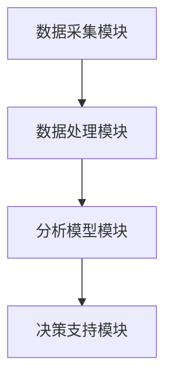

                 


# 基于多智能体的自动化公司战略规划分析系统

> 关键词：多智能体系统，公司战略规划，自动化分析，协同算法，系统架构

> 摘要：本文深入探讨了基于多智能体的公司战略规划自动化分析系统，涵盖多智能体系统的核心概念、协同算法的数学模型、系统架构设计以及项目实战案例。通过详细分析，展示了如何利用多智能体系统提升战略规划的效率和准确性。

---

## 第1章: 多智能体系统与公司战略规划概述

### 1.1 多智能体系统的基本概念

#### 1.1.1 多智能体系统的定义
多智能体系统（Multi-Agent System, MAS）是由多个智能体组成的分布式系统，每个智能体能够感知环境、自主决策并协同完成任务。智能体之间通过通信和协作，共同解决问题。

#### 1.1.2 多智能体系统的特征
- **分布式**：多个智能体独立运行，协同完成任务。
- **自主性**：每个智能体能够自主决策。
- **反应性**：能够根据环境变化调整行为。
- **协作性**：通过通信和协作完成复杂任务。

#### 1.1.3 多智能体系统与传统单智能体系统的区别
| 特性 | 多智能体系统 | 单智能体系统 |
|------|--------------|---------------|
| 结构 | 分布式结构   | 集中式结构   |
| 智能体数量 | 多个        | 单个          |
| 协作性 | 高           | 无             |
| 应用场景 | 复杂任务     | 简单任务       |

### 1.2 公司战略规划的定义与特点

#### 1.2.1 公司战略规划的定义
公司战略规划是指企业为了实现长期目标而制定的全面计划，涵盖市场分析、资源配置、目标设定等。

#### 1.2.2 公司战略规划的核心要素
- **目标设定**：明确企业的发展目标。
- **资源分配**：合理分配人力、财力和物力资源。
- **风险评估**：识别潜在风险并制定应对策略。

#### 1.2.3 公司战略规划的实施步骤
1. **分析环境**：了解市场、竞争环境和内部资源。
2. **设定目标**：明确短期和长期目标。
3. **制定策略**：制定实现目标的具体策略。
4. **实施计划**：分配资源，执行计划。
5. **监控与调整**：监控进展，及时调整。

### 1.3 多智能体系统在公司战略规划中的应用背景

#### 1.3.1 当前公司战略规划的挑战
- **复杂性**：市场环境复杂多变，需要实时调整。
- **数据量大**：处理大量数据，需要高效算法。
- **协作需求高**：需要多部门协作，提高效率。

#### 1.3.2 多智能体系统的优势
- **分布式计算**：提高处理效率。
- **自主决策**：智能体能够独立处理问题。
- **协作能力**：智能体之间可以高效协作。

#### 1.3.3 多智能体系统与公司战略规划的结合意义
通过多智能体系统，可以实现战略规划的自动化、智能化，提高决策效率和准确性。

---

## 第2章: 多智能体系统的核心概念与联系

### 2.1 多智能体系统的原理

#### 2.1.1 多智能体系统的组成
- **智能体**：具有感知和行动能力的实体。
- **通信机制**：智能体之间交换信息的方式。
- **协作机制**：智能体协同完成任务的方式。

#### 2.1.2 多智能体系统的通信机制
- **直接通信**：智能体之间直接交换信息。
- **间接通信**：通过中间媒介传递信息。

#### 2.1.3 多智能体系统的协调与协作
- **协调**：确保智能体行动一致。
- **协作**：智能体共同完成任务。

### 2.2 公司战略规划分析系统的原理

#### 2.2.1 战略规划分析的核心流程
1. **数据采集**：收集市场、竞争等数据。
2. **数据处理**：清洗、转换数据。
3. **分析模型**：建立数学模型进行分析。
4. **决策支持**：基于分析结果提供决策建议。

#### 2.2.2 数据采集与处理
- **数据源**：市场报告、财务数据等。
- **数据处理**：数据清洗、特征提取。

#### 2.2.3 分析模型与决策支持
- **分析模型**：如决策树、回归分析。
- **决策支持**：基于模型结果提供决策建议。

### 2.3 多智能体系统与公司战略规划系统的联系

#### 2.3.1 多智能体系统如何支持战略规划
- **分布式计算**：提高数据处理效率。
- **智能体协作**：智能体协同完成复杂任务。
- **动态调整**：根据环境变化实时调整策略。

#### 2.3.2 多智能体系统在战略规划中的具体应用
- **市场分析**：智能体实时分析市场动态。
- **风险评估**：智能体协作评估潜在风险。
- **资源分配**：智能体优化资源配置。

#### 2.3.3 多智能体系统的优势与局限性
- **优势**：高效、智能、协作能力强。
- **局限性**：复杂性高，维护成本高。

---

## 第3章: 基于多智能体的公司战略规划分析系统的算法原理

### 3.1 多智能体协同算法概述

#### 3.1.1 协同算法的基本概念
协同算法是指多个智能体通过协作完成任务的算法。

#### 3.1.2 常见的协同算法类型
- **基于规则的协同算法**：基于预定义规则进行协作。
- **基于学习的协同算法**：通过学习优化协作策略。
- **基于模型的协同算法**：基于数学模型进行协作。

#### 3.1.3 协同算法的选择与优化
根据任务需求选择合适的协同算法，并进行参数优化。

### 3.2 多智能体协同算法的数学模型

#### 3.2.1 协同算法的数学表达式
$$ \text{目标函数} = \sum_{i=1}^{n} a_i $$
其中，$a_i$ 表示第i个智能体的贡献。

#### 3.2.2 协同算法的优化目标
最小化目标函数，提高协作效率。

#### 3.2.3 协同算法的收敛性分析
通过数学证明，协同算法在一定条件下可以收敛。

### 3.3 多智能体协同算法的实现

#### 3.3.1 算法实现的步骤
1. 初始化智能体。
2. 确定协同规则。
3. 实现通信机制。
4. 迭代优化。

#### 3.3.2 算法实现的代码示例

```python
class Agent:
    def __init__(self, id):
        self.id = id
        self.goal = None

    def set_goal(self, goal):
        self.goal = goal

    def collaborate(self, agents):
        for agent in agents:
            if agent.id != self.id:
                self.goal += agent.goal

def main():
    agent1 = Agent(1)
    agent2 = Agent(2)
    agent3 = Agent(3)
    agent1.set_goal(10)
    agent2.set_goal(20)
    agent3.set_goal(30)
    agent1.collaborate([agent2, agent3])
    print(agent1.goal)

if __name__ == "__main__":
    main()
```

#### 3.3.3 算法实现的注意事项
- 确保通信机制高效。
- 定期优化协同规则。
- 处理可能出现的冲突。

### 3.4 本章小结

---

## 第4章: 基于多智能体的公司战略规划分析系统的系统架构设计

### 4.1 系统功能模块

#### 4.1.1 数据采集模块
- **功能**：收集市场、竞争数据。
- **流程**：数据源 -> 数据清洗 -> 数据存储。

#### 4.1.2 数据处理模块
- **功能**：处理数据，提取特征。
- **流程**：数据清洗 -> 特征提取 -> 数据转换。

#### 4.1.3 分析模型模块
- **功能**：建立数学模型，进行预测。
- **流程**：数据输入 -> 模型训练 -> 结果输出。

#### 4.1.4 决策支持模块
- **功能**：提供决策建议。
- **流程**：模型结果 -> 决策建议 -> 输出报告。

### 4.2 系统架构设计

#### 4.2.1 系统功能模块设计
- **模块划分**：数据采集、数据处理、分析模型、决策支持。
- **模块交互**：数据采集模块 -> 数据处理模块 -> 分析模型模块 -> 决策支持模块。

#### 4.2.2 系统架构图



### 4.3 系统架构设计的注意事项

#### 4.3.1 数据流设计
确保数据在各模块之间高效流动。

#### 4.3.2 智能体协作设计
优化智能体之间的协作机制，提高效率。

#### 4.3.3 系统扩展性设计
确保系统能够适应未来的需求变化。

---

## 第5章: 项目实战——基于多智能体的公司战略规划分析系统实现

### 5.1 项目背景与目标

#### 5.1.1 项目背景
一家中型制造企业希望利用多智能体系统优化战略规划。

#### 5.1.2 项目目标
- 实现战略规划的自动化分析。
- 提高决策效率和准确性。

### 5.2 系统核心代码实现

#### 5.2.1 数据采集模块代码

```python
import requests

def collect_data():
    url = "https://api.example.com/market_data"
    response = requests.get(url)
    return response.json()
```

#### 5.2.2 数据处理模块代码

```python
def process_data(data):
    processed_data = []
    for d in data:
        processed_data.append({
            'revenue': d['revenue'],
            'expenses': d['expenses']
        })
    return processed_data
```

#### 5.2.3 分析模型模块代码

```python
from sklearn.linear_model import LinearRegression

def train_model(data):
    model = LinearRegression()
    model.fit(data[['revenue']], data[['expenses']])
    return model
```

#### 5.2.4 决策支持模块代码

```python
def generate_recommendation(model):
    recommendation = model.predict([[100000]])
    return f"建议投入 {recommendation[0][0]:.2f} 万元"
```

### 5.3 项目实战案例分析

#### 5.3.1 案例介绍
某制造企业使用多智能体系统优化战略规划，实现了市场预测和资源分配的自动化。

#### 5.3.2 系统实现的关键点
- 数据采集的准确性。
- 模型的训练和优化。
- 决策支持的实用性和可操作性。

### 5.4 项目总结

#### 5.4.1 项目成果
- 提高了战略规划的效率。
- 提高了决策的准确性。

#### 5.4.2 经验总结
- 系统设计要注重模块化。
- 数据质量直接影响结果。
- 系统维护和优化是长期任务。

---

## 第6章: 总结与展望

### 6.1 本章小结
本文详细介绍了基于多智能体的公司战略规划分析系统，涵盖了系统的核心概念、算法原理、系统架构设计以及项目实战案例。

### 6.2 未来展望
未来，多智能体系统将在公司战略规划中发挥更大的作用，尤其是在大数据和人工智能技术的推动下，系统将更加智能化和高效。

### 6.3 最佳实践 tips
- 定期优化协同算法。
- 确保数据质量和安全。
- 提高智能体之间的协作效率。

---

## 关键词：多智能体系统，公司战略规划，自动化分析，协同算法，系统架构

## 摘要：本文深入探讨了基于多智能体的公司战略规划自动化分析系统，涵盖多智能体系统的核心概念、协同算法的数学模型、系统架构设计以及项目实战案例。通过详细分析，展示了如何利用多智能体系统提升战略规划的效率和准确性。

