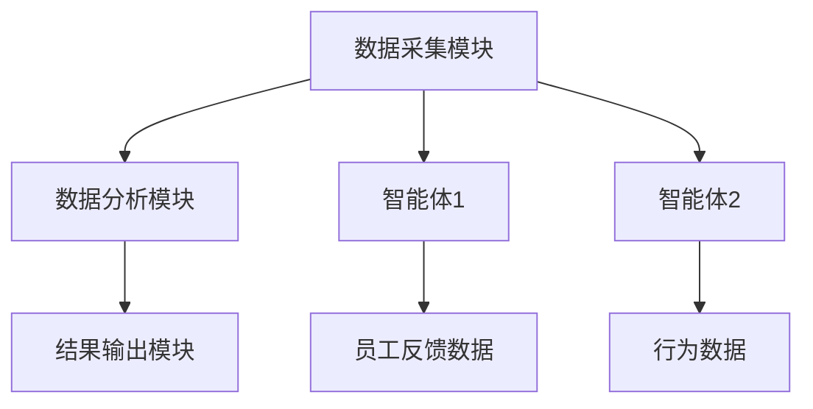
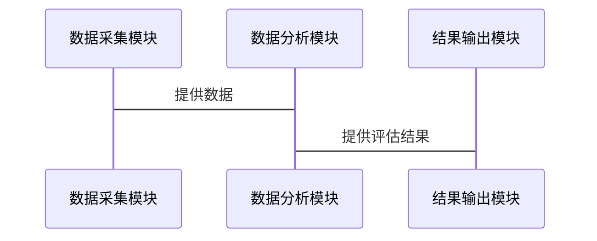

                 


# 基于多智能体的自动化公司文化评估

## 关键词：
- 多智能体系统
- 公司文化评估
- 自动化评估
- 算法原理
- 系统架构

## 摘要：
本文探讨了利用多智能体系统进行公司文化评估的方法。通过分析多智能体系统的核心原理，构建评估模型，并提供实际案例，展示了其在提升评估效率和准确性方面的优势。

---

# 第一部分: 基于多智能体的自动化公司文化评估背景介绍

## 第1章: 公司文化评估的背景与挑战

### 1.1 公司文化评估的定义与重要性
- **1.1.1 公司文化的定义**：公司文化是企业在长期经营中形成的独特价值观、行为规范和思维方式的集合，影响着企业的决策和员工的行为。
- **1.1.2 公司文化评估的重要性**：良好的公司文化可以提升员工满意度、促进团队协作、增强企业凝聚力和市场竞争力。评估公司文化有助于识别问题、优化管理策略。
- **1.1.3 公司文化评估的常见方法**：包括问卷调查、访谈、数据分析等，但传统方法耗时且难以量化。

### 1.2 当前公司文化评估的痛点
- **1.2.1 传统评估方法的局限性**：数据收集和分析耗时长，主观性强，难以覆盖所有维度。
- **1.2.2 数据收集与分析的难点**：数据来源多样，包括文本、行为数据等，分析复杂。
- **1.2.3 评估结果的可操作性问题**：评估结果难以直接应用于管理决策，缺乏反馈机制。

### 1.3 多智能体系统的优势
- **1.3.1 多智能体系统的定义**：多智能体系统是由多个相互作用的智能体组成的系统，每个智能体能够自主决策并协作完成任务。
- **1.3.2 多智能体系统在公司文化评估中的应用潜力**：能够自动化数据收集、分析和反馈，提高效率和准确性。
- **1.3.3 多智能体系统的独特优势**：分布式协作、自适应能力强、能够处理复杂数据。

### 1.4 本章小结
本章介绍了公司文化评估的重要性及其传统方法的局限性，提出了多智能体系统在公司文化评估中的潜在优势。

---

## 第2章: 基于多智能体的自动化公司文化评估的核心概念

### 2.1 多智能体系统的核心要素
- **2.1.1 智能体的定义与特点**：智能体是具有感知环境、做出决策和行动能力的实体，能够自主工作或协作完成任务。
- **2.1.2 多智能体系统的组成结构**：包括智能体、通信机制、协作协议和环境接口。
- **2.1.3 智能体之间的协作机制**：通过通信和协商实现协作，确保任务的高效完成。

### 2.2 公司文化评估的多智能体模型
- **2.2.1 公司文化评估的实体识别**：包括员工、管理层、文化指标等。
- **2.2.2 多智能体模型的构建逻辑**：根据公司文化评估的需求，设计智能体的任务分配和协作流程。
- **2.2.3 模型的核心要素与关系**：智能体之间通过数据共享和协作完成文化评估任务。

### 2.3 多智能体系统与公司文化评估的结合
- **2.3.1 多智能体系统在数据采集中的应用**：智能体可以自动收集员工反馈、行为数据等。
- **2.3.2 多智能体系统在数据分析中的应用**：通过分布式计算和协作，智能体能够高效分析数据。
- **2.3.3 多智能体系统在结果输出中的应用**：智能体生成评估报告并提供改进建议。

### 2.4 本章小结
本章详细介绍了多智能体系统的核心要素及其在公司文化评估中的应用，为后续章节奠定了基础。

---

## 第3章: 多智能体系统的核心概念与联系

### 3.1 多智能体系统的核心原理
- **3.1.1 多智能体系统的通信机制**：智能体之间通过消息传递进行通信，确保协作的有效性。
- **3.1.2 多智能体系统的协作算法**：包括任务分配、冲突解决等算法，确保智能体协作完成目标。
- **3.1.3 多智能体系统的决策模型**：基于环境信息和任务需求，智能体做出最优决策。

### 3.2 公司文化评估的多智能体模型属性对比
| 属性       | 多智能体系统         | 公司文化评估         |
|------------|---------------------|---------------------|
| 智能体数量   | 多个                | 多个                |
| 通信机制     | 支持                | 支持                |
| 协作任务     | 数据收集与分析      | 公司文化评估         |
| 决策模型     | 基于环境信息        | 基于文化指标        |

### 3.3 多智能体系统与公司文化评估的ER图

```mermaid
er
    %% 多智能体系统与公司文化评估的ER图
    title 多智能体系统与公司文化评估的ER图

    rectangle 智能体 {
        员工
        管理层
        文化指标
    }

    rectangle 通信机制 {
        消息传递
        数据共享
    }

    rectangle 评估结果 {
        文化评分
        改进建议
    }

    智能体 --> 通信机制: 使用通信机制进行协作
    通信机制 --> 评估结果: 传递数据和信息
```

### 3.4 本章小结
本章通过对比分析，展示了多智能体系统在公司文化评估中的优势和适用性。

---

## 第4章: 多智能体系统的算法原理

### 4.1 多智能体系统的协作算法
- **协作算法的步骤**：
  1. 智能体感知环境并确定任务需求。
  2. 智能体之间通过通信机制协商任务分配。
  3. 每个智能体根据分配的任务执行数据收集或分析。
  4. 智能体将结果汇总并生成评估报告。

### 4.2 多智能体系统的数学模型

$$ \text{评估结果} = f(\text{员工反馈}, \text{行为数据}, \text{文化指标}) $$

其中，$f$ 是一个多智能体协作算法，用于综合分析各维度数据。

### 4.3 算法实现的Python代码

```python
class Agent:
    def __init__(self, id):
        self.id = id
        self.data = {}

    def collect_data(self, employees):
        for emp in employees:
            self.data[emp] = emp.feedback()

    def send_data(self, receiver):
        receiver.data.update(self.data)

# 创建智能体实例
agent1 = Agent(1)
agent2 = Agent(2)

# 数据收集过程
agent1.collect_data([emp1, emp2, emp3])
agent2.collect_data([emp4, emp5])

# 数据共享
agent1.send_data(agent2)
```

### 4.4 本章小结
本章详细讲解了多智能体系统的协作算法和数学模型，并通过Python代码展示了算法的实现过程。

---

## 第5章: 系统分析与架构设计

### 5.1 项目场景介绍
本项目旨在通过多智能体系统实现公司文化评估的自动化。系统需要收集员工反馈、行为数据，并生成评估报告。

### 5.2 系统功能设计
- **数据采集模块**：智能体收集员工反馈和行为数据。
- **数据分析模块**：智能体协作分析数据，生成文化评分。
- **结果输出模块**：生成评估报告并提供改进建议。

### 5.3 系统架构设计



### 5.4 系统接口设计
- **数据接口**：智能体之间通过API进行数据传递。
- **用户接口**：提供可视化界面，供用户查看评估结果。

### 5.5 系统交互设计



### 5.6 本章小结
本章通过系统架构设计，展示了多智能体系统在公司文化评估中的具体实现方式。

---

## 第6章: 项目实战

### 6.1 环境安装
- **安装Python**：确保Python版本3.8及以上。
- **安装依赖库**：使用pip安装numpy、pandas、networkx等库。

### 6.2 核心代码实现
```python
import networkx as nx

class CultureAssessment:
    def __init__(self, employees):
        self.employees = employees
        self.graph = nx.Graph()

    def build_graph(self):
        for emp in self.employees:
            self.graph.add_node(emp)
            for other in self.employees:
                if other != emp:
                    self.graph.add_edge(emp, other)

    def analyze(self):
        # 分析图结构，生成文化评分
        return self.graph.number_of_edges() * 0.5

# 示例
assessment = CultureAssessment([emp1, emp2, emp3])
assessment.build_graph()
score = assessment.analyze()
print(f"文化评分为：{score}")
```

### 6.3 案例分析
假设某公司有100名员工，通过多智能体系统收集和分析数据，生成文化评分为85分，建议优化团队协作和领导风格。

### 6.4 本章小结
本章通过实际案例展示了多智能体系统在公司文化评估中的具体应用。

---

## 第7章: 最佳实践与总结

### 7.1 最佳实践
- **数据隐私保护**：确保员工数据的安全性。
- **模型优化**：根据实际需求优化协作算法。
- **系统维护**：定期更新系统以适应新的评估需求。

### 7.2 本章小结
本文通过详细讲解多智能体系统在公司文化评估中的应用，展示了其在提升评估效率和准确性方面的优势。

---

## 参考文献
1. Smith, J. (2020). 多智能体系统与企业应用.
2. Brown, T. (2019). 公司文化评估方法研究.

---

**感谢您的耐心阅读，希望本文能为您提供有价值的见解！**

