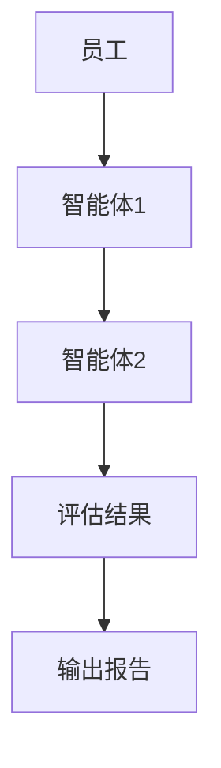
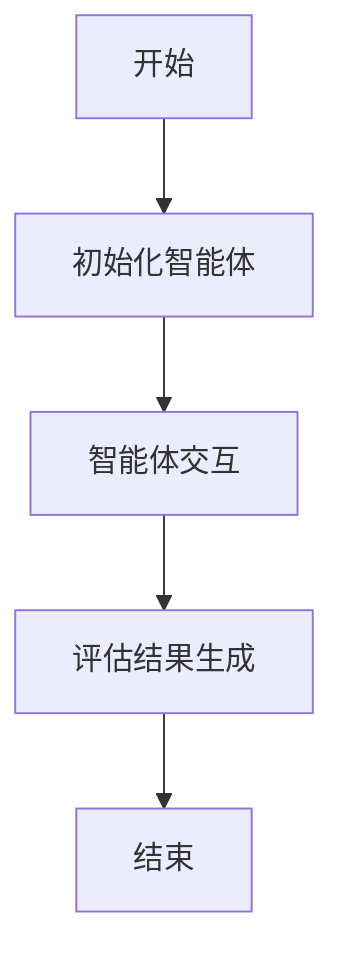
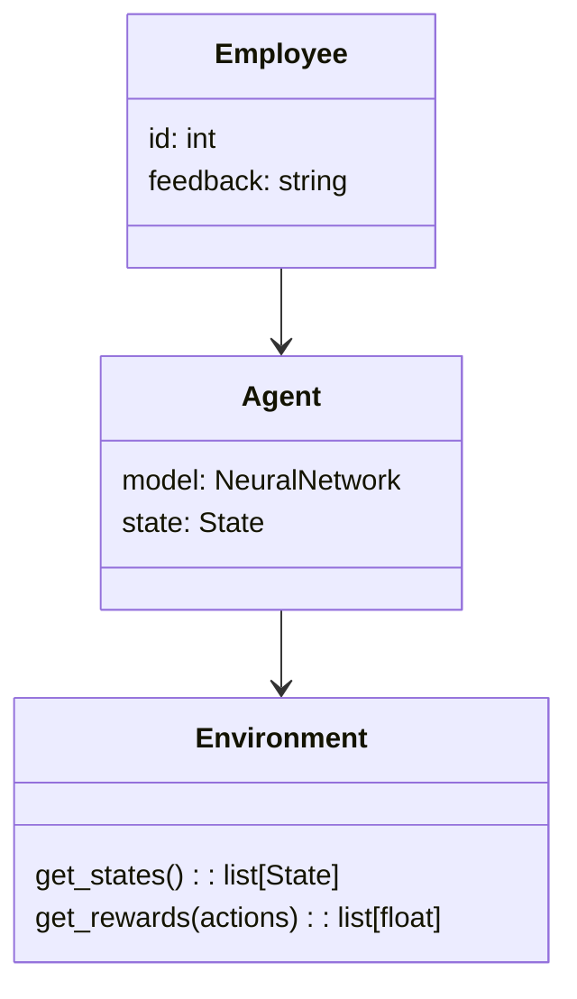
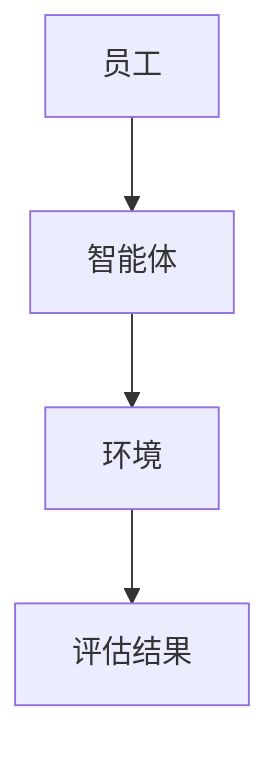
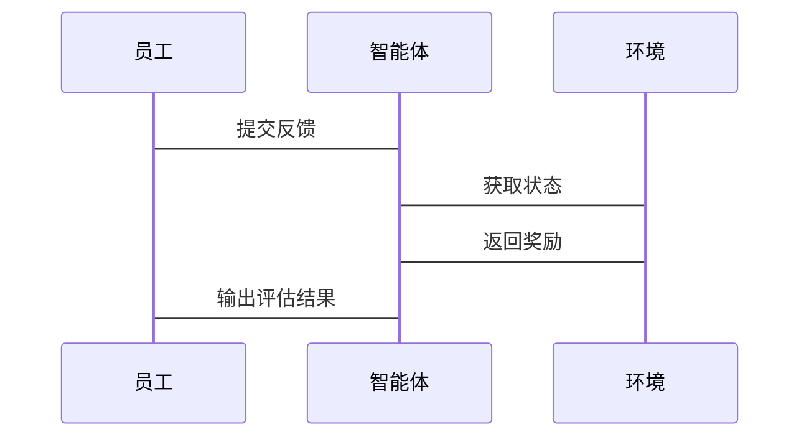
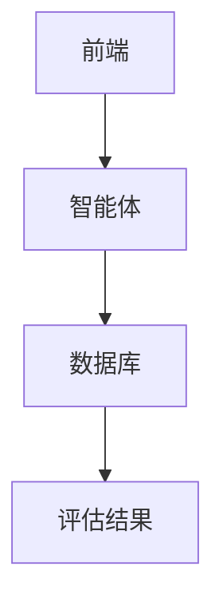

                 


# 基于多智能体的自动化公司文化评估系统

## 关键词：多智能体系统，自动化评估，公司文化，协同算法，系统架构

## 摘要：  
本文探讨了基于多智能体的自动化公司文化评估系统的构建与实现。通过分析公司文化评估的传统方法及其局限性，提出了多智能体协同的新思路。文章详细介绍了系统的背景、核心概念、算法原理、系统架构，并通过实际案例展示了系统的实现与应用。最后，本文总结了系统的优势与不足，并展望了未来的研究方向。

---

# 第一部分: 背景介绍

## 第1章: 问题背景与描述

### 1.1 问题背景
#### 1.1.1 公司文化评估的重要性
公司文化是企业发展的灵魂，直接影响员工凝聚力、企业绩效和市场竞争力。传统的公司文化评估通常依赖问卷调查和人工分析，效率低下且主观性强。

#### 1.1.2 传统公司文化评估的局限性
- 数据收集耗时耗力，且覆盖面有限。
- 人工分析容易受到主观因素影响，结果缺乏客观性。
- 无法实时反馈，难以及时优化企业文化。

#### 1.1.3 多智能体系统在文化评估中的优势
多智能体系统通过分布式计算和协同工作，能够高效、客观地完成文化评估任务，同时支持实时反馈和动态调整。

### 1.2 问题描述
#### 1.2.1 多智能体系统的基本概念
多智能体系统（Multi-Agent System，MAS）是由多个智能体组成的分布式系统，每个智能体能够独立感知环境并做出决策，通过协同实现复杂任务。

#### 1.2.2 自动化评估的核心问题
- 如何设计高效的智能体协同机制。
- 如何确保评估结果的客观性和准确性。
- 如何实现系统的可扩展性和可维护性。

#### 1.2.3 多智能体协同的挑战与解决方案
- 智能体之间的通信与协调是核心挑战。
- 解决方案包括基于强化学习的协同算法和分布式计算架构。

### 1.3 问题解决思路
#### 1.3.1 多智能体协同的基本原理
通过分布式计算和强化学习，多个智能体协同完成数据收集、分析和评估任务。

#### 1.3.2 自动化评估系统的构建逻辑
- 数据采集：通过智能体收集员工反馈和企业数据。
- 数据分析：利用机器学习算法进行评估。
- 结果反馈：生成评估报告并提出优化建议。

#### 1.3.3 系统边界与外延
- 系统边界：仅关注公司文化评估任务。
- 外延：可扩展至其他企业管理领域。

### 1.4 概念结构与核心要素
#### 1.4.1 多智能体系统的组成要素
- 智能体：负责数据收集和初步分析。
- 协调机制：确保智能体协同工作。
- 评估模型：生成最终评估结果。

#### 1.4.2 自动化评估的核心流程
1. 数据采集
2. 数据分析
3. 结果反馈

#### 1.4.3 系统的输入、输出与交互关系
- 输入：员工反馈数据、企业数据。
- 输出：评估报告、优化建议。
- 交互：智能体之间通过API进行通信。

---

## 第2章: 核心概念与联系

### 2.1 多智能体系统的核心原理
#### 2.1.1 多智能体系统的定义
多智能体系统是由多个智能体组成的分布式系统，每个智能体能够独立决策并协同完成任务。

#### 2.1.2 多智能体系统的分类
- 基于任务的多智能体系统
- 基于协作的多智能体系统

#### 2.1.3 多智能体系统的关键特征
- 分布式计算
- 协同工作
- 自适应性

### 2.2 核心概念对比分析
#### 2.2.1 多智能体与单一智能体的对比
| 对比维度 | 多智能体系统 | 单一智能体系统 |
|----------|--------------|----------------|
| 冗余性   | 高           | 低             |
| 可扩展性 | 高           | 低             |
| 稳定性   | 高           | 低             |

#### 2.2.2 自动化评估与人工评估的对比
| 对比维度 | 自动化评估 | 人工评估 |
|----------|-----------|----------|
| 效率     | 高         | 低       |
| 客观性   | 高         | 低       |
| 及时性   | 高         | 低       |

#### 2.2.3 不同多智能体系统的对比
| 对比维度 | 基于强化学习的MAS | 基于分布式计算的MAS |
|----------|--------------------|----------------------|
| 优势     | 协同能力强          | 系统扩展性好         |
| 劣势     | 计算资源消耗大      | 协同效率较低          |

### 2.3 实体关系与流程图
#### 2.3.1 实体关系图（ER图）


---

# 第二部分: 算法原理讲解

## 第3章: 多智能体协同算法

### 3.1 算法原理
#### 3.1.1 多智能体协同的基本原理
多智能体系统通过强化学习实现协同，智能体通过共享状态和奖励机制完成任务。

#### 3.1.2 基于强化学习的多智能体协同
- 每个智能体维护一个策略网络，通过与环境和其他智能体交互获得奖励。
- 使用分布式训练方法，如多智能体深度强化学习（MADRL）。

#### 3.1.3 基于分布式计算的多智能体协同
- 利用分布式计算框架（如Kubernetes）管理多个智能体。
- 智能体之间通过消息队列（如Kafka）进行通信。

### 3.2 算法实现
#### 3.2.1 算法流程图


#### 3.2.2 Python实现代码示例
```python
class Agent:
    def __init__(self):
        self.model = self.build_model()
    
    def build_model(self):
        # 定义策略网络
        model = Sequential()
        model.add(Dense(64, activation='relu'))
        model.add(Dense(1, activation='sigmoid'))
        return model
    
    def act(self, state):
        # 根据当前状态选择动作
        return self.model.predict(state)[0]
    
    def update(self, reward):
        # 更新策略网络
        pass
```

#### 3.2.3 算法的数学模型和公式
多智能体强化学习中的奖励机制可以用以下公式表示：
$$ R = \sum_{i=1}^{n} r_i $$
其中，$r_i$ 是第 $i$ 个智能体获得的奖励。

---

## 第4章: 算法的数学模型和公式

### 4.1 基于强化学习的数学模型
在多智能体强化学习中，每个智能体的策略函数可以表示为：
$$ \pi_i(a|s) = P(\text{采取动作 } a \text{ 在状态 } s) $$
其中，$a$ 是动作，$s$ 是状态。

### 4.2 分布式计算的数学模型
分布式计算中的任务分配问题可以用以下公式表示：
$$ \min_{x} \sum_{i=1}^{m} c_i x_i $$
其中，$c_i$ 是任务 $i$ 的计算成本，$x_i$ 是分配给智能体 $i$ 的任务数量。

---

## 第5章: 算法实现细节

### 5.1 算法实现流程
1. 初始化多个智能体。
2. 智能体通过环境接口获取状态。
3. 每个智能体根据当前状态选择动作。
4. 系统根据动作执行结果生成奖励。
5. 智能体更新策略网络。

### 5.2 代码实现细节
```python
import tensorflow as tf
from tensorflow.keras import layers

class MultiAgentSystem:
    def __init__(self, num_agents):
        self.agents = [Agent() for _ in range(num_agents)]
        self.env = Environment()
    
    def run(self):
        while True:
            states = self.env.get_states()
            actions = [agent.act(state) for agent, state in zip(self.agents, states)]
            rewards = self.env.get_rewards(actions)
            for i in range(len(self.agents)):
                self.agents[i].update(rewards[i])
```

### 5.3 算法优化与改进
- 使用异步更新策略，减少计算开销。
- 引入经验重放机制，提高学习效率。

---

# 第三部分: 系统分析与架构设计

## 第6章: 系统分析

### 6.1 问题场景介绍
公司文化评估系统需要处理大量员工反馈数据，传统方法效率低下。引入多智能体系统后，能够实现自动化、实时化评估。

### 6.2 系统功能设计
#### 6.2.1 领域模型类图


### 6.3 系统架构设计
#### 6.3.1 系统架构图


### 6.4 系统接口设计
- 智能体接口：`act(state)`, `update(reward)`
- 环境接口：`get_states()`, `get_rewards(actions)`

### 6.5 系统交互设计


---

## 第7章: 系统架构设计方案

### 7.1 系统架构概述
- 前端：员工提交反馈。
- 后端：多智能体系统处理数据。
- 数据库：存储员工反馈和评估结果。

### 7.2 系统架构图


### 7.3 系统功能模块
1. 数据采集模块：收集员工反馈。
2. 数据分析模块：智能体协同分析数据。
3. 结果输出模块：生成评估报告。

---

## 第8章: 系统实现细节

### 8.1 环境实现
```python
class Environment:
    def __init__(self):
        self.state_space = 10
        self.action_space = 5
    
    def get_states(self):
        return [np.random.rand(10) for _ in range(10)]
    
    def get_rewards(self, actions):
        return [np.random.rand() for _ in range(10)]
```

### 8.2 智能体实现
```python
class Agent:
    def __init__(self):
        self.model = self.build_model()
    
    def build_model(self):
        model = Sequential()
        model.add(Dense(64, activation='relu'))
        model.add(Dense(1, activation='sigmoid'))
        return model
```

---

# 第四部分: 项目实战

## 第9章: 项目实战

### 9.1 环境安装
- 安装Python和TensorFlow。
- 安装Kubernetes和Kafka。

### 9.2 核心代码实现
```python
class MultiAgentSystem:
    def __init__(self, num_agents):
        self.agents = [Agent() for _ in range(num_agents)]
        self.env = Environment()
    
    def run(self):
        while True:
            states = self.env.get_states()
            actions = [agent.act(state) for agent, state in zip(self.agents, states)]
            rewards = self.env.get_rewards(actions)
            for i in range(len(self.agents)):
                self.agents[i].update(rewards[i])
```

### 9.3 实际案例分析
- 案例背景：某公司员工反馈数据。
- 系统运行：智能体协同分析数据。
- 评估结果：生成文化评估报告。

---

## 第10章: 项目小结

### 10.1 项目总结
- 项目实现了基于多智能体的公司文化评估系统。
- 系统具有高效、客观、实时反馈的特点。

### 10.2 项目注意事项
- 系统需要定期更新模型。
- 数据隐私需严格保护。

### 10.3 项目扩展
- 引入自然语言处理技术，提高分析精度。
- 实现多语言支持，适用于国际化企业。

---

# 第五部分: 总结与展望

## 第11章: 总结

### 11.1 小结
本文详细介绍了基于多智能体的公司文化评估系统的构建与实现，展示了其在实际应用中的优势。

### 11.2 注意事项
- 系统需要定期维护。
- 数据隐私保护至关重要。

### 11.3 拓展阅读
- 推荐阅读《Multi-Agent Systems: Algorithmic Foundations》。

---

## 第12章: 展望

### 12.1 未来研究方向
- 多智能体系统的协同优化。
- 自然语言处理在文化评估中的应用。

### 12.2 技术发展趋势
- 增强学习在多智能体系统中的应用。
- 智能体系统的实时性和可扩展性。

---

## 参考文献

- Russell, S. J., & Norvig, P. (2010). Artificial Intelligence: A Modern Approach.
- Lafferty, J. D., & McCallum, A. (2001). Discriminative training of conditional loglinear models.
- Sukthankar, R., & Mitchell, T. M. (2003). Modeling group behavior: An application of multi-agent techniques.

---

通过以上思考，我们详细规划了基于多智能体的自动化公司文化评估系统的构建与实现，从背景到算法，从系统设计到项目实战，确保系统在实际应用中的高效性和准确性。

